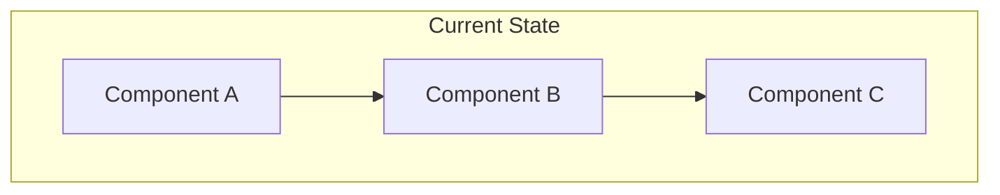
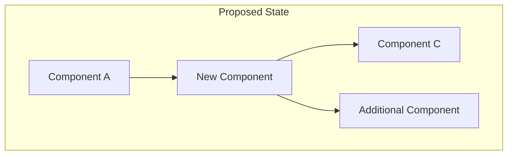
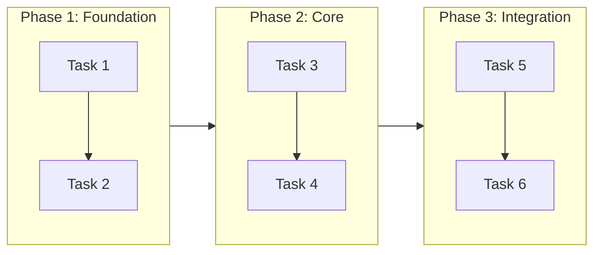
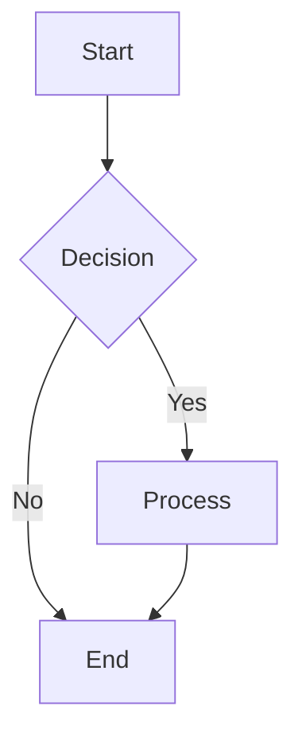
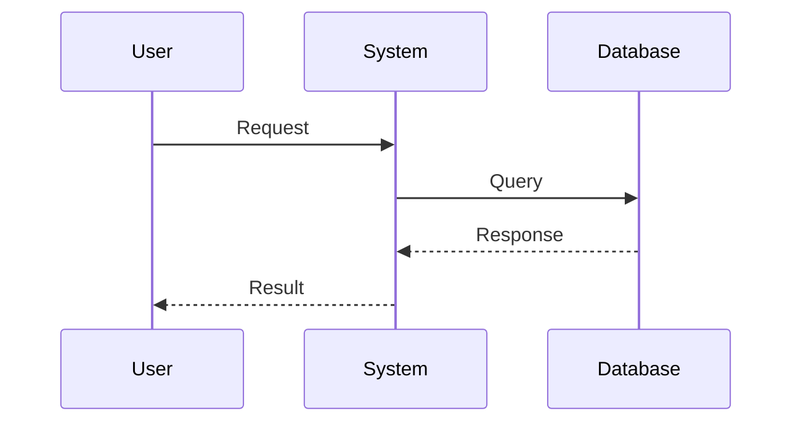
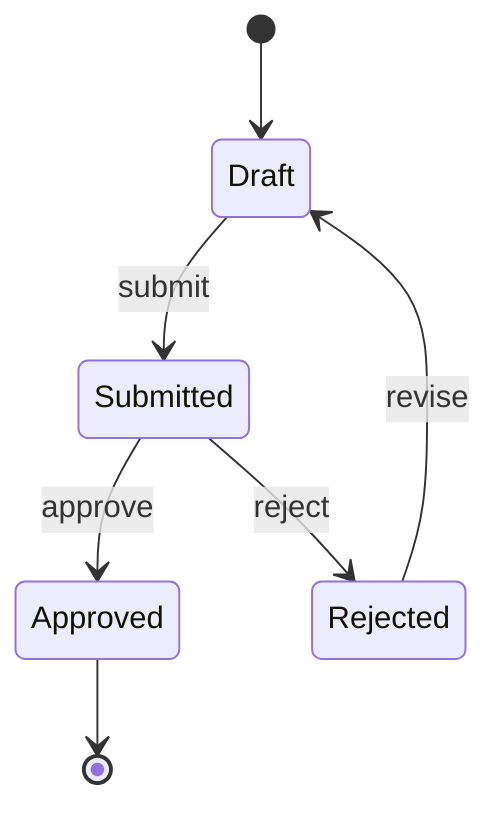
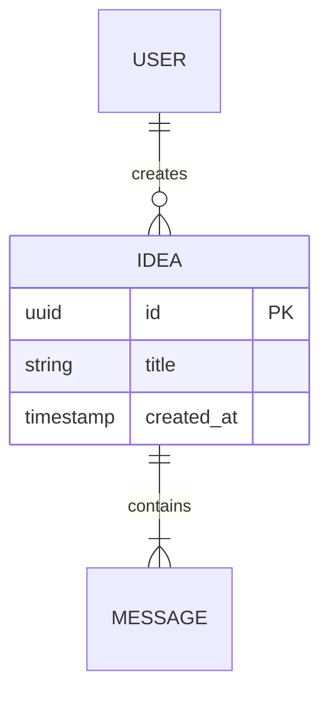

---
# These are required metadata elements. Feel free to add additional if motivated.
id: "CR-XXXX"
status: "{proposed | approved | rejected | implemented | on-hold | cancelled}"
date: {YYYY-MM-DD when the change request was last updated}
requestor: {person or team requesting the change}
stakeholders: {list everyone involved in reviewing/approving the change}
priority: "{critical | high | medium | low}"
target-version: {version or milestone when this change should be implemented}
---

<!--
=============================================================================
CHANGE REQUEST TEMPLATE GUIDELINES
=============================================================================

0. ID + FILENAME CONVENTION
   - The CR **MUST** have an ID in frontmatter (e.g., `CR-0001`)
   - The file **MUST** be named `CR-0001-{shortName}.md` (ID prefix matches frontmatter `id`)
   - `{shortName}` should be a short, kebab-case slug (e.g., `billing-endpoints`)

1. REQUIREMENTS LANGUAGE (RFC 2119)
   - Use ONLY **MUST** for requirements to ensure unambiguous specification
   - Avoid SHOULD, MAY, RECOMMENDED, OPTIONAL - these create ambiguity
   - If a requirement is not mandatory, it is not a requirement - remove it
   - Example: "The system **MUST** validate email format before submission"

2. ACCEPTANCE CRITERIA (Given-When-Then)
   - All acceptance criteria **MUST** follow the Given-When-Then formula
   - Given: Precondition or context (the initial state)
   - When: Action or trigger (the behavior being tested)
   - Then: Expected outcome (the result to verify)
   - Example:
     Given a user is authenticated
     When the user submits an idea without a title
     Then the system displays a validation error "Title is required"

3. VISUALIZATIONS (Mermaid Diagrams)
   - All diagrams, flowcharts, and visualizations **MUST** use Mermaid syntax
   - Supported diagram types: flowchart, sequenceDiagram, stateDiagram, erDiagram
   - Example:
     ```mermaid
     flowchart LR
       A[Start] --> B{Decision}
       B -->|Yes| C[Action]
       B -->|No| D[End]
     ```

4. DOCUMENT COMPLETENESS (250+ Lines Minimum)
   - A comprehensive CR **MUST** be at least 250 lines to ensure sufficient detail
   - This minimum ensures that all sections are properly filled out with meaningful content
   - Incomplete or superficial CRs lead to ambiguity, rework, and implementation errors
   - Each section should contain enough detail for implementers to work independently
   - If your CR is under 250 lines, review each section and add:
     * More specific requirements with concrete examples
     * Detailed acceptance criteria covering edge cases
     * Comprehensive impact assessments
     * Additional diagrams to clarify complex flows
     * Thorough risk analysis with mitigation strategies

5. IMPLEMENTATION VALIDATION (DeepWiki MCP)
   - Use DeepWiki MCP to validate implementation details against authoritative GitHub repositories
   - DeepWiki MCP provides up-to-date documentation directly from source repositories
   - Before finalizing implementation approach, query DeepWiki MCP for:
     * Current API signatures and method names (avoid outdated documentation)
     * Recommended patterns and best practices from official examples
     * Breaking changes or deprecations in recent versions
     * Configuration options and their correct usage
   - Implementation instructions **MUST** be validated against the source repository to ensure accuracy
   - When referencing external libraries or frameworks:
     * Query DeepWiki with the repository (e.g., `google/adk-go`, `AnswerDotAI/llms-txt`)
     * Document specific topics researched in the `.deepwiki` file
     * Include version-specific details when implementation depends on particular versions
   - Example DeepWiki queries:
     * "How to configure agents in google/adk-go"
     * "Tool registration patterns in google/adk-go"
     * "Session management best practices in google/adk-go"
   - Benefits of DeepWiki validation:
     * Prevents implementation errors from outdated documentation
     * Ensures code examples match current library versions
     * Provides authoritative source for implementation decisions
     * Reduces rework caused by incorrect assumptions

6. TEST STRATEGY (Required for All Code Changes)
   - Every CR involving code changes **MUST** include a comprehensive test strategy
   - The test strategy **MUST** address three categories:
     * **Adding Missing Tests:** Identify functionality that lacks test coverage and specify new tests to be written
     * **Removing Redundant Tests:** Identify tests that become obsolete due to the change and should be removed
     * **Modifying Changed Tests:** Identify existing tests that need updates to reflect new behavior
   - For each test category, specify:
     * Test file location (existing or new)
     * Test function/method names
     * What the test validates
     * Expected inputs and outputs
   - Test coverage requirements:
     * All new functionality **MUST** have corresponding unit tests
     * All modified functionality **MUST** have updated tests reflecting new behavior
     * Integration tests **MUST** be added for cross-component interactions
     * Edge cases and error conditions **MUST** be tested
   - Test removal criteria:
     * Tests for removed functionality **MUST** be deleted
     * Tests that duplicate coverage **MUST** be consolidated
     * Tests that no longer reflect system behavior **MUST** be updated or removed

7. QUALITY STANDARDS COMPLIANCE (Mandatory)
   - Implementation **MUST** meet all project quality standards before completion
   - Code quality requirements:
     * Code **MUST** compile/build without errors
     * All linter checks **MUST** pass with zero warnings/errors
     * Code **MUST** follow project coding conventions and style guides
   - Test quality requirements:
     * All existing tests **MUST** pass after implementation
     * New tests **MUST** achieve adequate coverage for changed code
     * Test code **MUST** follow the same quality standards as production code
   - Documentation requirements:
     * Code changes **MUST** include updated inline documentation where applicable
     * API changes **MUST** include updated API documentation
     * README or user-facing docs **MUST** be updated if behavior changes
   - Review requirements:
     * All changes **MUST** go through code review via pull request
     * PR title **MUST** follow Conventional Commits format
     * Changes **MUST** be squash-merged to maintain linear history
   - Prohibited actions:
     * Committing code that breaks builds
     * Bypassing or weakening tests to force them to pass
     * Using skip flags to avoid running tests
     * Marking tests as @Ignored/@Disabled without explicit approval
=============================================================================
-->

# {short title describing the requested change}

## Change Summary

{Provide a clear, concise summary of what is being requested to change. Describe the current state and the desired future state in 2-3 sentences.}

## Motivation and Background

{Explain why this change is needed. What problem does it solve? What opportunity does it enable? Include any relevant context about user feedback, business needs, technical debt, or market conditions.}

<!-- This is an optional element. Feel free to remove. -->
## Change Drivers

* {driver 1, e.g., user feedback, business requirement, technical limitation, …}
* {driver 2, e.g., competitive pressure, compliance requirement, performance issue, …}
* … <!-- numbers of drivers can vary -->

## Current State

{Describe the current implementation, behavior, or requirement that will be changed. Be specific about what exists today.}

<!-- This is an optional element. Feel free to remove. -->
### Current State Diagram



## Proposed Change

{Describe in detail what should change. Be specific about new requirements, modified behaviors, or removed functionality.}

<!-- This is an optional element. Feel free to remove. -->
### Proposed State Diagram



## Requirements

<!--
IMPORTANT: Use ONLY **MUST** for requirements per RFC 2119.
- If something is optional, it is not a requirement - do not include it
- If something is recommended but not mandatory, it is not a requirement - do not include it
- Every requirement listed here is mandatory for implementation to be considered complete
-->

### Functional Requirements

1. The system **MUST** {requirement 1}
2. The system **MUST** {requirement 2}
3. The system **MUST** {requirement 3}
<!-- Add more requirements as needed -->

### Non-Functional Requirements

1. The system **MUST** {performance/security/reliability requirement 1}
2. The system **MUST** {performance/security/reliability requirement 2}
<!-- Add more requirements as needed -->

<!-- This is an optional element. Feel free to remove. -->
## Affected Components

* {component 1, e.g., UI module, API endpoint, database schema, …}
* {component 2, e.g., documentation, user workflows, integrations, …}
* … <!-- numbers of components can vary -->

## Scope Boundaries

<!--
IMPORTANT: Clearly define the boundaries of this change request.
The "here, but not further" principle helps prevent scope creep and sets clear expectations
for what will and will NOT be addressed by this change.

Be explicit about:
- What is IN scope: specific features, components, or behaviors being changed
- What is OUT of scope: related areas that will NOT be modified, even if they seem connected
- Future considerations: items intentionally deferred to future change requests
-->

### In Scope

{List specific items, features, or components that ARE included in this change request.}

* {in-scope item 1, e.g., "User authentication flow for web application"}
* {in-scope item 2, e.g., "Password reset functionality"}
* … <!-- add more as needed -->

### Out of Scope ("Here, But Not Further")

{Explicitly list items that are intentionally EXCLUDED from this change request, even if they are related or might seem like natural extensions. This prevents scope creep and clarifies boundaries.}

* {out-of-scope item 1, e.g., "Mobile app authentication - will be addressed in CR-XXXX"}
* {out-of-scope item 2, e.g., "Social login integration - deferred to future iteration"}
* {out-of-scope item 3, e.g., "Admin user management - existing functionality remains unchanged"}
* … <!-- add more as needed -->

<!-- This is an optional element. Feel free to remove. -->
## Alternative Approaches Considered

* {alternative 1}
* {alternative 2}
* {alternative 3}
* … <!-- numbers of alternatives can vary -->

## Impact Assessment

### User Impact

{Describe how this change will affect end users. Will it require retraining? Change workflows? Improve experience?}

### Technical Impact

{Describe technical implications: breaking changes, migration needs, performance impacts, dependencies affected, etc.}

### Business Impact

{Describe business implications: costs, timelines, revenue impact, competitive position, etc.}

## Implementation Approach

{Provide a high-level description of how this change will be implemented. Include phases if applicable.}

<!-- This is an optional element. Feel free to remove. -->
### Implementation Flow



## Test Strategy

<!--
IMPORTANT: This section is REQUIRED for all CRs involving code changes.
Address all three categories below. If a category does not apply, explicitly state "Not applicable" with justification.
-->

### Tests to Add

{List new tests that **MUST** be written to cover new functionality or previously untested code paths.}

| Test File | Test Name | Description | Inputs | Expected Output |
|-----------|-----------|-------------|--------|-----------------|
| `{path/to/test_file}` | `{TestFunctionName}` | {What this test validates} | {Key inputs} | {Expected result} |
| `{path/to/test_file}` | `{TestFunctionName}` | {What this test validates} | {Key inputs} | {Expected result} |
<!-- Add more rows as needed -->

### Tests to Modify

{List existing tests that **MUST** be updated to reflect changed behavior.}

| Test File | Test Name | Current Behavior | New Behavior | Reason for Change |
|-----------|-----------|------------------|--------------|-------------------|
| `{path/to/test_file}` | `{TestFunctionName}` | {What it tests now} | {What it should test} | {Why change is needed} |
<!-- Add more rows as needed -->

### Tests to Remove

{List tests that **MUST** be removed because they are redundant or test removed functionality.}

| Test File | Test Name | Reason for Removal |
|-----------|-----------|-------------------|
| `{path/to/test_file}` | `{TestFunctionName}` | {e.g., "Tests removed feature X", "Duplicates TestY coverage"} |
<!-- Add more rows as needed -->

## Acceptance Criteria

<!--
IMPORTANT: All acceptance criteria **MUST** follow the Given-When-Then formula.
- Given: The precondition or initial context
- When: The action or event that triggers the behavior
- Then: The expected outcome or result

Each criterion should be independently testable and verifiable.
-->

### AC-1: {Brief description}

```gherkin
Given {precondition/context}
When {action/trigger}
Then {expected outcome}
```

### AC-2: {Brief description}

```gherkin
Given {precondition/context}
  And {additional precondition if needed}
When {action/trigger}
Then {expected outcome}
  And {additional outcome if needed}
```

### AC-3: {Brief description}

```gherkin
Given {precondition/context}
When {action/trigger}
Then {expected outcome}
```

<!-- Add more acceptance criteria as needed -->

## Quality Standards Compliance

<!--
IMPORTANT: Implementation **MUST** meet all project quality standards.
This section documents how the implementation will be verified against quality requirements.
-->

### Build & Compilation

- [ ] Code compiles/builds without errors
- [ ] No new compiler warnings introduced

### Linting & Code Style

- [ ] All linter checks pass with zero warnings/errors
- [ ] Code follows project coding conventions and style guides
- [ ] Any linter exceptions are documented with justification

### Test Execution

- [ ] All existing tests pass after implementation
- [ ] All new tests pass
- [ ] Test coverage meets project requirements for changed code

### Documentation

- [ ] Inline code documentation updated where applicable
- [ ] API documentation updated for any API changes
- [ ] User-facing documentation updated if behavior changes

### Code Review

- [ ] Changes submitted via pull request
- [ ] PR title follows Conventional Commits format
- [ ] Code review completed and approved
- [ ] Changes squash-merged to maintain linear history

### Verification Commands

{List the specific commands that **MUST** be run to verify quality standards compliance.}

```bash
# Build verification
{build command, e.g., go build ./...}

# Lint verification
{lint command, e.g., golangci-lint run}

# Test execution
{test command, e.g., go test ./...}
```

<!-- This is an optional element. Feel free to remove. -->
## Risks and Mitigation

### Risk 1: {risk description}

**Likelihood:** {high | medium | low}
**Impact:** {high | medium | low}
**Mitigation:** {how to prevent or reduce this risk}

### Risk 2: {risk description}

**Likelihood:** {high | medium | low}
**Impact:** {high | medium | low}
**Mitigation:** {how to prevent or reduce this risk}

<!-- Add more risks as needed -->

## Dependencies

* {dependency 1, e.g., requires completion of CR-0123, needs API v2 deployment, …}
* {dependency 2, e.g., blocked by infrastructure upgrade, depends on third-party feature, …}
* … <!-- numbers of dependencies can vary -->

## Estimated Effort

{Provide effort estimates in person-hours, story points, or time duration. Break down by phases or components if helpful.}

## Decision Outcome

Chosen approach: "{brief description}", because {justification for this approach over alternatives}.

<!-- This is an optional element. Feel free to remove. -->
## Implementation Status

* **Started:** {YYYY-MM-DD}
* **Completed:** {YYYY-MM-DD}
* **Deployed to Production:** {YYYY-MM-DD}
* **Notes:** {any relevant notes about implementation}

<!-- This is an optional element. Feel free to remove. -->
## Related Items

* Links to related change requests: CR-XXXX
* Links to architecture decisions: ADR-XXXX
* Links to issues/tickets: #XXXX
* Links to pull requests: #XXXX
* Links to documentation: {URL}

<!-- This is an optional element. Feel free to remove. -->
## More Information

{You might want to provide additional context, links to research, prototypes, user studies, or market analysis. Include any other relevant information that supports or documents this change request.}

<!--
=============================================================================
DIAGRAM REFERENCE (Mermaid Syntax Examples)
=============================================================================

FLOWCHART:


SEQUENCE DIAGRAM:


STATE DIAGRAM:


ENTITY RELATIONSHIP:


=============================================================================
-->
