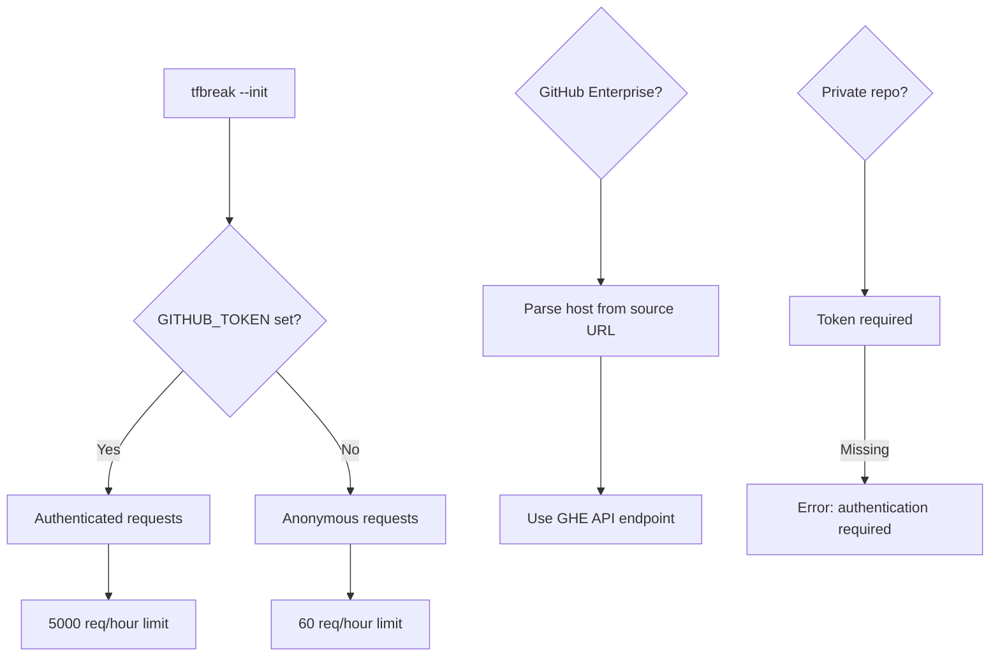

# Plugin Distribution and Automatic Installation via GitHub Releases

## Context and Problem Statement

tfbreak's plugin architecture (ADR-0002) enables extensible rulesets via external binaries that communicate over gRPC. However, the current implementation requires manual plugin installation: users must download binaries from GitHub releases, place them in the correct directory, and set permissions. This creates significant friction, especially in CI/CD environments where automation is essential.

The key questions to address:

1. **Distribution mechanism**: How should plugins be distributed and discovered?
2. **Installation workflow**: How should users install plugins?
3. **Verification**: How do we ensure downloaded plugins are authentic and untampered?
4. **Authentication**: How do we handle private repositories and API rate limits?
5. **Extensibility**: How do we support future distribution sources beyond GitHub?

## Decision Drivers

* **User experience**: Plugin installation must be simple and automated
* **CI/CD compatibility**: Must work in headless, automated environments
* **Security**: Downloaded binaries must be verifiable for authenticity
* **Ecosystem alignment**: tflint users expect familiar patterns
* **Platform agnosticism**: Must not lock into a single distribution platform
* **Incremental adoption**: Users with existing manual installations should not be disrupted
* **Enterprise readiness**: Must support GitHub Enterprise and authenticated access

## Considered Options

* **Option 1: GitHub releases with tflint-aligned conventions**
* **Option 2: Go module proxy (go install pattern)**
* **Option 3: Custom plugin registry**
* **Option 4: OCI registry distribution**
* **Option 5: Embedded plugins in tfbreak binary**

## Decision Outcome

Chosen option: "**Option 1: GitHub releases with tflint-aligned conventions**", because it leverages existing infrastructure, provides a familiar experience for tflint users, and enables incremental security enhancements while maintaining simplicity.

### Consequences

* Good, because GitHub releases are familiar to Go developers and widely understood
* Good, because tflint users have established expectations we can meet
* Good, because no custom infrastructure is required
* Good, because plugin developers can use standard release workflows
* Good, because enterprise GitHub instances are supported
* Good, because security can be incrementally enhanced (checksums → PGP → keyless)
* Neutral, because requires `GITHUB_TOKEN` to avoid rate limits in CI
* Bad, because non-GitHub users must wait for future extensibility
* Bad, because no automatic plugin updates (must change version in config)

### Confirmation

This decision will be confirmed by:

1. Successfully installing plugins from public GitHub repositories without authentication
2. Successfully installing plugins from private repositories with `GITHUB_TOKEN`
3. Checksum verification preventing installation of tampered plugins
4. Plugin discovery working with the versioned directory structure
5. Familiar UX reported by tflint users evaluating tfbreak

## Pros and Cons of the Options

### Option 1: GitHub releases with tflint-aligned conventions

Use GitHub releases as the primary distribution mechanism, following tflint's established patterns for configuration syntax, directory structure, and asset naming.

**Architecture Overview:**

```
┌─────────────────────────────────────────────────────────────────────────────┐
│                        Plugin Distribution Architecture                      │
├─────────────────────────────────────────────────────────────────────────────┤
│                                                                             │
│  ┌─────────────┐     ┌──────────────┐     ┌─────────────────────────────┐  │
│  │ .tfbreak.hcl│     │ tfbreak --init │     │     GitHub Releases         │  │
│  │             │────▶│              │────▶│                             │  │
│  │ plugin "x"  │     │ - Parse      │     │  v0.1.0/                    │  │
│  │   source=.. │     │ - Download   │     │  ├── tfbreak-ruleset-x_     │  │
│  │   version=..│     │ - Verify     │     │  │   darwin_arm64.zip       │  │
│  │             │     │ - Extract    │     │  ├── checksums.txt          │  │
│  └─────────────┘     └──────────────┘     │  └── checksums.txt.sig      │  │
│                             │             └─────────────────────────────┘  │
│                             ▼                                               │
│  ┌─────────────────────────────────────────────────────────────────────┐   │
│  │                    Plugin Directory Structure                        │   │
│  │  ~/.tfbreak.d/plugins/                                               │   │
│  │  └── github.com/                                                     │   │
│  │      └── org/                                                        │   │
│  │          └── tfbreak-ruleset-x/                                      │   │
│  │              └── 0.1.0/                                              │   │
│  │                  └── tfbreak-ruleset-x  (executable)                 │   │
│  └─────────────────────────────────────────────────────────────────────┘   │
│                                                                             │
└─────────────────────────────────────────────────────────────────────────────┘
```

**Configuration syntax:**

```hcl
plugin "azurerm" {
  enabled = true
  source  = "github.com/jokarl/tfbreak-ruleset-azurerm"
  version = "0.1.0"

  # Future: PGP signature verification
  signing_key = <<-KEY
    -----BEGIN PGP PUBLIC KEY BLOCK-----
    ...
    KEY
}
```

**Release asset naming convention:**

| Asset | Pattern | Example |
|-------|---------|---------|
| Binary zip | `tfbreak-ruleset-{name}_{GOOS}_{GOARCH}.zip` | `tfbreak-ruleset-azurerm_darwin_arm64.zip` |
| Checksums | `checksums.txt` | SHA256 hashes |
| Signature | `checksums.txt.sig` | PGP detached signature (optional) |

**Verification layers (incremental):**

```
Phase 1: SHA256 checksum verification (baseline)
    └── Ensures download integrity

Phase 2: PGP signature verification (enhanced)
    └── Ensures publisher authenticity
    └── signing_key attribute in config

Phase 3: Keyless verification (advanced)
    └── GitHub Artifact Attestations
    └── Sigstore-based verification
    └── No key management required
```

* Good, because familiar to tflint users (same config syntax, same workflow)
* Good, because leverages existing GitHub release infrastructure
* Good, because enterprise GitHub instances supported via URL parsing
* Good, because plugin developers use standard release workflows
* Good, because security can be incrementally enhanced
* Good, because multiple plugin versions can coexist
* Good, because `GITHUB_TOKEN` handling is well-understood
* Neutral, because requires specific asset naming convention
* Neutral, because GitHub API has rate limits (60 unauthenticated, 5000 authenticated)
* Bad, because initially limited to GitHub (extensibility in future phases)

### Option 2: Go module proxy (go install pattern)

Distribute plugins as Go modules, installing via `go install github.com/org/plugin@version`.

* Good, because leverages Go's existing module infrastructure
* Good, because version resolution is handled by Go toolchain
* Good, because proxy caching improves reliability
* Bad, because requires Go toolchain on target systems
* Bad, because doesn't support prebuilt binaries
* Bad, because CI environments may not have Go installed
* Bad, because cross-compilation complexity for plugin developers

### Option 3: Custom plugin registry

Build a tfbreak-specific plugin registry API for plugin discovery and distribution.

* Good, because full control over plugin metadata and verification
* Good, because could support multiple source backends
* Good, because could provide plugin search and discovery
* Bad, because significant infrastructure to build and maintain
* Bad, because ecosystem fragmentation from tflint patterns
* Bad, because plugin developers must publish to additional registry
* Bad, because single point of failure if registry goes down

### Option 4: OCI registry distribution

Distribute plugins as OCI (container) artifacts using tools like ORAS.

* Good, because OCI registries are widely available (Docker Hub, GHCR, ECR)
* Good, because strong content addressing and verification
* Good, because enterprise registries often already deployed
* Bad, because unfamiliar distribution pattern for CLI tools
* Bad, because adds container tooling dependency
* Bad, because complex setup for plugin developers
* Bad, because overkill for single binary distribution

### Option 5: Embedded plugins in tfbreak binary

Compile popular plugins directly into the tfbreak binary.

* Good, because zero installation friction for bundled plugins
* Good, because guaranteed compatibility between core and plugins
* Good, because single binary distribution
* Bad, because increases tfbreak binary size significantly
* Bad, because independent plugin versioning not possible
* Bad, because plugin updates require tfbreak release
* Bad, because doesn't scale to community plugins

## More Information

### Implementation Phases

The plugin distribution system will be implemented in phases to manage complexity and deliver value incrementally:

```mermaid
flowchart LR
    subgraph Phase1["Phase 1: Baseline"]
        A1[GitHub client]
        A2[SHA256 verification]
        A3[Plugin download]
        A4[CLI integration]
    end

    subgraph Phase2["Phase 2: Security"]
        B1[PGP verification]
        B2[signing_key config]
        B3[Built-in keys]
    end

    subgraph Phase3["Phase 3: Extensibility"]
        C1[Source abstraction]
        C2[GitLab support]
        C3[Custom registries]
    end

    subgraph Phase4["Phase 4: Advanced"]
        D1[Keyless verification]
        D2[Artifact attestations]
        D3[Plugin updates]
    end

    Phase1 --> Phase2 --> Phase3 --> Phase4
```



**Phase 1: Baseline (CR-0018)**
- GitHub API client for release metadata
- Asset download with redirect handling
- SHA256 checksum verification via `checksums.txt`
- Plugin directory structure with source/version organization
- `GITHUB_TOKEN` support for authentication
- CLI integration in `tfbreak --init`

**Phase 2: Signature Verification (CR-0019)**
- PGP signature verification of `checksums.txt`
- `signing_key` attribute in plugin configuration
- Built-in signing keys for official plugins
- Clear error messages for verification failures

**Phase 3: Source Extensibility (CR-0020)**
- Abstract source interface for multiple backends
- GitLab releases support
- Custom HTTP endpoints
- Source auto-detection from URL patterns

**Phase 4: Advanced Verification (Future)**
- Keyless verification via GitHub Artifact Attestations
- Sigstore integration
- Automatic plugin update checking

### Directory Structure Design

The plugin directory structure follows tflint's convention, enabling:

1. **Version coexistence**: Multiple versions of the same plugin can be installed
2. **Source traceability**: Full source URL preserved in path
3. **Clean upgrades**: New versions don't overwrite old ones
4. **Easy cleanup**: Entire version directory can be deleted

```
~/.tfbreak.d/plugins/
├── github.com/
│   ├── jokarl/
│   │   └── tfbreak-ruleset-azurerm/
│   │       ├── 0.1.0/
│   │       │   └── tfbreak-ruleset-azurerm
│   │       └── 0.2.0/
│   │           └── tfbreak-ruleset-azurerm
│   └── other-org/
│       └── tfbreak-ruleset-custom/
│           └── 1.0.0/
│               └── tfbreak-ruleset-custom
└── gitlab.com/                    # Future: Phase 3
    └── company/
        └── tfbreak-ruleset-internal/
            └── 2.0.0/
                └── tfbreak-ruleset-internal
```

### Authentication Model



**Environment variables:**
- `GITHUB_TOKEN`: Authentication token for GitHub API
- `GH_TOKEN`: Alternative (GitHub CLI convention)
- `TFBREAK_PLUGIN_DIR`: Override default plugin directory

### Security Considerations

1. **Checksum verification (Phase 1)**: Ensures download integrity but not publisher authenticity
2. **PGP signatures (Phase 2)**: Proves publisher authenticity if you trust the signing key
3. **Keyless verification (Phase 4)**: Uses GitHub's identity to prove the release came from the expected repository

**Threat model:**

| Threat | Phase 1 | Phase 2 | Phase 4 |
|--------|---------|---------|---------|
| Download corruption | ✅ Protected | ✅ Protected | ✅ Protected |
| CDN compromise | ❌ Vulnerable | ✅ Protected | ✅ Protected |
| GitHub account compromise | ❌ Vulnerable | ✅ Protected* | ✅ Protected |
| Build system compromise | ❌ Vulnerable | ❌ Vulnerable | ✅ Protected |

*If attacker doesn't have access to signing key

### tflint Alignment

This architecture intentionally aligns with tflint's plugin system to provide familiarity:

| Aspect | tflint | tfbreak |
|--------|--------|---------|
| Config block | `plugin "name" { ... }` | Same |
| source attribute | `github.com/org/repo` | Same |
| version attribute | `"0.1.0"` (no v prefix) | Same |
| signing_key attribute | PGP public key | Same |
| Asset naming | `tflint-ruleset-{name}_{os}_{arch}.zip` | `tfbreak-ruleset-{name}_{os}_{arch}.zip` |
| Directory structure | `[dir]/[source]/[version]/binary` | Same |
| Init flag | `tflint --init` | `tfbreak --init` |
| Plugin dir env | `TFLINT_PLUGIN_DIR` | `TFBREAK_PLUGIN_DIR` |

### Related Documents

- ADR-0002: Plugin architecture (gRPC communication, plugin SDK)
- CR-0013: Plugin infrastructure (discovery, runner, issue types)
- CR-0018: Plugin auto-download baseline (GitHub, checksums, init)
- CR-0019: Plugin signature verification (PGP, signing_key)
- CR-0020: Plugin source extensibility (GitLab, custom sources)

### References

- tflint plugin documentation: https://github.com/terraform-linters/tflint/blob/master/docs/user-guide/plugins.md
- tflint plugin installation code: https://github.com/terraform-linters/tflint/blob/master/plugin/install.go
- GitHub Releases API: https://docs.github.com/en/rest/releases
- Sigstore/cosign for keyless verification: https://www.sigstore.dev/
