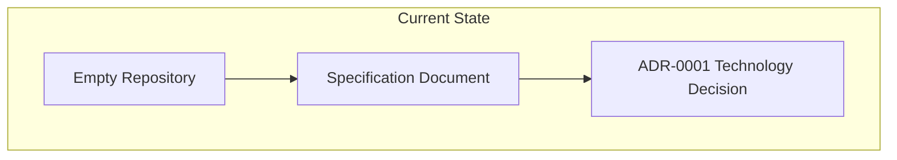
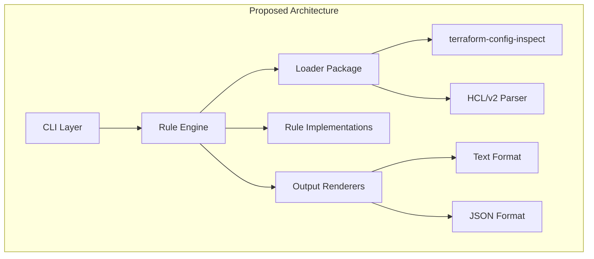
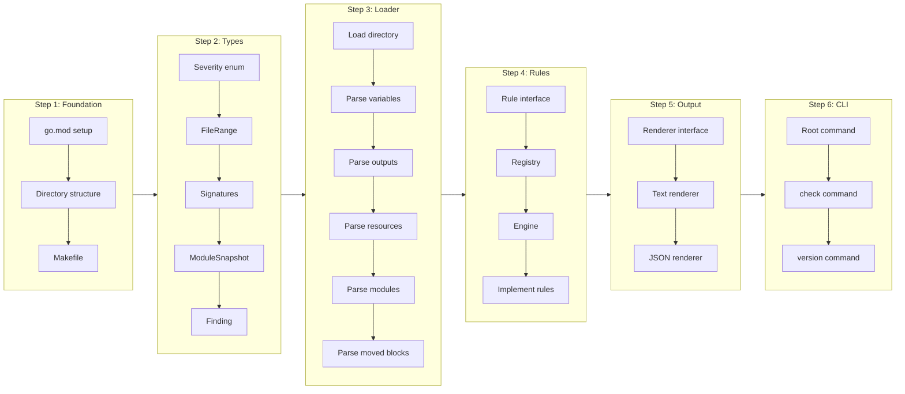

# Phase 1: MVP Implementation - Core Functionality

## Change Summary

Implement the Minimum Viable Product (MVP) for tfbreak, a static analysis tool that compares two Terraform configurations and reports breaking changes to module interfaces and state safety. This CR covers the foundational architecture, core rules, CLI interface, and output formats necessary for basic usage.

## Motivation and Background

Terraform module maintainers currently have no automated way to detect breaking changes before releasing new versions. Manual review is error-prone, time-consuming, and inconsistent. Teams need a tool that can be integrated into CI pipelines to catch breaking changes early in the development cycle.

The MVP will enable users to run `tfbreak check old/ new/` and receive clear feedback about changes that would break callers or destroy state.

## Change Drivers

* No existing tool provides static analysis specifically for Terraform module interface contracts
* Manual review of breaking changes is error-prone and does not scale
* CI/CD pipelines need machine-readable output and clear exit codes
* Module consumers need confidence that updates won't break their infrastructure

## Current State

This is a greenfield project. No code exists yet. The project repository contains only:
- `spec/001_IDEA.md` - Complete specification document
- `docs/adr/ADR-0001-*.md` - Technology stack decision

### Current State Diagram



## Proposed Change

Implement the complete Phase 1 MVP as defined in spec/001_IDEA.md section 10, including:

1. **Project Infrastructure** - Go module setup, directory structure, build system
2. **Core Types** - Severity, Finding, ModuleSnapshot, and related data structures
3. **Loader Package** - Extract module signatures from Terraform configurations
4. **Rules Engine** - Evaluate rules against old/new snapshots
5. **Core Rules** - 9 rules covering variables, outputs, and state safety
6. **CLI Interface** - check and version commands
7. **Output Renderers** - Text and JSON formats
8. **Test Suite** - Unit tests and fixture-based integration tests

### Proposed State Diagram



## Requirements

### Functional Requirements

#### Project Setup

1. The project **MUST** use Go modules with module path `github.com/jokarl/tfbreak-core`
2. The project **MUST** follow the directory structure defined in spec/001_IDEA.md section 9
3. The project **MUST** include a Makefile with targets: `build`, `test`, `lint`, `clean`
4. The project **MUST** compile without CGO dependencies

#### Types Package

5. The system **MUST** implement the `Severity` type with values: `BREAKING`, `RISKY`, `INFO`
6. The system **MUST** implement the `ModuleSnapshot` struct as defined in spec section 3.2
7. The system **MUST** implement the `VariableSignature` struct with fields: Name, Type, Default, Description, Sensitive, Required, DeclRange (Note: Nullable requires direct HCL parsing, deferred to Phase 3)
8. The system **MUST** implement the `OutputSignature` struct with fields: Name, Description, Sensitive, DeclRange
9. The system **MUST** implement the `ResourceSignature` struct with fields: Type, Name, Address, DeclRange
10. The system **MUST** implement the `ModuleCallSignature` struct with fields: Name, Source, Address, DeclRange
11. The system **MUST** implement the `MovedBlock` struct with fields: From, To, DeclRange
12. The system **MUST** implement the `Finding` struct as defined in spec section 3.3
13. The system **MUST** implement the `FileRange` struct with fields: Filename, Line (Note: terraform-config-inspect only provides start line, no end line)

#### Loader Package

14. The system **MUST** load all `.tf` files from a given directory
15. The system **MUST** extract variable declarations using terraform-config-inspect
16. The system **MUST** extract output declarations using terraform-config-inspect
17. The system **MUST** extract resource declarations using terraform-config-inspect
18. The system **MUST** extract module call declarations using terraform-config-inspect
19. The system **MUST** parse moved blocks using HCL/v2 directly
20. The system **MUST** return a `ModuleSnapshot` containing all extracted signatures
21. The system **MUST** handle empty directories gracefully (return empty snapshot)
22. The system **MUST** report parse errors with file and line information

#### Rule Engine

23. The system **MUST** implement the `Rule` interface as defined in spec section 3.3
24. The system **MUST** implement a rule registry that holds all available rules
25. The system **MUST** evaluate all enabled rules against old and new snapshots
26. The system **MUST** collect all findings from all rules into a single result set
27. The system **MUST** support enabling/disabling rules via configuration

#### Core Rules (MVP Set)

28. The system **MUST** implement rule BC001 (required-input-added) as defined in spec section 2.3
29. The system **MUST** implement rule BC002 (input-removed) as defined in spec section 2.3
30. The system **MUST** implement rule BC005 (input-default-removed) as defined in spec section 2.3
31. The system **MUST** implement rule RC006 (input-default-changed) as defined in spec section 2.3
32. The system **MUST** implement rule BC009 (output-removed) as defined in spec section 2.3
33. The system **MUST** implement rule BC100 (resource-removed-no-moved) as defined in spec section 2.3
34. The system **MUST** implement rule BC101 (module-removed-no-moved) as defined in spec section 2.3
35. The system **MUST** implement rule BC102 (invalid-moved-block) which triggers when: (a) HCL parse error in moved block, or (b) type mismatch between from/to (resource to module or vice versa)
36. The system **MUST** implement rule BC103 (conflicting-moved) which triggers when: (a) duplicate "from" addresses exist, (b) moved blocks form a cycle, or (c) "to" address does not exist in the new configuration

#### CLI Interface

37. The system **MUST** implement the `check` command that accepts two directory arguments
38. The system **MUST** implement the `version` command that prints version information
39. The system **MUST** support the `--format` flag with values: `text`, `json`
40. The system **MUST** support the `--output` flag to write results to a file
41. The system **MUST** support the `--fail-on` flag with values: `BREAKING`, `RISKY`, `INFO`
42. The system **MUST** support the `--color` flag with values: `auto`, `always`, `never`
43. The system **MUST** support the `--quiet` flag to suppress non-error output
44. The system **MUST** support the `--verbose` flag for detailed output

#### Exit Codes

45. The system **MUST** exit with code 0 when no findings at or above fail_on severity
46. The system **MUST** exit with code 1 when findings at or above fail_on severity exist
47. The system **MUST** exit with code 2 for configuration or usage errors
48. The system **MUST** exit with code 3 for internal errors

#### Output Formats

49. The system **MUST** implement text output format as shown in spec section 7.1
50. The system **MUST** implement JSON output format as shown in spec section 7.2
51. The system **MUST** include a summary section in both output formats
52. The system **MUST** include the result (PASS/FAIL) in both output formats

### Non-Functional Requirements

53. The system **MUST** complete analysis of a 100-resource module in under 5 seconds
54. The system **MUST** produce deterministic output (same input always produces same output)
55. The system **MUST** handle malformed HCL gracefully with clear error messages
56. The system **MUST** not panic on any input (use error returns instead)

## Affected Components

* New: `cmd/tfbreak/main.go` - Entry point
* New: `internal/cli/` - CLI command implementations
* New: `internal/types/` - Core type definitions
* New: `internal/loader/` - Terraform configuration loader
* New: `internal/rules/` - Rule implementations and engine
* New: `internal/output/` - Output renderers
* New: `testdata/scenarios/` - Test fixtures

## Scope Boundaries

### In Scope

* Go module initialization and project structure
* Core type definitions (Severity, Finding, ModuleSnapshot, etc.)
* Loader for extracting signatures from `.tf` files
* Rule engine with registry pattern
* 9 core rules: BC001, BC002, BC005, RC006, BC009, BC100, BC101, BC102, BC103
* CLI with `check` and `version` commands
* Text and JSON output formats
* Unit tests for all rules
* Fixture-based integration tests
* Makefile for build, test, lint

### Out of Scope ("Here, But Not Further")

* Configuration file loading (`.tfbreak.hcl`) - deferred to CR-0002 (Phase 2)
* Annotation/ignore system - deferred to CR-0002 (Phase 2)
* Rules BC003, BC004, RC007, RC008, BC010, RC011, BC200, BC201 - deferred to CR-0003 (Phase 3). Note: RC007 (nullable-changed) requires direct HCL parsing since terraform-config-inspect does not expose the nullable attribute
* `diff`, `explain`, `init` commands - deferred to CR-0002 (Phase 2)
* Git ref mode (`--git-base`, `--git-head`) - deferred to CR-0004 (Phase 4)
* SARIF output format - deferred to CR-0004 (Phase 4)
* `.tf.json` file support - future consideration
* Rename detection heuristics - deferred to CR-0004 (Phase 4)
* Data source tracking - intentionally excluded (data sources are read-only queries without state migration concerns)

## Implementation Approach

The implementation will proceed in the following order to minimize dependencies and enable incremental testing:

### Implementation Flow



### Step 1: Foundation

Create the project structure and build system:

```
tfbreak-core/
├── cmd/tfbreak/main.go
├── internal/
│   ├── cli/
│   ├── config/
│   ├── loader/
│   ├── rules/
│   ├── output/
│   └── types/
├── testdata/scenarios/
├── go.mod
├── go.sum
└── Makefile
```

### Step 2: Types Package

Implement all core types in `internal/types/`:
- `severity.go` - Severity enum and methods
- `snapshot.go` - ModuleSnapshot and signature types
- `finding.go` - Finding type

### Step 3: Loader Package

Implement the loader in `internal/loader/`:
- `loader.go` - Main Load function
- `variables.go` - Variable extraction
- `outputs.go` - Output extraction
- `resources.go` - Resource extraction
- `modules.go` - Module call extraction
- `moved.go` - Moved block parsing with HCL/v2

### Step 4: Rules Package

Implement the rule engine and rules in `internal/rules/`:
- `rule.go` - Rule interface
- `registry.go` - Rule registry
- `engine.go` - Rule evaluation engine
- `bc001.go` through `bc103.go` - Individual rule implementations

### Step 5: Output Package

Implement output renderers in `internal/output/`:
- `renderer.go` - Renderer interface
- `text.go` - Text format renderer
- `json.go` - JSON format renderer

### Step 6: CLI Package

Implement CLI in `internal/cli/`:
- `root.go` - Root command setup
- `check.go` - Check command
- `version.go` - Version command

## Test Strategy

### Tests to Add

| Test File | Test Name | Description | Inputs | Expected Output |
|-----------|-----------|-------------|--------|-----------------|
| `internal/types/severity_test.go` | `TestSeverityString` | Validates severity string representation | Each severity value | Correct string |
| `internal/types/severity_test.go` | `TestSeverityComparison` | Validates severity ordering | Severity pairs | Correct comparison |
| `internal/loader/loader_test.go` | `TestLoadEmptyDirectory` | Handles empty directories | Empty dir path | Empty snapshot, no error |
| `internal/loader/loader_test.go` | `TestLoadVariables` | Extracts variable signatures | Dir with variables.tf | Correct variable map |
| `internal/loader/loader_test.go` | `TestLoadOutputs` | Extracts output signatures | Dir with outputs.tf | Correct output map |
| `internal/loader/loader_test.go` | `TestLoadResources` | Extracts resource signatures | Dir with main.tf | Correct resource map |
| `internal/loader/loader_test.go` | `TestLoadModules` | Extracts module signatures | Dir with modules | Correct module map |
| `internal/loader/moved_test.go` | `TestParseMovedBlocks` | Parses moved blocks | HCL with moved blocks | Correct MovedBlock slice |
| `internal/loader/moved_test.go` | `TestParseInvalidMovedBlock` | Handles malformed moved | Invalid HCL | Error with location |
| `internal/rules/bc001_test.go` | `TestBC001_NewRequiredVariable` | Detects new required var | Old: none, New: required var | Finding with BC001 |
| `internal/rules/bc001_test.go` | `TestBC001_NewOptionalVariable` | Ignores optional vars | Old: none, New: var with default | No finding |
| `internal/rules/bc001_test.go` | `TestBC001_ExistingVariable` | Ignores existing vars | Old: var, New: same var | No finding |
| `internal/rules/bc002_test.go` | `TestBC002_RemovedVariable` | Detects removed var | Old: var, New: none | Finding with BC002 |
| `internal/rules/bc002_test.go` | `TestBC002_VariableStillExists` | Ignores existing vars | Old: var, New: var | No finding |
| `internal/rules/bc005_test.go` | `TestBC005_DefaultRemoved` | Detects default removal | Old: var with default, New: var without | Finding with BC005 |
| `internal/rules/bc005_test.go` | `TestBC005_DefaultStillExists` | Ignores when default present | Old: default, New: default | No finding |
| `internal/rules/rc006_test.go` | `TestRC006_DefaultChanged` | Detects default change | Old: default "a", New: default "b" | Finding with RC006 |
| `internal/rules/rc006_test.go` | `TestRC006_DefaultUnchanged` | Ignores same default | Old: default "a", New: default "a" | No finding |
| `internal/rules/bc009_test.go` | `TestBC009_RemovedOutput` | Detects removed output | Old: output, New: none | Finding with BC009 |
| `internal/rules/bc100_test.go` | `TestBC100_ResourceRemovedNoMoved` | Detects resource removal | Old: resource, New: none, no moved | Finding with BC100 |
| `internal/rules/bc100_test.go` | `TestBC100_ResourceMovedCorrectly` | Ignores with moved block | Old: resource, New: moved block | No finding |
| `internal/rules/bc101_test.go` | `TestBC101_ModuleRemovedNoMoved` | Detects module removal | Old: module, New: none, no moved | Finding with BC101 |
| `internal/rules/bc102_test.go` | `TestBC102_InvalidMovedSyntax` | Detects HCL parse error | Malformed moved block | Finding with BC102 |
| `internal/rules/bc102_test.go` | `TestBC102_TypeMismatch` | Detects resource-to-module mismatch | moved from resource to module | Finding with BC102 |
| `internal/rules/bc103_test.go` | `TestBC103_DuplicateFrom` | Detects duplicate from | Two moved with same from | Finding with BC103 |
| `internal/rules/bc103_test.go` | `TestBC103_CyclicMoved` | Detects cycles | A->B, B->A | Finding with BC103 |
| `internal/rules/bc103_test.go` | `TestBC103_NonExistentTarget` | Detects missing "to" target | moved to non-existent resource | Finding with BC103 |
| `internal/rules/engine_test.go` | `TestEngineRunsAllRules` | All rules evaluated | Snapshot pair | Findings from all applicable |
| `internal/output/text_test.go` | `TestTextRenderer` | Correct text format | Findings list | Formatted text |
| `internal/output/json_test.go` | `TestJSONRenderer` | Correct JSON format | Findings list | Valid JSON |
| `internal/cli/check_test.go` | `TestCheckCommandExitCodes` | Correct exit codes | Various scenarios | Correct exit code |

### Fixture-Based Integration Tests

| Test Directory | Scenario | Expected Findings |
|----------------|----------|-------------------|
| `testdata/scenarios/bc001_required_input_added/` | New required variable | BC001 |
| `testdata/scenarios/bc002_input_removed/` | Variable removed | BC002 |
| `testdata/scenarios/bc005_default_removed/` | Default removed | BC005 |
| `testdata/scenarios/rc006_default_changed/` | Default changed | RC006 |
| `testdata/scenarios/bc009_output_removed/` | Output removed | BC009 |
| `testdata/scenarios/bc100_resource_removed/` | Resource removed, no moved | BC100 |
| `testdata/scenarios/bc100_resource_moved/` | Resource with moved block | None |
| `testdata/scenarios/bc101_module_removed/` | Module removed, no moved | BC101 |
| `testdata/scenarios/bc102_invalid_moved/` | Invalid moved syntax | BC102 |
| `testdata/scenarios/bc102_type_mismatch/` | Moved from resource to module | BC102 |
| `testdata/scenarios/bc103_duplicate_from/` | Duplicate from addresses | BC103 |
| `testdata/scenarios/bc103_cyclic_moved/` | Cyclic moved blocks | BC103 |
| `testdata/scenarios/bc103_nonexistent_target/` | Moved to non-existent resource | BC103 |
| `testdata/scenarios/no_changes/` | Identical configs | None |
| `testdata/scenarios/multiple_findings/` | Multiple issues | Multiple |

### Tests to Modify

Not applicable - this is a greenfield implementation.

### Tests to Remove

Not applicable - this is a greenfield implementation.

## Acceptance Criteria

### AC-1: Project builds successfully

```gherkin
Given a clean checkout of the repository
When I run "make build"
Then the build completes without errors
  And a binary is produced at "bin/tfbreak"
```

### AC-2: Version command works

```gherkin
Given the tfbreak binary is built
When I run "tfbreak version"
Then the output contains the version number
  And the exit code is 0
```

### AC-3: Check detects new required variable (BC001)

```gherkin
Given an old directory with no variables
  And a new directory with a variable without default
When I run "tfbreak check old/ new/"
Then the output contains "BC001"
  And the output contains "required-input-added"
  And the exit code is 1
```

### AC-4: Check detects removed variable (BC002)

```gherkin
Given an old directory with a variable "foo"
  And a new directory without variable "foo"
When I run "tfbreak check old/ new/"
Then the output contains "BC002"
  And the output contains "input-removed"
  And the exit code is 1
```

### AC-5: Check detects default removal (BC005)

```gherkin
Given an old directory with a variable with default
  And a new directory with the same variable without default
When I run "tfbreak check old/ new/"
Then the output contains "BC005"
  And the output contains "input-default-removed"
  And the exit code is 1
```

### AC-6: Check detects default change (RC006)

```gherkin
Given an old directory with variable default "a"
  And a new directory with variable default "b"
When I run "tfbreak check old/ new/ --fail-on RISKY"
Then the output contains "RC006"
  And the output contains "input-default-changed"
  And the exit code is 1
```

### AC-7: Check detects removed output (BC009)

```gherkin
Given an old directory with output "bar"
  And a new directory without output "bar"
When I run "tfbreak check old/ new/"
Then the output contains "BC009"
  And the output contains "output-removed"
  And the exit code is 1
```

### AC-8: Check detects resource removal without moved (BC100)

```gherkin
Given an old directory with resource "aws_s3_bucket.main"
  And a new directory without that resource and no moved block
When I run "tfbreak check old/ new/"
Then the output contains "BC100"
  And the output contains "resource-removed-no-moved"
  And the exit code is 1
```

### AC-9: Check allows resource removal with moved block

```gherkin
Given an old directory with resource "aws_s3_bucket.main"
  And a new directory with a moved block from "aws_s3_bucket.main" to "aws_s3_bucket.primary"
  And a new directory with resource "aws_s3_bucket.primary"
When I run "tfbreak check old/ new/"
Then the output does not contain "BC100"
  And the exit code is 0
```

### AC-10: Check detects module removal without moved (BC101)

```gherkin
Given an old directory with module "vpc"
  And a new directory without that module and no moved block
When I run "tfbreak check old/ new/"
Then the output contains "BC101"
  And the output contains "module-removed-no-moved"
  And the exit code is 1
```

### AC-11: Check detects invalid moved block syntax (BC102)

```gherkin
Given a new directory with a moved block that has HCL parse errors
When I run "tfbreak check old/ new/"
Then the output contains "BC102"
  And the output contains "invalid-moved-block"
  And the exit code is 1
```

### AC-11b: Check detects moved block type mismatch (BC102)

```gherkin
Given an old directory with resource "aws_s3_bucket.main"
  And a new directory with a moved block from "aws_s3_bucket.main" to "module.bucket"
When I run "tfbreak check old/ new/"
Then the output contains "BC102"
  And the output contains "invalid-moved-block"
  And the exit code is 1
```

### AC-12: Check detects conflicting moved blocks - duplicate from (BC103)

```gherkin
Given a new directory with two moved blocks having the same "from" address
When I run "tfbreak check old/ new/"
Then the output contains "BC103"
  And the output contains "conflicting-moved"
  And the exit code is 1
```

### AC-12b: Check detects moved block with non-existent target (BC103)

```gherkin
Given an old directory with resource "aws_s3_bucket.main"
  And a new directory with a moved block from "aws_s3_bucket.main" to "aws_s3_bucket.primary"
  And no resource "aws_s3_bucket.primary" exists in the new directory
When I run "tfbreak check old/ new/"
Then the output contains "BC103"
  And the output contains "conflicting-moved"
  And the exit code is 1
```

### AC-13: JSON output format

```gherkin
Given old and new directories with changes
When I run "tfbreak check old/ new/ --format json"
Then the output is valid JSON
  And the JSON contains "findings" array
  And the JSON contains "summary" object
  And the JSON contains "result" field
```

### AC-14: Text output format

```gherkin
Given old and new directories with changes
When I run "tfbreak check old/ new/ --format text"
Then the output contains severity labels (BREAKING, RISKY)
  And the output contains file locations
  And the output contains a summary line
  And the output contains a result line
```

### AC-15: Exit code 0 for clean comparison

```gherkin
Given identical old and new directories
When I run "tfbreak check old/ new/"
Then the exit code is 0
  And the output indicates no breaking changes
```

### AC-16: Exit code 2 for invalid arguments

```gherkin
Given no arguments provided
When I run "tfbreak check"
Then the exit code is 2
  And the output contains usage information
```

### AC-17: All tests pass

```gherkin
Given the complete implementation
When I run "make test"
Then all tests pass
  And test coverage is at least 80%
```

### AC-18: Linting passes

```gherkin
Given the complete implementation
When I run "make lint"
Then no linting errors are reported
```

## Quality Standards Compliance

### Build & Compilation

- [ ] Code compiles/builds without errors
- [ ] No new compiler warnings introduced
- [ ] Binary produced for target platforms

### Linting & Code Style

- [ ] All linter checks pass with zero warnings/errors
- [ ] Code follows Go project conventions
- [ ] Any linter exceptions are documented with justification

### Test Execution

- [ ] All existing tests pass after implementation
- [ ] All new tests pass
- [ ] Test coverage meets 80% requirement for changed code

### Documentation

- [ ] Inline code documentation updated where applicable
- [ ] README updated with basic usage instructions
- [ ] CLI help text is accurate and complete

### Code Review

- [ ] Changes submitted via pull request
- [ ] PR title follows Conventional Commits format
- [ ] Code review completed and approved
- [ ] Changes squash-merged to maintain linear history

### Verification Commands

```bash
# Build verification
make build

# Lint verification
make lint

# Test execution
make test

# Test coverage
make coverage
```

## Technical Constraints (Confirmed via DeepWiki Research)

The following constraints were confirmed by analyzing the terraform-config-inspect library:

### terraform-config-inspect Provides

| Type | Available Fields |
|------|------------------|
| Variable | Name, Type (string), Default (interface{} via JSON), Description, Sensitive (bool), Required (bool), Pos |
| Output | Name, Description, Sensitive (bool), Pos |
| Resource | Mode, Type, Name, Provider (ProviderRef), Pos |
| ModuleCall | Name, Source, Version, Pos |
| SourcePos | Filename, Line (no column, no end line) |

### terraform-config-inspect Does NOT Provide

| Feature | Workaround |
|---------|------------|
| Moved blocks | Parse with HCL/v2 directly |
| Variable.nullable | Deferred to Phase 3 (requires HCL/v2 parsing) |
| End line in SourcePos | FileRange will only have Line field |

### Default Value Handling

- terraform-config-inspect converts cty.Value to interface{} via JSON marshaling
- For RC006 comparison, re-serialize both defaults to JSON and compare strings
- This handles complex types (maps, lists, objects) correctly

## Risks and Mitigation

### Risk 1: HCL/v2 parsing complexity for moved blocks

**Likelihood:** medium
**Impact:** medium
**Mitigation:** Implement moved block parsing early in the implementation. Reference Terraform source code for the moved block schema. Use hcl.DecodeBody with a defined schema.

### Risk 2: Default value comparison edge cases

**Likelihood:** low
**Impact:** medium
**Mitigation:** Use canonical JSON serialization for default comparison. Add test cases covering: simple types, lists, maps, nested objects, null values.

### Risk 3: Moved block validation complexity

**Likelihood:** medium
**Impact:** medium
**Mitigation:** Clear boundary between BC102 and BC103: BC102 handles structural validity (HCL parse errors, type mismatches like resource↔module), BC103 handles semantic conflicts (duplicate "from" addresses, cycles, non-existent "to" targets). The "to must exist" check belongs in BC103.

## Dependencies

* ADR-0001 accepted (technology stack decision)
* Go 1.21+ installed
* golangci-lint installed for linting

## Estimated Effort

| Component | Estimate |
|-----------|----------|
| Project setup and types | Small |
| Loader package | Medium |
| Rules engine and 9 rules | Medium |
| Output renderers | Small |
| CLI commands | Small |
| Unit tests | Medium |
| Integration tests | Medium |
| Documentation | Small |

## Decision Outcome

Chosen approach: "Implement MVP as specified in Phase 1 of spec/001_IDEA.md", because it provides the minimum viable functionality needed for users to start detecting breaking changes in their Terraform modules, while deferring configuration and advanced features to subsequent phases.

## Related Items

* Specification: `spec/001_IDEA.md`
* Architecture Decision: `docs/adr/ADR-0001-project-inception-and-technology-stack.md`
* Future: CR-0002 (Phase 2: Configuration & Annotations)
* Future: CR-0003 (Phase 3: Extended Rules)
* Future: CR-0004 (Phase 4: CI Enhancements)
