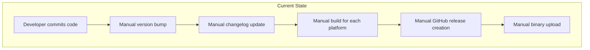
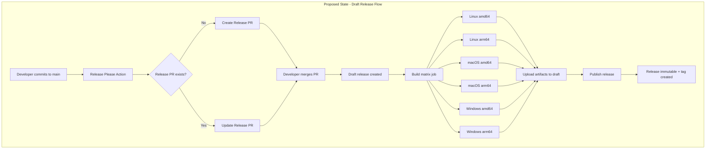
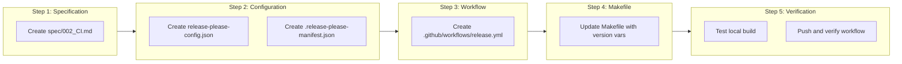

# Automated Releases with Release Please

## Change Summary

Add automated release management using Google's Release Please GitHub Action. This enables automatic version bumping based on Conventional Commits, changelog generation from commit history, and cross-platform binary distribution attached to GitHub releases. The implementation uses draft releases to support GitHub's immutable release feature.

## Motivation and Background

Manual release processes are error-prone, time-consuming, and inconsistent. Without automation:
- Version numbers must be manually tracked and updated
- Changelogs must be manually written and often become outdated
- Binary builds for multiple platforms require manual effort
- Release timing becomes unpredictable

Release Please solves these problems by automating the entire release workflow based on Conventional Commits, which tfbreak already uses.

## Change Drivers

* Need for consistent, automated releases to support module consumers
* Requirement for cross-platform binaries (Linux, macOS, Windows on amd64/arm64)
* Desire to minimize manual release overhead
* CI/CD best practice of automating repetitive processes
* GitHub immutable releases enabled - requires draft release workflow

## Current State

The project has a working MVP implementation (CR-0001) with:
- A Makefile that can build the binary
- Version variables in `cmd/tfbreak/main.go` that can be injected via ldflags
- No automated release process
- No GitHub Actions workflows

### Current State Diagram



## Proposed Change

Implement automated releases using Release Please with the following components:

1. **Release Please Configuration** - Config files for version management, changelog, and draft releases
2. **GitHub Actions Workflow** - Automated workflow triggered on push to main
3. **Draft Release Strategy** - Create releases as drafts, upload artifacts, then publish
4. **Cross-Platform Build Matrix** - Build binaries for 6 platform combinations
5. **Version Injection** - Inject version, commit, and date into binaries
6. **Specification Document** - Document CI/CD architecture in `spec/002_CI.md`

### Proposed State Diagram



## Requirements

### Functional Requirements

#### Release Please Configuration

1. The project **MUST** include a `release-please-config.json` file with release type set to "go"
2. The project **MUST** include a `.release-please-manifest.json` file tracking the current version
3. The configuration **MUST** set `draft: true` to create releases as drafts
4. The changelog **MUST** include a custom section for Dependencies (`deps` commit type)
5. The changelog **MUST** use Release Please defaults for Features and Bug Fixes (automatic)
6. The configuration **MUST** set `include-component-in-tag: false` for clean version tags

#### GitHub Actions Workflow

7. The workflow **MUST** trigger on push to the `main` branch
8. The workflow **MUST** use `googleapis/release-please-action@v4`
9. The workflow **MUST** output whether a release was created
10. The workflow **MUST** output the tag name when a release is created
11. The workflow **MUST** output the version when a release is created
12. The workflow **MUST** output the commit SHA for the release

#### Build Process

13. The build job **MUST** run only when a release is created
14. The build job **MUST** checkout code at the commit SHA (not the tag, since tag doesn't exist for draft releases)
15. The build job **MUST** produce binaries for all 6 platform combinations
16. Each binary **MUST** be named `tfbreak-{os}-{arch}` with `.exe` suffix for Windows
17. Each binary **MUST** be compiled with `CGO_ENABLED=0` for static linking
18. Each binary **MUST** include `-trimpath` flag to remove filesystem paths
19. Each binary **MUST** include `-ldflags "-s -w"` to strip debug information

#### Version Injection

20. The build **MUST** inject the release version via `-X main.version`
21. The build **MUST** inject the commit SHA via `-X main.commit`
22. The build **MUST** inject the build date via `-X main.date`
23. The local Makefile **MUST** also inject version information for local builds

#### Release Assets and Publishing

24. All 6 binaries **MUST** be uploaded to the draft GitHub release
25. After all artifacts are uploaded, the workflow **MUST** publish the release using `gh release edit --draft=false`
26. Publishing the release **MUST** create the git tag and make the release immutable

### Non-Functional Requirements

27. The workflow **MUST** complete all builds in under 10 minutes
28. The workflow **MUST** use `ubuntu-latest` for all jobs
29. The workflow **MUST** have `contents: write` and `pull-requests: write` permissions
30. The workflow **MUST** be compatible with GitHub's immutable releases feature

## Affected Components

* New: `.github/workflows/release.yml` - GitHub Actions release workflow
* New: `release-please-config.json` - Release Please configuration
* New: `.release-please-manifest.json` - Version manifest
* New: `spec/002_CI.md` - CI/CD specification document
* Modified: `Makefile` - Add version injection variables

## Scope Boundaries

### In Scope

* Release Please configuration for Go projects with draft releases
* GitHub Actions workflow for release automation
* Cross-platform binary builds (6 platforms)
* Version injection via ldflags
* Makefile updates for local version injection
* CI/CD specification document
* Compatibility with GitHub immutable releases

### Out of Scope ("Here, But Not Further")

* Homebrew formula - deferred to future CR
* Docker image publishing - deferred to future CR
* GoReleaser integration - using manual build matrix instead for simplicity
* Code signing for binaries - deferred to future CR
* Artifact attestation - deferred to future CR
* Additional CI jobs (lint, test) - can be added in separate workflow

## Alternative Approaches Considered

* **GoReleaser** - More feature-rich but adds complexity; Release Please with manual builds is simpler and sufficient for MVP
* **Manual releases** - Rejected due to high overhead and inconsistency
* **GitHub Release Drafter** - Only handles changelog, doesn't manage versions
* **Non-draft releases with --clobber** - Incompatible with immutable releases; artifacts cannot be modified after publication
* **Disable immutable releases** - Rejected; immutable releases provide security guarantees

## Impact Assessment

### User Impact

Users will benefit from:
- Predictable release cadence based on merged changes
- Pre-built binaries for their platform
- Clear changelogs documenting what changed in each release
- Semantic versioning that follows Conventional Commits
- Immutable releases ensuring artifact integrity

### Technical Impact

- Repository gains new workflow files and configuration
- Makefile updated to support version injection
- No breaking changes to existing functionality
- Builds become reproducible via commit SHA checkout
- Draft release workflow enables immutable releases

### Business Impact

- Reduced maintenance overhead for releases
- Faster iteration cycle from commit to release
- Professional release process builds user confidence
- Immutable releases provide supply chain security

## Implementation Approach

### Implementation Flow



### File Details

#### spec/002_CI.md

Specification document following the format of `spec/001_IDEA.md`, covering:
- Overview of Release Please
- Version bump rules
- Build configuration
- Workflow architecture
- Draft release strategy
- Verification procedures

#### release-please-config.json

```json
{
  "$schema": "https://raw.githubusercontent.com/googleapis/release-please/main/schemas/config.json",
  "release-type": "go",
  "draft": true,
  "packages": {
    ".": {
      "component": "tfbreak"
    }
  },
  "changelog-sections": [
    {
      "type": "deps",
      "section": "Dependencies"
    }
  ],
  "include-component-in-tag": false
}
```

Notes:
- `draft: true` creates releases as drafts for immutable release compatibility
- `feat` and `fix` changelog sections are included automatically by Release Please
- Only `deps` needs explicit configuration for the Dependencies section
- PR title uses Release Please defaults

#### .release-please-manifest.json

```json
{
  ".": "0.1.0"
}
```

#### .github/workflows/release.yml

Key workflow steps:
1. **release-please job**: Runs Release Please, creates draft release, outputs `release_created`, `tag_name`, `version`, `sha`
2. **build job**: Matrix build (6 platforms), checks out at **commit SHA** (not tag), runs only if release created
3. **upload-release-assets job**: Downloads artifacts, uploads to draft release, then publishes with `gh release edit --draft=false`

Critical implementation detail: The build job checks out at the commit SHA rather than the tag because draft releases don't create tags until published.

#### Makefile Changes

Add version injection variables:

```makefile
VERSION ?= dev
COMMIT ?= $(shell git rev-parse --short HEAD 2>/dev/null || echo "none")
DATE ?= $(shell date -u +"%Y-%m-%dT%H:%M:%SZ")

LDFLAGS=-s -w \
    -X main.version=$(VERSION) \
    -X main.commit=$(COMMIT) \
    -X main.date=$(DATE)
```

## Test Strategy

### Tests to Add

This CR does not add new code tests. Verification is done through:

| Verification | Method | Expected Result |
|--------------|--------|-----------------|
| Local build | `make build && ./bin/tfbreak version` | Shows commit and date |
| Workflow syntax | GitHub Actions parser | Valid YAML |
| Release Please config | JSON schema validation | Valid config |

### Tests to Modify

Not applicable - no existing tests affected.

### Tests to Remove

Not applicable - no tests to remove.

## Acceptance Criteria

### AC-1: Local build shows version information

```gherkin
Given the updated Makefile
When I run "make build && ./bin/tfbreak version"
Then the output contains the git commit hash
  And the output contains the build date
```

### AC-2: Release Please creates release PR

```gherkin
Given a push to main with a feat: commit
When the release workflow runs
Then Release Please creates a release PR
  And the PR body contains a changelog
```

### AC-3: Merging release PR creates draft release

```gherkin
Given an open Release Please PR
When I merge the PR
Then a draft release is created
  And no git tag exists yet
  And the build workflow triggers
```

### AC-4: Build produces all platform binaries

```gherkin
Given a draft release was created
When the build workflow completes
Then 6 binaries are uploaded to the draft release:
  | tfbreak-linux-amd64 |
  | tfbreak-linux-arm64 |
  | tfbreak-darwin-amd64 |
  | tfbreak-darwin-arm64 |
  | tfbreak-windows-amd64.exe |
  | tfbreak-windows-arm64.exe |
```

### AC-5: Release is published after artifact upload

```gherkin
Given all 6 binaries are uploaded to the draft release
When the upload-release-assets job completes
Then the release is published (no longer a draft)
  And the git tag is created
  And the release becomes immutable
```

### AC-6: Binary contains correct version

```gherkin
Given a released binary for the current platform
When I run "./tfbreak version"
Then the output shows the release version (e.g., "0.1.0")
  And the output shows the release commit SHA
  And the output shows the build date
```

### AC-7: Specification document exists

```gherkin
Given the implementation is complete
When I read spec/002_CI.md
Then it documents the release workflow
  And it documents the build configuration
  And it documents the draft release strategy
  And it documents verification procedures
```

### AC-8: Immutable releases are supported

```gherkin
Given GitHub immutable releases are enabled
When a release is published
Then the release assets cannot be modified
  And the release tag cannot be modified
  And subsequent workflow runs do not fail
```

## Quality Standards Compliance

### Build & Compilation

- [x] Code compiles/builds without errors
- [x] No new compiler warnings introduced

### Linting & Code Style

- [x] All linter checks pass with zero warnings/errors
- [x] YAML follows standard formatting
- [x] JSON is valid and properly formatted

### Test Execution

- [x] All existing tests pass after implementation
- [x] Local build verification passes

### Documentation

- [x] spec/002_CI.md created with full documentation
- [x] Workflow includes descriptive step names

### Code Review

- [ ] Changes submitted via pull request
- [ ] PR title follows Conventional Commits format
- [ ] Code review completed and approved
- [ ] Changes squash-merged to maintain linear history

### Verification Commands

```bash
# Build verification
make build

# Version output verification
./bin/tfbreak version

# Test execution
make test

# YAML lint (if yamllint installed)
yamllint .github/workflows/release.yml

# JSON validation
python3 -m json.tool release-please-config.json > /dev/null
python3 -m json.tool .release-please-manifest.json > /dev/null
```

## Risks and Mitigation

### Risk 1: Release Please version compatibility

**Likelihood:** low
**Impact:** medium
**Mitigation:** Pin to `googleapis/release-please-action@v4` which is stable. Monitor for breaking changes in release notes.

### Risk 2: Build matrix failure on one platform

**Likelihood:** low
**Impact:** medium
**Mitigation:** Each platform builds independently; a failure on one doesn't affect others. Can manually re-run failed jobs. Draft release allows retries before publishing.

### Risk 3: Draft release not published

**Likelihood:** low
**Impact:** high
**Mitigation:** The publish step runs after all artifacts are uploaded. If it fails, the draft release remains and can be manually published or the workflow can be re-run.

### Risk 4: Immutable release prevents re-runs

**Likelihood:** medium
**Impact:** low
**Mitigation:** Using draft releases solves this - artifacts are uploaded before publication. Once published, re-runs are not needed since artifacts are already attached.

## Dependencies

* CR-0001 implemented (MVP with version variables in main.go)
* GitHub repository with Actions enabled
* `GITHUB_TOKEN` with `contents: write` and `pull-requests: write` permissions
* GitHub immutable releases enabled (optional but supported)

## Estimated Effort

| Component | Estimate |
|-----------|----------|
| Specification document | Small |
| Release Please config files | Small |
| GitHub Actions workflow | Small |
| Makefile updates | Small |
| Verification and testing | Small |

## Decision Outcome

Chosen approach: "Release Please with draft releases and manual build matrix", because:
1. Provides automated version management and changelog generation
2. Keeps the build process simple and understandable
3. Supports GitHub immutable releases through draft → publish workflow
4. GoReleaser was considered but adds complexity not needed for MVP

## Implementation Status

* **Started:** 2026-01-28
* **Completed:** 2026-01-28
* **Notes:** Implementation completed. Files created:
  - `spec/002_CI.md`
  - `release-please-config.json` (with `draft: true`)
  - `.release-please-manifest.json`
  - `.github/workflows/release.yml` (with SHA checkout and publish step)
  - `Makefile` (updated with version injection)

## Related Items

* Specification: `spec/002_CI.md`
* Prerequisite: `docs/cr/CR-0001-phase1-mvp-implementation.md`
* DeepWiki validation: `googleapis/release-please`, `googleapis/release-please-action`

## DeepWiki Research

The following topics were researched using DeepWiki to validate the implementation:

| Repository | Question | Key Findings |
|------------|----------|--------------|
| `googleapis/release-please` | Config format for Go projects | Use `release-type: go`, manifest tracks versions in `.release-please-manifest.json` |
| `googleapis/release-please` | changelog-sections format | Array of objects with `type`, `section`, optional `hidden: true`. `feat` and `fix` are automatic. |
| `googleapis/release-please` | Draft release support | Set `draft: true` in config. Draft releases don't create tags until published ("un-drafted"). |
| `googleapis/release-please-action` | Draft release configuration | Use `draft: true` in `release-please-config.json`, not as action input. Supported since v3.0.0. |

## External References

* [gh release edit documentation](https://cli.github.com/manual/gh_release_edit) - Used for `--draft=false` to publish releases
* [GitHub Immutable Releases](https://docs.github.com/en/repositories/releasing-projects-on-github/managing-releases-in-a-repository) - Disallows asset modification after publication
