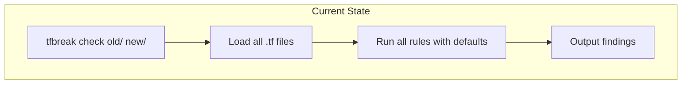
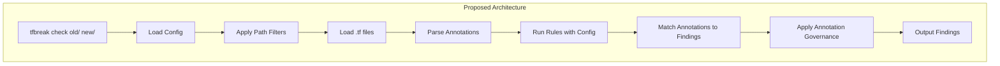
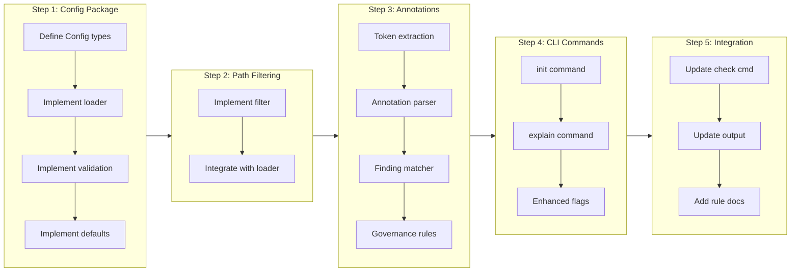

# Phase 2: Configuration & Annotations

## Change Summary

Implement the configuration system and annotation (in-code ignore) support for tfbreak as defined in Phase 2 of spec/001_IDEA.md. This CR covers HCL configuration file loading, path filtering, annotation parsing, the `init` and `explain` commands, and complete CLI flag support for policy and output customization.

## Motivation and Background

The Phase 1 MVP provides core breaking change detection with hardcoded defaults. While functional, users need:

1. **Configuration files** to customize behavior per-project without CLI flags
2. **Path filtering** to exclude generated files, examples, and test directories
3. **Annotations** to suppress specific findings with documented reasons
4. **Rule documentation** accessible via CLI for understanding and remediation
5. **Project initialization** to bootstrap configuration with sensible defaults

Without these features, tfbreak requires verbose CLI invocations and cannot adapt to different project structures or suppress intentional changes.

## Change Drivers

* Teams need consistent configuration checked into source control
* Generated files and examples should be excluded from analysis
* Intentional breaking changes require documented suppression
* New users need guidance on rule meanings and remediation
* CI pipelines benefit from project-specific defaults in config files

## Current State

The project has a working MVP (CR-0001) and automated releases (CR-0002):

- `check` command with basic flags (--format, --fail-on, --color, --output, --quiet, --verbose)
- 9 rules with hardcoded default severities
- No configuration file support
- No annotation/ignore system
- No `init` or `explain` commands
- No path filtering

### Current State Diagram



## Proposed Change

Implement Phase 2 features as defined in spec/001_IDEA.md sections 4, 5, and 6:

1. **Config Package** - Load and validate `.tfbreak.hcl` configuration files
2. **Path Filtering** - Include/exclude patterns using doublestar glob matching
3. **Annotation Package** - Parse `# tfbreak:ignore` comments and match to findings
4. **CLI Enhancements** - Full flag support, `init` and `explain` commands
5. **Rule Documentation** - Embedded documentation for each rule

### Proposed State Diagram



## Requirements

### Functional Requirements

#### Configuration File Loading

1. The system **MUST** search for configuration in this order: `--config` flag, `.tfbreak.hcl` in current directory, `.tfbreak.hcl` in old directory, default configuration
2. The system **MUST** parse `.tfbreak.hcl` using the hashicorp/hcl/v2 library with `gohcl` struct-based decoding
3. The system **MUST** require `version = 1` in configuration files for forward compatibility
4. The system **MUST** support all configuration options defined in spec/001_IDEA.md section 4.2
5. The system **MUST** validate configuration and report errors with file and line information
6. The system **MUST** merge CLI flags with configuration file settings (CLI flags take precedence)

#### Configuration Schema

7. The configuration **MUST** support `paths` block with `include` and `exclude` string arrays
8. The configuration **MUST** support `output` block with `format` and `color` attributes
9. The configuration **MUST** support `policy` block with `fail_on` and `treat_warnings_as_errors` attributes
10. The configuration **MUST** support `annotations` block with `enabled`, `require_reason`, `allow_rule_ids`, and `deny_rule_ids` attributes
11. The configuration **MUST** support `rules` block with per-rule `enabled` and `severity` configuration
12. The configuration **MUST** apply defaults as specified in spec/001_IDEA.md section 4.3

#### Path Filtering

13. The system **MUST** use `bmatcuk/doublestar/v4` for glob pattern matching
14. The system **MUST** support `**` patterns for recursive directory matching (e.g., `**/*.tf`)
15. The system **MUST** apply include patterns first, then filter by exclude patterns
16. The system **MUST** default to `include = ["**/*.tf"]` and `exclude = [".terraform/**"]`
17. The system **MUST** support both `--include` and `--exclude` CLI flags (repeatable)
18. CLI path flags **MUST** override configuration file path settings entirely (not merge)

#### Annotation Parsing

19. The system **MUST** parse comments using `hclsyntax.LexConfig` to extract `TokenComment` tokens
20. The system **MUST** recognize annotations with prefix `tfbreak:` (case-sensitive)
21. The system **MUST** support `# tfbreak:ignore-file` for file-level ignores
22. The system **MUST** support `# tfbreak:ignore` for block-level ignores (applies to immediately following block)
23. The system **MUST** parse optional rule ID list (comma-separated, e.g., `BC001,BC002`)
24. The system **MUST** parse optional metadata: `reason="..."`, `ticket="..."`, `expires="YYYY-MM-DD"`
25. The system **MUST** match file-level ignores to all findings in that file
26. The system **MUST** match block-level ignores to findings for the immediately following block

#### Annotation Governance

27. The system **MUST** respect `annotations.enabled` configuration (default: true)
28. The system **MUST** enforce `annotations.require_reason` when set to true
29. The system **MUST** respect `annotations.allow_rule_ids` whitelist (empty = all allowed)
30. The system **MUST** respect `annotations.deny_rule_ids` blacklist (these rules cannot be ignored)
31. The system **MUST** ignore annotations with expired `expires` dates
32. The system **MUST** report governance violations as warnings in output

#### CLI `init` Command

33. The system **MUST** implement `tfbreak init` command
34. The command **MUST** create `.tfbreak.hcl` with documented default configuration
35. The command **MUST** fail if `.tfbreak.hcl` already exists (unless `--force` flag provided)
36. The command **MUST** support `--force` flag to overwrite existing configuration
37. The generated configuration **MUST** include comments explaining each option

#### CLI `explain` Command

38. The system **MUST** implement `tfbreak explain <rule_id>` command
39. The command **MUST** accept exactly one positional argument (the rule ID)
40. The command **MUST** display: rule ID, name, default severity, description
41. The command **MUST** display example old/new code snippets
42. The command **MUST** display remediation guidance
43. The command **MUST** exit with code 2 if rule ID is not found

#### CLI Flag Enhancements

44. The system **MUST** support `--config` / `-c` flag to specify configuration file path
45. The system **MUST** support `--enable` flag to enable specific rules (comma-separated)
46. The system **MUST** support `--disable` flag to disable specific rules (comma-separated)
47. The system **MUST** support `--severity` flag to override rule severity (format: `RULE=SEV`, repeatable)
48. The system **MUST** support `--include` flag for path include patterns (repeatable)
49. The system **MUST** support `--exclude` flag for path exclude patterns (repeatable)
50. The system **MUST** support `--no-annotations` flag to disable annotation processing
51. The system **MUST** support `--require-reason` flag to require reasons in annotations

#### Rule Documentation

52. Each rule **MUST** implement a `Documentation()` method returning structured documentation
53. Documentation **MUST** include: ID, Name, DefaultSeverity, Description, Example (old/new), Remediation
54. The `explain` command **MUST** use this embedded documentation

### Non-Functional Requirements

55. Configuration parsing **MUST** complete in under 100ms for typical configuration files
56. Annotation parsing **MUST** not significantly impact overall analysis time (<10% overhead)
57. The system **MUST** provide clear error messages for configuration syntax errors
58. The system **MUST** handle missing configuration files gracefully (use defaults)

## Affected Components

* New: `internal/config/config.go` - Configuration types and loading
* New: `internal/config/defaults.go` - Default configuration values
* New: `internal/config/validate.go` - Configuration validation
* New: `internal/annotation/parser.go` - Annotation parsing from HCL comments
* New: `internal/annotation/matcher.go` - Matching annotations to findings
* New: `internal/annotation/types.go` - Annotation types
* New: `internal/pathfilter/filter.go` - Path filtering with doublestar
* New: `internal/cli/init.go` - Init command
* New: `internal/cli/explain.go` - Explain command
* Modified: `internal/cli/root.go` - Add global config flag
* Modified: `internal/cli/check.go` - Integrate config, annotations, path filtering
* Modified: `internal/rules/rule.go` - Add Documentation interface
* Modified: `internal/rules/*.go` - Add documentation to each rule
* Modified: `internal/output/text.go` - Show ignored findings
* Modified: `internal/output/json.go` - Include ignore information
* New: `testdata/config/` - Configuration test fixtures
* New: `testdata/annotations/` - Annotation test fixtures

## Scope Boundaries

### In Scope

* Configuration file loading and validation (`.tfbreak.hcl`)
* Path filtering with include/exclude patterns
* Annotation parsing (`# tfbreak:ignore`, `# tfbreak:ignore-file`)
* Annotation matching to findings
* Annotation governance (allow/deny rules, require reason, expiration)
* CLI `init` command with documented defaults
* CLI `explain` command with rule documentation
* Enhanced CLI flags for config, enable/disable, severity override, paths, annotations
* Rule documentation embedded in code
* Updated output to show ignored findings

### Out of Scope ("Here, But Not Further")

* `diff` command (shows differences without policy evaluation) - deferred to future CR
* Rules BC003, BC004, RC007, RC008, BC010, RC011, BC200, BC201 - deferred to CR-0004 (Phase 3)
* Git ref mode (`--git-base`, `--git-head`) - deferred to CR-0005 (Phase 4)
* SARIF output format - deferred to CR-0005 (Phase 4)
* `.tf.json` file support - future consideration
* Annotation inheritance from parent directories - future consideration
* Remote configuration fetching - future consideration

## Implementation Approach

### Implementation Flow



### Step 1: Config Package

Create `internal/config/` with:

```go
// config.go - Main types using gohcl struct tags
type Config struct {
    Version     int              `hcl:"version,attr"`
    Paths       *PathsConfig     `hcl:"paths,block"`
    Output      *OutputConfig    `hcl:"output,block"`
    Policy      *PolicyConfig    `hcl:"policy,block"`
    Annotations *AnnotationConfig `hcl:"annotations,block"`
    Rules       []*RuleConfig    `hcl:"rules,block"`
}

type RuleConfig struct {
    ID       string `hcl:"id,label"`
    Enabled  *bool  `hcl:"enabled,attr"`
    Severity string `hcl:"severity,attr"`
}
```

Use `hclparse.NewParser()` and `gohcl.DecodeBody()` for parsing (validated via DeepWiki research on hashicorp/hcl).

### Step 2: Path Filtering

Create `internal/pathfilter/` using `doublestar.Glob()`:

```go
// Filter files using doublestar patterns
func FilterFiles(dir string, include, exclude []string) ([]string, error) {
    fsys := os.DirFS(dir)
    var result []string

    for _, pattern := range include {
        matches, err := doublestar.Glob(fsys, pattern)
        // ... filter by exclude patterns
    }
    return result, nil
}
```

(Validated via DeepWiki research on bmatcuk/doublestar)

### Step 3: Annotation Package

Create `internal/annotation/` using `hclsyntax.LexConfig`:

```go
// parser.go - Extract annotations from HCL comments
func ParseAnnotations(filename string, src []byte) ([]*Annotation, error) {
    tokens, diags := hclsyntax.LexConfig(src, filename, hcl.InitialPos)

    var annotations []*Annotation
    for _, token := range tokens {
        if token.Type == hclsyntax.TokenComment {
            if ann := parseAnnotationComment(token); ann != nil {
                annotations = append(annotations, ann)
            }
        }
    }
    return annotations, nil
}
```

(Validated via DeepWiki research - hclsyntax.LexConfig returns TokenComment for all comment types)

### Step 4: CLI Commands

Add `init` and `explain` commands following existing patterns in `internal/cli/`:

```go
// init.go
var initCmd = &cobra.Command{
    Use:   "init",
    Short: "Create starter .tfbreak.hcl configuration",
    RunE:  runInit,
}

// explain.go
var explainCmd = &cobra.Command{
    Use:   "explain <rule_id>",
    Short: "Show rule documentation",
    Args:  cobra.ExactArgs(1),
    RunE:  runExplain,
}
```

(Validated via DeepWiki research on spf13/cobra - use ExactArgs(1) for positional arguments)

### Step 5: Integration

Update `check.go` to:
1. Load configuration (with CLI flag overrides)
2. Apply path filtering before loading
3. Parse annotations from loaded files
4. Pass config to rule engine
5. Match annotations to findings
6. Apply governance rules
7. Update output to show ignored status

## Test Strategy

### Unit Tests

| Test File | Test Name | Description |
|-----------|-----------|-------------|
| `internal/config/config_test.go` | `TestLoadConfig` | Load valid configuration file |
| `internal/config/config_test.go` | `TestLoadConfigNotFound` | Handle missing config gracefully |
| `internal/config/config_test.go` | `TestLoadConfigInvalid` | Report syntax errors with location |
| `internal/config/config_test.go` | `TestConfigDefaults` | Verify default values applied |
| `internal/config/validate_test.go` | `TestValidateVersion` | Reject unsupported version |
| `internal/config/validate_test.go` | `TestValidateSeverity` | Reject invalid severity values |
| `internal/config/validate_test.go` | `TestValidateRuleID` | Reject unknown rule IDs |
| `internal/pathfilter/filter_test.go` | `TestFilterInclude` | Match include patterns |
| `internal/pathfilter/filter_test.go` | `TestFilterExclude` | Exclude matching patterns |
| `internal/pathfilter/filter_test.go` | `TestFilterRecursive` | Handle `**` patterns |
| `internal/annotation/parser_test.go` | `TestParseIgnoreFile` | Parse file-level ignore |
| `internal/annotation/parser_test.go` | `TestParseIgnoreBlock` | Parse block-level ignore |
| `internal/annotation/parser_test.go` | `TestParseRuleList` | Parse comma-separated rule IDs |
| `internal/annotation/parser_test.go` | `TestParseMetadata` | Parse reason, ticket, expires |
| `internal/annotation/matcher_test.go` | `TestMatchFileLevelIgnore` | Match to all findings in file |
| `internal/annotation/matcher_test.go` | `TestMatchBlockLevelIgnore` | Match to following block's findings |
| `internal/annotation/matcher_test.go` | `TestMatchSpecificRules` | Match only specified rule IDs |
| `internal/annotation/matcher_test.go` | `TestGovernanceRequireReason` | Reject annotations without reason |
| `internal/annotation/matcher_test.go` | `TestGovernanceDenyRules` | Reject ignored rules in deny list |
| `internal/annotation/matcher_test.go` | `TestGovernanceExpired` | Ignore expired annotations |
| `internal/cli/init_test.go` | `TestInitCreatesFile` | Create .tfbreak.hcl |
| `internal/cli/init_test.go` | `TestInitFailsIfExists` | Fail without --force |
| `internal/cli/init_test.go` | `TestInitForceOverwrites` | Overwrite with --force |
| `internal/cli/explain_test.go` | `TestExplainValidRule` | Show documentation for valid rule |
| `internal/cli/explain_test.go` | `TestExplainInvalidRule` | Exit code 2 for unknown rule |

### Fixture-Based Integration Tests

| Test Directory | Scenario | Expected Behavior |
|----------------|----------|-------------------|
| `testdata/config/valid/` | Valid configuration | Loads successfully |
| `testdata/config/invalid_version/` | Version != 1 | Validation error |
| `testdata/config/invalid_severity/` | Unknown severity | Validation error |
| `testdata/config/path_filtering/` | Include/exclude patterns | Correct file filtering |
| `testdata/annotations/ignore_file/` | File-level ignore | All findings ignored |
| `testdata/annotations/ignore_block/` | Block-level ignore | Following block ignored |
| `testdata/annotations/ignore_specific_rules/` | Rule ID list | Only specified rules ignored |
| `testdata/annotations/with_reason/` | Annotation with reason | Reason captured |
| `testdata/annotations/expired/` | Expired annotation | Annotation not applied |
| `testdata/annotations/governance_deny/` | Denied rule ID | Governance violation warning |

## Acceptance Criteria

### AC-1: Configuration file loads successfully

```gherkin
Given a .tfbreak.hcl file with valid configuration
When I run "tfbreak check old/ new/"
Then the configuration is applied
  And the output reflects configured settings
```

### AC-2: Path filtering excludes files

```gherkin
Given a configuration with exclude = [".terraform/**", "**/examples/**"]
When I run "tfbreak check old/ new/"
Then files in .terraform/ and examples/ directories are not analyzed
```

### AC-3: Block-level annotation ignores finding

```gherkin
Given a new directory with:
  """
  # tfbreak:ignore BC001 reason="intentional change"
  variable "new_required" {
    type = string
  }
  """
When I run "tfbreak check old/ new/"
Then the BC001 finding is marked as ignored
  And the output shows the ignore reason
  And the exit code is 0 (finding ignored)
```

### AC-4: File-level annotation ignores all findings

```gherkin
Given a new directory with a file starting with:
  """
  # tfbreak:ignore-file reason="generated file"
  """
When I run "tfbreak check old/ new/"
Then all findings from that file are marked as ignored
```

### AC-5: Annotation governance enforces require_reason

```gherkin
Given a configuration with annotations.require_reason = true
  And a file with "# tfbreak:ignore BC001" (no reason)
When I run "tfbreak check old/ new/"
Then a governance violation warning is reported
  And the finding is NOT ignored
```

### AC-6: Annotation governance respects deny_rule_ids

```gherkin
Given a configuration with annotations.deny_rule_ids = ["BC100"]
  And a file with "# tfbreak:ignore BC100 reason="..."
When I run "tfbreak check old/ new/"
Then a governance violation warning is reported
  And the BC100 finding is NOT ignored
```

### AC-7: Init command creates configuration file

```gherkin
Given no .tfbreak.hcl file exists
When I run "tfbreak init"
Then .tfbreak.hcl is created
  And the file contains documented default configuration
```

### AC-8: Init command fails if file exists

```gherkin
Given .tfbreak.hcl already exists
When I run "tfbreak init"
Then the command fails with an error message
  And the exit code is 2
```

### AC-9: Init --force overwrites existing file

```gherkin
Given .tfbreak.hcl already exists
When I run "tfbreak init --force"
Then .tfbreak.hcl is overwritten with default configuration
```

### AC-10: Explain command shows rule documentation

```gherkin
When I run "tfbreak explain BC001"
Then the output contains:
  | Field | Content |
  | ID | BC001 |
  | Name | required-input-added |
  | Severity | BREAKING |
  | Description | New variable without a default value |
  | Example | Old/new code snippets |
  | Remediation | Add a default value or update callers |
```

### AC-11: Explain command fails for unknown rule

```gherkin
When I run "tfbreak explain INVALID"
Then the output contains "unknown rule ID"
  And the exit code is 2
```

### AC-12: CLI flags override configuration

```gherkin
Given a configuration with policy.fail_on = "BREAKING"
When I run "tfbreak check old/ new/ --fail-on RISKY"
Then the --fail-on RISKY setting takes precedence
```

### AC-13: Expired annotation is not applied

```gherkin
Given an annotation with expires="2025-01-01" (past date)
When I run "tfbreak check old/ new/"
Then the annotation is ignored
  And the finding is NOT marked as ignored
```

### AC-14: JSON output includes ignore information

```gherkin
Given findings with some ignored via annotations
When I run "tfbreak check old/ new/ --format json"
Then the JSON output contains "ignored": true for suppressed findings
  And the JSON output contains "ignore_reason" for those findings
```

## Quality Standards Compliance

### Build & Compilation

- [ ] Code compiles/builds without errors
- [ ] No new compiler warnings introduced
- [ ] `make build` produces working binary

### Linting & Code Style

- [ ] All linter checks pass with zero warnings/errors
- [ ] Code follows existing project conventions
- [ ] New packages follow established patterns

### Test Execution

- [ ] All existing tests pass after implementation
- [ ] All new tests pass
- [ ] Test coverage meets 80% requirement for new code

### Documentation

- [ ] CLI help text is accurate and complete for new commands
- [ ] Rule documentation is complete for all 9 existing rules
- [ ] Configuration options are documented in generated .tfbreak.hcl

### Code Review

- [ ] Changes submitted via pull request
- [ ] PR title follows Conventional Commits format
- [ ] Code review completed and approved
- [ ] Changes squash-merged to maintain linear history

### Verification Commands

```bash
# Build verification
make build

# Lint verification
make lint

# Test execution
make test

# Test coverage
make coverage

# Manual verification
./bin/tfbreak init
cat .tfbreak.hcl
./bin/tfbreak explain BC001
./bin/tfbreak check --help
```

## Technical Design Notes

### HCL Configuration Parsing (DeepWiki Validated)

Use `gohcl` for struct-based decoding with labeled blocks for rules:

```go
type RuleConfig struct {
    ID       string `hcl:"id,label"`    // Block label: rules "BC001" { }
    Enabled  *bool  `hcl:"enabled,attr"`
    Severity string `hcl:"severity,attr"`
}

type Config struct {
    Rules []*RuleConfig `hcl:"rules,block"`
}
```

The `label` tag captures the block label (rule ID), and multiple blocks with the same type are collected into a slice.

### Annotation Comment Extraction (DeepWiki Validated)

Use `hclsyntax.LexConfig` to tokenize HCL and extract comments:

```go
tokens, diags := hclsyntax.LexConfig(src, filename, hcl.InitialPos)
for _, token := range tokens {
    if token.Type == hclsyntax.TokenComment {
        // token.Bytes contains the comment text including # or //
        // token.Range provides the source location
    }
}
```

This captures all comment types: `#`, `//`, and `/* */`.

### Glob Pattern Matching (DeepWiki Validated)

Use `doublestar.Glob` with `os.DirFS`:

```go
fsys := os.DirFS(dir)
matches, err := doublestar.Glob(fsys, "**/*.tf")
```

Exclusion is handled programmatically after glob matching, as doublestar doesn't support negative patterns directly.

### Cobra Subcommands (DeepWiki Validated)

Use `cobra.ExactArgs(n)` for positional argument validation:

```go
var explainCmd = &cobra.Command{
    Use:   "explain <rule_id>",
    Args:  cobra.ExactArgs(1),
    RunE: func(cmd *cobra.Command, args []string) error {
        ruleID := args[0]
        // ...
    },
}
```

## Risks and Mitigation

### Risk 1: Annotation matching complexity

**Likelihood:** medium
**Impact:** medium
**Mitigation:** Block-level annotation matching requires tracking comment positions relative to HCL blocks. Use the token Range to compare line numbers. A comment applies to the next block on a greater line number.

### Risk 2: Configuration schema evolution

**Likelihood:** low
**Impact:** medium
**Mitigation:** Include `version = 1` requirement. Future versions can add new fields with defaults, maintaining backward compatibility. Breaking schema changes increment the version number.

### Risk 3: Path filter performance on large directories

**Likelihood:** low
**Impact:** low
**Mitigation:** doublestar.Glob is efficient. For very large directories, consider caching or using GlobWalk with early termination. Monitor performance in integration tests.

### Risk 4: Annotation grammar ambiguity

**Likelihood:** low
**Impact:** medium
**Mitigation:** Define strict grammar as in spec section 5.2. Use regex for initial parsing, then structured parsing for metadata. Add comprehensive test cases for edge cases.

## Dependencies

* CR-0001 completed (MVP implementation)
* CR-0002 completed (automated releases)
* Go 1.21+
* New dependency: `github.com/bmatcuk/doublestar/v4` (already in go.mod)

## Estimated Effort

| Component | Estimate |
|-----------|----------|
| Config package (types, loader, validation) | Medium |
| Path filtering | Small |
| Annotation parser | Medium |
| Annotation matcher | Medium |
| Annotation governance | Small |
| CLI init command | Small |
| CLI explain command | Small |
| CLI flag enhancements | Small |
| Rule documentation | Medium |
| Integration and testing | Medium |

## Decision Outcome

Chosen approach: "Implement Phase 2 as specified in spec/001_IDEA.md", because it provides essential configuration and ignore capabilities that users need for production use, while maintaining the established architecture patterns from Phase 1.

## Related Items

* Specification: `spec/001_IDEA.md` sections 4, 5, 6
* Prerequisite: `docs/cr/CR-0001-phase1-mvp-implementation.md`
* Prerequisite: `docs/cr/CR-0002-automated-releases.md`
* Future: CR-0004 (Phase 3: Extended Rules)
* Future: CR-0005 (Phase 4: CI Enhancements)

## DeepWiki Research

| Repository | Question | Key Findings |
|------------|----------|--------------|
| `hashicorp/hcl` | HCL config parsing with nested blocks | Use `gohcl` with struct tags; `label` tag captures block labels like `rules "BC001"` |
| `hashicorp/hcl` | Comment extraction from HCL | Use `hclsyntax.LexConfig` which returns `TokenComment` for all comment types |
| `bmatcuk/doublestar` | Glob pattern matching | Use `doublestar.Glob(fsys, pattern)`; exclusion handled programmatically |
| `spf13/cobra` | Subcommands and positional args | Use `cobra.ExactArgs(1)` for commands like `explain <rule_id>` |
