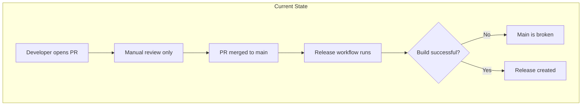
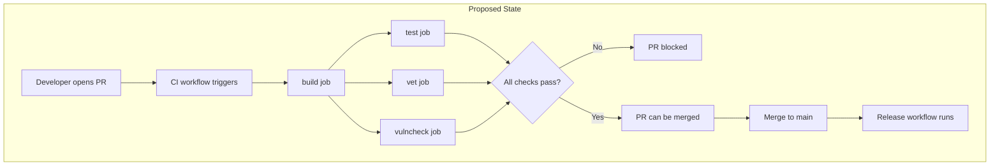
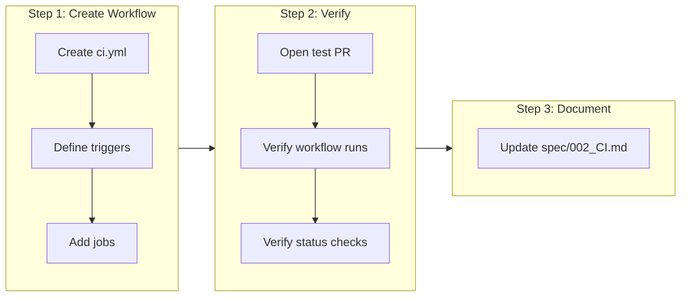

# CI Validation Workflow for Pull Requests

## Change Summary

Add a GitHub Actions workflow that runs on pull requests targeting the main branch. The workflow validates code quality by running build, test, vet, and security vulnerability scanning commands. This ensures that all code merged to main meets minimum quality and security standards.

## Motivation and Background

Currently, the project has a release workflow (CR-0002) that triggers on push to main, but no validation runs before code is merged. This creates risk:

1. Broken builds can be merged to main
2. Failing tests can slip through without detection
3. Code quality issues (caught by `go vet`) may not be discovered until after merge
4. Security vulnerabilities in dependencies may go unnoticed
5. Contributors don't get fast feedback on their PRs

A CI validation workflow provides a quality gate that prevents problematic code from being merged, catches issues early in the development cycle, and gives contributors immediate feedback on their changes.

## Change Drivers

* No automated validation currently runs on pull requests
* Contributors need fast feedback on code quality
* Main branch should always be in a buildable and testable state
* Security vulnerabilities should be caught before merge (shift-left security)
* Aligns with industry best practices for CI/CD
* Foundation for future enhancements (linting, coverage thresholds)

## Current State

The project has:
- A release workflow (`.github/workflows/release.yml`) that runs on push to main
- Build and test capabilities via Makefile (`make build`, `make test`)
- No validation running on pull requests

### Current State Diagram



## Proposed Change

Add a new GitHub Actions workflow (`.github/workflows/ci.yml`) that:
1. Triggers on pull requests targeting the main branch
2. Runs `go build` to verify compilation
3. Runs `go test` to execute all tests
4. Runs `go vet` to catch common issues
5. Runs `govulncheck` to detect known security vulnerabilities
6. Reports status back to the PR for merge gating

### Proposed State Diagram



## Requirements

### Functional Requirements

#### Workflow Triggers

1. The workflow **MUST** trigger on pull requests targeting the `main` branch
2. The workflow **MUST** trigger on the following PR events: `opened`, `synchronize`, `reopened`
3. The workflow **MUST** run on every push to a PR branch (synchronize event)

#### Job Structure and Parallelization

4. The workflow **MUST** use separate jobs for build, test, vet, and vulnerability scanning
5. The build job **MUST** run first as a prerequisite for other jobs
6. The test, vet, and vulncheck jobs **MUST** run in parallel after build succeeds
7. All parallel jobs **MUST** depend on the build job using `needs: build`

#### Build Validation

8. The build job **MUST** run `go build ./...` to verify all packages compile
9. The build job **MUST** fail the workflow if compilation errors occur
10. The build job **MUST** use the Go version specified in `go.mod`

#### Test Execution

11. The test job **MUST** run `go test ./...` to execute all tests
12. The test job **MUST** fail the workflow if any test fails
13. The test job **MUST** use the `-race` flag to detect race conditions
14. The test job **MUST** use the `-v` flag for verbose output

#### Static Analysis

15. The vet job **MUST** run `go vet ./...` for static analysis
16. The vet job **MUST** fail the workflow if issues are detected

#### Security Vulnerability Scanning

17. The vulncheck job **MUST** install `govulncheck` using `go install golang.org/x/vuln/cmd/govulncheck@latest`
18. The vulncheck job **MUST** run `govulncheck ./...` to detect known vulnerabilities
19. The vulncheck job **MUST** fail the workflow if vulnerabilities are detected
20. The vulncheck job **MUST** check both the codebase and dependencies

#### Environment

21. All jobs **MUST** run on `ubuntu-latest` runner
22. All jobs **MUST** use `actions/checkout@v4` for code checkout
23. All jobs **MUST** use `actions/setup-go@v5` with `go-version-file: go.mod`

#### Reporting

24. The workflow **MUST** report status to the PR (via GitHub status checks)
25. Each job (build, test, vet, vulncheck) **MUST** be named descriptively for clear status reporting

### Non-Functional Requirements

26. The workflow **MUST** complete within 10 minutes for typical PRs
27. The workflow **MUST** have minimal permissions (contents: read only)
28. All jobs **MUST** cache Go modules for faster subsequent runs
29. Parallel execution **MUST** reduce total workflow time compared to sequential execution

## Affected Components

* New: `.github/workflows/ci.yml` - CI validation workflow
* Documentation: Update `spec/002_CI.md` with CI workflow details

## Scope Boundaries

### In Scope

* GitHub Actions workflow for PR validation
* Build verification (`go build`)
* Test execution (`go test` with race detection)
* Static analysis (`go vet`)
* Security vulnerability scanning (`govulncheck`)
* Go module caching for performance
* Status reporting to PRs

### Out of Scope ("Here, But Not Further")

* golangci-lint integration - deferred to future CR
* Code coverage reporting - deferred to future CR
* Code coverage thresholds - deferred to future CR
* Benchmark testing - deferred to future CR
* Multi-platform validation - single platform (Linux) is sufficient for validation
* Branch protection rules - repository settings, not workflow configuration

## Alternative Approaches Considered

* **Run validation in release workflow** - Rejected; validation should happen before merge, not after
* **Use Makefile targets** - Rejected; direct Go commands are clearer in workflow logs and avoid Makefile as dependency
* **Matrix build across platforms** - Rejected for CI; cross-platform build is already handled in release workflow
* **Single sequential job** - Rejected; parallel jobs reduce total execution time by ~22%
* **Full parallelization (no build dependency)** - Rejected; build serves as a quick sanity check that fails fast if code doesn't compile

## Impact Assessment

### User Impact

Contributors will:
- Receive immediate feedback on PR quality (typically within 2-3 minutes)
- See clear status checks on their PRs
- Know exactly which step failed if validation fails
- Have confidence that their code meets quality and security standards
- Be alerted to known vulnerabilities before merging

### Technical Impact

- Adds one new workflow file to the repository
- Increases GitHub Actions usage (minimal cost for open source projects)
- No changes to existing code or dependencies
- No breaking changes

### Business Impact

- Reduces time spent debugging broken builds on main
- Increases confidence in code quality and security
- Proactive vulnerability detection reduces security incident risk
- Aligns with industry best practices
- Low implementation cost with high value

## Implementation Approach

### Implementation Flow



### Workflow Structure

```yaml
name: CI

on:
  pull_request:
    branches: [main]

permissions:
  contents: read

jobs:
  build:
    runs-on: ubuntu-latest
    steps:
      - uses: actions/checkout@v4

      - name: Set up Go
        uses: actions/setup-go@v5
        with:
          go-version-file: go.mod
          cache: true

      - name: Build
        run: go build ./...

  test:
    needs: build
    runs-on: ubuntu-latest
    steps:
      - uses: actions/checkout@v4

      - name: Set up Go
        uses: actions/setup-go@v5
        with:
          go-version-file: go.mod
          cache: true

      - name: Test
        run: go test -race -v ./...

  vet:
    needs: build
    runs-on: ubuntu-latest
    steps:
      - uses: actions/checkout@v4

      - name: Set up Go
        uses: actions/setup-go@v5
        with:
          go-version-file: go.mod
          cache: true

      - name: Vet
        run: go vet ./...

  vulncheck:
    needs: build
    runs-on: ubuntu-latest
    steps:
      - uses: actions/checkout@v4

      - name: Set up Go
        uses: actions/setup-go@v5
        with:
          go-version-file: go.mod
          cache: true

      - name: Install govulncheck
        run: go install golang.org/x/vuln/cmd/govulncheck@latest

      - name: Vulnerability Check
        run: govulncheck ./...
```

### Parallelization Benefits

By running test, vet, and vulncheck in parallel after build:
- **Sequential time**: ~45 seconds (build: 5s + test: 30s + vet: 5s + vulncheck: 5s)
- **Parallel time**: ~35 seconds (build: 5s + max(test: 30s, vet: 5s, vulncheck: 5s))
- **Time saved**: ~10 seconds per run (22% reduction)

The Go module cache is shared across jobs via GitHub Actions caching, minimizing the overhead of parallel job setup.

## Test Strategy

### Tests to Add

This CR does not add code tests. Verification is done through:

| Verification | Method | Expected Result |
|--------------|--------|-----------------|
| Workflow syntax | GitHub Actions parser | Valid YAML |
| Build job | Open PR with valid code | Job passes |
| Build failure | Open PR with syntax error | Job fails, parallel jobs skipped |
| Test job | Open PR with passing tests | Job passes |
| Test failure | Open PR with failing test | Job fails, PR blocked |
| Vet job | Open PR with clean code | Job passes |
| Vet failure | Open PR with vet issues | Job fails, PR blocked |
| Vulncheck job | Open PR with no vulnerabilities | Job passes |
| Vulncheck failure | PR with vulnerable dependency | Job fails, PR blocked |
| Parallel execution | Check workflow run timeline | test, vet, vulncheck start simultaneously |
| Job dependencies | Verify job graph | test, vet, vulncheck depend on build |

### Tests to Modify

Not applicable - no existing tests affected.

### Tests to Remove

Not applicable - no tests to remove.

## Acceptance Criteria

### AC-1: Workflow triggers on PR to main

```gherkin
Given a developer creates a new branch from main
When the developer opens a pull request targeting main
Then the CI workflow is triggered
  And the workflow appears in the PR's "Checks" section
```

### AC-2: Build step validates compilation

```gherkin
Given a PR is opened with valid Go code
When the CI workflow runs the build step
Then the step completes successfully
  And the output shows "go build ./..." execution
```

### AC-3: Build failure blocks PR

```gherkin
Given a PR is opened with code that has syntax errors
When the CI workflow runs the build step
Then the step fails
  And the PR shows a failing status check
  And the error message indicates the compilation failure
```

### AC-4: Test step executes all tests

```gherkin
Given a PR is opened with all tests passing
When the CI workflow runs the test step
Then the step completes successfully
  And the output shows test execution with -race and -v flags
  And all test packages are listed in the output
```

### AC-5: Test failure blocks PR

```gherkin
Given a PR is opened with a failing test
When the CI workflow runs the test step
Then the step fails
  And the PR shows a failing status check
  And the output shows which test(s) failed
```

### AC-6: Vet step performs static analysis

```gherkin
Given a PR is opened with code that passes vet
When the CI workflow runs the vet step
Then the step completes successfully
```

### AC-7: Vet failure blocks PR

```gherkin
Given a PR is opened with code that has vet issues
When the CI workflow runs the vet step
Then the step fails
  And the PR shows a failing status check
  And the output indicates the vet findings
```

### AC-8: Vulnerability check scans for known CVEs

```gherkin
Given a PR is opened with dependencies that have no known vulnerabilities
When the CI workflow runs the vulnerability check step
Then the step completes successfully
  And the output shows govulncheck execution
```

### AC-9: Vulnerability found blocks PR

```gherkin
Given a PR is opened with a dependency that has a known vulnerability
When the CI workflow runs the vulnerability check step
Then the step fails
  And the PR shows a failing status check
  And the output indicates the vulnerable package and CVE
```

### AC-10: Workflow uses Go module caching

```gherkin
Given a PR has previously run the CI workflow
When the developer pushes a new commit to the PR
Then the CI workflow runs again
  And the Go module cache is restored from the previous run
  And the setup time is reduced
```

### AC-11: Jobs run in parallel after build

```gherkin
Given a PR is opened and the build job succeeds
When the workflow continues execution
Then the test, vet, and vulncheck jobs start simultaneously
  And all three jobs run in parallel
  And the workflow completes when all parallel jobs finish
```

### AC-12: Build failure prevents parallel jobs

```gherkin
Given a PR is opened with code that fails to compile
When the build job fails
Then the test, vet, and vulncheck jobs do not run
  And the PR shows only the build failure
```

### AC-13: Status is reported to PR

```gherkin
Given a PR is opened
When the CI workflow completes (pass or fail)
Then the PR "Checks" section shows the workflow status
  And each job (build, test, vet, vulncheck) has individual status
  And the overall workflow status reflects the combined result
```

## Quality Standards Compliance

### Build & Compilation

- [x] Workflow YAML is valid syntax
- [x] No configuration errors in workflow

### Linting & Code Style

- [x] Workflow follows GitHub Actions best practices
- [x] Step names are descriptive and consistent

### Test Execution

- [x] Manual verification by opening test PRs
- [x] Verify all four validation steps execute (build, test, vet, vulncheck)

### Documentation

- [x] Workflow has clear comments where needed
- [x] spec/002_CI.md updated with workflow documentation

### Code Review

- [ ] Changes submitted via pull request
- [ ] PR title follows Conventional Commits format: `ci: add PR validation workflow`
- [ ] Code review completed and approved
- [ ] Changes squash-merged to maintain linear history

### Verification Commands

```bash
# Validate workflow syntax locally (requires act or similar)
# Or simply push and verify in GitHub Actions UI

# Commands the workflow will execute:
go build ./...
go test -race -v ./...
go vet ./...
go install golang.org/x/vuln/cmd/govulncheck@latest
govulncheck ./...
```

## Risks and Mitigation

### Risk 1: Flaky tests cause false failures

**Likelihood:** low
**Impact:** medium
**Mitigation:** Current test suite has no known flaky tests. If flakiness is discovered, address in separate issue. Consider retry mechanism in future if needed.

### Risk 2: Slow workflow impacts developer productivity

**Likelihood:** low
**Impact:** low
**Mitigation:** Go module caching reduces setup time. Current test suite runs in under 30 seconds. Monitor workflow duration.

### Risk 3: Race detector increases test time significantly

**Likelihood:** low
**Impact:** low
**Mitigation:** Race detector typically adds 2-10x overhead, but with fast tests this is acceptable. Can be removed if it becomes a bottleneck.

### Risk 4: Govulncheck reports vulnerability in unused code path

**Likelihood:** low
**Impact:** low
**Mitigation:** Govulncheck is symbol-aware and only reports vulnerabilities in code actually called by the application. If a false positive occurs, it can be investigated and the dependency updated or the finding documented.

### Risk 5: Parallel jobs increase total billable minutes

**Likelihood:** certain
**Impact:** low
**Mitigation:** While parallel execution uses more concurrent minutes, it reduces wall-clock time. For open source projects, GitHub provides unlimited Actions minutes. For private repos, the time savings (~22%) offset the increased parallelism. Go module caching further reduces setup overhead per job.

## Dependencies

* CR-0001 completed (project has tests to run)
* GitHub repository with Actions enabled
* No external dependencies required

## Estimated Effort

| Component | Estimate |
|-----------|----------|
| Create workflow file | Small |
| Test workflow | Small |
| Update documentation | Small |

## Decision Outcome

Chosen approach: "Parallel workflow with build gate, then test/vet/vulncheck in parallel", because:
1. Build job provides fast fail for compilation errors (~5 seconds)
2. Parallel execution reduces total time by ~22% compared to sequential
3. Includes security scanning early (shift-left security)
4. Each job has independent status for clear failure identification
5. Easy to extend with additional parallel checks in the future
6. Follows Go community best practices

## Related Items

* Prerequisite: `docs/cr/CR-0001-phase1-mvp-implementation.md`
* Related: `docs/cr/CR-0002-automated-releases.md`
* Related: `spec/002_CI.md`

## Future Considerations

The following enhancements may be considered in future CRs:

1. **golangci-lint integration** - More comprehensive linting
2. **Code coverage reporting** - Track test coverage metrics
3. **Coverage thresholds** - Fail if coverage drops below threshold
4. **Dependency updates** - Dependabot or similar for automated updates
5. **Branch protection** - Require status checks to pass before merge
