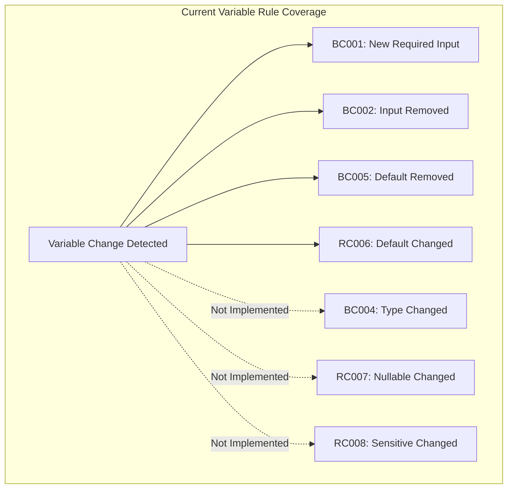
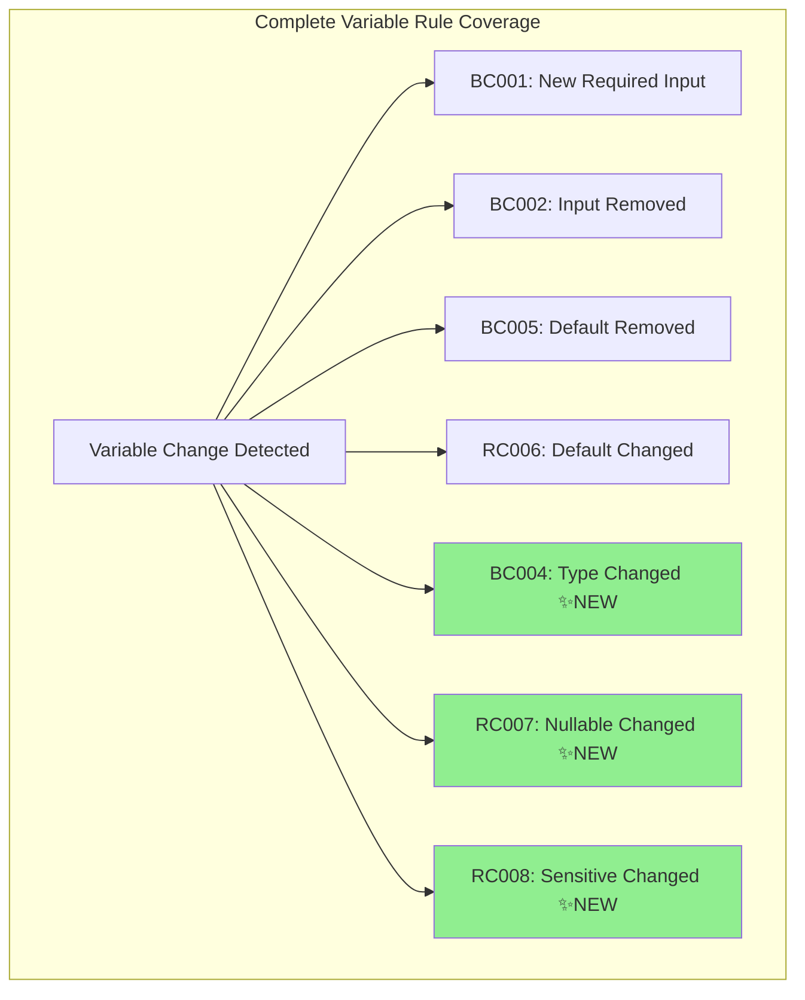
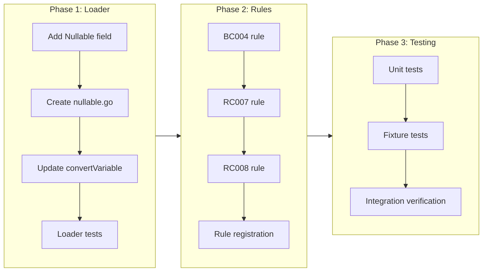

# Phase 3: Variable Attribute Rules

## Change Summary

Implement three new rules that detect breaking and risky changes to Terraform variable attributes: type constraints (BC004), nullable attribute (RC007), and sensitive attribute (RC008). This completes the variable-related rule set defined in the specification, providing comprehensive coverage of module interface contract changes.

## Motivation and Background

The Phase 1 MVP implemented rules for detecting variable additions, removals, and default value changes. However, Terraform variables have additional attributes that, when changed, can break callers or cause unexpected behavior:

1. **Type constraints** (`type`): Changing a variable's type can break callers passing values of the old type
2. **Nullable attribute** (`nullable`): Changing nullable behavior can cause plan failures when callers pass `null`
3. **Sensitive attribute** (`sensitive`): Changing sensitivity can affect downstream outputs and plan visibility

These attributes are already extracted by terraform-config-inspect and stored in `VariableSignature`, but no rules currently evaluate them.

## Change Drivers

* Completeness: The spec defines 8 variable rules; only 5 are implemented (BC001, BC002, BC005, RC006 + BC009 for outputs)
* User feedback: Type changes are a common source of breaking changes in module upgrades
* Terraform 1.1+ adoption: The `nullable` attribute is increasingly used in production modules
* Security compliance: Sensitive attribute changes can affect audit and logging requirements

## Current State

### Implemented Variable Rules

| ID | Name | Status |
|----|------|--------|
| BC001 | required-input-added | ✅ Implemented |
| BC002 | input-removed | ✅ Implemented |
| BC003 | input-renamed | ⏳ Phase 4 (opt-in heuristic) |
| BC004 | input-type-changed | ❌ Not implemented |
| BC005 | input-default-removed | ✅ Implemented |
| RC006 | input-default-changed | ✅ Implemented |
| RC007 | input-nullable-changed | ❌ Not implemented |
| RC008 | input-sensitive-changed | ❌ Not implemented |

### Current VariableSignature Structure

```go
// internal/types/snapshot.go
type VariableSignature struct {
    Name        string
    Type        string      // ✅ Already extracted
    Default     interface{}
    Description string
    Sensitive   bool        // ✅ Already extracted
    Required    bool
    DeclRange   FileRange
}
```

**Gap identified**: The `Nullable` field is missing from `VariableSignature`. The terraform-config-inspect library does not expose nullable directly, so this requires enhancement.

### Current State Diagram



## Proposed Change

Implement three new rules with the following characteristics:

### BC004 — input-type-changed (BREAKING)

Detects when a variable's type constraint changes between versions.

**Evaluation logic** (from spec):
```
Condition: variable V exists in both AND old.V.type != new.V.type
```

**Type comparison strategy**:
- Use normalized string representation from terraform-config-inspect
- Treat empty string as "any" (unspecified type)
- Consider `any` → specific type as non-breaking (narrowing is safe)
- Consider specific type → `any` as breaking (widening callers' expectations)
- Consider type A → type B (both specific) as breaking

### RC007 — input-nullable-changed (RISKY)

Detects when a variable's nullable attribute changes.

**Evaluation logic** (from spec):
```
Condition: variable V exists in both AND old.V.nullable != new.V.nullable
```

**Nullable handling**:
- Terraform defaults `nullable = true` when unspecified (since Terraform 1.1)
- terraform-config-inspect does NOT expose nullable directly
- **Solution**: Parse nullable attribute directly from HCL using `hashicorp/hcl/v2`, similar to how moved blocks are parsed

### RC008 — input-sensitive-changed (RISKY)

Detects when a variable's sensitive attribute changes.

**Evaluation logic** (from spec):
```
Condition: variable V exists in both AND old.V.sensitive != new.V.sensitive
```

**Sensitive handling**:
- Already extracted by terraform-config-inspect
- No loader changes required
- Simple boolean comparison

### Proposed State Diagram



## Requirements

### Functional Requirements

1. The system **MUST** implement rule BC004 (input-type-changed) that detects when a variable's type constraint changes
2. The system **MUST** implement rule RC007 (input-nullable-changed) that detects when a variable's nullable attribute changes
3. The system **MUST** implement rule RC008 (input-sensitive-changed) that detects when a variable's sensitive attribute changes
4. The system **MUST** add a `Nullable` field to `VariableSignature` to track the nullable attribute
5. The system **MUST** parse the nullable attribute directly from HCL files since terraform-config-inspect does not expose it
6. The system **MUST** treat unspecified nullable as `true` (Terraform's default behavior since 1.1)
7. The system **MUST** register all three rules in the rule registry with correct default severities
8. The system **MUST** provide Documentation() method for each rule supporting the `explain` command
9. The system **MUST** include the new rules in the default configuration with enabled=true
10. BC004 **MUST** treat `any` (or empty type) → specific type as non-breaking
11. BC004 **MUST** treat specific type → `any` (or empty type) as BREAKING
12. BC004 **MUST** treat type A → type B (both specific and different) as BREAKING

### Non-Functional Requirements

1. The nullable attribute parsing **MUST** not significantly impact performance (< 10% overhead on large modules)
2. All rule implementations **MUST** follow the existing code patterns established in Phase 1
3. All rules **MUST** achieve > 90% test coverage
4. The implementation **MUST** pass all existing tests without modification

## Affected Components

* `internal/types/snapshot.go` — Add Nullable field to VariableSignature
* `internal/loader/loader.go` — Enhance variable conversion to extract nullable
* `internal/loader/nullable.go` — New file for nullable attribute parsing from HCL
* `internal/rules/bc004.go` — New rule implementation
* `internal/rules/rc007.go` — New rule implementation
* `internal/rules/rc008.go` — New rule implementation
* `internal/rules/bc004_test.go` — Unit tests for BC004
* `internal/rules/rc007_test.go` — Unit tests for RC007
* `internal/rules/rc008_test.go` — Unit tests for RC008
* `testdata/scenarios/` — Fixture tests for each rule

## Scope Boundaries

### In Scope

* BC004 (input-type-changed) rule implementation with type comparison logic
* RC007 (input-nullable-changed) rule implementation with nullable parsing
* RC008 (input-sensitive-changed) rule implementation
* Nullable attribute extraction from HCL files
* Unit tests for all three rules
* Fixture-based integration tests for all three rules
* Rule documentation for `explain` command

### Out of Scope ("Here, But Not Further")

* BC003 (input-renamed) — Deferred to Phase 4 (requires heuristic matching)
* BC010 (output-renamed) — Deferred to Phase 4 (requires heuristic matching)
* RC011 (output-sensitive-changed) — Will be addressed in a separate CR
* BC200/BC201 (version constraints) — Will be addressed in a separate CR
* Complex type compatibility analysis (e.g., `list(string)` compatible with `list(any)`) — Future enhancement
* Semantic version constraint comparison — Future enhancement

## Alternative Approaches Considered

### Nullable Parsing Alternatives

1. **Use terraform-config-inspect as-is**: Not viable; nullable is not exposed
2. **Fork terraform-config-inspect**: Adds maintenance burden, upstream sync issues
3. **Parse nullable directly from HCL** (chosen): Consistent with moved block approach, minimal overhead
4. **Regex-based extraction**: Fragile, doesn't handle edge cases

### Type Comparison Alternatives

1. **Exact string comparison** (chosen for MVP): Simple, predictable
2. **Semantic type compatibility**: Complex, requires understanding Terraform's type system
3. **Use cty library for type comparison**: More accurate but adds significant complexity

## Impact Assessment

### User Impact

* **Positive**: Users will be alerted to type, nullable, and sensitive changes that could break callers
* **Neutral**: No changes to existing CLI interface or output formats
* **Training**: No retraining needed; rules follow established patterns

### Technical Impact

* **Loader enhancement**: Small change to add nullable parsing (follows moved block pattern)
* **New files**: 3 rule files + 1 nullable parser file + test files
* **No breaking changes**: All existing APIs remain unchanged
* **Dependencies**: No new dependencies required

### Business Impact

* **Value delivery**: Completes the variable rule set, increases tool usefulness
* **Competitive position**: Feature parity with commercial tools that detect type changes
* **Risk**: Low — follows established patterns, well-specified in original spec

## Implementation Approach

### Phase 1: Loader Enhancement

1. Add `Nullable *bool` field to `VariableSignature` (pointer to distinguish unset from false)
2. Create `internal/loader/nullable.go` with HCL parsing logic
3. Update `convertVariable()` to extract nullable from parsed HCL
4. Add unit tests for nullable extraction

### Phase 2: Rule Implementation

1. Implement BC004 (input-type-changed) with type comparison helpers
2. Implement RC007 (input-nullable-changed) with nullable defaulting logic
3. Implement RC008 (input-sensitive-changed) with simple boolean comparison
4. Register all rules in `init()` functions
5. Implement Documentation() for all rules

### Phase 3: Testing

1. Add unit tests for each rule with comprehensive edge cases
2. Create fixture test scenarios in `testdata/scenarios/`
3. Verify all existing tests still pass
4. Verify integration with annotation system (if Phase 2 is complete)

### Implementation Flow



## Test Strategy

### Tests to Add

| Test File | Test Name | Description | Inputs | Expected Output |
|-----------|-----------|-------------|--------|-----------------|
| `internal/loader/nullable_test.go` | `TestParseNullableAttribute` | Verify nullable extraction from HCL | Various .tf files with nullable set/unset | Correct boolean values |
| `internal/loader/nullable_test.go` | `TestParseNullableDefault` | Verify default nullable=true behavior | Variable without nullable | `Nullable: nil` (defaults to true) |
| `internal/rules/bc004_test.go` | `TestBC004_TypeChanged` | Type string→number triggers finding | old: string, new: number | 1 BREAKING finding |
| `internal/rules/bc004_test.go` | `TestBC004_TypeUnchanged` | Same type no finding | old: string, new: string | No findings |
| `internal/rules/bc004_test.go` | `TestBC004_AnyToSpecific` | any→string is non-breaking | old: any, new: string | No findings |
| `internal/rules/bc004_test.go` | `TestBC004_SpecificToAny` | string→any is breaking | old: string, new: any | 1 BREAKING finding |
| `internal/rules/bc004_test.go` | `TestBC004_EmptyTypeAsAny` | Empty type treated as any | old: "", new: string | No findings |
| `internal/rules/bc004_test.go` | `TestBC004_ComplexTypes` | Complex type changes | old: list(string), new: list(number) | 1 BREAKING finding |
| `internal/rules/rc007_test.go` | `TestRC007_NullableChanged` | nullable true→false triggers | old: true, new: false | 1 RISKY finding |
| `internal/rules/rc007_test.go` | `TestRC007_NullableUnchanged` | Same nullable no finding | old: true, new: true | No findings |
| `internal/rules/rc007_test.go` | `TestRC007_UnsetToExplicit` | unset→explicit false triggers | old: nil, new: false | 1 RISKY finding |
| `internal/rules/rc007_test.go` | `TestRC007_UnsetToExplicitTrue` | unset→explicit true no finding | old: nil, new: true | No findings |
| `internal/rules/rc008_test.go` | `TestRC008_SensitiveChanged` | sensitive false→true triggers | old: false, new: true | 1 RISKY finding |
| `internal/rules/rc008_test.go` | `TestRC008_SensitiveUnchanged` | Same sensitive no finding | old: true, new: true | No findings |
| `internal/rules/rc008_test.go` | `TestRC008_SensitiveRemoved` | sensitive true→false triggers | old: true, new: false | 1 RISKY finding |

### Fixture Tests to Add

| Scenario Directory | Description | Expected Findings |
|--------------------|-------------|-------------------|
| `testdata/scenarios/bc004_type_string_to_number/` | Variable type changed from string to number | BC004 BREAKING |
| `testdata/scenarios/bc004_type_any_to_specific/` | Variable type changed from any to string | No findings |
| `testdata/scenarios/bc004_type_specific_to_any/` | Variable type changed from string to any | BC004 BREAKING |
| `testdata/scenarios/bc004_type_complex_change/` | list(string) to list(number) | BC004 BREAKING |
| `testdata/scenarios/rc007_nullable_true_to_false/` | nullable changed from true to false | RC007 RISKY |
| `testdata/scenarios/rc007_nullable_unset_to_false/` | nullable unset (default true) to explicit false | RC007 RISKY |
| `testdata/scenarios/rc008_sensitive_false_to_true/` | sensitive changed from false to true | RC008 RISKY |
| `testdata/scenarios/rc008_sensitive_true_to_false/` | sensitive changed from true to false | RC008 RISKY |

### Tests to Modify

| Test File | Test Name | Current Behavior | New Behavior | Reason for Change |
|-----------|-----------|------------------|--------------|-------------------|
| `internal/loader/loader_test.go` | `TestLoad_Variables` | Does not check Nullable | Verifies Nullable extraction | New field added |

### Tests to Remove

None. No existing tests need to be removed.

## Acceptance Criteria

### AC-1: BC004 detects type constraint changes

```gherkin
Given an old module with variable "instance_type" of type "string"
  And a new module with variable "instance_type" of type "number"
When tfbreak check is run comparing the two modules
Then a BREAKING finding with rule ID "BC004" is reported
  And the finding message indicates the type changed from "string" to "number"
```

### AC-2: BC004 treats any-to-specific as non-breaking

```gherkin
Given an old module with variable "value" of type "any"
  And a new module with variable "value" of type "string"
When tfbreak check is run comparing the two modules
Then no BC004 finding is reported
```

### AC-3: BC004 treats specific-to-any as breaking

```gherkin
Given an old module with variable "value" of type "string"
  And a new module with variable "value" of type "any"
When tfbreak check is run comparing the two modules
Then a BREAKING finding with rule ID "BC004" is reported
```

### AC-4: RC007 detects nullable attribute changes

```gherkin
Given an old module with variable "optional_value" with nullable = true
  And a new module with variable "optional_value" with nullable = false
When tfbreak check is run comparing the two modules
Then a RISKY finding with rule ID "RC007" is reported
  And the finding message indicates nullable changed from "true" to "false"
```

### AC-5: RC007 handles unspecified nullable as default true

```gherkin
Given an old module with variable "value" without explicit nullable attribute
  And a new module with variable "value" with nullable = false
When tfbreak check is run comparing the two modules
Then a RISKY finding with rule ID "RC007" is reported
```

### AC-6: RC008 detects sensitive attribute changes

```gherkin
Given an old module with variable "password" with sensitive = false
  And a new module with variable "password" with sensitive = true
When tfbreak check is run comparing the two modules
Then a RISKY finding with rule ID "RC008" is reported
  And the finding message indicates sensitive changed from "false" to "true"
```

### AC-7: RC008 detects sensitive removal

```gherkin
Given an old module with variable "password" with sensitive = true
  And a new module with variable "password" with sensitive = false
When tfbreak check is run comparing the two modules
Then a RISKY finding with rule ID "RC008" is reported
```

### AC-8: Rules provide documentation for explain command

```gherkin
Given the three new rules are implemented
When tfbreak explain BC004 is run
Then the rule documentation is displayed including ID, name, severity, description, examples, and remediation
  And the same works for RC007 and RC008
```

### AC-9: Rules are enabled by default

```gherkin
Given no configuration file exists
When tfbreak check is run with modules containing type, nullable, and sensitive changes
Then all three rules (BC004, RC007, RC008) evaluate and report findings
```

### AC-10: Rules respect configuration

```gherkin
Given a configuration file with BC004 disabled
When tfbreak check is run with modules containing a type change
Then no BC004 finding is reported
  But RC007 and RC008 findings are still reported if applicable
```

## Quality Standards Compliance

### Build & Compilation

- [ ] Code compiles/builds without errors
- [ ] No new compiler warnings introduced

### Linting & Code Style

- [ ] All linter checks pass with zero warnings/errors
- [ ] Code follows project coding conventions and style guides
- [ ] Any linter exceptions are documented with justification

### Test Execution

- [ ] All existing tests pass after implementation
- [ ] All new tests pass
- [ ] Test coverage meets project requirements for changed code (>90%)

### Documentation

- [ ] Inline code documentation updated where applicable
- [ ] Rule documentation implemented via Documentation() method
- [ ] README updated if needed (optional)

### Code Review

- [ ] Changes submitted via pull request
- [ ] PR title follows Conventional Commits format: `feat: implement Phase 3 variable attribute rules (BC004, RC007, RC008)`
- [ ] Code review completed and approved
- [ ] Changes squash-merged to maintain linear history

### Verification Commands

```bash
# Build verification
go build ./...

# Lint verification
make lint

# Test execution with coverage
go test -race -cover ./...

# Specific rule tests
go test -v ./internal/rules/ -run "TestBC004|TestRC007|TestRC008"

# Specific loader tests
go test -v ./internal/loader/ -run "TestNullable"
```

## Risks and Mitigation

### Risk 1: terraform-config-inspect version compatibility

**Likelihood:** Low
**Impact:** Medium
**Mitigation:** Pin terraform-config-inspect version in go.mod; test with multiple Terraform configuration versions

### Risk 2: Nullable parsing performance overhead

**Likelihood:** Low
**Impact:** Low
**Mitigation:** Only parse nullable when needed; cache results; benchmark against large modules

### Risk 3: Type comparison edge cases

**Likelihood:** Medium
**Impact:** Low
**Mitigation:** Start with string comparison (simple, predictable); document known limitations; plan semantic comparison for future phase

### Risk 4: Terraform version differences in nullable behavior

**Likelihood:** Medium
**Impact:** Medium
**Mitigation:** Document that nullable defaults to true (Terraform 1.1+); consider config option for older Terraform compatibility

## Dependencies

* CR-0001 (Phase 1 MVP) — Completed; provides foundation
* CR-0003 (Phase 2 Configuration) — Optional; rules work without config, but config enables disable/severity override
* No external dependencies to add

## Estimated Effort

* **Loader enhancement (Nullable)**: 2-4 hours
* **BC004 implementation + tests**: 3-4 hours
* **RC007 implementation + tests**: 2-3 hours
* **RC008 implementation + tests**: 1-2 hours
* **Fixture tests**: 2-3 hours
* **Integration verification**: 1-2 hours
* **Total**: 11-18 hours (2-3 days)

## Decision Outcome

Chosen approach: "Direct HCL parsing for nullable with string-based type comparison", because:

1. **Consistency**: Follows the pattern established for moved block parsing
2. **Simplicity**: String comparison for types is predictable and debuggable
3. **No new dependencies**: Uses existing hashicorp/hcl/v2 library
4. **Extensibility**: Can add semantic type comparison later without breaking changes

## Related Items

* Links to related change requests: CR-0001, CR-0003
* Links to architecture decisions: ADR-0001
* Links to specification: spec/001_IDEA.md (Section 2.2, 2.3)

## More Information

### terraform-config-inspect Variable Structure

From DeepWiki analysis, terraform-config-inspect provides:

```go
type Variable struct {
    Name        string
    Type        string      // Type constraint as string
    Description string
    Default     interface{} // Decoded default value
    Required    bool        // True if no default
    Sensitive   bool        // Sensitive attribute
    Pos         SourcePos   // Source location
}
```

Note: `Nullable` is NOT included in the upstream library, hence the need for direct HCL parsing.

### Terraform Nullable Behavior Reference

From Terraform documentation:
- Introduced in Terraform 1.1
- Default value: `true` (when not specified)
- When `nullable = false`, passing `null` to the variable causes an error
- Primarily affects module callers who explicitly pass `null`

### Type Comparison Reference

Terraform type constraints are represented as strings:
- Primitive: `string`, `number`, `bool`
- Complex: `list(string)`, `map(number)`, `set(bool)`
- Structural: `object({name = string, age = number})`
- Special: `any` (accepts any type)

For MVP, we use exact string comparison. Future enhancement could use the `cty` library for semantic type compatibility.
