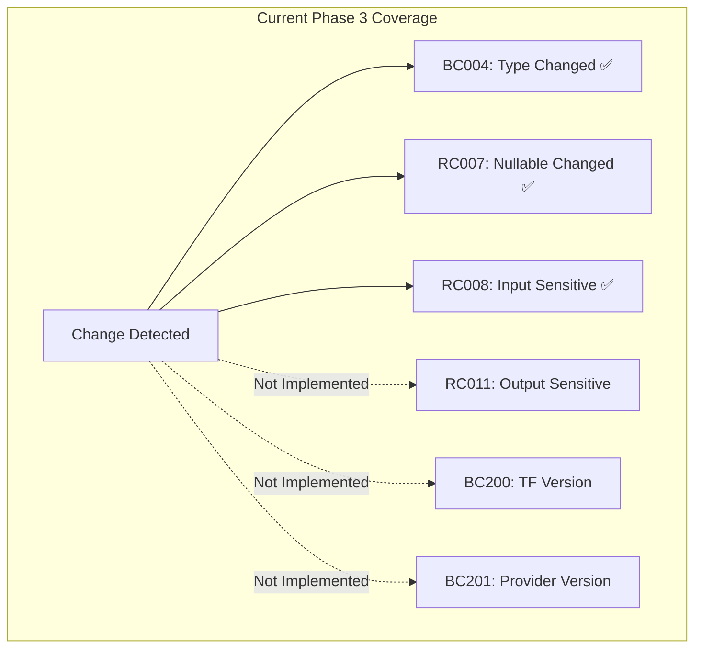
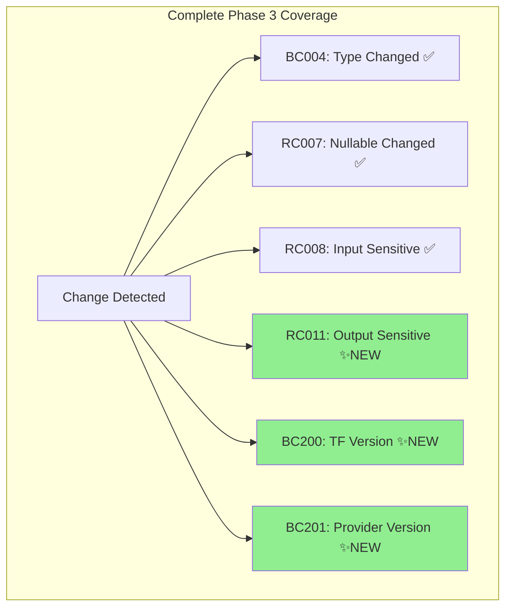
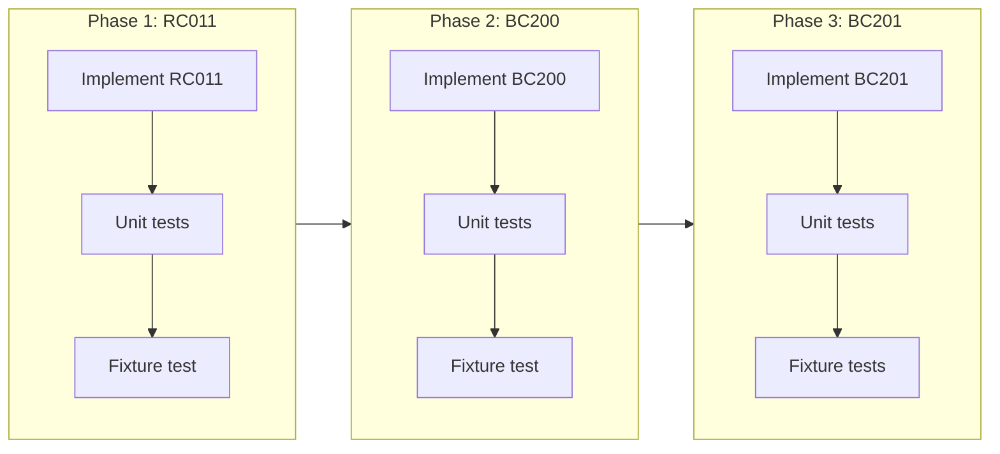

# Phase 3: Output Sensitive and Toolchain Constraint Rules

## Change Summary

Implement the remaining Phase 3 rules: RC011 (output-sensitive-changed), BC200 (terraform-version-constrained), and BC201 (provider-version-constrained). This completes Phase 3 as defined in the specification, providing full coverage of output attribute changes and toolchain version constraint detection.

## Motivation and Background

CR-0005 implemented the variable attribute rules (BC004, RC007, RC008). This CR completes Phase 3 by addressing:

1. **Output sensitive changes** (RC011): Mirrors RC008 for outputs - detects when output sensitivity changes, which affects plan visibility and downstream module consumers
2. **Terraform version constraints** (BC200): Detects when `required_version` becomes more restrictive, potentially breaking CI pipelines or deployments using older Terraform versions
3. **Provider version constraints** (BC201): Detects when provider requirements are tightened or removed, which can break consumers using older provider versions

These rules are particularly valuable for:
- Platform teams managing shared modules across multiple Terraform versions
- Organizations with strict version pinning requirements
- CI/CD pipelines that need to detect compatibility-breaking changes

## Change Drivers

* Completeness: Phase 3 defines 6 rules; CR-0005 implemented 3, this CR implements the remaining 3
* Version compatibility: Terraform version constraint changes are a common source of CI failures
* Security compliance: Output sensitive changes affect audit logging and state file visibility
* Multi-team coordination: Provider version changes require coordination across consuming teams

## Current State

### Phase 3 Rule Implementation Status

| ID | Name | Status |
|----|------|--------|
| BC004 | input-type-changed | ✅ CR-0005 |
| RC007 | input-nullable-changed | ✅ CR-0005 |
| RC008 | input-sensitive-changed | ✅ CR-0005 |
| RC011 | output-sensitive-changed | ❌ Not implemented |
| BC200 | terraform-version-constrained | ❌ Not implemented |
| BC201 | provider-version-constrained | ❌ Not implemented |

### Current Data Model Support

The `ModuleSnapshot` already contains the required fields:

```go
type ModuleSnapshot struct {
    // ...
    Outputs           map[string]*OutputSignature      // Has Sensitive field
    RequiredVersion   string                           // terraform required_version
    RequiredProviders map[string]*ProviderRequirement  // provider requirements
}

type OutputSignature struct {
    Name        string
    Description string
    Sensitive   bool  // ✅ Already extracted
    DeclRange   FileRange
}

type ProviderRequirement struct {
    Source  string  // e.g., "hashicorp/aws"
    Version string  // version constraint
}
```

### Current State Diagram



## Proposed Change

Implement three new rules:

### RC011 — output-sensitive-changed (RISKY)

Detects when an output's sensitive attribute changes.

**Evaluation logic** (from spec):
```
Condition: output O exists in both AND old.O.sensitive != new.O.sensitive
```

**Implementation notes:**
- Simple boolean comparison (mirrors RC008 for variables)
- No loader changes required - `Sensitive` already extracted
- Both directions (adding/removing sensitive) are flagged as RISKY

### BC200 — terraform-version-constrained (BREAKING)

Detects when `required_version` constraint becomes more restrictive.

**Evaluation logic** (from spec):
```
Condition: new.required_version is more restrictive than old.required_version
```

**MVP Implementation:**
- Any change to `required_version` triggers this rule
- Adding a constraint where none existed is BREAKING
- Removing a constraint is not flagged (loosening is safe)
- Future enhancement: semantic version constraint comparison

**Edge cases:**
- Old: none, New: `">= 1.0"` → BREAKING (new constraint added)
- Old: `">= 1.0"`, New: `">= 1.5"` → BREAKING (constraint tightened)
- Old: `">= 1.0"`, New: none → No finding (constraint removed/loosened)
- Old: `">= 1.0"`, New: `">= 1.0"` → No finding (unchanged)

### BC201 — provider-version-constrained (BREAKING)

Detects when provider version requirements are tightened or providers are removed.

**Evaluation logic** (from spec):
```
Condition: provider P in old.required_providers is missing in new
           OR new constraint for P is more restrictive than old
```

**MVP Implementation:**
- Provider removed from requirements → BREAKING
- Provider version constraint changed → BREAKING
- Provider added → No finding (new dependency, not breaking)
- Future enhancement: semantic version constraint comparison

**Edge cases:**
- Provider removed entirely → BREAKING
- Provider source changed → BREAKING (different provider)
- Version constraint tightened → BREAKING
- Version constraint loosened → BREAKING (MVP: any change flagged)

### Proposed State Diagram



## Requirements

### Functional Requirements

1. The system **MUST** implement rule RC011 (output-sensitive-changed) that detects when an output's sensitive attribute changes
2. The system **MUST** implement rule BC200 (terraform-version-constrained) that detects when required_version is added or changed
3. The system **MUST** implement rule BC201 (provider-version-constrained) that detects when provider requirements are removed or changed
4. RC011 **MUST** detect both adding and removing the sensitive attribute
5. BC200 **MUST** flag adding a required_version where none existed as BREAKING
6. BC200 **MUST NOT** flag removal of required_version (loosening is safe)
7. BC201 **MUST** flag removal of a provider from required_providers as BREAKING
8. BC201 **MUST** flag any change to a provider's version constraint as BREAKING
9. BC201 **MUST NOT** flag addition of new providers (new dependency is not breaking)
10. All rules **MUST** register in the rule registry with correct default severities
11. All rules **MUST** provide Documentation() method for the `explain` command
12. All rules **MUST** be enabled by default

### Non-Functional Requirements

1. All rule implementations **MUST** follow existing code patterns from Phase 1 and CR-0005
2. All rules **MUST** achieve > 90% test coverage
3. The implementation **MUST** pass all existing tests without modification
4. Rule evaluation **MUST** complete in O(n) time where n is the number of outputs/providers

## Affected Components

* `internal/rules/rc011.go` — New rule implementation
* `internal/rules/bc200.go` — New rule implementation
* `internal/rules/bc201.go` — New rule implementation
* `internal/rules/rc011_test.go` — Unit tests for RC011
* `internal/rules/bc200_test.go` — Unit tests for BC200
* `internal/rules/bc201_test.go` — Unit tests for BC201
* `internal/integration_test.go` — Fixture test functions
* `testdata/scenarios/` — Fixture test data

## Scope Boundaries

### In Scope

* RC011 (output-sensitive-changed) rule implementation
* BC200 (terraform-version-constrained) rule with MVP string comparison
* BC201 (provider-version-constrained) rule with MVP string comparison
* Unit tests for all three rules
* Fixture-based integration tests
* Rule documentation for `explain` command

### Out of Scope ("Here, But Not Further")

* Semantic version constraint comparison (e.g., understanding `>= 1.0` vs `>= 1.5`) — Future enhancement
* Version constraint intersection analysis — Future enhancement
* BC003/BC010 (rename heuristics) — Phase 4
* Provider source validation — Future enhancement
* Multi-constraint version strings (e.g., `">= 1.0, < 2.0"`) parsing — MVP treats as opaque strings

## Alternative Approaches Considered

### Version Constraint Comparison

1. **String comparison only** (chosen for MVP): Simple, predictable, any change is flagged
2. **Semantic version parsing**: Complex, requires understanding constraint syntax (`>=`, `~>`, etc.)
3. **Use hashicorp/go-version library**: More accurate but adds dependency and complexity

**Decision**: Start with string comparison for MVP. This may produce false positives (flagging loosened constraints as breaking) but is safe and simple. Semantic comparison can be added later as an enhancement.

### Provider Change Detection

1. **Flag all changes** (chosen for MVP): Simple, safe, may have false positives
2. **Detect constraint direction**: Complex, requires version comparison logic
3. **Ignore source changes**: Misses breaking changes when provider source changes

**Decision**: Flag all provider changes for MVP. Provider changes are relatively rare and warrant attention.

## Impact Assessment

### User Impact

* **Positive**: Users will be alerted to version constraint changes that could break CI/CD
* **Positive**: Output sensitive changes now detected (completes sensitive rule family)
* **Neutral**: MVP may flag some non-breaking changes (false positives for loosened constraints)
* **Training**: No retraining needed; rules follow established patterns

### Technical Impact

* **No loader changes**: All required data already extracted
* **New files**: 3 rule files + 3 test files
* **No breaking changes**: All existing APIs remain unchanged
* **Dependencies**: No new dependencies required

### Business Impact

* **Value delivery**: Completes Phase 3, detects common CI-breaking changes
* **Risk**: Low — simple implementations following established patterns
* **False positives**: MVP may flag some non-breaking version changes; users can use annotations to suppress

## Implementation Approach

### Phase 1: RC011 Implementation

1. Implement RC011 (mirrors RC008 pattern)
2. Add unit tests
3. Add fixture test

### Phase 2: BC200 Implementation

1. Implement BC200 with string comparison
2. Handle edge cases (added/removed/changed)
3. Add unit tests
4. Add fixture test

### Phase 3: BC201 Implementation

1. Implement BC201 with provider iteration
2. Handle provider removal and constraint changes
3. Add unit tests
4. Add fixture tests

### Implementation Flow



## Test Strategy

### Tests to Add

| Test File | Test Name | Description | Inputs | Expected Output |
|-----------|-----------|-------------|--------|-----------------|
| `rc011_test.go` | `TestRC011_SensitiveChanged_FalseToTrue` | Output sensitive added | old: false, new: true | 1 RISKY finding |
| `rc011_test.go` | `TestRC011_SensitiveChanged_TrueToFalse` | Output sensitive removed | old: true, new: false | 1 RISKY finding |
| `rc011_test.go` | `TestRC011_SensitiveUnchanged` | No change | old: true, new: true | No findings |
| `rc011_test.go` | `TestRC011_OutputRemoved_NoFinding` | Output removed | old: exists, new: missing | No findings (BC009) |
| `bc200_test.go` | `TestBC200_VersionAdded` | Constraint added | old: none, new: ">= 1.0" | 1 BREAKING finding |
| `bc200_test.go` | `TestBC200_VersionChanged` | Constraint changed | old: ">= 1.0", new: ">= 1.5" | 1 BREAKING finding |
| `bc200_test.go` | `TestBC200_VersionRemoved_NoFinding` | Constraint removed | old: ">= 1.0", new: none | No findings |
| `bc200_test.go` | `TestBC200_VersionUnchanged` | No change | old: ">= 1.0", new: ">= 1.0" | No findings |
| `bc201_test.go` | `TestBC201_ProviderRemoved` | Provider removed | old: has aws, new: missing aws | 1 BREAKING finding |
| `bc201_test.go` | `TestBC201_ProviderVersionChanged` | Version changed | old: ">= 4.0", new: ">= 5.0" | 1 BREAKING finding |
| `bc201_test.go` | `TestBC201_ProviderSourceChanged` | Source changed | old: hashicorp/aws, new: other/aws | 1 BREAKING finding |
| `bc201_test.go` | `TestBC201_ProviderAdded_NoFinding` | Provider added | old: none, new: has aws | No findings |
| `bc201_test.go` | `TestBC201_ProviderUnchanged` | No change | old: aws >= 4.0, new: same | No findings |
| `bc201_test.go` | `TestBC201_MultipleProviders` | Multiple changes | old: aws, google; new: aws changed | Correct findings |

### Fixture Tests to Add

| Scenario Directory | Description | Expected Findings |
|--------------------|-------------|-------------------|
| `testdata/scenarios/rc011_output_sensitive_changed/` | Output sensitive changed | RC011 RISKY |
| `testdata/scenarios/bc200_version_added/` | required_version added | BC200 BREAKING |
| `testdata/scenarios/bc200_version_changed/` | required_version changed | BC200 BREAKING |
| `testdata/scenarios/bc201_provider_removed/` | Provider removed | BC201 BREAKING |
| `testdata/scenarios/bc201_provider_version_changed/` | Provider version changed | BC201 BREAKING |

### Tests to Modify

None. No existing tests need modification.

### Tests to Remove

None. No existing tests need to be removed.

## Acceptance Criteria

### AC-1: RC011 detects output sensitive added

```gherkin
Given an old module with output "connection_string" with sensitive = false
  And a new module with output "connection_string" with sensitive = true
When tfbreak check is run comparing the two modules
Then a RISKY finding with rule ID "RC011" is reported
  And the finding message indicates sensitive changed from "false" to "true"
```

### AC-2: RC011 detects output sensitive removed

```gherkin
Given an old module with output "debug_info" with sensitive = true
  And a new module with output "debug_info" with sensitive = false
When tfbreak check is run comparing the two modules
Then a RISKY finding with rule ID "RC011" is reported
```

### AC-3: BC200 detects required_version added

```gherkin
Given an old module with no required_version constraint
  And a new module with required_version = ">= 1.5.0"
When tfbreak check is run comparing the two modules
Then a BREAKING finding with rule ID "BC200" is reported
  And the finding message indicates a version constraint was added
```

### AC-4: BC200 detects required_version changed

```gherkin
Given an old module with required_version = ">= 1.0.0"
  And a new module with required_version = ">= 1.5.0"
When tfbreak check is run comparing the two modules
Then a BREAKING finding with rule ID "BC200" is reported
```

### AC-5: BC200 does not flag required_version removal

```gherkin
Given an old module with required_version = ">= 1.0.0"
  And a new module with no required_version constraint
When tfbreak check is run comparing the two modules
Then no BC200 finding is reported
```

### AC-6: BC201 detects provider removed

```gherkin
Given an old module with required_providers including "aws"
  And a new module without "aws" in required_providers
When tfbreak check is run comparing the two modules
Then a BREAKING finding with rule ID "BC201" is reported
  And the finding message indicates the provider was removed
```

### AC-7: BC201 detects provider version changed

```gherkin
Given an old module with aws provider version = ">= 4.0"
  And a new module with aws provider version = ">= 5.0"
When tfbreak check is run comparing the two modules
Then a BREAKING finding with rule ID "BC201" is reported
```

### AC-8: BC201 does not flag new provider added

```gherkin
Given an old module with no required_providers
  And a new module with required_providers including "aws"
When tfbreak check is run comparing the two modules
Then no BC201 finding is reported
```

### AC-9: Rules provide documentation for explain command

```gherkin
Given the three new rules are implemented
When tfbreak explain RC011 is run
Then the rule documentation is displayed including ID, name, severity, description, examples, and remediation
  And the same works for BC200 and BC201
```

### AC-10: Rules are enabled by default

```gherkin
Given no configuration file exists
When tfbreak check is run with modules containing output sensitive, terraform version, and provider changes
Then all three rules (RC011, BC200, BC201) evaluate and report findings
```

## Quality Standards Compliance

### Build & Compilation

- [ ] Code compiles/builds without errors
- [ ] No new compiler warnings introduced

### Linting & Code Style

- [ ] All linter checks pass with zero warnings/errors
- [ ] Code follows project coding conventions and style guides
- [ ] Any linter exceptions are documented with justification

### Test Execution

- [ ] All existing tests pass after implementation
- [ ] All new tests pass
- [ ] Test coverage meets project requirements for changed code (>90%)

### Documentation

- [ ] Inline code documentation updated where applicable
- [ ] Rule documentation implemented via Documentation() method
- [ ] README updated if needed (optional)

### Code Review

- [ ] Changes submitted via pull request
- [ ] PR title follows Conventional Commits format: `feat: implement Phase 3 output and toolchain rules (RC011, BC200, BC201)`
- [ ] Code review completed and approved
- [ ] Changes squash-merged to maintain linear history

### Verification Commands

```bash
# Build verification
go build ./...

# Lint verification
make lint

# Test execution with coverage
go test -race -cover ./...

# Specific rule tests
go test -v ./internal/rules/ -run "TestRC011|TestBC200|TestBC201"
```

## Risks and Mitigation

### Risk 1: False positives for version constraint loosening

**Likelihood:** Medium
**Impact:** Low
**Mitigation:** Document in rule remediation that loosened constraints may be flagged; users can use annotations to suppress. Future enhancement can add semantic comparison.

### Risk 2: Complex version constraint strings

**Likelihood:** Low
**Impact:** Low
**Mitigation:** MVP treats constraints as opaque strings. Complex constraints like `">= 1.0, < 2.0"` will be flagged if changed at all, which is conservative but safe.

### Risk 3: Provider source format variations

**Likelihood:** Low
**Impact:** Low
**Mitigation:** Compare source strings exactly. Variations like `aws` vs `hashicorp/aws` will be flagged as changes, which is the desired behavior.

## Dependencies

* CR-0001 (Phase 1 MVP) — Completed; provides foundation
* CR-0005 (Phase 3 Variable Rules) — Completed; established patterns for attribute rules
* No external dependencies to add

## Estimated Effort

* **RC011 implementation + tests**: 1-2 hours
* **BC200 implementation + tests**: 2-3 hours
* **BC201 implementation + tests**: 2-3 hours
* **Fixture tests**: 1-2 hours
* **Integration verification**: 1 hour
* **Total**: 7-11 hours (1-1.5 days)

## Decision Outcome

Chosen approach: "String comparison for version constraints with conservative flagging", because:

1. **Simplicity**: No version parsing complexity
2. **Safety**: Conservative approach catches all potential breaking changes
3. **Extensibility**: Can add semantic comparison later without breaking changes
4. **Consistency**: Follows established patterns from other rules

## Related Items

* Links to related change requests: CR-0001, CR-0005
* Links to architecture decisions: ADR-0001
* Links to specification: spec/001_IDEA.md (Section 2.2, 2.3)

## More Information

### terraform-config-inspect Data Structures

From DeepWiki analysis:

```go
// RequiredCore holds terraform required_version constraints
type Module struct {
    RequiredCore      []string                        // version constraints
    RequiredProviders map[string]*ProviderRequirement // provider requirements
}

type ProviderRequirement struct {
    Source             string   // e.g., "hashicorp/aws"
    VersionConstraints []string // version constraints
}
```

Note: Our loader stores only the first constraint string for simplicity.

### Version Constraint Syntax Reference

Terraform supports these version constraint operators:
- `= 1.0.0` — Exact version
- `!= 1.0.0` — Exclude version
- `> 1.0.0`, `>= 1.0.0`, `< 1.0.0`, `<= 1.0.0` — Comparisons
- `~> 1.0.0` — Pessimistic constraint (allows 1.0.x but not 1.1.0)

For MVP, we treat these as opaque strings. Any change is flagged.

### Future Enhancement: Semantic Version Comparison

A future CR could add semantic version comparison using:
- `github.com/hashicorp/go-version` library
- Constraint intersection analysis
- Detection of loosening vs tightening

This would reduce false positives but adds significant complexity.
