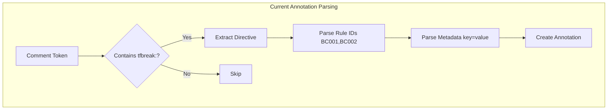
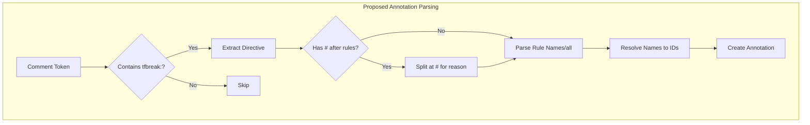
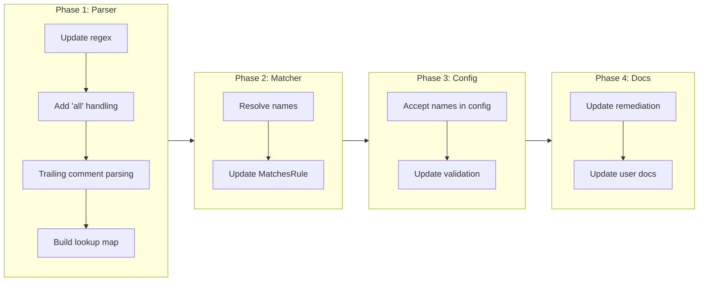

# Align Annotation Format with tflint Conventions

## Change Summary

The current tfbreak annotation format uses internal numeric codes (e.g., `BC001`) and requires structured metadata syntax (e.g., `reason="..."`). This change request proposes aligning with tflint's annotation conventions by using human-readable rule names (e.g., `required-input-added`) and making reasons optional as natural comments rather than structured metadata.

## Motivation and Background

The current annotation format creates cognitive load for users who must memorize internal rule codes like `BC001`, `RC006`, etc. These codes are meaningful to the tool but not to humans reading Terraform files. In contrast, tflint uses descriptive rule names that are self-documenting. Additionally, tflint treats reasons as optional natural language comments rather than requiring structured `key="value"` syntax, which is more ergonomic.

By aligning with tflint conventions:
1. Users already familiar with tflint will have a lower learning curve
2. Rule names become self-documenting in annotations
3. The annotation syntax becomes simpler and more natural
4. Teams can adopt tfbreak more easily alongside existing tflint workflows

## Change Drivers

* **Cognitive load reduction**: Users should not need to memorize arbitrary codes
* **Ecosystem alignment**: tflint is the de facto standard for Terraform linting; following its conventions reduces friction
* **Self-documenting annotations**: Reading `tfbreak:ignore required-input-added` immediately conveys intent
* **Ergonomic improvement**: Natural comment-style reasons are easier to write than structured metadata

## Current State

### Current Annotation Format

```hcl
# tfbreak:ignore BC001 reason="callers updated in same PR" ticket="JIRA-123"
variable "cluster_name" {
  type = string
}
```

**Current regex patterns** (from `parser.go`):
- Rule IDs: `^([A-Z]{2}[0-9]{3}(?:\s*,\s*[A-Z]{2}[0-9]{3})*)`
- Metadata: `(\w+)="([^"]*)"`

**Current features:**
- Rule identifiers: `BC001`, `BC002`, `RC006`, etc. (2 letters + 3 digits)
- Structured metadata: `reason="..."`, `ticket="..."`, `expires="YYYY-MM-DD"`
- File-level: `tfbreak:ignore-file`
- Block-level: `tfbreak:ignore`
- Multiple rules: `BC001,BC002,BC003`

### Current Rule Mapping

| Code   | Name                          |
|--------|-------------------------------|
| BC001  | required-input-added          |
| BC002  | input-removed                 |
| BC004  | input-type-changed            |
| BC005  | input-default-removed         |
| BC009  | output-removed                |
| BC100  | resource-removed-no-moved     |
| BC101  | module-removed-no-moved       |
| BC102  | invalid-moved-block           |
| BC103  | conflicting-moved             |
| BC200  | terraform-version-constrained |
| BC201  | provider-version-constrained  |
| RC006  | input-default-changed         |
| RC007  | input-nullable-changed        |
| RC008  | input-sensitive-changed       |
| RC011  | output-sensitive-changed      |

### Current State Diagram



## Proposed Change

### New Annotation Format

Adopt tflint-style annotations with rule names and optional natural comments:

```hcl
# tfbreak:ignore required-input-added
variable "cluster_name" {
  type = string
}
```

With optional reason as trailing comment:

```hcl
# Callers are updated in the same PR
# tfbreak:ignore required-input-added
variable "cluster_name" {
  type = string
}
```

Or on the same line (tflint style):

```hcl
# tfbreak:ignore required-input-added # callers updated in same PR
variable "cluster_name" {
  type = string
}
```

### Multiple Rules

```hcl
# tfbreak:ignore required-input-added, input-type-changed
variable "cluster_name" {
  type = string
}
```

### Ignore All Rules

Following tflint's `all` keyword:

```hcl
# tfbreak:ignore all
variable "cluster_name" {
  type = string
}
```

### File-Level Ignore

```hcl
# tfbreak:ignore-file required-input-added

variable "foo" {
  type = string
}
```

### Proposed State Diagram



## Requirements

### Functional Requirements

1. The parser **MUST** accept rule names (e.g., `required-input-added`) in annotations
2. The parser **MUST** accept the `all` keyword to ignore all rules (matching tflint behavior)
3. The parser **MUST** support trailing `#` comments for optional reasons (e.g., `# tfbreak:ignore rule-name # reason here`)
4. The parser **MUST NOT** accept legacy rule codes (e.g., `BC001`) - only rule names are valid
5. The matcher **MUST** resolve rule names to rule IDs when matching findings
6. The Rule interface **MUST** expose a `Name()` method (already exists)
7. The system **MUST** build a reverse lookup map from name to ID at startup
8. Error messages **MUST** use rule names in user-facing output for consistency
9. The `allow_rule_ids` and `deny_rule_ids` config options **MUST** accept rule names only
10. Documentation remediation examples **MUST** use the new annotation format

### Non-Functional Requirements

1. The parser **MUST** maintain current performance characteristics (O(n) where n is comment tokens)

## Affected Components

* `internal/annotation/parser.go` - Update regex patterns and parsing logic
* `internal/annotation/parser_test.go` - Update test cases for new format
* `internal/annotation/matcher.go` - Update to resolve names to IDs
* `internal/annotation/matcher_test.go` - Update test cases
* `internal/annotation/types.go` - Consider storing both name and ID
* `internal/rules/*.go` - Update documentation/remediation examples in all rules
* `internal/config/config.go` - Accept rule names in allow/deny lists
* `internal/config/validate.go` - Validate rule names in config

## Scope Boundaries

### In Scope

* New annotation syntax with rule names only
* Support for `all` keyword
* Trailing comment syntax for reasons
* Removal of legacy rule code support (BC001, etc.)
* Configuration updates to accept rule names only
* Documentation updates in rule remediation text
* Test updates for new format

### Out of Scope ("Here, But Not Further")

* Structured metadata syntax (`ticket="..."`, `expires="..."`) - evaluated separately in future CR
* JSON file annotation support - tflint only supports `tflint-ignore-file` in JSON, not line-level
* IDE/editor plugins for annotation autocomplete - future enhancement

## Alternative Approaches Considered

* **Keep current format**: Rejected because it creates unnecessary cognitive burden
* **Support both names and codes**: Rejected because it adds complexity and codes provide no value
* **Use alias system**: Rejected as over-engineered; direct name matching is simpler
* **Structured reason syntax as optional**: Could work but adds complexity; tflint's approach is simpler

## Impact Assessment

### User Impact

* **Positive**: Users can use intuitive, self-documenting rule names
* **Breaking**: Existing annotations using rule codes (BC001, etc.) must be updated
* **Learning curve**: Users must learn rule names (but these are self-documenting)

### Technical Impact

* **Breaking change**: Existing annotations with rule codes will no longer work
* **Parser changes**: Simplified - only accepts rule names
* **Lookup table**: Name-to-ID map built from registry at startup
* **Test coverage**: Comprehensive updates to annotation tests

### Business Impact

* **Adoption**: Lower barrier to entry for tflint users
* **Maintenance**: Simpler parser with single format
* **Ecosystem**: Better alignment with Terraform tooling standards

## Implementation Approach

### Phase 1: Parser Updates

1. Update regex to accept lowercase-hyphenated names: `[a-z]+(-[a-z]+)*`
2. Add `all` keyword handling
3. Implement trailing `#` comment parsing for reasons
4. Build name-to-ID lookup map from registered rules

### Phase 2: Matcher Updates

1. Update matcher to resolve names before comparison
2. Ensure both name and ID work in `MatchesRule()`

### Phase 3: Config Updates

1. Accept rule names in `allow_rule_ids` and `deny_rule_ids`
2. Update validation to recognize rule names

### Phase 4: Documentation Updates

1. Update all rule remediation examples
2. Update any user-facing documentation

### Implementation Flow



## Test Strategy

### Tests to Add

| Test File | Test Name | Description | Inputs | Expected Output |
|-----------|-----------|-------------|--------|-----------------|
| `parser_test.go` | `TestParseAnnotation_RuleName` | Verify parsing of rule names | `tfbreak:ignore required-input-added` | Annotation with resolved RuleID BC001 |
| `parser_test.go` | `TestParseAnnotation_AllKeyword` | Verify 'all' keyword handling | `tfbreak:ignore all` | Annotation with empty RuleIDs (matches all) |
| `parser_test.go` | `TestParseAnnotation_TrailingComment` | Verify reason extraction | `tfbreak:ignore rule # reason` | Annotation with Reason field populated |
| `parser_test.go` | `TestParseAnnotation_MultipleRules` | Verify multiple rule names | `tfbreak:ignore required-input-added, input-removed` | Both rules resolved correctly |
| `parser_test.go` | `TestParseAnnotation_RejectsLegacyCodes` | Verify legacy codes are rejected | `tfbreak:ignore BC001` | Rule not resolved (unknown rule) |
| `matcher_test.go` | `TestMatchesRule_ByName` | Verify matching works with names | Rule name in annotation, ID in finding | Match succeeds |
| `config_test.go` | `TestValidate_RuleNamesInAllowList` | Verify names accepted in config | `allow_rule_ids = ["required-input-added"]` | Validation passes |
| `config_test.go` | `TestValidate_RejectsLegacyCodes` | Verify legacy codes are rejected | `allow_rule_ids = ["BC001"]` | Validation fails |

### Tests to Modify

| Test File | Test Name | Current Behavior | New Behavior | Reason for Change |
|-----------|-----------|------------------|--------------|-------------------|
| `parser_test.go` | `TestParseAnnotation` | Tests BC001 format | Tests rule names only | Remove legacy format tests |
| `matcher_test.go` | `TestMatcher_Match` | Uses rule codes | Uses rule names only | Update to new format |
| `config_test.go` | `TestValidate_AllowRuleIDs` | Validates codes | Validates names only | Remove legacy format support |

### Tests to Remove

| Test File | Test Name | Reason for Removal |
|-----------|-----------|-------------------|
| Tests using BC001 format | Various | Legacy format no longer supported |

## Acceptance Criteria

### AC-1: Parse rule names

```gherkin
Given a Terraform file with annotation "# tfbreak:ignore required-input-added"
When the parser processes the file
Then an Annotation is created with RuleIDs containing "BC001"
```

### AC-2: Parse 'all' keyword

```gherkin
Given a Terraform file with annotation "# tfbreak:ignore all"
When the parser processes the file
Then an Annotation is created with empty RuleIDs (matches all rules)
```

### AC-3: Parse trailing comment as reason

```gherkin
Given a Terraform file with annotation "# tfbreak:ignore required-input-added # updated callers"
When the parser processes the file
Then an Annotation is created with Reason "updated callers"
```

### AC-4: Legacy codes are rejected

```gherkin
Given a Terraform file with annotation "# tfbreak:ignore BC001"
When the parser processes the file
Then the rule is not recognized (empty RuleIDs or warning)
```

### AC-5: Multiple rule names support

```gherkin
Given a Terraform file with annotation "# tfbreak:ignore required-input-added, input-removed"
When the parser processes the file
Then an Annotation is created with RuleIDs containing both "BC001" and "BC002"
```

### AC-6: Rule names in config

```gherkin
Given a .tfbreak.hcl config with allow_rule_ids = ["required-input-added"]
When the config is loaded and validated
Then the config is accepted as valid
  And annotations for "BC001" are allowed
```

### AC-7: Error messages use rule names

```gherkin
Given a finding for rule BC001
When the finding is displayed to the user
Then the output includes the rule name "required-input-added"
```

## Quality Standards Compliance

### Build & Compilation

- [ ] Code compiles/builds without errors
- [ ] No new compiler warnings introduced

### Linting & Code Style

- [ ] All linter checks pass with zero warnings/errors
- [ ] Code follows project coding conventions and style guides
- [ ] Any linter exceptions are documented with justification

### Test Execution

- [ ] All existing tests pass after implementation
- [ ] All new tests pass
- [ ] Test coverage meets project requirements for changed code

### Documentation

- [ ] Inline code documentation updated where applicable
- [ ] API documentation updated for any API changes
- [ ] User-facing documentation updated if behavior changes

### Code Review

- [ ] Changes submitted via pull request
- [ ] PR title follows Conventional Commits format
- [ ] Code review completed and approved
- [ ] Changes squash-merged to maintain linear history

### Verification Commands

```bash
# Build verification
go build ./...

# Lint verification
golangci-lint run

# Test execution
go test ./...
```

## Risks and Mitigation

### Risk 1: Rule name collisions in future

**Likelihood:** low
**Impact:** medium
**Mitigation:** Rule names follow consistent pattern (verb-noun-modifier); establish naming convention documentation

### Risk 2: Performance impact from name resolution

**Likelihood:** low
**Impact:** low
**Mitigation:** Build lookup map once at startup; map lookup is O(1)

### Risk 3: Breaking change for existing users

**Likelihood:** low (tool is new, few existing users)
**Impact:** medium
**Mitigation:** Clear documentation with migration guide showing old format → new format mapping

## Dependencies

* None - this change is self-contained

## Estimated Effort

* Phase 1 (Parser): 2-3 hours
* Phase 2 (Matcher): 1 hour
* Phase 3 (Config): 1 hour
* Phase 4 (Documentation): 1-2 hours
* Testing: 2-3 hours
* **Total: 7-10 hours**

## Decision Outcome

Chosen approach: "tflint-style annotations with rule names only", because it reduces cognitive load, aligns with ecosystem conventions, simplifies implementation, and the tool is new enough that breaking changes have minimal impact.

## Related Items

* tflint annotation documentation: https://github.com/terraform-linters/tflint/blob/master/docs/user-guide/annotations.md
* Current annotation implementation: `internal/annotation/`
* Rule definitions: `internal/rules/`
