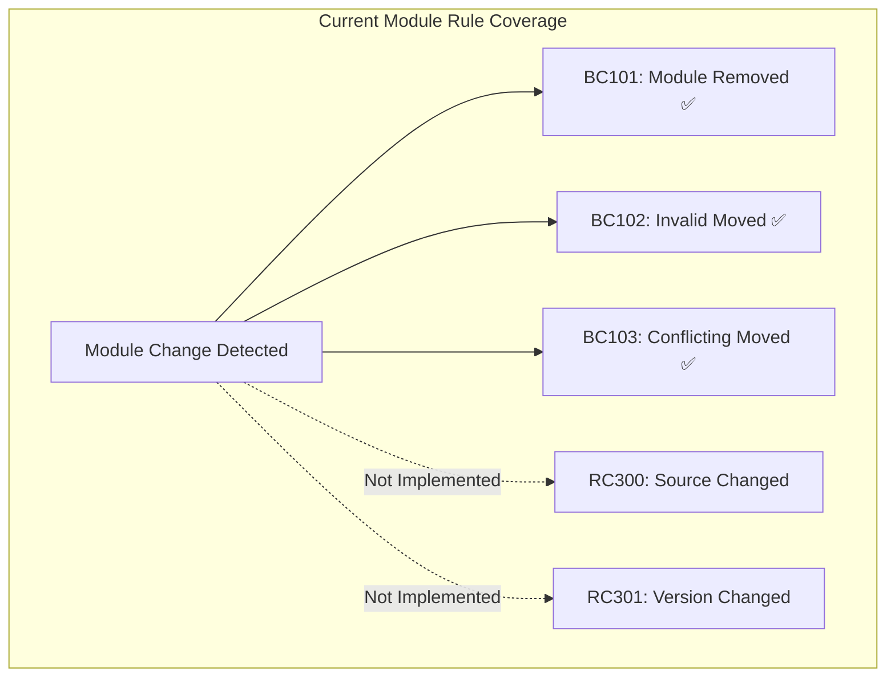
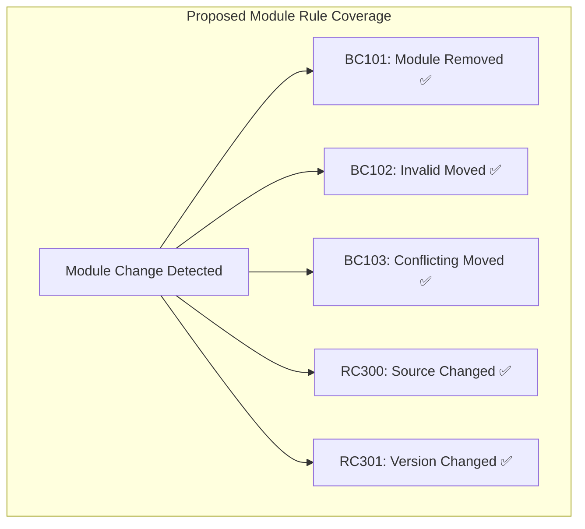
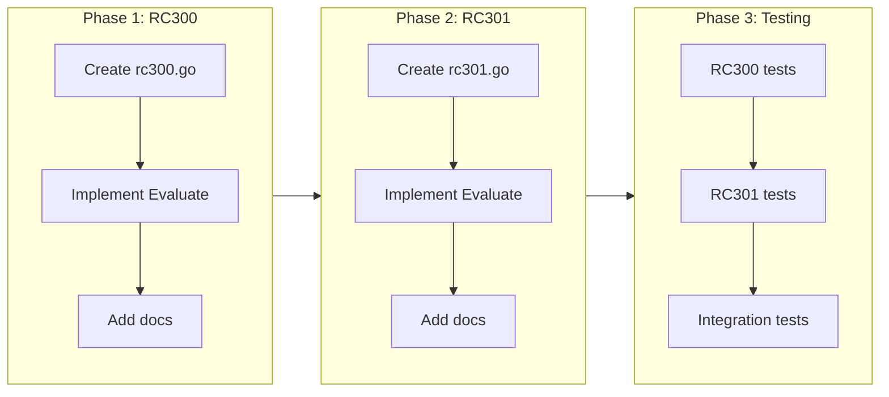

# Phase 4: Module Source and Version Rules

## Change Summary

Implement deterministic rules for detecting breaking changes in module calls: RC300 (module-source-changed) detects when a child module's source URL changes, and RC301 (module-version-changed) detects when a child module's version constraint changes. These rules help teams track dependency changes that could introduce breaking behavior or require coordination.

## Motivation and Background

When a Terraform root module or composition layer references child modules, changes to those module sources or version constraints can have significant impact:

1. **Source changes** can point to completely different module implementations, even if the module interface appears similar
2. **Version constraint changes** can pull in new module versions with breaking changes, new features, or bug fixes
3. **Registry migrations** (e.g., moving from GitHub to Terraform Registry) change how modules are resolved and versioned

These changes are currently invisible to tfbreak, meaning teams can unknowingly introduce breaking dependencies. Unlike variable/output changes which affect the module's public API, module source changes affect the module's internal dependencies.

### Note on BC010 (output-type-changed)

Initially considered for Phase 4, BC010 (output-type-changed) is **not feasible** with the current approach because:
- Terraform outputs don't have explicit `type` attributes like variables
- Output types are inferred from the `value` expression at plan time
- terraform-config-inspect doesn't expose output types (they're computed, not declared)

This rule would require expression evaluation or Terraform plan output analysis, which is out of scope for static analysis.

## Change Drivers

* **Dependency tracking**: Teams need visibility into module dependency changes
* **Version pinning policies**: Organizations with strict version policies need to detect constraint changes
* **Migration detection**: Detecting source URL changes helps track module migrations (git → registry)
* **Auditability**: Security and compliance teams need to track third-party dependency changes

## Current State

### Implemented Module Rules

| ID | Name | Status |
|----|------|--------|
| BC100 | resource-removed-no-moved | ✅ Implemented |
| BC101 | module-removed-no-moved | ✅ Implemented |
| BC102 | invalid-moved-block | ✅ Implemented |
| BC103 | conflicting-moved | ✅ Implemented |
| RC300 | module-source-changed | ❌ Not implemented |
| RC301 | module-version-changed | ❌ Not implemented |

### Current ModuleCallSignature Structure

```go
// internal/types/snapshot.go
type ModuleCallSignature struct {
    Name      string    `json:"name"`
    Source    string    `json:"source"`      // ✅ Already extracted
    Version   string    `json:"version"`     // ✅ Already extracted
    Address   string    `json:"address"`
    DeclRange FileRange `json:"pos"`
}
```

The data model already supports module source and version extraction. No schema changes are required.

### Current State Diagram



## Proposed Change

Implement two new rules that detect module dependency changes:

### RC300 — module-source-changed (RISKY)

Detects when a module call's source URL changes between versions.

**Evaluation logic:**
```
Condition: module M exists in both AND old.M.source != new.M.source
```

**Example scenarios:**
- Git URL changed: `git::https://github.com/org/module.git` → `git::https://github.com/org/module-v2.git`
- Registry migration: `git::https://...` → `registry.terraform.io/org/module/aws`
- Path changed: `./modules/vpc` → `./modules/networking/vpc`
- Protocol changed: `https://...` → `git::https://...`

**Severity:** RISKY - Source changes may point to different module implementations; verify the change is intentional

### RC301 — module-version-changed (RISKY)

Detects when a module call's version constraint changes.

**Evaluation logic:**
```
Condition: module M exists in both AND old.M.version != new.M.version
```

**Example scenarios:**
- Version bump: `"~> 3.0"` → `"~> 4.0"`
- Constraint tightened: `">= 1.0"` → `">= 2.0, < 3.0"`
- Constraint removed: `"~> 3.0"` → `""` (unpinned)
- Constraint added: `""` → `"~> 3.0"` (newly pinned)

**Severity:** RISKY - Version constraint changes may pull in different module behavior; impact depends on the module's versioning strategy

### Proposed State Diagram



## Requirements

### Functional Requirements

1. The RC300 rule **MUST** detect when a module call's `source` attribute value changes
2. The RC300 rule **MUST** report the old and new source values in the finding message
3. The RC300 rule **MUST** only fire when the module exists in both old and new snapshots
4. The RC301 rule **MUST** detect when a module call's `version` attribute value changes
5. The RC301 rule **MUST** report the old and new version constraints in the finding message
6. The RC301 rule **MUST** handle the case where version is added (empty → constraint)
7. The RC301 rule **MUST** handle the case where version is removed (constraint → empty)
8. Both rules **MUST** include source file locations in findings when available
9. Both rules **MUST** be suppressible via `tfbreak:ignore` annotations
10. Both rules **MUST** use rule names in annotation format (e.g., `module-source-changed`)

### Non-Functional Requirements

1. Both rules **MUST** maintain O(n) time complexity where n is the number of module calls
2. Both rules **MUST** follow the existing rule implementation pattern (ID, Name, Description, DefaultSeverity, Documentation, Evaluate)

## Affected Components

* `internal/rules/rc300.go` - New file for module-source-changed rule
* `internal/rules/rc301.go` - New file for module-version-changed rule
* `internal/config/validate.go` - Add new rule names to ValidRuleNames map
* `internal/annotation/parser_test.go` - Add test cases for new rule names (if using resolver)

## Scope Boundaries

### In Scope

* RC300 (module-source-changed) rule implementation
* RC301 (module-version-changed) rule implementation
* Rule documentation with remediation examples
* Unit tests for both rules
* Config validation for new rule names

### Out of Scope ("Here, But Not Further")

* BC010 (output-type-changed) - Requires expression evaluation, not feasible with static analysis
* Semantic version comparison - We compare version strings literally, not semantically
* Module source normalization - `./modules/vpc` vs `./modules/vpc/` treated as different
* Transitive dependency tracking - Only direct module calls are analyzed
* Module content diffing - We only detect source/version changes, not what changed inside the module

## Alternative Approaches Considered

* **Semantic version comparison**: Could detect if new constraint is a superset/subset of old. Rejected as over-complex; string comparison is sufficient for change detection.
* **Source URL normalization**: Could normalize URLs (strip protocols, trailing slashes). Rejected because different URLs should be flagged even if they resolve to same content.
* **Combine into single rule**: Could have one rule for all module changes. Rejected because source and version changes have different implications and users may want to suppress them independently.

## Impact Assessment

### User Impact

* **Positive**: Teams gain visibility into module dependency changes
* **Positive**: Helps enforce version pinning policies
* **Neutral**: Two new rules to learn, but follow existing patterns

### Technical Impact

* **Additive**: Two new rule files, no changes to existing rules
* **Data model**: No changes required - ModuleCallSignature already has needed fields
* **Config**: Minor update to add new rule names to validation

### Business Impact

* **Security**: Better tracking of third-party module changes
* **Compliance**: Supports audit requirements for dependency management
* **Adoption**: Addresses common user request for dependency change detection

## Implementation Approach

### Phase 1: RC300 Implementation

1. Create `internal/rules/rc300.go` following existing rule pattern
2. Implement source comparison logic
3. Add documentation with remediation examples
4. Add rule name to config validation

### Phase 2: RC301 Implementation

1. Create `internal/rules/rc301.go` following existing rule pattern
2. Implement version constraint comparison logic
3. Handle empty/non-empty transitions
4. Add documentation with remediation examples
5. Add rule name to config validation

### Phase 3: Testing

1. Add unit tests for RC300
2. Add unit tests for RC301
3. Add integration test scenarios

### Implementation Flow



## Test Strategy

### Tests to Add

| Test File | Test Name | Description | Inputs | Expected Output |
|-----------|-----------|-------------|--------|-----------------|
| `rc300_test.go` | `TestRC300_SourceChanged` | Detect source URL change | Module with different source | 1 finding with old/new source |
| `rc300_test.go` | `TestRC300_SourceUnchanged` | No finding when source same | Module with same source | 0 findings |
| `rc300_test.go` | `TestRC300_ModuleAdded` | No finding for new modules | Module only in new | 0 findings |
| `rc300_test.go` | `TestRC300_ModuleRemoved` | No finding for removed modules | Module only in old | 0 findings (handled by BC101) |
| `rc300_test.go` | `TestRC300_MultipleModules` | Handle multiple module changes | 3 modules, 2 changed | 2 findings |
| `rc301_test.go` | `TestRC301_VersionChanged` | Detect version constraint change | Module with different version | 1 finding with old/new version |
| `rc301_test.go` | `TestRC301_VersionAdded` | Detect version added | Module: "" → "~> 3.0" | 1 finding |
| `rc301_test.go` | `TestRC301_VersionRemoved` | Detect version removed | Module: "~> 3.0" → "" | 1 finding |
| `rc301_test.go` | `TestRC301_VersionUnchanged` | No finding when version same | Module with same version | 0 findings |
| `rc301_test.go` | `TestRC301_BothEmpty` | No finding when both empty | Module: "" → "" | 0 findings |

### Tests to Modify

| Test File | Test Name | Current Behavior | New Behavior | Reason for Change |
|-----------|-----------|------------------|--------------|-------------------|
| N/A | N/A | N/A | N/A | No existing tests need modification |

### Tests to Remove

| Test File | Test Name | Reason for Removal |
|-----------|-----------|-------------------|
| N/A | N/A | No tests need removal |

## Acceptance Criteria

### AC-1: Detect module source change

```gherkin
Given a Terraform module with child module "vpc" sourced from "git::https://github.com/org/vpc.git"
When the source is changed to "registry.terraform.io/org/vpc/aws"
Then RC300 reports a finding with message containing both source URLs
  And the finding has severity RISKY
  And the finding includes the file location
```

### AC-2: No finding when source unchanged

```gherkin
Given a Terraform module with child module "vpc" sourced from "./modules/vpc"
When the source remains "./modules/vpc"
Then RC300 reports no findings for that module
```

### AC-3: Detect module version constraint change

```gherkin
Given a Terraform module with child module "vpc" version "~> 3.0"
When the version is changed to "~> 4.0"
Then RC301 reports a finding with message containing both version constraints
  And the finding has severity RISKY
```

### AC-4: Detect version constraint added

```gherkin
Given a Terraform module with child module "vpc" with no version constraint
When a version constraint "~> 3.0" is added
Then RC301 reports a finding indicating version constraint was added
```

### AC-5: Detect version constraint removed

```gherkin
Given a Terraform module with child module "vpc" version "~> 3.0"
When the version constraint is removed (empty)
Then RC301 reports a finding indicating version constraint was removed
```

### AC-6: Suppression via annotation

```gherkin
Given a Terraform module with annotation "# tfbreak:ignore module-source-changed"
When the module source changes
Then RC300 does not report a finding for that module
```

### AC-7: Both rules work together

```gherkin
Given a Terraform module with child module "vpc"
When both source and version are changed
Then RC300 reports one finding for source change
  And RC301 reports one finding for version change
```

## Quality Standards Compliance

### Build & Compilation

- [ ] Code compiles/builds without errors
- [ ] No new compiler warnings introduced

### Linting & Code Style

- [ ] All linter checks pass with zero warnings/errors
- [ ] Code follows project coding conventions and style guides
- [ ] Any linter exceptions are documented with justification

### Test Execution

- [ ] All existing tests pass after implementation
- [ ] All new tests pass
- [ ] Test coverage meets project requirements for changed code

### Documentation

- [ ] Inline code documentation updated where applicable
- [ ] API documentation updated for any API changes
- [ ] User-facing documentation updated if behavior changes

### Code Review

- [ ] Changes submitted via pull request
- [ ] PR title follows Conventional Commits format
- [ ] Code review completed and approved
- [ ] Changes squash-merged to maintain linear history

### Verification Commands

```bash
# Build verification
go build ./...

# Lint verification
go vet ./...

# Test execution
go test ./...
```

## Risks and Mitigation

### Risk 1: False positives from whitespace/formatting differences

**Likelihood:** low
**Impact:** low
**Mitigation:** String comparison is exact; users can suppress with annotations if needed

### Risk 2: Users confused by version string comparison vs semantic comparison

**Likelihood:** medium
**Impact:** low
**Mitigation:** Clear documentation explaining literal string comparison; future CR could add semantic comparison

### Risk 3: Performance with many module calls

**Likelihood:** low
**Impact:** low
**Mitigation:** O(n) complexity is acceptable; module calls are typically fewer than resources

## Dependencies

* None - builds on existing ModuleCallSignature data model

## Estimated Effort

* Phase 1 (RC300): 1-2 hours
* Phase 2 (RC301): 1-2 hours
* Phase 3 (Testing): 2-3 hours
* **Total: 4-7 hours**

## Decision Outcome

Chosen approach: "Literal string comparison for source and version", because it's simple, deterministic, and aligns with existing rule patterns. Semantic version comparison can be added in a future enhancement if users request it.

## Related Items

* CR-0005: Phase 3 variable attribute rules
* CR-0006: Phase 3 output and toolchain rules
* CR-0007: tflint-style annotations (rule naming convention)
* Existing module rules: BC100, BC101, BC102, BC103
