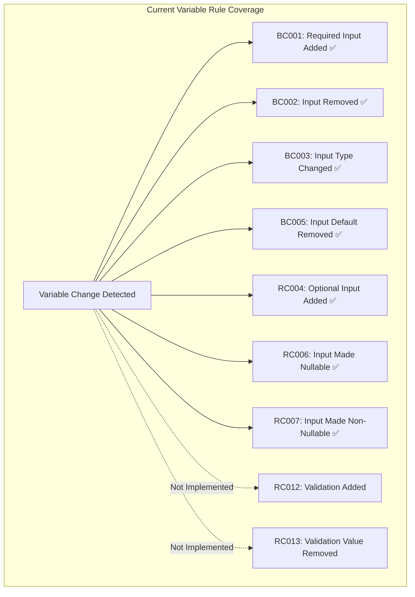
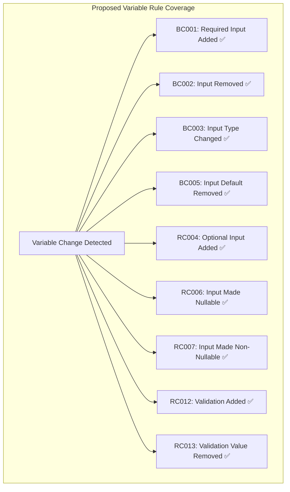
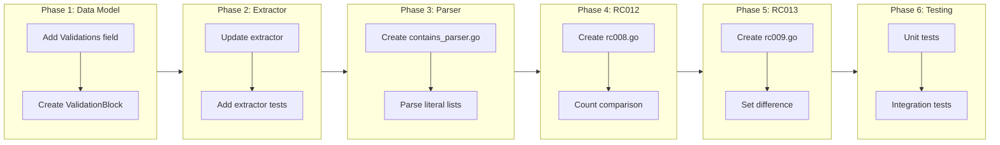

# Phase 5: Validation Rules

## Change Summary

Implement two validation-related rules:

1. **RC012 (validation-added)**: Detect when validation blocks are added to existing variables. This is a risky change because consumers passing values that don't meet the new criteria may experience deployment failures.

2. **RC013 (validation-value-removed)**: For the specific `contains([...], var.name)` pattern, detect when allowed values are removed from the list. This is a risky change because consumers using the removed values will fail validation.

## Motivation and Background

Terraform validation blocks provide runtime input validation:

```hcl
variable "environment" {
  type = string

  validation {
    condition     = contains(["dev", "staging", "prod"], var.environment)
    error_message = "Environment must be dev, staging, or prod."
  }
}
```

When a validation block is **added** to an existing variable, this is a breaking change for consumers who may be passing values that don't meet the new validation criteria. Their previously-working deployments will now fail.

### Why These Two Rules?

During the design discussion, we evaluated several potential validation-related rules:

| Rule | Description | Feasibility |
|------|-------------|-------------|
| RC012 | validation-added | ✅ Feasible - Count comparison |
| RC013 | validation-value-removed | ✅ Feasible - Pattern-specific detection for `contains()` |
| - | validation-tightened (general) | ❌ Not feasible - Requires SAT solver |
| - | validation-removed | ⚠️ Not risky - Loosens constraints |
| - | validation-loosened | ⚠️ Not risky - Allows more values |

**General semantic validation comparison is not feasible** because:

1. **Expression complexity**: Validation conditions can be arbitrarily complex Terraform expressions
2. **Cross-variable references**: Conditions can reference other variables
3. **Built-in function usage**: Functions like `alltrue`, `contains`, `regex` have complex semantics
4. **Constraint satisfiability**: Determining if one condition is "tighter" than another is equivalent to the SAT problem

### Real-World Validation Complexity

Consider these actual validation patterns that demonstrate why semantic comparison is infeasible:

**Example 1: Complex object validation with alltrue**
```hcl
variable "security_groups" {
  type = list(object({
    name        = string
    description = string
    rules       = list(object({
      type        = string
      from_port   = number
      to_port     = number
      protocol    = string
      cidr_blocks = list(string)
    }))
  }))

  validation {
    condition = alltrue([
      for sg in var.security_groups : alltrue([
        for rule in sg.rules : (
          rule.type == "ingress" || rule.type == "egress"
        ) && (
          rule.from_port >= 0 && rule.from_port <= 65535
        ) && (
          rule.to_port >= 0 && rule.to_port <= 65535
        )
      ])
    ])
    error_message = "Invalid security group configuration."
  }
}
```

**Example 2: Cross-variable validation**
```hcl
variable "min_instances" {
  type = number
}

variable "max_instances" {
  type = number

  validation {
    condition     = var.max_instances >= var.min_instances
    error_message = "max_instances must be >= min_instances."
  }
}
```

**Example 3: Regex validation**
```hcl
variable "bucket_name" {
  type = string

  validation {
    condition     = can(regex("^[a-z0-9][a-z0-9.-]{1,61}[a-z0-9]$", var.bucket_name))
    error_message = "Bucket name must follow S3 naming conventions."
  }
}
```

To determine if one regex is "tighter" than another requires regex language comparison - a computationally complex problem.

### Pattern-Specific Detection: `contains()`

While general semantic comparison is infeasible, the `contains()` pattern is common and deterministic:

```hcl
validation {
  condition     = contains(["dev", "staging", "prod"], var.environment)
  error_message = "Environment must be dev, staging, or prod."
}
```

For this specific pattern, we CAN detect:
- **Values removed** from the list → RISKY (consumers using removed values will fail)
- **Values added** to the list → Not risky (loosening, allows more values)

This is feasible because:
1. The pattern is syntactically recognizable: `contains([...], var.name)`
2. List literals can be parsed and compared
3. Set difference is a simple operation

We explicitly limit this to direct list literals - expressions like `contains(var.allowed_envs, ...)` are out of scope.

### What the Terraform LSP Cannot Catch

The Terraform Language Server provides real-time feedback on:
- Syntax errors
- Type mismatches
- Missing required variables
- Invalid references

However, it **cannot** catch:
- **New validation requirements on existing variables** - The LSP validates the module's internal consistency, not whether adding a validation block breaks existing consumers
- **Breaking changes to module interfaces** - This is tfbreak's domain

By focusing on "validation-added", we detect the one validation-related scenario that represents a genuine breaking change that consumers cannot discover until deployment time.

## Change Drivers

* **Breaking change detection**: Adding validation blocks to existing variables breaks consumers
* **Deployment failure prevention**: Consumers deserve warnings before their deployments fail
* **Scope discipline**: Focusing on feasible, high-value detection rather than impossible semantic analysis

## Current State

### Implemented Variable Rules

| ID | Name | Status |
|----|------|--------|
| BC001 | required-input-added | ✅ Implemented |
| BC002 | input-removed | ✅ Implemented |
| BC003 | input-type-changed | ✅ Implemented |
| RC004 | optional-input-added | ✅ Implemented |
| BC005 | input-default-removed | ✅ Implemented |
| RC006 | input-made-nullable | ✅ Implemented |
| RC007 | input-made-non-nullable | ✅ Implemented |
| RC012 | validation-added | ❌ Not implemented |
| RC013 | validation-value-removed | ❌ Not implemented |

### Current VariableSignature Structure

```go
// internal/types/snapshot.go
type VariableSignature struct {
    Name        string      `json:"name"`
    Type        string      `json:"type,omitempty"`
    Default     interface{} `json:"default,omitempty"`
    Description string      `json:"description,omitempty"`
    Sensitive   bool        `json:"sensitive,omitempty"`
    Nullable    *bool       `json:"nullable,omitempty"`
    Required    bool        `json:"required"`
    DeclRange   FileRange   `json:"pos"`
    // ValidationCount is NOT present - needs to be added
}
```

### Current State Diagram



## Proposed Change

### RC012 — validation-added (RISKY)

Detects when validation blocks are added to an existing variable.

**Evaluation logic:**
```
Condition: variable V exists in both AND old.V.validationCount < new.V.validationCount
```

**Note**: We detect if validation count increased (new validations added). We intentionally do not report when validations are removed, as that loosens constraints.

**Example scenarios:**
- Variable had 0 validations, now has 1 → RISKY
- Variable had 1 validation, now has 2 → RISKY
- Variable had 2 validations, now has 1 → Not reported (loosening)
- Variable had 1 validation, now has 1 (different content) → Not reported (cannot determine semantic change)

**Severity:** RISKY - Consumers passing values that don't meet new validation criteria may experience deployment failures, depending on what values they're actually using

### RC013 — validation-value-removed (RISKY)

Detects when allowed values are removed from a `contains()` validation pattern.

**Evaluation logic:**
```
Condition: variable V exists in both
  AND V has validation with pattern: contains([list], var.V)
  AND old list contains values not in new list
```

**Pattern matched:**
```hcl
validation {
  condition     = contains(["dev", "staging", "prod"], var.environment)
  error_message = "..."
}
```

**Example scenarios:**
- `["dev", "staging", "prod"]` → `["dev", "staging"]` → RISKY (prod removed)
- `["dev", "staging"]` → `["dev", "staging", "prod"]` → Not reported (value added, loosening)
- `["a", "b"]` → `["c", "d"]` → RISKY (a and b removed)
- `contains(var.allowed, ...)` → Not matched (dynamic list, out of scope)

**Severity:** RISKY - Consumers using removed values will fail validation

### Proposed State Diagram



## Requirements

### Functional Requirements — RC012 (validation-added)

1. The RC012 rule **MUST** detect when a variable's validation count increases
2. The RC012 rule **MUST NOT** fire when validation count decreases (loosening)
3. The RC012 rule **MUST NOT** fire when validation count stays the same
4. The RC012 rule **MUST** only fire when the variable exists in both old and new snapshots
5. The RC012 rule **MUST** report the old and new validation counts in the finding message
6. The RC012 rule **MUST** include source file location in findings
7. The RC012 rule **MUST** be suppressible via `tfbreak:ignore` annotations
8. The RC012 rule **MUST** use rule name `validation-added` in annotation format

### Functional Requirements — RC013 (validation-value-removed)

1. The RC013 rule **MUST** detect the pattern `contains([literal_list], var.name)`
2. The RC013 rule **MUST** fire when values are removed from the contains list
3. The RC013 rule **MUST NOT** fire when values are added to the contains list (loosening)
4. The RC013 rule **MUST** report the removed values in the finding message
5. The RC013 rule **MUST** only match literal list expressions, not variable references
6. The RC013 rule **MUST** only fire when the variable exists in both old and new snapshots
7. The RC013 rule **MUST** be suppressible via `tfbreak:ignore` annotations
8. The RC013 rule **MUST** use rule name `validation-value-removed` in annotation format

### Data Model Requirements

1. The VariableSignature struct **MUST** be extended with a `ValidationCount int` field
2. The VariableSignature struct **MUST** be extended with a `Validations []ValidationBlock` field
3. The ValidationBlock struct **MUST** store the raw condition expression
4. The snapshot extractor **MUST** extract validation blocks per variable
5. The snapshot JSON schema **MUST** include validation information

### Non-Functional Requirements

1. Both rules **MUST** maintain O(n) time complexity where n is the number of variables
2. Both rules **MUST** follow existing rule implementation pattern
3. RC013 **MUST** only attempt pattern matching on `contains()` with literal lists

## Affected Components

* `internal/types/snapshot.go` - Add ValidationCount and Validations fields to VariableSignature
* `internal/types/snapshot.go` - Add ValidationBlock struct
* `internal/extract/` - Update extractor to extract validation blocks
* `internal/rules/rc008.go` - New file for validation-added rule
* `internal/rules/rc009.go` - New file for validation-value-removed rule
* `internal/rules/contains_parser.go` - New file for parsing contains() patterns
* `internal/config/validate.go` - Add new rule names to ValidRuleNames map

## Scope Boundaries

### In Scope

* RC012 (validation-added) rule implementation
* RC013 (validation-value-removed) rule implementation for `contains()` pattern
* VariableSignature.ValidationCount and Validations fields
* ValidationBlock struct for storing validation data
* Contains pattern parser for extracting literal lists
* Extractor update to extract validation blocks
* Unit tests for RC012 and RC013
* Config validation for new rule names

### Out of Scope (Explicitly Excluded)

* **General semantic validation comparison** - Determining if arbitrary validation is "tighter" or "looser" requires solving constraint satisfiability
* **Dynamic contains() lists** - `contains(var.allowed, ...)` patterns with variable references
* **Cross-variable validation tracking** - Validations that reference other variables
* **Regex constraint comparison** - Determining regex subset relationships is computationally infeasible
* **Other validation patterns** - `can()`, `regex()`, arithmetic comparisons, etc.
* **Validation-removed** - Not a risky change (loosens constraints)
* **Validation-loosened** - Not a risky change (allows more values)

## Alternative Approaches Considered

### Alternative 1: General Semantic Validation Comparison

**Approach**: Parse all validation expressions and determine if they are more restrictive.

**Rejected because**:
- Terraform expressions are Turing-complete (with functions like `for`, conditionals)
- Cross-variable references create dependency graphs
- Would require implementing a SAT solver
- Functions like `regex`, `can`, `try` have complex failure modes
- Complexity is unbounded and grows with Terraform feature additions

### Alternative 2: Validation Hash Comparison

**Approach**: Hash validation expression content and detect any changes.

**Rejected because**:
- Any change (including loosening) would trigger a finding
- High false positive rate for non-breaking changes
- Whitespace/formatting changes would trigger findings
- Not useful for consumers who need to know about breaking changes specifically

### Alternative 3: Skip Validation Rules Entirely

**Approach**: Don't implement any validation-related rules.

**Rejected because**:
- Adding validations is a genuine risky change
- Consumers deserve warning before potential deployment failure
- Count-based detection is simple, reliable, and valuable

### Alternative 4: Count-Based Detection Only (no pattern matching)

**Approach**: Only detect validation count changes, skip `contains()` pattern detection.

**Rejected because**:
- The `contains()` pattern is extremely common for environment/region/tier variables
- Pattern detection for literal lists is feasible and deterministic
- Provides valuable semantic insight without SAT solver complexity
- Users would appreciate detection of removed allowed values

## Impact Assessment

### User Impact

* **Positive**: Teams are warned when new validation requirements are added
* **Positive**: Prevents surprise deployment failures
* **Neutral**: Simple rule with clear semantics

### Technical Impact

* **Data model**: Minor addition of ValidationCount field
* **Extractor**: Minor update to count validation blocks
* **Additive**: One new rule file, no changes to existing rules

### Business Impact

* **Risk reduction**: Early warning of potential deployment failures
* **Adoption**: Addresses common pain point of undiscovered validation additions

## Implementation Approach

### Phase 1: Data Model Update

1. Add `ValidationCount int` field to VariableSignature
2. Add `Validations []ValidationBlock` field to VariableSignature
3. Create `ValidationBlock` struct with Condition field
4. Update snapshot JSON schema documentation

### Phase 2: Extractor Update

1. Update extractor to extract validation blocks per variable
2. Store raw condition expressions for pattern matching
3. Add tests for validation extraction

### Phase 3: Contains Parser

1. Create `contains_parser.go` for parsing `contains([list], var.name)` patterns
2. Extract literal list values from condition expressions
3. Add tests for contains pattern parsing

### Phase 4: RC012 Rule Implementation

1. Create `internal/rules/rc008.go`
2. Implement validation count comparison logic
3. Add documentation with remediation examples
4. Add rule name to config validation

### Phase 5: RC013 Rule Implementation

1. Create `internal/rules/rc009.go`
2. Use contains parser to extract old/new allowed values
3. Compute set difference to find removed values
4. Add documentation with remediation examples
5. Add rule name to config validation

### Phase 6: Testing

1. Unit tests for RC012 rule
2. Unit tests for RC013 rule
3. Unit tests for contains parser
4. Integration test scenarios
5. Verify existing tests still pass

### Implementation Flow



## Test Strategy

### Tests to Add

| Test File | Test Name | Description | Inputs | Expected Output |
|-----------|-----------|-------------|--------|-----------------|
| `rc008_test.go` | `TestRC012_ValidationAdded` | Detect validation added | Variable: 0 → 1 validations | 1 finding |
| `rc008_test.go` | `TestRC012_MultipleValidationsAdded` | Detect multiple added | Variable: 1 → 3 validations | 1 finding |
| `rc008_test.go` | `TestRC012_ValidationRemoved` | No finding when removed | Variable: 2 → 1 validations | 0 findings |
| `rc008_test.go` | `TestRC012_ValidationUnchanged` | No finding when same | Variable: 1 → 1 validations | 0 findings |
| `rc008_test.go` | `TestRC012_VariableAdded` | No finding for new vars | Variable only in new | 0 findings |
| `rc008_test.go` | `TestRC012_VariableRemoved` | No finding for removed | Variable only in old | 0 findings (BC002) |
| `rc008_test.go` | `TestRC012_BothZero` | No finding when both 0 | Variable: 0 → 0 validations | 0 findings |
| `rc009_test.go` | `TestRC013_ValueRemoved` | Detect removed value | `["a","b","c"]` → `["a","b"]` | 1 finding, "c" removed |
| `rc009_test.go` | `TestRC013_ValueAdded` | No finding when added | `["a","b"]` → `["a","b","c"]` | 0 findings |
| `rc009_test.go` | `TestRC013_MultipleRemoved` | Detect multiple removed | `["a","b","c"]` → `["a"]` | 1 finding, "b,c" removed |
| `rc009_test.go` | `TestRC013_CompleteReplacement` | Detect all replaced | `["a","b"]` → `["c","d"]` | 1 finding, "a,b" removed |
| `rc009_test.go` | `TestRC013_NoContainsPattern` | Skip non-contains | Other validation | 0 findings |
| `rc009_test.go` | `TestRC013_DynamicList` | Skip dynamic lists | `contains(var.x, ...)` | 0 findings |
| `contains_parser_test.go` | `TestParseContains_LiteralList` | Parse literal list | `contains(["a","b"], var.x)` | `["a","b"]` |
| `contains_parser_test.go` | `TestParseContains_NoMatch` | No match non-pattern | `var.x > 0` | nil |
| `extract_test.go` | `TestExtractValidations` | Extract validations | Variable with 2 validations | 2 ValidationBlocks |

### Tests to Modify

| Test File | Test Name | Current Behavior | New Behavior | Reason for Change |
|-----------|-----------|------------------|--------------|-------------------|
| N/A | N/A | N/A | N/A | No existing tests need modification |

### Tests to Remove

| Test File | Test Name | Reason for Removal |
|-----------|-----------|-------------------|
| N/A | N/A | No tests need removal |

## Acceptance Criteria

### AC-1: Detect validation block added (RC012)

```gherkin
Given a Terraform variable "environment" with no validation blocks
When a validation block is added to the variable
Then RC012 reports a finding with severity RISKY
  And the message indicates validation was added
  And the finding includes the file location
```

### AC-2: No finding when validation removed (RC012)

```gherkin
Given a Terraform variable "environment" with 1 validation block
When the validation block is removed
Then RC012 reports no findings
```

### AC-3: No finding when validation count unchanged (RC012)

```gherkin
Given a Terraform variable "environment" with 1 validation block
When the validation block content changes but count stays at 1
Then RC012 reports no findings
```

### AC-4: Handle multiple validations added (RC012)

```gherkin
Given a Terraform variable "environment" with 1 validation block
When 2 more validation blocks are added (total 3)
Then RC012 reports a finding indicating validations were added
  And the message shows count changed from 1 to 3
```

### AC-5: Detect contains value removed (RC013)

```gherkin
Given a Terraform variable "environment" with validation:
  | condition = contains(["dev", "staging", "prod"], var.environment) |
When the validation is changed to:
  | condition = contains(["dev", "staging"], var.environment) |
Then RC013 reports a finding with severity RISKY
  And the message indicates "prod" was removed from allowed values
```

### AC-6: No finding when contains value added (RC013)

```gherkin
Given a Terraform variable "environment" with validation:
  | condition = contains(["dev", "staging"], var.environment) |
When the validation is changed to:
  | condition = contains(["dev", "staging", "prod"], var.environment) |
Then RC013 reports no findings
```

### AC-7: Skip dynamic contains lists (RC013)

```gherkin
Given a Terraform variable "environment" with validation:
  | condition = contains(var.allowed_environments, var.environment) |
When the variable definition changes
Then RC013 reports no findings for dynamic lists
```

### AC-8: Suppression via annotation

```gherkin
Given a Terraform variable with annotation "# tfbreak:ignore validation-added"
When a validation block is added
Then RC012 does not report a finding for that variable
```

```gherkin
Given a Terraform variable with annotation "# tfbreak:ignore validation-value-removed"
When a contains() value is removed
Then RC013 does not report a finding for that variable
```

### AC-9: ValidationCount in snapshot

```gherkin
Given a Terraform variable with 2 validation blocks
When a snapshot is extracted
Then the VariableSignature has ValidationCount = 2
  And the VariableSignature has 2 ValidationBlock entries
```

## Quality Standards Compliance

### Build & Compilation

- [ ] Code compiles/builds without errors
- [ ] No new compiler warnings introduced

### Linting & Code Style

- [ ] All linter checks pass with zero warnings/errors
- [ ] Code follows project coding conventions and style guides
- [ ] Any linter exceptions are documented with justification

### Test Execution

- [ ] All existing tests pass after implementation
- [ ] All new tests pass
- [ ] Test coverage meets project requirements for changed code

### Documentation

- [ ] Inline code documentation updated where applicable
- [ ] API documentation updated for any API changes
- [ ] User-facing documentation updated if behavior changes

### Code Review

- [ ] Changes submitted via pull request
- [ ] PR title follows Conventional Commits format
- [ ] Code review completed and approved
- [ ] Changes squash-merged to maintain linear history

### Verification Commands

```bash
# Build verification
go build ./...

# Lint verification
go vet ./...

# Test execution
go test ./...
```

## Risks and Mitigation

### Risk 1: terraform-config-inspect doesn't expose validation blocks

**Likelihood:** medium
**Impact:** high
**Mitigation:** Investigate terraform-config-inspect API; if not available, may need to parse HCL directly or use hclsimple

### Risk 2: Contains pattern parsing is fragile

**Likelihood:** medium
**Impact:** medium
**Mitigation:** Use robust HCL expression parsing; document supported patterns clearly; fail gracefully on unparseable expressions

### Risk 3: Users expect more semantic validation comparison

**Likelihood:** medium
**Impact:** low
**Mitigation:** Clear documentation explaining why general semantic comparison is infeasible; highlight that `contains()` pattern support is a best-effort feature

### Risk 4: False negatives when validations are replaced

**Likelihood:** low
**Impact:** low
**Mitigation:** Document that we detect count increases and contains value removals only; other changes are not detected

### Risk 5: HCL expression parsing complexity

**Likelihood:** medium
**Impact:** medium
**Mitigation:** Use hashicorp/hcl library for expression parsing; limit scope to literal list expressions only

## Dependencies

* terraform-config-inspect or HCL parsing for validation block counting
* Existing VariableSignature data model

## Decision Outcome

Chosen approach: "Count-based detection + pattern-specific semantic detection"

1. **RC012 (validation-added)**: Count-based detection for new validation blocks
2. **RC013 (validation-value-removed)**: Pattern-specific detection for `contains([literal], var)` changes

This approach balances feasibility with user value:
- Count-based detection is simple and reliable
- The `contains()` pattern is common and deterministically parseable
- Both rules use RISKY severity (potential impact, not guaranteed breakage)

Explicitly excluded from general semantic comparison because:
1. Terraform expressions are arbitrarily complex
2. Cross-variable references create dependency graphs
3. Regex and function-based validations have complex semantics
4. Determining constraint relationships is equivalent to SAT solving

The `contains()` pattern is a pragmatic exception because it uses literal lists that can be compared with simple set operations.

## Related Items

* CR-0005: Phase 3 variable attribute rules
* CR-0007: tflint-style annotations (rule naming convention)
* CR-0008: Phase 4 module source rules
* Existing variable rules: BC001, BC002, BC003, BC005, RC004, RC006, RC007
* hashicorp/hcl: HCL expression parsing library
