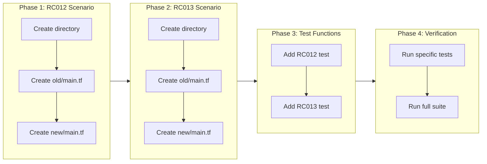

# Integration Test Scenarios for Validation Rules

## Change Summary

Add integration test scenarios for RC012 (validation-added) and RC013 (validation-value-removed) rules to ensure end-to-end validation of the Phase 5 validation rules implementation. This completes the testing requirements specified in CR-0009.

## Motivation and Background

CR-0009 implemented two new validation rules:
- **RC012 (validation-added)**: Detects when validation blocks are added to variables
- **RC013 (validation-value-removed)**: Detects when values are removed from `contains()` validation patterns

While unit tests cover the rule logic in isolation, integration tests verify that:
1. The loader correctly extracts validation blocks from real Terraform files
2. The rules engine correctly evaluates the extracted data
3. The entire pipeline works end-to-end with actual file system operations

The existing test infrastructure in `internal/integration_test.go` uses scenario directories under `testdata/scenarios/` with `old/` and `new/` subdirectories containing Terraform configurations.

## Change Drivers

* **Test coverage completeness**: CR-0009 specifies integration test scenarios as a requirement
* **End-to-end validation**: Unit tests don't verify HCL parsing and file system integration
* **Consistency**: All other rules have corresponding integration test scenarios
* **Regression prevention**: Integration tests catch issues that unit tests might miss

## Current State

### Existing Integration Test Scenarios

| Scenario | Rule | Description |
|----------|------|-------------|
| bc001_required_input_added | BC001 | Required variable added |
| bc002_input_removed | BC002 | Variable removed |
| bc004_type_changed | BC004 | Variable type changed |
| bc004_any_to_specific | BC004 | Type change from any (no finding) |
| bc005_default_removed | BC005 | Default value removed |
| bc009_output_removed | BC009 | Output removed |
| bc100_resource_removed | BC100 | Resource removed without moved |
| bc100_resource_moved | BC100 | Resource with moved block (no finding) |
| bc101_module_removed | BC101 | Module removed without moved |
| bc103_nonexistent_target | BC103 | Moved block with invalid target |
| bc200_version_added | BC200 | Terraform version constraint added |
| bc201_provider_removed | BC201 | Provider requirement removed |
| rc006_default_changed | RC006 | Default value changed |
| rc007_nullable_changed | RC007 | Nullable attribute changed |
| rc008_sensitive_changed | RC008 | Variable sensitive changed |
| rc011_output_sensitive_changed | RC011 | Output sensitive changed |
| no_changes | - | No changes (PASS result) |

### Missing Scenarios

| Scenario | Rule | Status |
|----------|------|--------|
| rc012_validation_added | RC012 | ❌ Not implemented |
| rc013_validation_value_removed | RC013 | ❌ Not implemented |

## Proposed Change

Add two new integration test scenarios and corresponding test functions:

### Scenario: rc012_validation_added

Tests that RC012 fires when a validation block is added to an existing variable.

**old/main.tf:**
```hcl
variable "environment" {
  type        = string
  description = "Deployment environment"
}
```

**new/main.tf:**
```hcl
variable "environment" {
  type        = string
  description = "Deployment environment"

  validation {
    condition     = contains(["dev", "staging", "prod"], var.environment)
    error_message = "Environment must be dev, staging, or prod."
  }
}
```

### Scenario: rc013_validation_value_removed

Tests that RC013 fires when values are removed from a `contains()` validation pattern.

**old/main.tf:**
```hcl
variable "environment" {
  type        = string
  description = "Deployment environment"

  validation {
    condition     = contains(["dev", "staging", "prod"], var.environment)
    error_message = "Environment must be dev, staging, or prod."
  }
}
```

**new/main.tf:**
```hcl
variable "environment" {
  type        = string
  description = "Deployment environment"

  validation {
    condition     = contains(["dev", "staging"], var.environment)
    error_message = "Environment must be dev or staging."
  }
}
```

## Requirements

### Functional Requirements

1. The rc012_validation_added scenario **MUST** contain old/main.tf with a variable without validation
2. The rc012_validation_added scenario **MUST** contain new/main.tf with the same variable with validation added
3. The rc013_validation_value_removed scenario **MUST** contain old/main.tf with a variable with contains() validation
4. The rc013_validation_value_removed scenario **MUST** contain new/main.tf with the same variable with values removed from contains()
5. The integration test for RC012 **MUST** verify that exactly one RC012 finding is produced
6. The integration test for RC013 **MUST** verify that exactly one RC013 finding is produced
7. Both tests **MUST** verify no unexpected findings are produced
8. Both tests **MUST** verify the overall result is not FAIL (RC rules are RISKY, not BREAKING)

### Non-Functional Requirements

1. Test scenarios **MUST** follow existing naming convention: `{rule_id}_{description}`
2. Test scenarios **MUST** use the existing directory structure: `old/main.tf` and `new/main.tf`
3. Test functions **MUST** follow existing naming convention: `TestScenario_{RuleID}_{Description}`

## Affected Components

* `testdata/scenarios/rc012_validation_added/old/main.tf` - New file
* `testdata/scenarios/rc012_validation_added/new/main.tf` - New file
* `testdata/scenarios/rc013_validation_value_removed/old/main.tf` - New file
* `testdata/scenarios/rc013_validation_value_removed/new/main.tf` - New file
* `internal/integration_test.go` - Add two new test functions

## Scope Boundaries

### In Scope

* Integration test scenario for RC012 (validation-added)
* Integration test scenario for RC013 (validation-value-removed)
* Test functions in integration_test.go
* Verification that tests pass

### Out of Scope

* Unit tests (already completed in CR-0009)
* Additional edge case scenarios (can be added in future CRs)
* Performance testing
* Annotation suppression testing in integration tests

## Implementation Approach

### Phase 1: Create RC012 Scenario

1. Create directory `testdata/scenarios/rc012_validation_added/`
2. Create `old/main.tf` with variable without validation
3. Create `new/main.tf` with same variable with validation added

### Phase 2: Create RC013 Scenario

1. Create directory `testdata/scenarios/rc013_validation_value_removed/`
2. Create `old/main.tf` with variable with contains() validation
3. Create `new/main.tf` with same variable with value removed from contains()

### Phase 3: Add Test Functions

1. Add `TestScenario_RC012_ValidationAdded` to integration_test.go
2. Add `TestScenario_RC013_ValidationValueRemoved` to integration_test.go

### Phase 4: Verification

1. Run `go test ./internal -v -run "RC012|RC013"`
2. Verify both tests pass
3. Run full test suite to ensure no regressions

### Implementation Flow



## Test Strategy

### Tests to Add

| Test File | Test Name | Description | Inputs | Expected Output |
|-----------|-----------|-------------|--------|-----------------|
| `internal/integration_test.go` | `TestScenario_RC012_ValidationAdded` | Verify RC012 fires when validation added | rc012_validation_added scenario | 1 RC012 finding |
| `internal/integration_test.go` | `TestScenario_RC013_ValidationValueRemoved` | Verify RC013 fires when contains value removed | rc013_validation_value_removed scenario | 1 RC013 finding |

### Tests to Modify

| Test File | Test Name | Current Behavior | New Behavior | Reason for Change |
|-----------|-----------|------------------|--------------|-------------------|
| N/A | N/A | N/A | N/A | No existing tests need modification |

### Tests to Remove

| Test File | Test Name | Reason for Removal |
|-----------|-----------|-------------------|
| N/A | N/A | No tests need removal |

## Acceptance Criteria

### AC-1: RC012 integration test passes

```gherkin
Given the rc012_validation_added scenario exists
  And old/main.tf contains a variable without validation
  And new/main.tf contains the same variable with validation added
When the integration test TestScenario_RC012_ValidationAdded runs
Then exactly one finding with RuleID "RC012" is produced
  And no other findings are produced
  And the test passes
```

### AC-2: RC013 integration test passes

```gherkin
Given the rc013_validation_value_removed scenario exists
  And old/main.tf contains a variable with contains(["dev", "staging", "prod"], var.x) validation
  And new/main.tf contains the same variable with contains(["dev", "staging"], var.x) validation
When the integration test TestScenario_RC013_ValidationValueRemoved runs
Then exactly one finding with RuleID "RC013" is produced
  And no other findings are produced
  And the test passes
```

### AC-3: All existing tests continue to pass

```gherkin
Given the new test scenarios and functions are added
When the full test suite is executed with "go test ./..."
Then all existing tests pass
  And no regressions are introduced
```

### AC-4: Scenario files are valid Terraform

```gherkin
Given the test scenario Terraform files
When terraform validate is run on each scenario
Then all files pass validation
```

## Quality Standards Compliance

### Build & Compilation

- [ ] Code compiles/builds without errors
- [ ] No new compiler warnings introduced

### Linting & Code Style

- [ ] All linter checks pass with zero warnings/errors
- [ ] Code follows project coding conventions and style guides
- [ ] Any linter exceptions are documented with justification

### Test Execution

- [ ] All existing tests pass after implementation
- [ ] All new tests pass
- [ ] Test coverage meets project requirements for changed code

### Documentation

- [ ] Inline code documentation updated where applicable
- [ ] API documentation updated for any API changes
- [ ] User-facing documentation updated if behavior changes

### Code Review

- [ ] Changes submitted via pull request
- [ ] PR title follows Conventional Commits format
- [ ] Code review completed and approved
- [ ] Changes squash-merged to maintain linear history

### Verification Commands

```bash
# Build verification
go build ./...

# Lint verification
go vet ./...

# Test execution (specific)
go test ./internal -v -run "RC012|RC013"

# Test execution (full)
go test ./...
```

## Risks and Mitigation

### Risk 1: HCL parsing differences between test and production

**Likelihood:** low
**Impact:** medium
**Mitigation:** Use simple, standard Terraform syntax in test scenarios that matches real-world usage

### Risk 2: Test flakiness due to file system timing

**Likelihood:** low
**Impact:** low
**Mitigation:** Tests use synchronous file operations; existing tests demonstrate this is not an issue

## Dependencies

* CR-0009 (Phase 5 Validation Rules) - Must be implemented first (completed)
* Existing integration test infrastructure in internal/integration_test.go

## Estimated Effort

* Phase 1 (RC012 scenario): 15 minutes
* Phase 2 (RC013 scenario): 15 minutes
* Phase 3 (Test functions): 10 minutes
* Phase 4 (Verification): 10 minutes
* **Total: ~1 hour**

## Decision Outcome

Chosen approach: "Follow existing integration test patterns" - using the established `testdata/scenarios/` directory structure and `runScenario()` test helper to maintain consistency with other rules.

## Related Items

* CR-0009: Phase 5 Validation Rules (parent CR)
* `internal/integration_test.go`: Existing integration test infrastructure
* `testdata/scenarios/`: Existing test scenario directories
