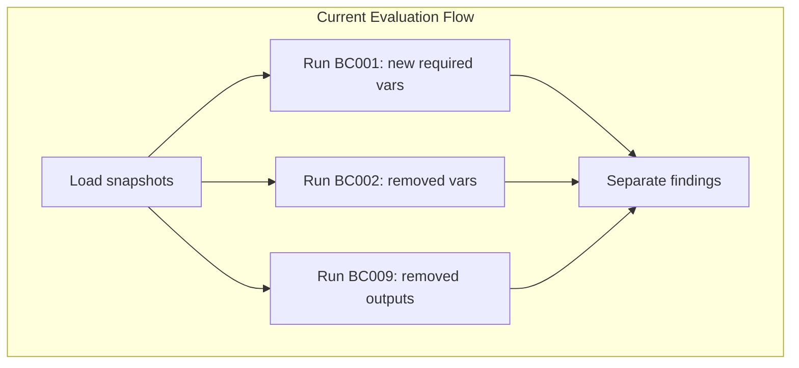
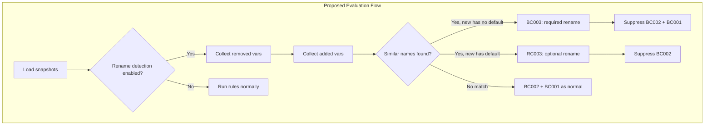
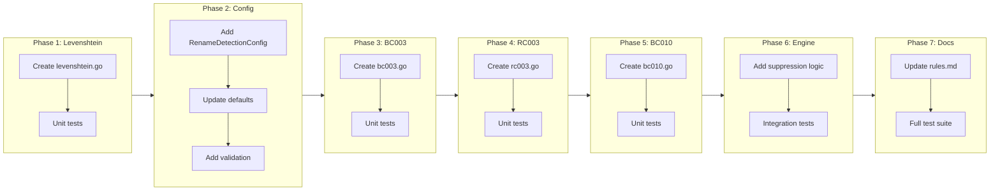

# Rename Heuristic Rules (BC003, RC003, BC010)

## Change Summary

Implement three rename detection rules using Levenshtein similarity:
- **BC003** (input-renamed): Detects required variable renames → BREAKING
- **RC003** (input-renamed-optional): Detects optional variable renames → RISKY
- **BC010** (output-renamed): Detects output renames → BREAKING

These rules are opt-in by default and replace separate removal/addition findings with a single more informative "renamed" finding when a rename is detected.

## Motivation and Background

When a developer renames a variable, the current tfbreak behavior produces separate findings that don't capture the semantic intent. The specific findings depend on whether the variable is required or optional:

**Renaming a required variable** (no default → no default):
```hcl
# Old
variable "instance_type" {
  type = string
}

# New
variable "vm_instance_type" {
  type = string
}
```
Current findings:
- BC002: Variable "instance_type" was removed
- BC001: New required variable "vm_instance_type" has no default

**Renaming an optional variable** (has default → has default):
```hcl
# Old
variable "instance_type" {
  type    = string
  default = "t3.micro"
}

# New
variable "vm_instance_type" {
  type    = string
  default = "t3.micro"
}
```
Current findings:
- BC002: Variable "instance_type" was removed
- (BC001 does NOT fire because the new variable has a default)

By detecting renames heuristically, tfbreak can provide clearer, more actionable feedback.

### Why Different Severities?

**Required variable rename → BREAKING**: We KNOW callers must be providing this variable (it's required by definition). A rename WILL break them—Terraform will error with "An argument named 'X' is not expected here" for the old name.

**Optional variable rename → RISKY**: We DON'T know if callers are actually passing this variable explicitly. If no caller is passing it (they rely on the default), the rename has no impact. If some callers are passing it explicitly, they will get an error. Since we can't determine actual usage statically, this is risky but not guaranteed to break.

This follows the same reasoning as RC006 (default-changed) being RISKY—we don't know if callers rely on the default or provide their own value.

**Output rename → BREAKING**: Outputs are typically referenced explicitly by callers. If you reference an output, you need its value. Unlike optional variables where callers might rely on defaults, output references are intentional.

## Change Drivers

* **User experience**: Separate removal/addition findings for a rename are confusing
* **Spec compliance**: BC003 and BC010 are specified in the original design document
* **Semantic accuracy**: A rename is one change, not two
* **Appropriate severity**: Required renames are certain to break; optional renames may or may not

## Current State

### Current Behavior

The rule engine evaluates BC001, BC002, and BC009 independently without considering whether changes might represent renames.

### Current State Diagram



## Proposed Change

Add three new opt-in rules that detect renames using Levenshtein string similarity:

### BC003 — input-renamed (BREAKING)

Detects when a required variable was likely renamed to another required variable.

**Condition:**
1. Variable V_old exists in old, not in new (would trigger BC002)
2. Variable V_new exists in new, not in old, AND has no default (would trigger BC001)
3. `similarity(V_old.name, V_new.name) >= threshold`

When BC003 fires, it suppresses both BC002 for V_old and BC001 for V_new.

### RC003 — input-renamed-optional (RISKY)

Detects when an optional variable was likely renamed to another optional variable.

**Condition:**
1. Variable V_old exists in old, not in new (would trigger BC002)
2. Variable V_new exists in new, not in old, AND has a default (would NOT trigger BC001)
3. `similarity(V_old.name, V_new.name) >= threshold`

When RC003 fires, it suppresses BC002 for V_old.

### BC010 — output-renamed (BREAKING)

Detects when an output was likely renamed.

**Condition:**
1. Output O_old exists in old, not in new (would trigger BC009)
2. Output O_new exists in new, not in old
3. `similarity(O_old.name, O_new.name) >= threshold`

When BC010 fires, it suppresses BC009 for O_old.

### Similarity Algorithm

Use Levenshtein distance normalized to a 0.0-1.0 similarity score:

```
similarity = 1 - (levenshtein_distance(a, b) / max(len(a), len(b)))
```

Default threshold: 0.85 (configurable via `rename_detection.similarity_threshold`)

### Proposed State Diagram



## Requirements

### Functional Requirements

1. The system **MUST** implement rule BC003 (input-renamed) for required variable renames with BREAKING severity
2. The system **MUST** implement rule RC003 (input-renamed-optional) for optional variable renames with RISKY severity
3. The system **MUST** implement rule BC010 (output-renamed) for output renames with BREAKING severity
4. All three rules **MUST** be disabled by default (opt-in)
5. The system **MUST** use Levenshtein distance for string similarity calculation
6. The system **MUST** support a configurable similarity threshold with default 0.85
7. When BC003 detects a rename, the system **MUST** suppress BC001 and BC002 findings for the renamed pair
8. When RC003 detects a rename, the system **MUST** suppress BC002 findings for the renamed variable
9. When BC010 detects a rename, the system **MUST** suppress BC009 findings for the renamed output
10. BC003 **MUST** only match when the new variable has NO default (required)
11. RC003 **MUST** only match when the new variable HAS a default (optional)
12. The rename finding **MUST** include both the old and new names in the message
13. The rename finding **MUST** include the calculated similarity score in the detail field
14. The system **MUST** handle multiple candidates by selecting the highest similarity match
15. All three rules **MUST** share the same `rename_detection` configuration block

### Non-Functional Requirements

1. The similarity calculation **MUST** complete in O(n*m) time where n and m are string lengths
2. The rules **MUST** follow existing rule implementation patterns (Rule interface, init registration)
3. The rules **MUST** have comprehensive unit tests with at least 90% code coverage

## Affected Components

* `internal/rules/bc003.go` - New file for required input rename rule
* `internal/rules/rc003.go` - New file for optional input rename rule
* `internal/rules/bc010.go` - New file for output rename rule
* `internal/rules/levenshtein.go` - New file for similarity calculation
* `internal/rules/engine.go` - Modify to support rename detection and suppression
* `internal/config/config.go` - Add rename_detection configuration
* `internal/config/defaults.go` - Add default rename_detection settings
* `internal/config/validate.go` - Add rule name mappings for BC003, RC003, BC010
* `docs/rules.md` - Document all three rules
* `testdata/scenarios/bc003_input_renamed/` - Integration test scenario
* `testdata/scenarios/rc003_input_renamed_optional/` - Integration test scenario
* `testdata/scenarios/bc010_output_renamed/` - Integration test scenario

## Scope Boundaries

### In Scope

* BC003 (input-renamed) rule implementation - BREAKING
* RC003 (input-renamed-optional) rule implementation - RISKY
* BC010 (output-renamed) rule implementation - BREAKING
* Levenshtein similarity calculation
* Configuration for rename detection (enabled, threshold)
* Suppression logic for related BC001/BC002/BC009 findings
* Unit tests for all rules and similarity algorithm
* Integration test scenarios
* Documentation updates to docs/rules.md

### Out of Scope

* Type compatibility checking for renames (future enhancement)
* Fuzzy matching algorithms beyond Levenshtein (Jaro-Winkler, etc.)
* Rename detection for resources or modules
* Mixed cases (required → optional or optional → required renames)
* Annotations specifically for rename suppression

## Alternative Approaches Considered

* **Single rule with context-aware severity**: BC003 could produce BREAKING or RISKY findings based on whether the variable is required or optional. Rejected because it complicates configuration—if a user sets `BC003.severity = "RISKY"` in config, the meaning becomes ambiguous.

* **Jaro-Winkler distance**: Better for short strings with common prefixes, but Levenshtein is more intuitive and widely understood. Levenshtein is also what the spec calls for.

* **Always BREAKING for all renames**: Could treat optional renames as BREAKING too since they MAY break callers. Rejected because it doesn't reflect the uncertainty—we can't statically determine if callers are passing optional variables explicitly.

## Impact Assessment

### User Impact

* Users who enable rename detection will see cleaner, more intuitive findings
* Users can configure each rule independently (enable BC003 but not RC003, etc.)
* No impact on users who don't enable the feature (opt-in)

### Technical Impact

* Rule engine needs modification to support finding suppression
* Three new rules share common rename detection logic
* No breaking changes to existing behavior

### Business Impact

* Aligns implementation with original spec (BC003, BC010)
* Extends spec with RC003 for optional variable renames
* Low risk due to opt-in nature

## Implementation Approach

### Phase 1: Levenshtein Implementation

1. Create `internal/rules/levenshtein.go` with:
   - `LevenshteinDistance(a, b string) int` - raw edit distance
   - `Similarity(a, b string) float64` - normalized 0.0-1.0 score
2. Add unit tests

### Phase 2: Configuration Support

1. Add `RenameDetectionConfig` struct to config package
2. Add parsing support in config loader
3. Add defaults (enabled=false, threshold=0.85)
4. Add validation for threshold range (0.0-1.0)
5. Add rule name mappings to validate.go

### Phase 3: BC003 Implementation (Required Rename)

1. Create `internal/rules/bc003.go`
2. Detect removed variable + added required variable with similar names
3. Return BREAKING finding with old/new names and similarity score
4. Add comprehensive unit tests

### Phase 4: RC003 Implementation (Optional Rename)

1. Create `internal/rules/rc003.go`
2. Detect removed variable + added optional variable with similar names
3. Return RISKY finding with old/new names and similarity score
4. Add comprehensive unit tests

### Phase 5: BC010 Implementation (Output Rename)

1. Create `internal/rules/bc010.go`
2. Detect removed output + added output with similar names
3. Return BREAKING finding with old/new names and similarity score
4. Add comprehensive unit tests

### Phase 6: Engine Integration

1. Modify rule engine to check for rename detection config
2. Implement suppression logic:
   - BC003 suppresses BC001 + BC002 for matched pair
   - RC003 suppresses BC002 for matched variable
   - BC010 suppresses BC009 for matched output
3. Add tests for suppression behavior

### Phase 7: Integration Tests & Documentation

1. Create test scenarios for BC003, RC003, and BC010
2. Update docs/rules.md with new rule documentation
3. Run full test suite and verify

### Implementation Flow



## Test Strategy

### Tests to Add

| Test File | Test Name | Description | Inputs | Expected Output |
|-----------|-----------|-------------|--------|-----------------|
| `internal/rules/levenshtein_test.go` | `TestLevenshteinDistance` | Verify edit distance calculation | Various string pairs | Correct distances |
| `internal/rules/levenshtein_test.go` | `TestSimilarity` | Verify similarity normalization | Various string pairs | 0.0-1.0 scores |
| `internal/rules/levenshtein_test.go` | `TestSimilarity_EdgeCases` | Empty strings, identical strings | Edge cases | Correct handling |
| `internal/rules/bc003_test.go` | `TestBC003_RequiredRenameDetected` | Required rename detected | Similar required vars | BC003 BREAKING |
| `internal/rules/bc003_test.go` | `TestBC003_OptionalNewVar_NoMatch` | New var has default | Similar but optional new | No BC003 finding |
| `internal/rules/bc003_test.go` | `TestBC003_BelowThreshold` | Similarity below threshold | Dissimilar names | No BC003 finding |
| `internal/rules/bc003_test.go` | `TestBC003_Disabled` | Rule disabled | Config disabled | No findings |
| `internal/rules/rc003_test.go` | `TestRC003_OptionalRenameDetected` | Optional rename detected | Similar optional vars | RC003 RISKY |
| `internal/rules/rc003_test.go` | `TestRC003_RequiredNewVar_NoMatch` | New var lacks default | Similar but required new | No RC003 finding |
| `internal/rules/rc003_test.go` | `TestRC003_BelowThreshold` | Similarity below threshold | Dissimilar names | No RC003 finding |
| `internal/rules/bc010_test.go` | `TestBC010_OutputRenameDetected` | Output rename detected | Similar outputs | BC010 BREAKING |
| `internal/rules/bc010_test.go` | `TestBC010_BelowThreshold` | Similarity below threshold | Dissimilar outputs | No BC010 finding |
| `internal/rules/engine_test.go` | `TestEngine_BC003_SuppressesBC001_BC002` | Suppression works | Required rename | Only BC003 |
| `internal/rules/engine_test.go` | `TestEngine_RC003_SuppressesBC002` | Suppression works | Optional rename | Only RC003 |
| `internal/rules/engine_test.go` | `TestEngine_BC010_SuppressesBC009` | Suppression works | Output rename | Only BC010 |
| `internal/integration_test.go` | `TestScenario_BC003_InputRenamed` | End-to-end required | Scenario files | BC003 finding |
| `internal/integration_test.go` | `TestScenario_RC003_InputRenamedOptional` | End-to-end optional | Scenario files | RC003 finding |
| `internal/integration_test.go` | `TestScenario_BC010_OutputRenamed` | End-to-end output | Scenario files | BC010 finding |

### Tests to Modify

| Test File | Test Name | Current Behavior | New Behavior | Reason for Change |
|-----------|-----------|------------------|--------------|-------------------|
| N/A | N/A | N/A | N/A | No existing tests need modification |

### Tests to Remove

| Test File | Test Name | Reason for Removal |
|-----------|-----------|-------------------|
| N/A | N/A | No tests need removal |

## Acceptance Criteria

### AC-1: Levenshtein similarity calculation works correctly

```gherkin
Given the strings "foo" and "foo_v2"
When the similarity function is called
Then the result is 0.5 (3 matching chars, 6 max length)
  And the result is between 0.0 and 1.0
```

### AC-2: BC003 detects required variable rename

```gherkin
Given rename detection is enabled with threshold 0.85
  And old snapshot has required variable "api_key" (no default)
  And new snapshot has required variable "api_key_v2" (no default)
  And similarity("api_key", "api_key_v2") >= 0.85
When the rules engine evaluates the snapshots
Then exactly one BC003 finding is produced with BREAKING severity
  And the finding message contains both "api_key" and "api_key_v2"
  And no BC001 or BC002 findings are produced for these variables
```

### AC-3: BC003 does not match when new variable has default

```gherkin
Given rename detection is enabled with threshold 0.85
  And old snapshot has required variable "api_key" (no default)
  And new snapshot has optional variable "api_key_v2" (has default)
When the rules engine evaluates the snapshots
Then no BC003 finding is produced
  And BC002 is produced for "api_key"
```

### AC-4: RC003 detects optional variable rename

```gherkin
Given rename detection is enabled with threshold 0.85
  And old snapshot has optional variable "timeout" (has default)
  And new snapshot has optional variable "timeout_seconds" (has default)
  And similarity("timeout", "timeout_seconds") >= 0.85
When the rules engine evaluates the snapshots
Then exactly one RC003 finding is produced with RISKY severity
  And the finding message contains both "timeout" and "timeout_seconds"
  And no BC002 finding is produced for "timeout"
```

### AC-5: RC003 does not match when new variable lacks default

```gherkin
Given rename detection is enabled with threshold 0.85
  And old snapshot has optional variable "timeout" (has default)
  And new snapshot has required variable "timeout_seconds" (no default)
When the rules engine evaluates the snapshots
Then no RC003 finding is produced
  And BC002 is produced for "timeout"
  And BC001 is produced for "timeout_seconds"
```

### AC-6: BC010 detects output rename

```gherkin
Given rename detection is enabled with threshold 0.85
  And old snapshot has output "vpc_id"
  And new snapshot has output "main_vpc_id"
  And similarity("vpc_id", "main_vpc_id") >= 0.85
When the rules engine evaluates the snapshots
Then exactly one BC010 finding is produced with BREAKING severity
  And the finding message contains both "vpc_id" and "main_vpc_id"
  And no BC009 finding is produced for "vpc_id"
```

### AC-7: Rules do not fire when disabled (default)

```gherkin
Given rename detection is disabled (default configuration)
  And old snapshot has variable "foo"
  And new snapshot has variable "foo_v2" without default
When the rules engine evaluates the snapshots
Then no BC003 or RC003 findings are produced
  And BC002 is produced for "foo"
  And BC001 is produced for "foo_v2"
```

### AC-8: Configuration works correctly

```gherkin
Given a .tfbreak.hcl file with:
  """
  rules {
    rename_detection {
      enabled              = true
      similarity_threshold = 0.90
    }
  }
  """
When the configuration is loaded
Then rename detection is enabled for BC003, RC003, and BC010
  And the similarity threshold is 0.90
```

### AC-9: Best match wins when multiple candidates exist

```gherkin
Given rename detection is enabled with threshold 0.70
  And old snapshot has variable "api_key"
  And new snapshot has required variables "api_key_v2" and "secret_key"
  And similarity("api_key", "api_key_v2") > similarity("api_key", "secret_key")
When the rules engine evaluates the snapshots
Then BC003 finding pairs "api_key" with "api_key_v2"
  And BC001 is still produced for "secret_key"
```

### AC-10: Integration tests pass

```gherkin
Given the test scenarios exist:
  - bc003_input_renamed (required rename)
  - rc003_input_renamed_optional (optional rename)
  - bc010_output_renamed (output rename)
When the integration test suite runs
Then all three scenario tests pass
```

## Quality Standards Compliance

### Build & Compilation

- [ ] Code compiles/builds without errors
- [ ] No new compiler warnings introduced

### Linting & Code Style

- [ ] All linter checks pass with zero warnings/errors
- [ ] Code follows project coding conventions and style guides
- [ ] Any linter exceptions are documented with justification

### Test Execution

- [ ] All existing tests pass after implementation
- [ ] All new tests pass
- [ ] Test coverage meets project requirements for changed code

### Documentation

- [ ] Inline code documentation updated where applicable
- [ ] API documentation updated for any API changes
- [ ] User-facing documentation updated if behavior changes

### Code Review

- [ ] Changes submitted via pull request
- [ ] PR title follows Conventional Commits format
- [ ] Code review completed and approved
- [ ] Changes squash-merged to maintain linear history

### Verification Commands

```bash
# Build verification
go build ./...

# Lint verification
go vet ./...

# Test execution (specific)
go test ./internal/rules -v -run "BC003|RC003|BC010|Levenshtein"

# Test execution (full)
go test ./...

# Coverage check
go test ./internal/rules -coverprofile=coverage.out
go tool cover -func=coverage.out | grep -E "bc003|rc003|bc010|levenshtein"
```

## Risks and Mitigation

### Risk 1: False positives for unrelated variables with similar names

**Likelihood:** medium
**Impact:** low
**Mitigation:** High default threshold (0.85) and opt-in behavior. Users can tune threshold or disable specific rules if needed.

### Risk 2: Performance impact for modules with many variables

**Likelihood:** low
**Impact:** low
**Mitigation:** Levenshtein is O(n*m) per comparison. For typical modules (<100 vars), this is negligible.

### Risk 3: Ambiguous matches when multiple candidates have same similarity

**Likelihood:** low
**Impact:** low
**Mitigation:** Use first match found (deterministic ordering). Could enhance to use secondary criteria (type match) in future.

## Dependencies

* No external dependencies required for Levenshtein implementation
* Depends on existing rule engine infrastructure
* Depends on existing config loading infrastructure

## Estimated Effort

* Phase 1 (Levenshtein): 30 minutes
* Phase 2 (Configuration): 30 minutes
* Phase 3 (BC003): 45 minutes
* Phase 4 (RC003): 30 minutes
* Phase 5 (BC010): 30 minutes
* Phase 6 (Engine integration): 45 minutes
* Phase 7 (Integration tests & docs): 45 minutes
* **Total: ~4 hours**

## Decision Outcome

Chosen approach: "Separate rules for required vs optional renames", because:
1. Required renames (BC003) are BREAKING—we know callers must provide the variable
2. Optional renames (RC003) are RISKY—we can't statically determine if callers pass it explicitly
3. Separate rules allow independent configuration without ambiguity
4. Consistent with existing pattern of fixed severity per rule

## Related Items

* docs/spec/001_IDEA.md: Original specification (BC003, BC010)
* internal/rules/bc001.go: Required input added (suppressed by BC003)
* internal/rules/bc002.go: Input removed (suppressed by BC003, RC003)
* internal/rules/bc009.go: Output removed (suppressed by BC010)
* docs/rules.md: Rule documentation to update
