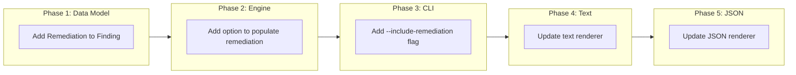

# Include Remediation Guidance in Check Output

## Change Summary

Add a `--include-remediation` flag to the `check` command that includes remediation guidance for each finding in the output. This helps users understand how to fix detected issues without consulting external documentation.

## Motivation and Background

Currently, when tfbreak reports a finding, users see:
- Rule ID and name
- Severity level
- A message describing the issue
- File locations

To understand how to fix the issue, users must consult the documentation (docs/rules.md) or run `tfbreak explain <rule>`. This creates friction in the development workflow.

Each rule already has remediation guidance defined in its `Documentation()` method. By exposing this in the check output, we can provide immediate, actionable feedback without requiring users to look elsewhere.

## Change Drivers

* **Developer experience**: Reduce context-switching between terminal and documentation
* **Self-documenting output**: Power users can get full context with a single command
* **Existing infrastructure**: Remediation text already exists in rule implementations
* **CI integration**: CI logs can include fix suggestions for reviewers

## Current State

### Current Text Output

```
tfbreak: comparing old/ -> new/

BREAKING  BC001  required-input-added
  new/variables.tf:15
  New required variable "cluster_name" has no default

Summary: 1 breaking, 0 risky, 0 info
Result: FAIL
```

### Current JSON Output

```json
{
  "findings": [
    {
      "rule_id": "BC001",
      "rule_name": "required-input-added",
      "severity": "BREAKING",
      "message": "New required variable \"cluster_name\" has no default",
      "new_location": { "filename": "new/variables.tf", "start_line": 15 }
    }
  ]
}
```

## Proposed Change

Add `--include-remediation` flag that includes remediation guidance in output.

### Proposed Text Output (with --include-remediation)

```
tfbreak: comparing old/ -> new/

BREAKING  BC001  required-input-added
  new/variables.tf:15
  New required variable "cluster_name" has no default

  Remediation:
    To fix this issue, either:
    1. Add a default value to make the variable optional:
       variable "cluster_name" {
         type    = string
         default = "my-cluster"
       }

    2. Or ensure all callers are updated to provide the new variable

    3. Or use an annotation to suppress if callers are updated in the same change:
       # tfbreak:ignore required-input-added # callers updated

Summary: 1 breaking, 0 risky, 0 info
Result: FAIL
```

### Proposed JSON Output (with --include-remediation)

```json
{
  "findings": [
    {
      "rule_id": "BC001",
      "rule_name": "required-input-added",
      "severity": "BREAKING",
      "message": "New required variable \"cluster_name\" has no default",
      "new_location": { "filename": "new/variables.tf", "start_line": 15 },
      "remediation": "To fix this issue, either:\n1. Add a default value..."
    }
  ]
}
```

## Requirements

### Functional Requirements

1. The system **MUST** add a `--include-remediation` flag to the `check` command
2. When the flag is set, the text renderer **MUST** include the remediation text after each finding
3. When the flag is set, the JSON renderer **MUST** include a `remediation` field in each finding
4. The remediation text **MUST** come from the rule's `Documentation().Remediation` field
5. The flag **MUST** default to false (remediation not included by default)
6. The remediation text **MUST** be properly indented in text output for readability
7. Rules without remediation text **MUST** not show a "Remediation:" section

### Non-Functional Requirements

1. The flag **MUST** be documented in `tfbreak check --help`
2. Adding remediation **MUST** not significantly impact output performance

## Affected Components

* `internal/cli/check.go` - Add --include-remediation flag
* `internal/output/text.go` - Include remediation in text output
* `internal/output/json.go` - Include remediation in JSON output
* `internal/types/finding.go` - Add Remediation field to Finding struct
* `internal/rules/engine.go` - Populate remediation field when requested

## Scope Boundaries

### In Scope

* `--include-remediation` flag for check command
* Text renderer remediation output
* JSON renderer remediation output
* Unit tests for new functionality

### Out of Scope

* Configuration file option for remediation (can be added later)
* SARIF output format (not yet implemented)
* Remediation as separate command (already have `tfbreak explain`)
* Colored/styled remediation text

## Implementation Approach

### Phase 1: Data Model Update

1. Add `Remediation` field to `Finding` struct
2. Update `NewFinding` or add a method to attach remediation

### Phase 2: Engine Update

1. Add `IncludeRemediation` option to engine or check method
2. When enabled, populate remediation from rule documentation

### Phase 3: CLI Update

1. Add `--include-remediation` flag to check command
2. Pass flag value to engine/renderer

### Phase 4: Text Renderer Update

1. Update text renderer to output remediation section
2. Proper indentation for readability
3. Blank line separation between findings

### Phase 5: JSON Renderer Update

1. Add `remediation` field to JSON output when present
2. Ensure proper JSON escaping of newlines

### Implementation Flow



## Test Strategy

### Tests to Add

| Test File | Test Name | Description | Inputs | Expected Output |
|-----------|-----------|-------------|--------|-----------------|
| `internal/output/text_test.go` | `TestTextRenderer_WithRemediation` | Remediation included | Finding with remediation | Output includes remediation section |
| `internal/output/text_test.go` | `TestTextRenderer_NoRemediation` | Default behavior | Finding without remediation | No remediation section |
| `internal/output/json_test.go` | `TestJSONRenderer_WithRemediation` | Remediation in JSON | Finding with remediation | JSON has remediation field |
| `internal/output/json_test.go` | `TestJSONRenderer_NoRemediation` | Default behavior | Finding without remediation | JSON has no remediation field |

### Tests to Modify

| Test File | Test Name | Current Behavior | New Behavior | Reason for Change |
|-----------|-----------|------------------|--------------|-------------------|
| N/A | N/A | N/A | N/A | No existing tests need modification |

### Tests to Remove

| Test File | Test Name | Reason for Removal |
|-----------|-----------|-------------------|
| N/A | N/A | No tests need removal |

## Acceptance Criteria

### AC-1: Flag exists and is documented

```gherkin
Given the tfbreak CLI
When I run "tfbreak check --help"
Then the output includes "--include-remediation" flag
  And the flag description explains its purpose
```

### AC-2: Text output includes remediation when flag is set

```gherkin
Given a scenario with BC001 finding
When I run "tfbreak check --include-remediation old/ new/"
Then the text output includes the finding
  And the output includes a "Remediation:" section
  And the remediation text is properly indented
```

### AC-3: Text output excludes remediation by default

```gherkin
Given a scenario with BC001 finding
When I run "tfbreak check old/ new/"
Then the text output includes the finding
  And the output does NOT include a "Remediation:" section
```

### AC-4: JSON output includes remediation when flag is set

```gherkin
Given a scenario with BC001 finding
When I run "tfbreak check --include-remediation --format json old/ new/"
Then the JSON output includes a finding object
  And the finding has a "remediation" field with remediation text
```

### AC-5: JSON output excludes remediation by default

```gherkin
Given a scenario with BC001 finding
When I run "tfbreak check --format json old/ new/"
Then the JSON output includes a finding object
  And the finding does NOT have a "remediation" field
```

## Quality Standards Compliance

### Build & Compilation

- [ ] Code compiles/builds without errors
- [ ] No new compiler warnings introduced

### Linting & Code Style

- [ ] All linter checks pass with zero warnings/errors
- [ ] Code follows project coding conventions and style guides
- [ ] Any linter exceptions are documented with justification

### Test Execution

- [ ] All existing tests pass after implementation
- [ ] All new tests pass
- [ ] Test coverage meets project requirements for changed code

### Documentation

- [ ] Inline code documentation updated where applicable
- [ ] API documentation updated for any API changes
- [ ] User-facing documentation updated if behavior changes

### Code Review

- [ ] Changes submitted via pull request
- [ ] PR title follows Conventional Commits format
- [ ] Code review completed and approved
- [ ] Changes squash-merged to maintain linear history

### Verification Commands

```bash
# Build verification
go build ./...

# Lint verification
go vet ./...

# Test execution
go test ./...

# Manual verification
tfbreak check --include-remediation testdata/scenarios/bc001_required_input_added/old testdata/scenarios/bc001_required_input_added/new
```

## Risks and Mitigation

### Risk 1: Output becomes too verbose

**Likelihood:** low
**Impact:** low
**Mitigation:** Flag is opt-in, default output remains unchanged. Users choose when to see remediation.

### Risk 2: Remediation text is missing for some rules

**Likelihood:** low
**Impact:** low
**Mitigation:** Rules without remediation simply don't show the section. All current rules have remediation defined.

## Dependencies

* Existing rule Documentation() infrastructure
* Text and JSON renderers

## Estimated Effort

* Phase 1 (Data model): 15 minutes
* Phase 2 (Engine): 20 minutes
* Phase 3 (CLI): 15 minutes
* Phase 4 (Text renderer): 30 minutes
* Phase 5 (JSON renderer): 15 minutes
* Testing: 30 minutes
* **Total: ~2 hours**

## Decision Outcome

Chosen approach: "CLI flag with optional remediation", because it keeps default output clean while giving users full context when needed. This balances brevity with helpfulness.

## Related Items

* `internal/rules/rule.go`: RuleDoc struct with Remediation field
* `docs/rules.md`: Existing remediation documentation
* `internal/cli/check.go`: Check command implementation
* `internal/output/text.go`: Text renderer
* `internal/output/json.go`: JSON renderer
