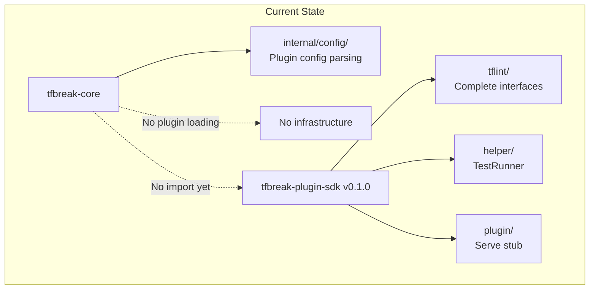
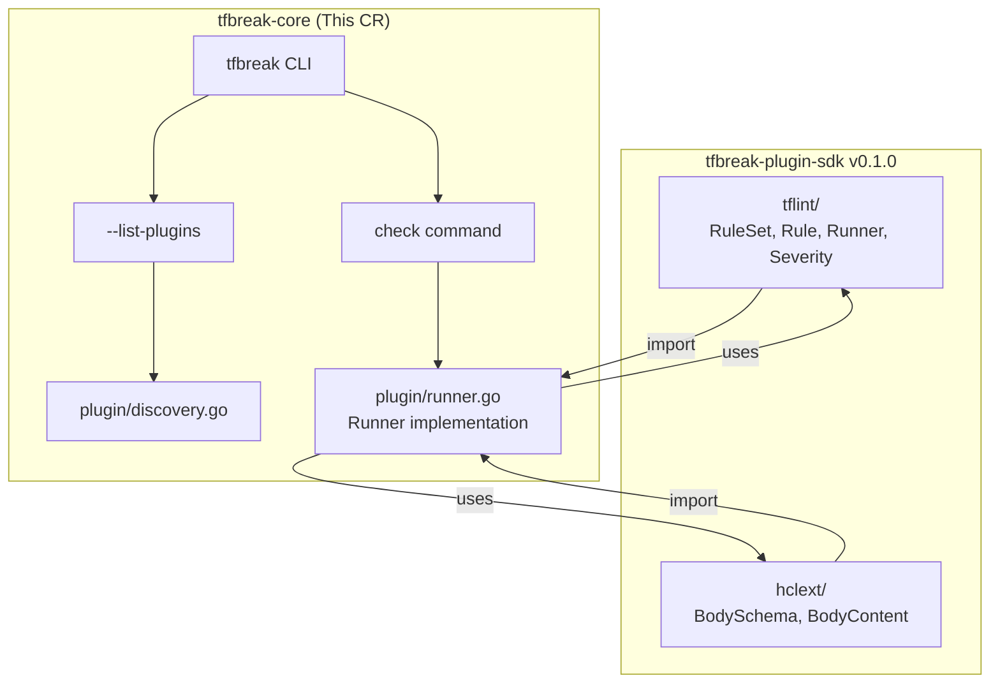
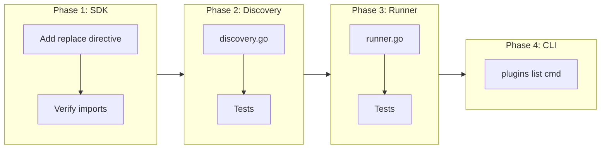

# Plugin Infrastructure with SDK Integration

## Change Summary

Implement plugin infrastructure in tfbreak-core that **imports interfaces from tfbreak-plugin-sdk** and prepares for plugin communication. This CR focuses on SDK integration, plugin discovery, and Runner implementation. Actual gRPC communication is deferred to a future CR (pending SDK gRPC implementation).

**IMPORTANT**: tfbreak-core does NOT define its own RuleSet, Rule, Runner, or Severity types. These are imported from `github.com/jokarl/tfbreak-plugin-sdk/tflint`. This ensures type compatibility between host and plugins.

## Motivation and Background

tfbreak-core provides provider-agnostic breaking change detection. Provider-specific concerns (ForceNew attributes, naming conventions, etc.) require plugins. ADR-0002 establishes that we should:

1. **Align with tflint** - Use the same patterns Terraform users are familiar with
2. **Separate Rule interface** - Each rule is a distinct object with Name, Severity, Check method
3. **Plugins decide** - Let plugins determine what constitutes a breaking change

**Key architectural insight from tflint**: Both tflint (host) and tflint-ruleset-* (plugins) import from tflint-plugin-sdk. The SDK is the **single source of truth** for interface definitions. This ensures type compatibility across the gRPC boundary.

## Change Drivers

* ADR-0002 mandates tflint-aligned go-plugin/gRPC architecture
* Plugins need access to BOTH old and new configs (unlike tflint which sees one config)
* **tflint-core imports from tflint-plugin-sdk** - we must follow this pattern
* Interface types MUST come from SDK to ensure host/plugin compatibility

## Current State

tfbreak-core has:
- Plugin configuration support in `.tfbreak.hcl` (ConfigBlock, PluginConfig types)
- No plugin discovery, loading, or communication infrastructure
- No dependency on tfbreak-plugin-sdk

**tfbreak-plugin-sdk v0.1.0 is now COMPLETE** with the following packages:
- `tflint/`: Severity, DefaultRule, Rule, Runner, RuleSet, BuiltinRuleSet, Config
- `hclext/`: BodySchema, BodyContent, Attribute, Block, conversion functions
- `helper/`: TestRunner, Issue, AssertIssues (for plugin testing)
- `plugin/`: Serve, ServeOpts (**stub implementation** - gRPC deferred)

### Current State Diagram



## Proposed Change

Implement plugin infrastructure in tfbreak-core that:

1. **Imports all plugin types from tfbreak-plugin-sdk** - No local interface definitions
2. **Discovers plugins** from standard paths (tflint-aligned)
3. **Implements Runner** to provide old/new config access to plugins
4. **Provides `--list-plugins`** command for discoverability

**Deferred to future CR** (pending SDK gRPC implementation):
- Actual plugin loading with hashicorp/go-plugin
- gRPC communication between host and plugins
- Issue aggregation from plugin execution

### Proposed Architecture (This CR)



## Requirements

### Functional Requirements

#### SDK Integration
1. The system **MUST** add `github.com/jokarl/tfbreak-plugin-sdk` to go.mod (via replace directive for local dev)
2. The system **MUST** import `github.com/jokarl/tfbreak-plugin-sdk/tflint` for all plugin interfaces
3. The system **MUST** import `github.com/jokarl/tfbreak-plugin-sdk/hclext` for schema types
4. The system **MUST NOT** define its own RuleSet, Rule, Runner, or Severity types

#### Runner Implementation
5. The system **MUST** implement `tflint.Runner` interface from the SDK
6. The implementation **MUST** provide `GetOldModuleContent()` and `GetNewModuleContent()` methods
7. The implementation **MUST** provide `GetOldResourceContent()` and `GetNewResourceContent()` methods
8. The implementation **MUST** provide `EmitIssue(rule, message, range)` for plugins to report findings
9. The implementation **MUST** provide `DecodeRuleConfig()` for rule-specific configuration

#### Plugin Discovery (tflint-aligned)
10. The system **MUST** discover plugins from `~/.tfbreak.d/plugins/`
11. The system **MUST** discover plugins from `./.tfbreak.d/plugins/`
12. The system **MUST** support `TFBREAK_PLUGIN_DIR` environment variable
13. The system **MUST** support `plugin_dir` attribute in .tfbreak.hcl
14. The system **MUST** use naming convention `tfbreak-ruleset-{name}`

#### List Plugins Command
15. The system **MUST** support `tfbreak plugins list` (or `--list-plugins`) command
16. The command **MUST** show discovered plugin paths and names
17. The command **MUST** indicate if plugins are enabled via config

### Non-Functional Requirements

1. The package **MUST** compile with `go build ./...`
2. All tests **MUST** pass with `go test -race ./...`

### Deferred Requirements (Future CR)

The following are OUT OF SCOPE for this CR:
- Plugin loading with hashicorp/go-plugin
- gRPC communication
- Plugin handshake and version validation
- Timeout handling for plugin operations
- Issue aggregation from plugin execution
- Plugin crash isolation

## Affected Components

* New: `plugin/discovery.go` - Plugin discovery from paths
* New: `plugin/discovery_test.go` - Tests for discovery
* New: `plugin/runner.go` - Runner implementation (implements tflint.Runner)
* New: `plugin/runner_test.go` - Tests for runner
* New: `internal/cli/plugins.go` - `tfbreak plugins` subcommand
* Modified: `go.mod` - Add SDK dependency (replace directive)

**NOT CREATED** (imported from SDK instead):
* ~~`plugin/tflint/interface.go`~~ - Use SDK
* ~~`plugin/tflint/rule.go`~~ - Use SDK
* ~~`plugin/tflint/severity.go`~~ - Use SDK

**DEFERRED** (to future gRPC CR):
* `plugin/loader.go` - Plugin loading with go-plugin
* `plugin/host2plugin/client.go` - gRPC client
* `plugin/manager.go` - Plugin lifecycle management

## Scope Boundaries

### In Scope

* SDK dependency via replace directive
* Import plugin types from tfbreak-plugin-sdk
* Plugin discovery from standard paths
* Runner implementation (old/new config access)
* `tfbreak plugins list` command
* Unit tests for discovery and runner

### Out of Scope ("Here, But Not Further")

* ~~Local interface definitions~~ - Use SDK
* gRPC communication - Deferred (SDK Serve is stub)
* Plugin loading with go-plugin - Deferred
* Issue aggregation from plugins - Deferred
* Plugin installation command - Future CR
* Plugin registry integration - Future CR
* Expression evaluation (`EvaluateExpr`) - Future CR

## Implementation Approach

### Phase 1: SDK Dependency

1. Add `replace github.com/jokarl/tfbreak-plugin-sdk => ./tfbreak-plugin-sdk` to go.mod
2. Verify imports work with `go build ./...`

### Phase 2: Plugin Discovery

1. Create `plugin/discovery.go` with:
   - `Discover(config *config.Config) ([]PluginInfo, error)`
   - Search priority: config > env > local > home
   - Binary naming convention: `tfbreak-ruleset-{name}`
2. Create `PluginInfo` struct with Name, Path, Enabled fields

### Phase 3: Runner Implementation

1. Create `plugin/runner.go` implementing `tflint.Runner`
2. Store old/new parsed HCL files
3. Implement all Get* methods using hclext conversions
4. Implement EmitIssue to collect issues
5. Implement DecodeRuleConfig (stub for now)

### Phase 4: CLI Integration

1. Create `tfbreak plugins list` command
2. Display discovered plugins with status

### Implementation Flow



## Test Strategy

### Tests to Add

| Test File | Test Name | Description | Inputs | Expected Output |
|-----------|-----------|-------------|--------|-----------------|
| `plugin/discovery_test.go` | `TestDiscovery_ConfigPath` | Discover from plugin_dir config | Config + mock dir | Plugin found |
| `plugin/discovery_test.go` | `TestDiscovery_EnvVar` | Discover from TFBREAK_PLUGIN_DIR | Env + mock dir | Plugin found |
| `plugin/discovery_test.go` | `TestDiscovery_LocalPath` | Discover from ./.tfbreak.d/plugins | Local dir | Plugin found |
| `plugin/discovery_test.go` | `TestDiscovery_HomePath` | Discover from ~/.tfbreak.d/plugins | Home dir | Plugin found |
| `plugin/discovery_test.go` | `TestDiscovery_Priority` | Config > env > local > home | All paths | Correct priority |
| `plugin/discovery_test.go` | `TestDiscovery_NamingConvention` | Only tfbreak-ruleset-* | Mixed names | Only matching |
| `plugin/runner_test.go` | `TestRunner_GetOldResourceContent` | Return old config content | Schema + files | Content returned |
| `plugin/runner_test.go` | `TestRunner_GetNewResourceContent` | Return new config content | Schema + files | Content returned |
| `plugin/runner_test.go` | `TestRunner_EmitIssue` | Collect emitted issues | Rule + message | Issue recorded |
| `plugin/runner_test.go` | `TestRunner_ImplementsInterface` | Verify interface satisfaction | Runner | Compiles |

### Tests to Modify

None - this is new infrastructure.

### Tests to Remove

None.

## Acceptance Criteria

### AC-1: SDK types imported (not defined locally)

```gherkin
Given tfbreak-core go.mod
When inspecting imports in plugin/ package
Then all RuleSet, Rule, Runner, Severity types come from github.com/jokarl/tfbreak-plugin-sdk/tflint
  And no local definitions exist
```

### AC-2: Plugin discovery from standard paths

```gherkin
Given a plugin binary at ~/.tfbreak.d/plugins/tfbreak-ruleset-azurerm
When I run "tfbreak plugins list"
Then the output includes "azurerm" with its path
```

### AC-3: Runner implements tflint.Runner

```gherkin
Given the plugin/runner.go file
When compiled
Then Runner satisfies tflint.Runner interface
  And GetOld*/GetNew* methods return parsed HCL content
```

### AC-4: Runner collects issues

```gherkin
Given a Runner instance
When EmitIssue is called with rule, message, range
Then the issue is stored in Runner.Issues
```

### AC-5: Discovery respects priority

```gherkin
Given plugins in both config path and home path
When Discover() is called
Then config path plugins take precedence
```

## Quality Standards Compliance

### Verification Commands

```bash
# Build
go build ./...

# Verify SDK import (should find imports from SDK)
grep -r "tfbreak-plugin-sdk/tflint" plugin/

# Verify no local interface definitions
test ! -f plugin/tflint/interface.go

# Lint
go vet ./...

# Test
go test -race -v ./plugin/...
```

## Risks and Mitigation

### Risk 1: SDK API changes before gRPC implementation

**Likelihood:** Low
**Impact:** Medium
**Mitigation:** Pin SDK version; coordinate releases between repos

### Risk 2: Runner implementation differs from future gRPC needs

**Likelihood:** Medium
**Impact:** Low
**Mitigation:** Runner design follows SDK helper.Runner pattern; refactor if needed

## Dependencies

* **SATISFIED**: tfbreak-plugin-sdk v0.1.0 (CRs 0002-0007 complete)
* Local development: replace directive in go.mod

## Estimated Effort

* Phase 1 (SDK Dependency): 15 minutes
* Phase 2 (Discovery): 1.5 hours
* Phase 3 (Runner): 2 hours
* Phase 4 (CLI): 30 minutes
* Testing: 1.5 hours
* **Total: ~6 hours**

## Decision Outcome

Chosen approach: "Import from SDK, implement discovery and runner", because:
1. SDK is now complete and ready for use
2. Incremental approach - don't block on gRPC
3. Runner implementation validates SDK interface design
4. Discovery enables `tfbreak plugins list` immediately

## Related Items

* ADR-0002: Plugin Architecture (tfbreak-core)
* **Dependency**: tfbreak-plugin-sdk v0.1.0 (COMPLETE)
* Consumer: tfbreak-ruleset-azurerm CR-0002 (SDK migration)
* Future CR: gRPC communication (pending SDK plugin.Serve implementation)

## More Information

### Import Structure

```go
// plugin/runner.go
package plugin

import (
    "github.com/hashicorp/hcl/v2"
    "github.com/jokarl/tfbreak-plugin-sdk/hclext"
    "github.com/jokarl/tfbreak-plugin-sdk/tflint"
)

// Runner implements tflint.Runner for providing config access.
type Runner struct {
    oldFiles map[string]*hcl.File
    newFiles map[string]*hcl.File
    Issues   []Issue
}

// Ensure Runner implements the interface
var _ tflint.Runner = (*Runner)(nil)

func (r *Runner) GetOldResourceContent(resourceType string, schema *hclext.BodySchema, opts *tflint.GetModuleContentOption) (*hclext.BodyContent, error) {
    // Implementation using hclext conversion functions
}

func (r *Runner) EmitIssue(rule tflint.Rule, message string, issueRange hcl.Range) error {
    r.Issues = append(r.Issues, Issue{Rule: rule, Message: message, Range: issueRange})
    return nil
}
```

### Discovery Structure

```go
// plugin/discovery.go
package plugin

// PluginInfo contains metadata about a discovered plugin.
type PluginInfo struct {
    Name    string // e.g., "azurerm"
    Path    string // Full path to binary
    Enabled bool   // Whether enabled in config
}

// Discover finds plugins from configured paths.
// Priority: config.PluginDir > TFBREAK_PLUGIN_DIR > ./.tfbreak.d/plugins > ~/.tfbreak.d/plugins
func Discover(cfg *config.Config) ([]PluginInfo, error) {
    // Implementation
}
```
