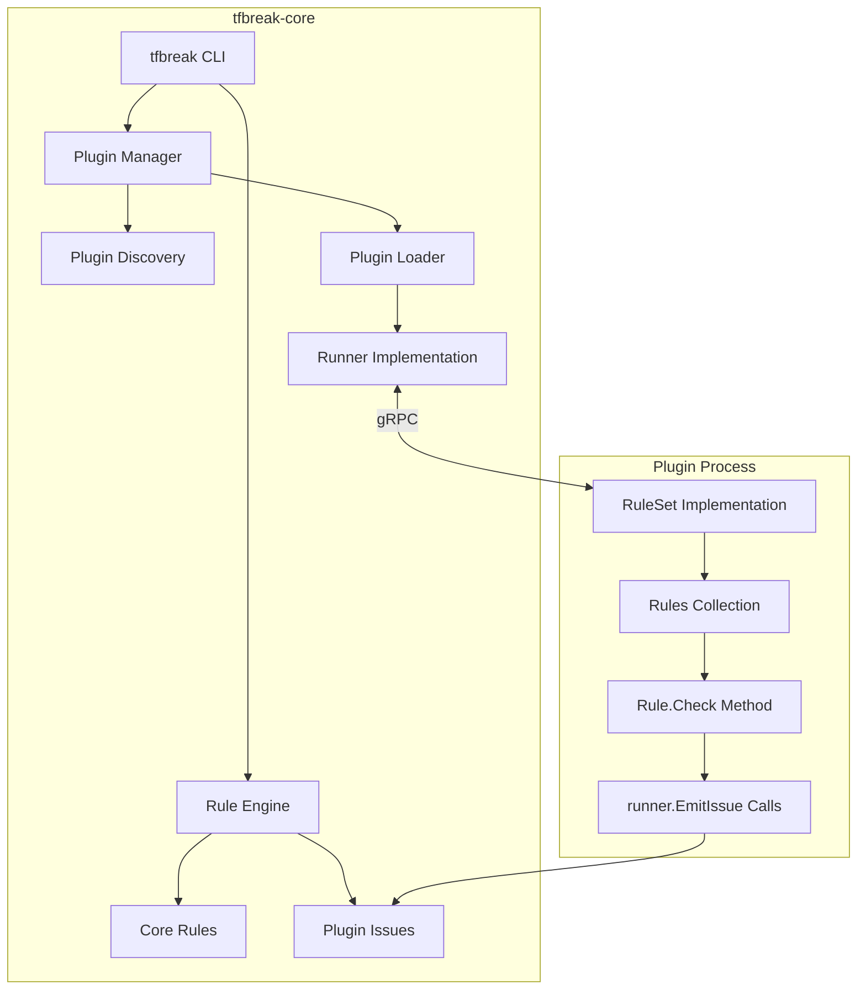
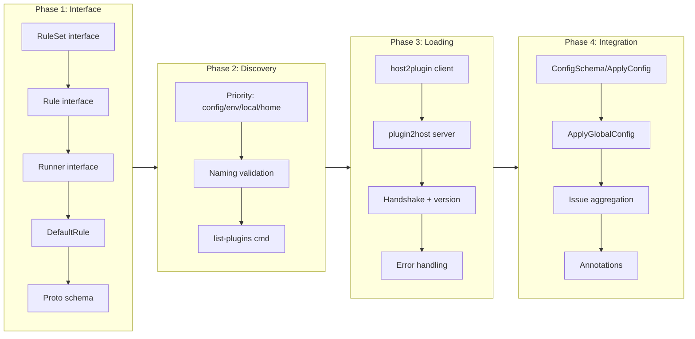

# Plugin Infrastructure with tflint-Aligned Interface

## Change Summary

Implement plugin infrastructure in tfbreak-core using a tflint-aligned interface. The core provides access to old/new Terraform configurations via a Runner interface, and plugins define Rules that report findings via EmitIssue. This follows the established Terraform ecosystem patterns from tflint-plugin-sdk.

## Motivation and Background

tfbreak-core provides provider-agnostic breaking change detection. Provider-specific concerns (ForceNew attributes, naming conventions, etc.) require plugins. ADR-0002 establishes that we should:

1. **Align with tflint** - Use the same patterns Terraform users are familiar with
2. **Separate Rule interface** - Each rule is a distinct object with Name, Severity, Check method
3. **Plugins decide** - Let plugins determine what constitutes a breaking change

The key insight from tflint: the host provides configuration access via Runner, plugins provide Rule implementations that perform detection logic.

## Change Drivers

* ADR-0002 mandates tflint-aligned go-plugin/gRPC architecture
* Plugins need access to BOTH old and new configs (unlike tflint which sees one config)
* Must align with tflint-plugin-sdk patterns: RuleSet, Rule, Runner interfaces
* Interface follows tflint conventions - plugins implement Rule.Check(runner) pattern

## Current State

tfbreak-core has no plugin infrastructure. All rules are compiled into the main binary.

## Proposed Change

Implement tflint-aligned plugin infrastructure:

1. **RuleSet interface** - Plugin container (name, version, rules list, config schema)
2. **Rule interface** - Individual rules (Name, Severity, Enabled, Link, Check method)
3. **Runner interface** - What tfbreak provides (old/new config access, EmitIssue)
4. **DefaultRule struct** - Base struct that rules embed (tflint pattern)

### Proposed Architecture



### Key Deviation from tflint

**tflint** operates on a single Terraform configuration. **tfbreak** compares TWO configurations (old and new) to detect breaking changes. This requires:

- Dual Runner methods: `GetOldModuleContent()` / `GetNewModuleContent()`
- Dual resource methods: `GetOldResourceContent()` / `GetNewResourceContent()`
- Dual file methods: `GetOldFiles()` / `GetNewFiles()`
- Issue struct with both `OldRange` and `NewRange` fields

This deviation is intentional and justified - it's the core differentiator of tfbreak.

## Requirements

### Functional Requirements

#### Runner Interface
1. The system **MUST** implement the Runner interface providing access to old and new configs
2. The system **MUST** support `GetOldModuleContent()` and `GetNewModuleContent()` methods
3. The system **MUST** support `GetOldResourceContent()` and `GetNewResourceContent()` methods
4. The system **MUST** support `GetOldFiles()` and `GetNewFiles()` methods
5. The system **MUST** support `GetOriginalwd()` method (tflint-aligned)
6. The system **MUST** support `GetModulePath()` method (tflint-aligned)
7. The system **MUST** support `EmitIssue(rule, message, range)` for plugins to report findings (tflint signature)
8. The system **MUST** support `DecodeRuleConfig()` for rule-specific configuration

#### RuleSet Interface
9. The system **MUST** support `RuleSetName()`, `RuleSetVersion()`, `RuleNames()` methods
10. The system **MUST** support `VersionConstraint()` for tfbreak compatibility checking
11. The system **MUST** support `ConfigSchema()` returning plugin's configuration schema
12. The system **MUST** support `ApplyGlobalConfig()` for global tfbreak settings
13. The system **MUST** support `ApplyConfig()` for plugin-specific configuration
14. The system **MUST** support `NewRunner()` for optional Runner customization

#### Rule Interface
15. The system **MUST** support Rule interface with `Name()`, `Enabled()`, `Severity()`, `Link()` methods
16. The system **MUST** support `Rule.Check(runner Runner)` as the rule execution entry point
17. The system **MUST** provide `DefaultRule` struct for rules to embed

#### Plugin Discovery (tflint-aligned)
18. The system **MUST** discover plugins from `~/.tfbreak.d/plugins/`
19. The system **MUST** discover plugins from `./.tfbreak.d/plugins/`
20. The system **MUST** support `TFBREAK_PLUGIN_DIR` environment variable
21. The system **MUST** support `plugin_dir` attribute in .tfbreak.hcl (tflint-aligned)
22. The system **MUST** use naming convention `tfbreak-ruleset-{name}`

#### Plugin Loading
23. The system **MUST** load plugins using hashicorp/go-plugin with gRPC
24. The system **MUST** perform handshake with MagicCookie validation
25. The system **MUST** check plugin version constraints before loading
26. The system **MUST** aggregate plugin issues with core rule findings
27. The system **MUST** support `--list-plugins` flag
28. The system **MUST** support plugin configuration via `plugin` blocks in .tfbreak.hcl
29. The system **MUST** handle plugin errors without crashing

### Non-Functional Requirements

1. Plugin startup **MUST** timeout after 5 seconds
2. Plugin check **MUST** timeout after 30 seconds
3. The system **MUST** gracefully handle plugin crashes
4. The system **MUST** log plugin lifecycle events at verbose level

## Affected Components

* New: `plugin/tflint/interface.go` - RuleSet, Rule, Runner interfaces (tflint-aligned)
* New: `plugin/tflint/rule.go` - DefaultRule struct for embedding
* New: `plugin/tflint/severity.go` - Severity enum (ERROR, WARNING, NOTICE)
* New: `plugin/proto/plugin.proto` - Protocol buffer definitions
* New: `plugin/discovery.go` - Plugin discovery from paths (tflint-aligned)
* New: `plugin/manager.go` - Plugin lifecycle management
* New: `plugin/host2plugin/client.go` - gRPC client (calls into plugin)
* New: `plugin/plugin2host/server.go` - gRPC server (Runner implementation)
* New: `plugin/serve.go` - SDK entry point for plugins
* Modified: `internal/config/config.go` - Plugin configuration parsing
* Modified: `internal/cli/check.go` - Integrate plugin issues
* Modified: `internal/cli/root.go` - Add --list-plugins flag

## Scope Boundaries

### In Scope

* tflint-aligned Runner interface (old/new config access, EmitIssue)
* tflint-aligned RuleSet interface (name, version, rules, config schema)
* tflint-aligned Rule interface (Name, Severity, Enabled, Link, Check)
* DefaultRule struct for embedding
* Plugin discovery from standard paths (tflint-aligned)
* Handshake and version checking
* Issue aggregation
* Plugin configuration via ConfigSchema/ApplyConfig
* --list-plugins command

### Out of Scope

* Plugin installation command (`tfbreak plugin install`) - future CR
* Plugin registry integration - future CR
* Expression evaluation (`EvaluateExpr`) - future CR (tflint has this)
* Autofix support (`EmitIssueWithFix`, `Fixer` interface) - future CR
* Plugin auto-update - future CR
* `WalkExpressions` traversal - future CR

## Implementation Approach

### Phase 1: Interface Definition (tflint-aligned)

1. Define RuleSet interface with all tflint methods
2. Define Rule interface with Name, Severity, Enabled, Link, Check
3. Define DefaultRule struct for embedding
4. Define Runner interface with old/new dual methods
5. Define Severity enum (ERROR, WARNING, NOTICE)
6. Create protobuf schema

### Phase 2: Plugin Discovery (tflint-aligned)

1. Implement discovery priority: config > env > local > home
2. Support `plugin_dir` in .tfbreak.hcl
3. Support `TFBREAK_PLUGIN_DIR` environment variable
4. Binary naming convention: `tfbreak-ruleset-{name}`
5. Implement --list-plugins

### Phase 3: Plugin Loading

1. Implement go-plugin client (host2plugin)
2. Implement Runner gRPC server (plugin2host)
3. Handshake with secure MagicCookieValue
4. Version constraint validation
5. Timeout and error handling

### Phase 4: Integration

1. Plugin configuration via ConfigSchema/ApplyConfig
2. Global config via ApplyGlobalConfig
3. Issue aggregation with core findings
4. Annotation handling for plugin rules

### Implementation Flow



## Test Strategy

### Tests to Add

| Test File | Test Name | Description | Inputs | Expected Output |
|-----------|-----------|-------------|--------|-----------------|
| `plugin/discovery_test.go` | `TestDiscovery_ConfigPath` | Discover from plugin_dir config | Config + mock dir | Plugin found |
| `plugin/discovery_test.go` | `TestDiscovery_EnvVar` | Discover from TFBREAK_PLUGIN_DIR | Env + mock dir | Plugin found |
| `plugin/discovery_test.go` | `TestDiscovery_ProjectPath` | Discover from .tfbreak.d/plugins | Mock dir | Plugin found |
| `plugin/discovery_test.go` | `TestDiscovery_HomePath` | Discover from ~/.tfbreak.d/plugins | Mock dir | Plugin found |
| `plugin/discovery_test.go` | `TestDiscovery_Priority` | Config > env > local > home | All paths | Correct priority |
| `plugin/discovery_test.go` | `TestDiscovery_NamingConvention` | Validate tfbreak-ruleset-{name} | Various names | Correct validation |
| `plugin/manager_test.go` | `TestManager_LoadPlugin` | Load plugin successfully | Mock plugin | Client connected |
| `plugin/manager_test.go` | `TestManager_Handshake` | Validate handshake | Wrong cookie | Error |
| `plugin/manager_test.go` | `TestManager_VersionConstraint` | Check version constraint | Incompatible | Error |
| `plugin/manager_test.go` | `TestManager_Timeout` | Handle slow plugin | Slow plugin | Timeout error |
| `plugin/manager_test.go` | `TestManager_Crash` | Handle plugin crash | Crashing plugin | Error, core continues |
| `plugin/plugin2host/server_test.go` | `TestRunner_GetOldModuleContent` | Return old config content | Schema request | Content returned |
| `plugin/plugin2host/server_test.go` | `TestRunner_GetNewModuleContent` | Return new config content | Schema request | Content returned |
| `plugin/plugin2host/server_test.go` | `TestRunner_GetOriginalwd` | Return working directory | None | Path returned |
| `plugin/plugin2host/server_test.go` | `TestRunner_EmitIssue` | Collect emitted issues | Rule + message + range | Issue recorded |
| `plugin/plugin2host/server_test.go` | `TestRunner_DecodeRuleConfig` | Decode rule config | Rule name + struct | Config decoded |
| `plugin/host2plugin/client_test.go` | `TestRuleSet_RuleNames` | Get rule names from plugin | None | Rule names returned |
| `plugin/host2plugin/client_test.go` | `TestRuleSet_ConfigSchema` | Get config schema | None | Schema returned |
| `plugin/host2plugin/client_test.go` | `TestRuleSet_ApplyConfig` | Apply plugin config | Config content | Config applied |
| `plugin/tflint/rule_test.go` | `TestDefaultRule_Embedding` | DefaultRule can be embedded | Rule struct | Methods work |
| `internal/config/config_test.go` | `TestConfig_PluginBlock` | Parse plugin config | HCL | Config parsed |
| `internal/config/config_test.go` | `TestConfig_PluginDir` | Parse plugin_dir | HCL | Path parsed |

### Tests to Modify

| Test File | Test Name | Current Behavior | New Behavior | Reason for Change |
|-----------|-----------|------------------|--------------|-------------------|
| N/A | N/A | N/A | N/A | No existing tests to modify |

### Tests to Remove

| Test File | Test Name | Reason for Removal |
|-----------|-----------|-------------------|
| N/A | N/A | No tests to remove |

## Acceptance Criteria

### AC-1: Plugin discovery from standard paths

```gherkin
Given a plugin binary at ~/.tfbreak.d/plugins/tfbreak-ruleset-azurerm
When I run "tfbreak --list-plugins"
Then the output includes "azurerm" with its version
```

### AC-2: Runner provides old/new config access

```gherkin
Given a Rule.Check method that calls runner.GetOldResourceContent("azurerm_resource_group", schema)
  And calls runner.GetNewResourceContent("azurerm_resource_group", schema)
When the Rule's Check method is invoked by tfbreak
Then it receives content from both old and new configurations
```

### AC-3: Plugins can emit issues (tflint signature)

```gherkin
Given a Rule that calls runner.EmitIssue(rule, message, range) with:
  | Field    | Value                                 |
  | rule     | Rule object with Name()="azurerm-force-new", Severity()=ERROR |
  | message  | "Changing 'location' forces recreation" |
  | range    | hcl.Range pointing to the attribute   |
When tfbreak aggregates findings
Then the issue appears in output with ERROR severity
```

### AC-4: Plugin configuration via .tfbreak.hcl

```gherkin
Given a .tfbreak.hcl file with:
  """
  plugin "azurerm" {
    enabled = true
  }
  """
When I run "tfbreak check old/ new/"
Then the azurerm plugin's Check method is called
```

### AC-5: Disabled plugin not loaded

```gherkin
Given a .tfbreak.hcl file with:
  """
  plugin "azurerm" {
    enabled = false
  }
  """
When I run "tfbreak check old/ new/"
Then the azurerm plugin is NOT loaded
```

### AC-6: Version constraint validation

```gherkin
Given a plugin with VersionConstraint() returning ">= 1.0.0"
  And tfbreak version is 0.8.0
When tfbreak attempts to load the plugin
Then an error indicates version incompatibility
```

### AC-7: Plugin crash isolation

```gherkin
Given a plugin that crashes during Check
When I run "tfbreak check old/ new/"
Then an error message indicates plugin failure
  And core rule findings are still reported
```

### AC-8: Severity levels

```gherkin
Given a plugin emits issues with these severities:
  | Severity | Meaning                              |
  | ERROR    | Resource will be destroyed/recreated |
  | WARNING  | Potential issue, review recommended  |
  | NOTICE   | Informational                        |
When tfbreak displays output
Then severities are shown as emitted by the plugin
```

## Quality Standards Compliance

### Build & Compilation

- [ ] Code compiles/builds without errors
- [ ] Protobuf generates without errors
- [ ] No new compiler warnings introduced

### Linting & Code Style

- [ ] All linter checks pass
- [ ] Code follows project conventions

### Test Execution

- [ ] All existing tests pass
- [ ] All new tests pass
- [ ] Test coverage adequate

### Documentation

- [ ] Plugin development guide created
- [ ] Interface documentation complete

### Code Review

- [ ] Changes submitted via PR
- [ ] PR follows Conventional Commits

### Verification Commands

```bash
# Generate protobuf
protoc --go_out=. --go-grpc_out=. plugin/proto/plugin.proto

# Build
go build ./...

# Lint
go vet ./...

# Test
go test -race -v ./...
```

## Risks and Mitigation

### Risk 1: Interface too minimal

**Likelihood:** low
**Impact:** medium
**Mitigation:** Start minimal, add methods as needed. Easier to add than remove.

### Risk 2: go-plugin complexity

**Likelihood:** medium
**Impact:** medium
**Mitigation:** Follow tflint patterns closely.

### Risk 3: Protocol compatibility

**Likelihood:** medium
**Impact:** high
**Mitigation:** Version protocol from day one. Clear upgrade path.

## Dependencies

* hashicorp/go-plugin v1.6.0+
* google.golang.org/grpc v1.60.0+
* google.golang.org/protobuf v1.32.0+

## Estimated Effort

* Phase 1 (Interface): 2 hours
* Phase 2 (Discovery): 2 hours
* Phase 3 (Loading): 4 hours
* Phase 4 (Integration): 4 hours
* Testing: 4 hours
* **Total: ~16 hours**

## Decision Outcome

Chosen approach: "tflint-aligned minimal interface", because it follows established patterns and gives plugins maximum flexibility.

## Related Items

* ADR-0002: Plugin Architecture (tfbreak-core)
* CR-0001: Plugin Foundation (tfbreak-ruleset-azurerm)

## More Information

### tflint-Aligned Interface (Complete)

```go
// ==================== plugin/tflint/interface.go ====================

// RuleSet is implemented by plugins (tflint-aligned)
type RuleSet interface {
    // Metadata
    RuleSetName() string
    RuleSetVersion() string
    RuleNames() []string
    VersionConstraint() string

    // Configuration (tflint-aligned)
    ConfigSchema() *hclext.BodySchema
    ApplyGlobalConfig(config *Config) error
    ApplyConfig(content *hclext.BodyContent) error

    // Execution
    NewRunner(runner Runner) (Runner, error)  // Optional: wrap/modify runner

    // Internal (embedding support)
    BuiltinImpl() *BuiltinRuleSet
}

// Rule is implemented by individual rules (tflint-aligned)
type Rule interface {
    Name() string
    Enabled() bool
    Severity() Severity
    Link() string
    Check(runner Runner) error
}

// DefaultRule provides default implementations for embedding
type DefaultRule struct{}

func (r *DefaultRule) Enabled() bool      { return true }
func (r *DefaultRule) Severity() Severity { return WARNING }
func (r *DefaultRule) Link() string       { return "" }

// Runner is provided by tfbreak to plugins
// DEVIATION: Dual old/new methods (tflint only has single config)
type Runner interface {
    // Working directory (tflint-aligned)
    GetOriginalwd() (string, error)
    GetModulePath() ([]string, error)

    // Old configuration access (tfbreak-specific)
    GetOldModuleContent(schema *hclext.BodySchema, opts *GetModuleContentOption) (*hclext.BodyContent, error)
    GetOldResourceContent(resourceType string, schema *hclext.BodySchema, opts *GetModuleContentOption) (*hclext.BodyContent, error)
    GetOldFiles() (map[string]*hcl.File, error)

    // New configuration access (tfbreak-specific)
    GetNewModuleContent(schema *hclext.BodySchema, opts *GetModuleContentOption) (*hclext.BodyContent, error)
    GetNewResourceContent(resourceType string, schema *hclext.BodySchema, opts *GetModuleContentOption) (*hclext.BodyContent, error)
    GetNewFiles() (map[string]*hcl.File, error)

    // Report findings (tflint signature)
    EmitIssue(rule Rule, message string, issueRange hcl.Range) error

    // Rule configuration (tflint-aligned)
    DecodeRuleConfig(ruleName string, ret interface{}) error
}

// GetModuleContentOption configures content retrieval (tflint-aligned)
type GetModuleContentOption struct {
    ModuleCtx         ModuleCtxType
    ExpandMode        ExpandMode
    Hint              GetModuleContentHint
}

// Severity levels (tflint-aligned: ERROR, WARNING, NOTICE)
type Severity int
const (
    ERROR   Severity = iota  // Resource will be destroyed/recreated
    WARNING                   // Potential issue, review recommended
    NOTICE                    // Informational
)

func (s Severity) String() string {
    switch s {
    case ERROR:
        return "ERROR"
    case WARNING:
        return "WARNING"
    case NOTICE:
        return "NOTICE"
    default:
        return "UNKNOWN"
    }
}
```

### Issue Handling

Unlike tflint's single `issueRange`, tfbreak issues may reference locations in BOTH configurations:

```go
// EmitIssue signature matches tflint
runner.EmitIssue(rule, message, issueRange)

// For tfbreak, we extend with an optional method for dual ranges:
type ExtendedRunner interface {
    Runner
    // EmitIssueWithOldRange allows specifying range in old config too
    EmitIssueWithOldRange(rule Rule, message string, oldRange, newRange hcl.Range) error
}
```

### Handshake Configuration (tflint-aligned)

```go
// Following tflint pattern: use a secure random MagicCookieValue
var Handshake = plugin.HandshakeConfig{
    ProtocolVersion:  1,
    MagicCookieKey:   "TFBREAK_RULESET_PLUGIN",
    MagicCookieValue: "8Jx2vKmPnQ3wYzL5bN7cR9dF1gH4jT6uA0sE2iO8pU5mW3xC7vB9",
}

// Protocol version history:
// v1 - Initial release (tfbreak v0.8.0)
```

### Plugin SDK Entry Point (tflint-aligned)

```go
// plugin/serve.go - used by plugin authors
// Follows tflint-plugin-sdk pattern

type ServeOpts struct {
    RuleSet RuleSet
}

// Serve is the main entry point for plugins (blocks indefinitely)
func Serve(opts *ServeOpts) {
    plugin.Serve(&plugin.ServeConfig{
        HandshakeConfig: Handshake,
        Plugins: map[string]plugin.Plugin{
            "ruleset": &RuleSetPlugin{Impl: opts.RuleSet},
        },
        GRPCServer: plugin.DefaultGRPCServer,
    })
}
```

### Configuration Schema

```hcl
# .tfbreak.hcl

# Global plugin directory override (tflint-aligned)
config {
  plugin_dir = "/custom/plugin/path"
}

# Plugin configuration
plugin "azurerm" {
  enabled = true
  version = "0.1.0"
  source  = "github.com/jokarl/tfbreak-ruleset-azurerm"
}

# Rule-specific configuration (passed to DecodeRuleConfig)
rule "azurerm_force_new_location" {
  enabled  = true
  severity = "WARNING"  # Override default ERROR
}
```

### Plugin Discovery Priority (tflint-aligned)

Plugins are discovered in this order (first match wins):

1. `plugin_dir` attribute in `.tfbreak.hcl` config block
2. `TFBREAK_PLUGIN_DIR` environment variable
3. `./.tfbreak.d/plugins/` (project-local)
4. `~/.tfbreak.d/plugins/` (user home)

Binary naming convention: `tfbreak-ruleset-{name}` (e.g., `tfbreak-ruleset-azurerm`)

### Example Plugin Implementation (tflint-aligned)

```go
// cmd/tfbreak-ruleset-azurerm/main.go
package main

import (
    "github.com/jokarl/tfbreak-core/plugin"
    "github.com/jokarl/tfbreak-ruleset-azurerm/rules"
)

func main() {
    plugin.Serve(&plugin.ServeOpts{
        RuleSet: rules.NewRuleSet(),
    })
}

// internal/rules/ruleset.go
type RuleSet struct {
    tflint.BuiltinRuleSet  // Embed for default implementations
    rules []tflint.Rule
}

func NewRuleSet() *RuleSet {
    return &RuleSet{
        rules: []tflint.Rule{
            &ForceNewLocationRule{},
            &ForceNewNameRule{},
        },
    }
}

func (r *RuleSet) RuleSetName() string      { return "azurerm" }
func (r *RuleSet) RuleSetVersion() string   { return "0.1.0" }
func (r *RuleSet) RuleNames() []string      { return []string{"azurerm_force_new_location", "azurerm_force_new_name"} }
func (r *RuleSet) VersionConstraint() string { return ">= 0.8.0" }

// internal/rules/force_new_location.go
type ForceNewLocationRule struct {
    tflint.DefaultRule  // Embed for default Enabled(), Severity(), Link()
}

func (r *ForceNewLocationRule) Name() string     { return "azurerm_force_new_location" }
func (r *ForceNewLocationRule) Severity() Severity { return tflint.ERROR }  // Override default
func (r *ForceNewLocationRule) Link() string     { return "https://docs.tfbreak.io/rules/azurerm_force_new_location" }

func (r *ForceNewLocationRule) Check(runner tflint.Runner) error {
    schema := &hclext.BodySchema{
        Blocks: []hclext.BlockSchema{
            {Type: "resource", LabelNames: []string{"type", "name"}, Body: &hclext.BodySchema{
                Attributes: []hclext.AttributeSchema{{Name: "location"}},
            }},
        },
    }

    // Get resources from BOTH configs (tfbreak-specific)
    oldContent, _ := runner.GetOldResourceContent("azurerm_resource_group", schema, nil)
    newContent, _ := runner.GetNewResourceContent("azurerm_resource_group", schema, nil)

    // Plugin's detection logic: compare old vs new
    for _, newRes := range newContent.Blocks {
        oldRes := findMatchingResource(oldContent, newRes)
        if oldRes != nil && locationChanged(oldRes, newRes) {
            runner.EmitIssue(
                r,  // Pass rule object (tflint pattern)
                "Changing 'location' forces resource recreation",
                newRes.Body.Attributes["location"].Expr.Range(),
            )
        }
    }

    return nil
}
```

### Deviations from tflint (Justified)

The following deviations from tflint's architecture are intentional and necessary for tfbreak's use case:

| Aspect | tflint | tfbreak | Justification |
|--------|--------|---------|---------------|
| Config access | Single config | Old + New configs | tfbreak compares two configs to detect breaking changes |
| Runner methods | `GetModuleContent()` | `GetOldModuleContent()` / `GetNewModuleContent()` | Need access to both states |
| Issue range | Single `hcl.Range` | Primary range + optional old range | May need to reference both old and new locations |
| EvaluateExpr | Supported | Out of scope (future) | Adds complexity; defer until needed |
| EmitIssueWithFix | Supported | Out of scope (future) | Autofix is lower priority for breaking change detection |

### tflint Alignment Summary

| Component | Alignment Status | Notes |
|-----------|-----------------|-------|
| RuleSet interface | Fully aligned | All methods from tflint-plugin-sdk |
| Rule interface | Fully aligned | Name, Enabled, Severity, Link, Check |
| DefaultRule | Fully aligned | Struct for embedding |
| Severity enum | Fully aligned | ERROR, WARNING, NOTICE |
| Runner interface | Partial | Dual old/new methods (justified deviation) |
| EmitIssue signature | Fully aligned | `EmitIssue(rule, message, range)` |
| Plugin discovery | Fully aligned | Same priority order as tflint |
| Handshake | Fully aligned | Secure MagicCookieValue pattern |
| ConfigSchema/ApplyConfig | Fully aligned | Plugin configuration pattern |
| DecodeRuleConfig | Fully aligned | Rule-specific configuration |
