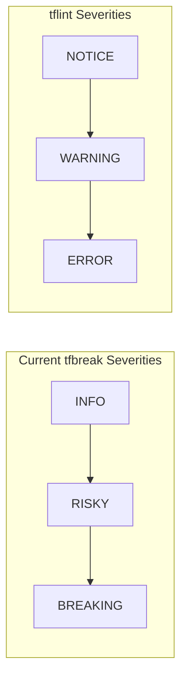
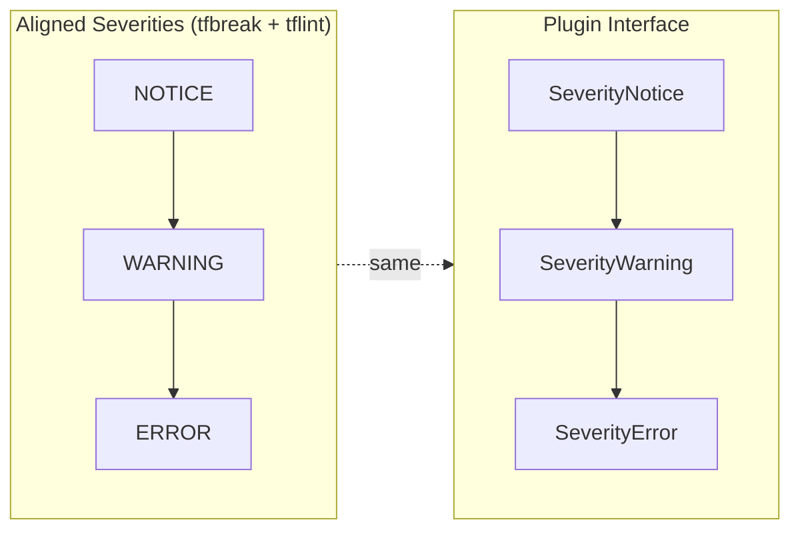
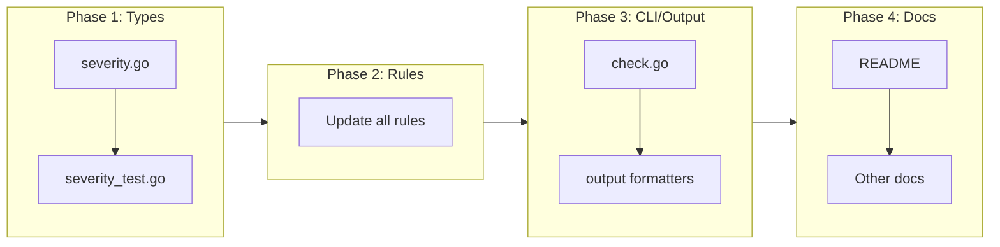

# Align Severity Levels with tflint Convention

## Change Summary

Change tfbreak's severity levels from BREAKING/RISKY/INFO to ERROR/WARNING/NOTICE to align with tflint's established convention. This ensures consistency across the Terraform ecosystem and eliminates the need for severity mapping between tfbreak-core and plugins.

## Motivation and Background

tfbreak currently uses custom severity names (BREAKING, RISKY, INFO) that differ from tflint's convention (ERROR, WARNING, NOTICE). With the upcoming plugin architecture (CR-0013), plugins will report findings back to tfbreak. Using different severity names between core and plugins would require unnecessary mapping logic and create confusion for developers familiar with tflint.

tflint is the de facto standard linter in the Terraform ecosystem. By aligning with its conventions, we:
1. Reduce cognitive load for Terraform developers
2. Eliminate severity mapping complexity in the plugin interface
3. Enable consistent terminology in documentation and error messages
4. Follow the principle of least surprise

## Change Drivers

* Plugin architecture (CR-0013) requires consistent severity interface
* tflint alignment is an explicit goal per ADR-0002
* Simplicity: no mapping means fewer bugs and less maintenance
* Ecosystem consistency benefits all users

## Current State

tfbreak uses custom severity levels defined in `internal/types/severity.go`:

```go
const (
    SeverityInfo Severity = iota      // "INFO"
    SeverityRisky                      // "RISKY"
    SeverityBreaking                   // "BREAKING"
)
```

These are used throughout the codebase:
- Rule definitions specify severity
- CLI `--fail-on` flag accepts severity values
- Output formatters display severity
- Configuration files reference severity

### Current Severity Model



## Proposed Change

Rename severity levels to match tflint's convention:

| Current | Proposed | Meaning |
|---------|----------|---------|
| INFO | NOTICE | Informational, no action needed |
| RISKY | WARNING | Potential issue, review recommended |
| BREAKING | ERROR | Will cause destruction or breaking change |

The Go constants will change from:
- `SeverityInfo` → `SeverityNotice`
- `SeverityRisky` → `SeverityWarning`
- `SeverityBreaking` → `SeverityError`

### Proposed Severity Model



## Requirements

### Functional Requirements

1. The system **MUST** use `SeverityError` instead of `SeverityBreaking`
2. The system **MUST** use `SeverityWarning` instead of `SeverityRisky`
3. The system **MUST** use `SeverityNotice` instead of `SeverityInfo`
4. The system **MUST** output "ERROR" instead of "BREAKING" in all formats
5. The system **MUST** output "WARNING" instead of "RISKY" in all formats
6. The system **MUST** output "NOTICE" instead of "INFO" in all formats
7. The system **MUST** accept "ERROR", "WARNING", "NOTICE" in `--fail-on` flag
8. The system **MUST** accept "ERROR", "WARNING", "NOTICE" in configuration files
9. The system **MUST** parse severity strings case-insensitively

### Non-Functional Requirements

1. The system **MUST** maintain backward compatibility for JSON output structure
2. The system **MUST** update all documentation to reflect new severity names

## Affected Components

* `internal/types/severity.go` - Severity constants and parsing
* `internal/types/severity_test.go` - Severity tests
* `internal/types/finding.go` - References to severity constants
* `internal/types/finding_test.go` - Finding tests with severity
* `internal/rules/*.go` - All rule definitions
* `internal/cli/check.go` - `--fail-on` flag
* `internal/output/text.go` - Text output formatting
* `internal/output/json.go` - JSON output (if severity strings change)
* `internal/config/*.go` - Configuration parsing
* `docs/*.md` - Documentation
* `README.md` - User-facing documentation

## Scope Boundaries

### In Scope

* Renaming severity constants in Go code
* Updating severity string representations
* Updating CLI flag descriptions and validation
* Updating all rule definitions to use new constants
* Updating tests to use new severity names
* Updating documentation

### Out of Scope

* Backward compatibility aliases (e.g., accepting "BREAKING" as alias for "ERROR")
  - Rationale: No releases exist yet, no backward compatibility needed
* Plugin interface changes - already using correct names in CR-0013
* Configuration schema changes beyond severity names

## Impact Assessment

### User Impact

Users will see different severity names in output:
- `BREAKING` → `ERROR`
- `RISKY` → `WARNING`
- `INFO` → `NOTICE`

Since there are no public releases yet, there is no migration burden.

### Technical Impact

This is a straightforward find-and-replace change across the codebase. No structural changes are needed.

### Business Impact

Aligning with tflint conventions makes tfbreak more approachable for the existing Terraform tooling community.

## Implementation Approach

### Phase 1: Core Type Changes

1. Update `internal/types/severity.go`:
   - Rename constants
   - Update String() method
   - Update ParseSeverity() function

2. Update `internal/types/severity_test.go`:
   - Update test cases for new names

### Phase 2: Rule Updates

1. Update all rule files in `internal/rules/`:
   - Replace `SeverityBreaking` with `SeverityError`
   - Replace `SeverityRisky` with `SeverityWarning`
   - Replace `SeverityInfo` with `SeverityNotice`

### Phase 3: CLI and Output

1. Update `internal/cli/check.go`:
   - Update `--fail-on` flag description
   - Update validation messages

2. Update output formatters if they reference severity names directly

### Phase 4: Documentation

1. Update README.md
2. Update any docs that reference severity levels

### Implementation Flow



## Test Strategy

### Tests to Add

No new tests needed - existing tests will be updated.

### Tests to Modify

| Test File | Test Name | Current Behavior | New Behavior | Reason for Change |
|-----------|-----------|------------------|--------------|-------------------|
| `internal/types/severity_test.go` | `TestSeverityString` | Tests "BREAKING", "RISKY", "INFO" | Tests "ERROR", "WARNING", "NOTICE" | Severity names changed |
| `internal/types/severity_test.go` | `TestParseSeverity` | Parses "BREAKING", "RISKY", "INFO" | Parses "ERROR", "WARNING", "NOTICE" | Severity names changed |
| `internal/types/severity_test.go` | `TestSeverityJSON` | Uses "BREAKING", "RISKY" | Uses "ERROR", "WARNING" | Severity names changed |
| `internal/types/severity_test.go` | `TestSeverityComparison` | Uses SeverityBreaking, SeverityRisky | Uses SeverityError, SeverityWarning | Constant names changed |

### Tests to Remove

None.

## Acceptance Criteria

### AC-1: Severity constants renamed

```gherkin
Given the severity.go file
When I inspect the Severity constants
Then SeverityError exists with the highest value
  And SeverityWarning exists with middle value
  And SeverityNotice exists with lowest value
  And SeverityBreaking does not exist
  And SeverityRisky does not exist
  And SeverityInfo does not exist
```

### AC-2: String output uses tflint names

```gherkin
Given a finding with SeverityError
When the finding is displayed in text format
Then the severity shows as "ERROR"
```

```gherkin
Given a finding with SeverityWarning
When the finding is displayed in text format
Then the severity shows as "WARNING"
```

```gherkin
Given a finding with SeverityNotice
When the finding is displayed in text format
Then the severity shows as "NOTICE"
```

### AC-3: CLI accepts new severity names

```gherkin
Given the tfbreak check command
When I run "tfbreak check --fail-on ERROR old/ new/"
Then the command accepts the flag without error
```

```gherkin
Given the tfbreak check command
When I run "tfbreak check --fail-on WARNING old/ new/"
Then the command accepts the flag without error
```

### AC-4: Severity parsing works

```gherkin
Given the ParseSeverity function
When I parse "error" (lowercase)
Then it returns SeverityError without error
```

```gherkin
Given the ParseSeverity function
When I parse "WARNING" (uppercase)
Then it returns SeverityWarning without error
```

### AC-5: All rules use new constants

```gherkin
Given the codebase
When I search for "SeverityBreaking"
Then no matches are found
When I search for "SeverityRisky"
Then no matches are found
When I search for "SeverityInfo"
Then no matches are found
```

## Quality Standards Compliance

### Build & Compilation

- [ ] Code compiles/builds without errors
- [ ] No new compiler warnings introduced

### Linting & Code Style

- [ ] All linter checks pass with zero warnings/errors
- [ ] Code follows project coding conventions and style guides

### Test Execution

- [ ] All existing tests pass after implementation
- [ ] All modified tests pass
- [ ] Test coverage maintained

### Documentation

- [ ] README updated with new severity names
- [ ] Code comments updated

### Code Review

- [ ] Changes submitted via pull request
- [ ] PR title follows Conventional Commits format

### Verification Commands

```bash
# Build verification
go build ./...

# Lint verification
go vet ./...

# Test execution
go test -race -v ./...

# Verify no old severity names remain
grep -r "SeverityBreaking\|SeverityRisky\|SeverityInfo" internal/ && exit 1 || echo "OK"
grep -r '"BREAKING"\|"RISKY"\|"INFO"' internal/types/severity.go && exit 1 || echo "OK"
```

## Risks and Mitigation

### Risk 1: Missing occurrences during rename

**Likelihood:** low
**Impact:** medium
**Mitigation:** Use grep to verify all occurrences are updated. CI will catch any mismatches.

### Risk 2: Documentation drift

**Likelihood:** low
**Impact:** low
**Mitigation:** Search all .md files for old severity names.

## Dependencies

* None - this change is independent and should be done before CR-0013 (Plugin Infrastructure)

## Estimated Effort

* Phase 1 (Types): 30 minutes
* Phase 2 (Rules): 30 minutes
* Phase 3 (CLI/Output): 30 minutes
* Phase 4 (Docs): 30 minutes
* **Total: ~2 hours**

## Decision Outcome

Chosen approach: "Adopt tflint severity names (ERROR/WARNING/NOTICE)", because it aligns with the established Terraform ecosystem standard and eliminates unnecessary complexity in the plugin interface.

## Related Items

* ADR-0002: Plugin Architecture (mandates tflint alignment)
* CR-0013: Plugin Infrastructure (uses these severity levels)
* tflint severity reference: https://github.com/terraform-linters/tflint

## More Information

### tflint Severity Reference

From tflint-plugin-sdk:

```go
// Severity indicates the severity of the issue.
type Severity int

const (
    // ERROR is a severity for issues that should be fixed.
    ERROR Severity = iota
    // WARNING is a severity for issues that are not critical but should be noted.
    WARNING
    // NOTICE is a severity for issues that are informational.
    NOTICE
)
```

Source: https://github.com/terraform-linters/tflint-plugin-sdk/blob/main/tflint/severity.go

### Complete Code Change

```go
// internal/types/severity.go (after change)
package types

import (
    "encoding/json"
    "fmt"
    "strings"
)

// Severity represents the severity level of a finding
type Severity int

const (
    // SeverityNotice is informational, no action needed
    SeverityNotice Severity = iota
    // SeverityWarning may cause unexpected behavior changes
    SeverityWarning
    // SeverityError will break callers or destroy state
    SeverityError
)

// String returns the string representation of the severity
func (s Severity) String() string {
    switch s {
    case SeverityError:
        return "ERROR"
    case SeverityWarning:
        return "WARNING"
    case SeverityNotice:
        return "NOTICE"
    default:
        return "UNKNOWN"
    }
}

// ParseSeverity parses a string into a Severity
func ParseSeverity(s string) (Severity, error) {
    switch strings.ToUpper(s) {
    case "ERROR":
        return SeverityError, nil
    case "WARNING":
        return SeverityWarning, nil
    case "NOTICE":
        return SeverityNotice, nil
    default:
        return SeverityNotice, fmt.Errorf("unknown severity: %s", s)
    }
}
```
