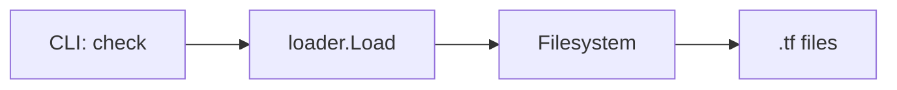
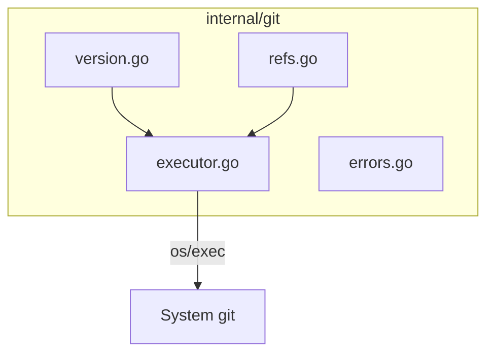
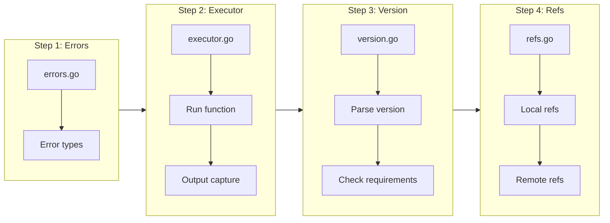

# Git Infrastructure Package

## Change Summary

Create a foundational `internal/git` package that provides a safe, well-tested wrapper around git command execution. This package will be the foundation for git ref comparison features (CR-0016, CR-0017) and must handle command execution, error capture, version detection, and ref validation without any platform-specific code.

## Motivation and Background

The ADR-0003 decision to shell out to system git (rather than using go-git) requires a robust infrastructure layer that:

1. Executes git commands safely with proper stderr/stdout capture
2. Provides clear error messages when git operations fail
3. Validates git availability and version requirements
4. Validates refs exist before expensive operations
5. Manages temporary directories for worktrees and clones

This infrastructure layer must be implemented before the user-facing git ref features can be built.

## Change Drivers

* ADR-0003 mandates using system git for all git operations
* Go's `os/exec` requires careful handling of stderr for useful error messages
* Git version differences affect available features
* Ref validation prevents wasted time on operations that will fail
* Clean separation enables thorough unit testing

## Current State

tfbreak currently has no git integration. The `check` command accepts two directory paths and loads Terraform configurations directly from the filesystem.

### Current State Diagram



## Proposed Change

Add a new `internal/git` package with the following components:

1. **Command executor** - Safe wrapper around `os/exec` for git commands
2. **Version detector** - Parse and validate git version
3. **Ref validator** - Check if refs exist locally or remotely
4. **Error types** - Structured errors with stderr context

### Proposed State Diagram



## Requirements

### Functional Requirements

#### Command Execution

1. The `git.Run` function **MUST** execute git commands using `os/exec.Command`
2. The `git.Run` function **MUST** capture stdout and stderr separately
3. The `git.Run` function **MUST** return stdout content on success
4. The `git.Run` function **MUST** include stderr content in error messages on failure
5. The `git.Run` function **MUST** pass through the current environment (for credentials)
6. The `git.Run` function **MUST** support setting a working directory for the command
7. The `git.Run` function **MUST** return a structured `GitError` type on failure

#### Git Detection and Version

8. The `git.Available` function **MUST** return false if git is not in PATH
9. The `git.Available` function **MUST** use `exec.LookPath("git")` for detection
10. The `git.Version` function **MUST** return the installed git version
11. The `git.Version` function **MUST** parse the version string into major, minor, patch components
12. The `git.CheckVersion` function **MUST** return an error if git is not installed
13. The `git.CheckVersion` function **MUST** return an error if git version is below 2.5
14. The `git.CheckVersion` function **MUST** return a warning (not error) if git version is below 2.25

#### Ref Validation

13. The `git.RefExists` function **MUST** check if a ref exists in a local repository
14. The `git.RefExists` function **MUST** use `git rev-parse --verify` for local refs
15. The `git.RemoteRefExists` function **MUST** check if a ref exists in a remote repository
16. The `git.RemoteRefExists` function **MUST** use `git ls-remote --exit-code` for remote refs
17. The `git.RemoteRefExists` function **MUST** NOT clone or fetch any data
18. The `git.ResolveRef` function **MUST** resolve a ref to its commit SHA

#### Error Handling

19. The `GitError` type **MUST** include the git command that was executed
20. The `GitError` type **MUST** include the exit code
21. The `GitError` type **MUST** include stderr output
22. The `GitError` type **MUST** implement the `error` interface
23. The `IsNotFound` function **MUST** detect "ref not found" errors
24. The `IsAuthError` function **MUST** detect authentication-related errors

#### Repository State Detection

25. The `IsShallowClone` function **MUST** detect if a repository is a shallow clone
26. The `IsShallowClone` function **MUST** check for the existence of `.git/shallow` file
27. The `FindGitRoot` function **MUST** find the root directory of a git repository
28. The `FindGitRoot` function **MUST** return an error if not in a git repository

### Non-Functional Requirements

1. The package **MUST** NOT contain any platform-specific code (GitHub, GitLab, etc.)
2. The package **MUST** have at least 90% test coverage
3. All exported functions **MUST** have godoc comments
4. The package **MUST** NOT import any tfbreak-specific packages (pure git abstraction)

## Affected Components

* New: `internal/git/executor.go` - Command execution
* New: `internal/git/executor_test.go` - Executor tests
* New: `internal/git/version.go` - Version detection
* New: `internal/git/version_test.go` - Version tests
* New: `internal/git/refs.go` - Ref validation
* New: `internal/git/refs_test.go` - Refs tests
* New: `internal/git/errors.go` - Error types
* New: `internal/git/errors_test.go` - Error tests
* New: `internal/git/repo.go` - Repository state detection (shallow clone, git root)
* New: `internal/git/repo_test.go` - Repository state tests
* New: `internal/git/doc.go` - Package documentation

## Scope Boundaries

### In Scope

* Git command execution wrapper with stderr capture
* Git version detection and parsing
* Local ref existence checking (`git rev-parse --verify`)
* Remote ref existence checking (`git ls-remote`)
* Ref resolution to commit SHA
* Structured error types with context
* Comprehensive unit tests

### Out of Scope ("Here, But Not Further")

* Worktree management - deferred to CR-0016
* Clone operations - deferred to CR-0017
* Sparse checkout - deferred to future CR
* Any platform-specific code (GitHub Actions, GitLab CI, etc.)
* Credential management or storage
* Git configuration modification

## Implementation Approach

### Implementation Flow



### Step 1: Error Types

Create structured error types that preserve git command context and provide clear messages:

```go
// internal/git/errors.go

// ErrGitNotFound is returned when git is not installed
var ErrGitNotFound = errors.New("git is not installed or not in PATH")

// ErrNotARepository is returned when not in a git repository
type ErrNotARepository struct {
    Dir string
}

func (e *ErrNotARepository) Error() string {
    return fmt.Sprintf("'%s' is not a git repository (or any parent directory)", e.Dir)
}

// ErrRefNotFound is returned when a ref doesn't exist
type ErrRefNotFound struct {
    Ref      string
    IsShallow bool
}

func (e *ErrRefNotFound) Error() string {
    msg := fmt.Sprintf("ref '%s' not found", e.Ref)
    if e.IsShallow {
        msg += "\n\nThis repository is a shallow clone. The ref may exist but is not in the local history.\n"
        msg += "To fix, fetch the ref:\n\n"
        msg += fmt.Sprintf("  git fetch origin %s\n\n", e.Ref)
        msg += "Or fetch full history:\n\n"
        msg += "  git fetch --unshallow"
    }
    return msg
}

// GitError wraps errors from git command execution
type GitError struct {
    Command  []string
    ExitCode int
    Stderr   string
}

func (e *GitError) Error() string {
    return fmt.Sprintf("git %s failed (exit %d): %s",
        e.Command[0], e.ExitCode, e.Stderr)
}
```

### Step 2: Command Executor

Create the core execution wrapper:

```go
// internal/git/executor.go
type RunOptions struct {
    Dir string   // Working directory
    Env []string // Additional environment variables
}

func Run(args []string, opts *RunOptions) (string, error) {
    var stdout, stderr bytes.Buffer
    cmd := exec.Command("git", args...)
    cmd.Stdout = &stdout
    cmd.Stderr = &stderr
    if opts != nil && opts.Dir != "" {
        cmd.Dir = opts.Dir
    }
    // Inherit environment for credentials
    cmd.Env = os.Environ()
    if opts != nil {
        cmd.Env = append(cmd.Env, opts.Env...)
    }

    if err := cmd.Run(); err != nil {
        return "", &GitError{
            Command:  args,
            ExitCode: exitCode(err),
            Stderr:   stderr.String(),
        }
    }
    return strings.TrimSpace(stdout.String()), nil
}
```

### Step 3: Version Detection

Parse git version output:

```go
// internal/git/version.go
type Version struct {
    Major int
    Minor int
    Patch int
    Raw   string
}

func GetVersion() (*Version, error) {
    out, err := Run([]string{"--version"}, nil)
    if err != nil {
        return nil, fmt.Errorf("git not found: %w", err)
    }
    // Parse "git version 2.39.0" or similar
    return parseVersion(out)
}

func CheckVersion(minMajor, minMinor int) error {
    v, err := GetVersion()
    if err != nil {
        return err
    }
    if v.Major < minMajor || (v.Major == minMajor && v.Minor < minMinor) {
        return fmt.Errorf("git version %s is below minimum %d.%d",
            v.Raw, minMajor, minMinor)
    }
    return nil
}
```

### Step 4: Ref Validation

Validate refs without expensive operations:

```go
// internal/git/refs.go
func RefExists(dir, ref string) (bool, error) {
    _, err := Run([]string{"rev-parse", "--verify", ref}, &RunOptions{Dir: dir})
    if err != nil {
        if IsNotFound(err) {
            return false, nil
        }
        return false, err
    }
    return true, nil
}

func RemoteRefExists(url, ref string) (bool, error) {
    _, err := Run([]string{"ls-remote", "--exit-code", url, ref}, nil)
    if err != nil {
        if IsNotFound(err) {
            return false, nil
        }
        return false, err
    }
    return true, nil
}

func ResolveRef(dir, ref string) (string, error) {
    return Run([]string{"rev-parse", ref}, &RunOptions{Dir: dir})
}
```

## Test Strategy

### Tests to Add

| Test File | Test Name | Description | Inputs | Expected Output |
|-----------|-----------|-------------|--------|-----------------|
| `executor_test.go` | `TestAvailable_GitInstalled` | Git is in PATH | System with git | true |
| `executor_test.go` | `TestAvailable_GitMissing` | Git not in PATH | Modified PATH | false |
| `executor_test.go` | `TestRun_Success` | Successful command execution | `["--version"]` | Version string, no error |
| `executor_test.go` | `TestRun_Failure` | Failed command returns GitError | Invalid command | GitError with stderr |
| `executor_test.go` | `TestRun_WorkingDir` | Command runs in specified directory | Dir option | Correct working dir |
| `executor_test.go` | `TestRun_Environment` | Environment variables passed | Env option | Vars available to git |
| `version_test.go` | `TestGetVersion` | Parse git version | - | Version struct |
| `version_test.go` | `TestParseVersion_Standard` | Parse "git version 2.39.0" | Version string | {2, 39, 0} |
| `version_test.go` | `TestParseVersion_MacOS` | Parse macOS version format | Apple version | Correct parsing |
| `version_test.go` | `TestParseVersion_Windows` | Parse Windows version format | Windows version | Correct parsing |
| `version_test.go` | `TestCheckVersion_Satisfied` | Version meets requirement | v2.39 >= v2.5 | No error |
| `version_test.go` | `TestCheckVersion_TooOld` | Version below requirement | v2.4 < v2.5 | Error |
| `refs_test.go` | `TestRefExists_Branch` | Branch exists | "main" | true |
| `refs_test.go` | `TestRefExists_Tag` | Tag exists | "v1.0.0" | true |
| `refs_test.go` | `TestRefExists_Commit` | Commit SHA exists | Full SHA | true |
| `refs_test.go` | `TestRefExists_NotFound` | Ref doesn't exist | "nonexistent" | false, no error |
| `refs_test.go` | `TestRemoteRefExists_Branch` | Remote branch exists | Public repo URL | true |
| `refs_test.go` | `TestRemoteRefExists_NotFound` | Remote ref doesn't exist | Invalid ref | false, no error |
| `refs_test.go` | `TestResolveRef` | Resolve ref to SHA | "HEAD" | 40-char SHA |
| `errors_test.go` | `TestGitError_Error` | Error message format | GitError | Formatted message |
| `errors_test.go` | `TestIsNotFound_True` | Detect not found error | Not found stderr | true |
| `errors_test.go` | `TestIsNotFound_False` | Other errors return false | Different error | false |
| `errors_test.go` | `TestIsAuthError_SSH` | Detect SSH auth error | Permission denied | true |
| `errors_test.go` | `TestIsAuthError_HTTPS` | Detect HTTPS auth error | 401/403 error | true |
| `repo_test.go` | `TestIsShallowClone_True` | Detect shallow clone | Shallow repo | true |
| `repo_test.go` | `TestIsShallowClone_False` | Detect full clone | Full repo | false |
| `repo_test.go` | `TestFindGitRoot_Found` | Find git root | Subdirectory | Root path |
| `repo_test.go` | `TestFindGitRoot_NotRepo` | Not a git repo | Non-repo dir | Error |

### Tests to Modify

Not applicable - this is a new package.

### Tests to Remove

Not applicable - this is a new package.

## Acceptance Criteria

### AC-1: Git command execution captures output

```gherkin
Given git is installed on the system
When I call git.Run with ["--version"]
Then the function returns the git version string
  And no error is returned
```

### AC-2: Git command failure returns structured error

```gherkin
Given git is installed on the system
When I call git.Run with an invalid command ["invalid-command"]
Then a GitError is returned
  And the GitError contains the command that was run
  And the GitError contains the exit code
  And the GitError contains the stderr output
```

### AC-3: Git version is correctly parsed

```gherkin
Given git is installed with version 2.39.0
When I call git.GetVersion
Then the returned Version has Major=2, Minor=39, Patch=0
```

### AC-4: Version check fails for old git

```gherkin
Given git version is 2.4.0
When I call git.CheckVersion(2, 5)
Then an error is returned indicating the version is too old
```

### AC-5: Local ref existence check works

```gherkin
Given a git repository with branch "main"
When I call git.RefExists with ref "main"
Then the function returns true
  And no error is returned
```

### AC-6: Local ref not found returns false

```gherkin
Given a git repository without branch "nonexistent"
When I call git.RefExists with ref "nonexistent"
Then the function returns false
  And no error is returned
```

### AC-7: Remote ref check works without cloning

```gherkin
Given a public git repository URL
When I call git.RemoteRefExists with the URL and ref "main"
Then the function returns true
  And no data is downloaded (no clone)
  And no error is returned
```

### AC-8: Remote ref not found returns false

```gherkin
Given a public git repository URL
When I call git.RemoteRefExists with ref "nonexistent-branch-xyz"
Then the function returns false
  And no error is returned
```

### AC-9: Environment is passed to git

```gherkin
Given a git command that requires environment variables
When I call git.Run with Env option containing custom variables
Then the git command has access to those variables
```

### AC-10: Authentication errors are detectable

```gherkin
Given a private repository URL with no credentials
When I call git.RemoteRefExists
  And git returns a permission denied error
Then IsAuthError returns true for the error
```

## Quality Standards Compliance

### Build & Compilation

- [ ] Code compiles/builds without errors
- [ ] No new compiler warnings introduced

### Linting & Code Style

- [ ] All linter checks pass with zero warnings/errors
- [ ] Code follows project coding conventions and style guides
- [ ] Any linter exceptions are documented with justification

### Test Execution

- [ ] All existing tests pass after implementation
- [ ] All new tests pass
- [ ] Test coverage meets 90% requirement for the git package

### Documentation

- [ ] Package-level godoc in doc.go
- [ ] All exported functions have godoc comments
- [ ] Examples provided for key functions

### Code Review

- [ ] Changes submitted via pull request
- [ ] PR title follows Conventional Commits format: `feat(git): add git infrastructure package`
- [ ] Code review completed and approved
- [ ] Changes squash-merged to maintain linear history

### Verification Commands

```bash
# Build verification
go build ./internal/git/...

# Lint verification
go vet ./internal/git/...

# Test execution with coverage
go test -v -race -coverprofile=coverage.out ./internal/git/...
go tool cover -func=coverage.out | grep total
```

## Risks and Mitigation

### Risk 1: Git version string format varies across platforms

**Likelihood:** medium
**Impact:** low
**Mitigation:** Test version parsing with known formats from macOS, Linux, and Windows. Use regex that handles variations like "git version 2.39.0 (Apple Git-143)".

### Risk 2: Git not installed in CI environment

**Likelihood:** low
**Impact:** medium
**Mitigation:** Document git as a runtime dependency. Tests that require git should skip gracefully if git is not available. Integration tests can use `exec.LookPath("git")` to check.

### Risk 3: Authentication error detection is fragile

**Likelihood:** medium
**Impact:** low
**Mitigation:** Use substring matching for common error patterns. Document that IsAuthError is best-effort and may return false negatives. The primary goal is better error messages, not perfect classification.

## Dependencies

* ADR-0003 accepted (git ref comparison architecture)
* Go standard library only (no external dependencies)

## Estimated Effort

| Component | Estimate |
|-----------|----------|
| errors.go | 1-2 hours |
| executor.go | 2-3 hours |
| version.go | 2-3 hours |
| refs.go | 2-3 hours |
| Unit tests | 4-6 hours |
| Documentation | 1-2 hours |
| **Total** | **12-19 hours** |

## Decision Outcome

Chosen approach: "Create a standalone git package with no external dependencies", because it maintains the simplicity of ADR-0003's approach while providing a well-tested foundation for git operations.

## Related Items

* Architecture Decision: `docs/adr/ADR-0003-git-ref-comparison.md`
* Follow-up: CR-0016 (Local git ref comparison)
* Follow-up: CR-0017 (Remote repository comparison)

## More Information

### Research Sources

- [Git Documentation - git-worktree](https://git-scm.com/docs/git-worktree)
- [Git Documentation - git-ls-remote](https://git-scm.com/docs/git-ls-remote)
- [Go os/exec Patterns - DoltHub Blog](https://www.dolthub.com/blog/2022-11-28-go-os-exec-patterns/)
- [Gotchas in exec.Errors - Gopher Advent](https://gopheradvent.com/calendar/2021/gotchas-in-exec-errors/)
- [go-git Limitations](https://deepwiki.com/go-git/go-git) - Confirms decision to use system git

### Version Format Examples

Different platforms produce different version strings:

```
# Linux
git version 2.39.0

# macOS (Xcode)
git version 2.39.0 (Apple Git-143)

# Windows (Git for Windows)
git version 2.39.0.windows.1

# Ubuntu
git version 2.34.1
```

The version parser must handle all these formats correctly.
