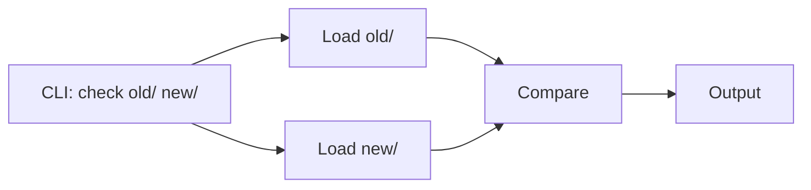
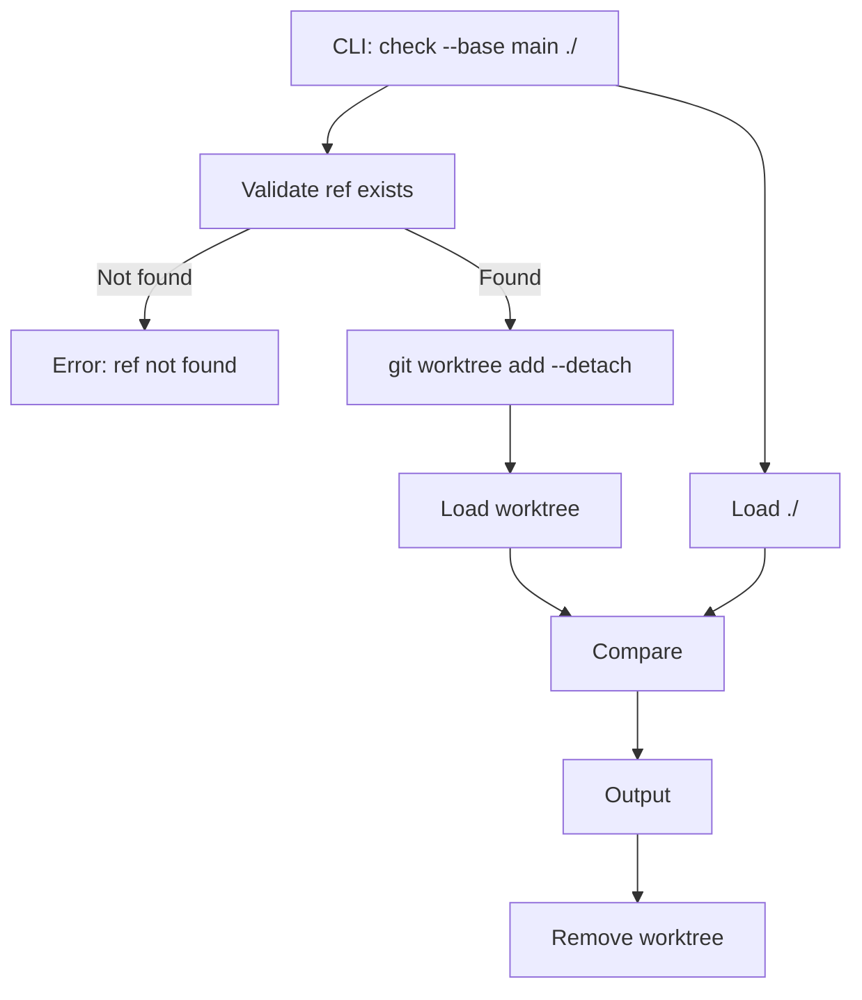
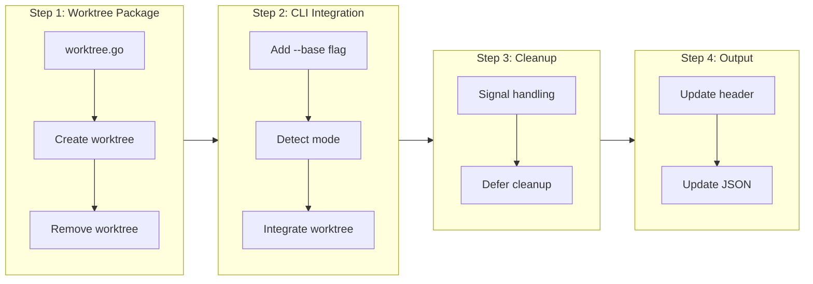

# Local Git Ref Comparison

## Change Summary

Add `--base` flag to the `tfbreak check` command to compare the current working directory against a local git ref (branch, tag, or commit). This eliminates the need for users to manually check out old versions into temporary directories, significantly improving the CI/CD workflow experience.

## Motivation and Background

The current `tfbreak check <old_dir> <new_dir>` interface requires users to manually prepare two directories for comparison. In CI/CD pipelines, this typically means:

1. Checking out the base branch/tag into a temporary directory
2. Running tfbreak against those directories
3. Cleaning up the temporary directory

With git ref support, users can simply run:

```bash
tfbreak check --base main ./
```

This is the most common use case: comparing the current working directory against a base branch to detect breaking changes in a pull request.

## Change Drivers

* Simplifies CI/CD integration - no manual checkout required
* Reduces script complexity in PR validation workflows
* Matches user mental model of "compare against main branch"
* Enables single-command PR checks
* Foundation for remote repository comparison (CR-0017)

## Current State

### Current CLI Interface

```bash
tfbreak check <old_dir> <new_dir>
```

Both arguments are required directory paths. There is no git integration.

### Current Check Flow



## Proposed Change

### New CLI Interface

```bash
# New: git ref mode (this CR)
tfbreak check --base <ref[:path]> [new_dir]

# Examples
tfbreak check --base main ./                    # Compare ./ against main branch
tfbreak check --base v1.0.0 ./                  # Compare against tag
tfbreak check --base HEAD~5 ./                  # Compare against 5 commits ago
tfbreak check --base abc1234 ./                 # Compare against commit SHA
tfbreak check --base origin/main ./             # Compare against remote-tracking branch

# Monorepo support: ref:path syntax (like git show REVISION:path)
tfbreak check --base main:modules/vpc ./modules/vpc      # Compare subdirectory at ref
tfbreak check --base v1.0.0:terraform/prod ./            # Compare terraform/prod at tag vs ./

# Original mode still supported
tfbreak check ./old ./new                       # Original directory mode
```

### Ref:Path Syntax

The `--base` flag supports the `ref:path` syntax to specify a subdirectory within the checked-out ref. This follows git's convention (as used in `git show REVISION:path`) and enables comparison of specific modules within monorepos.

**Syntax:** `<ref>:<path>`

| Component | Description | Examples |
|-----------|-------------|----------|
| `ref` | Git ref (branch, tag, SHA, relative) | `main`, `v1.0.0`, `HEAD~5`, `abc1234` |
| `path` | Path relative to repository root | `modules/vpc`, `terraform/prod` |

**Behavior:**
- If no `:path` is specified, the repository root is used
- The path is applied after the worktree is created
- Worktree contains the full checkout; path selects the subdirectory for comparison

### New Check Flow with Git Ref



### Pre-flight Check Order and Error Messages

When `--base` is used, checks run in this order (failing fast at first error):

```
1. Is git installed?
   └─ No  → "Error: git is not installed or not in PATH

            tfbreak requires git 2.5 or later for --base flag.
            Install git: https://git-scm.com/downloads"

2. Are we in a git repository?
   └─ No  → "Error: not a git repository (or any parent up to /)

            The --base flag requires running from within a git repository.
            Either:
              - Run from inside a git repository
              - Use --repo to compare remote repositories"

3. Does the ref exist?
   └─ No  → (see Shallow Clone Handling for detailed error)

4. Is git version sufficient?
   └─ No  → "Error: git version 2.3.0 is below minimum required 2.5

            tfbreak requires git 2.5 or later for worktree support.
            Please upgrade git: https://git-scm.com/downloads"
```

### Shallow Clone Handling

**Assumption**: tfbreak assumes the local repository has sufficient history to resolve the requested refs. This is the typical case for developer workstations and CI pipelines configured with full checkout depth.

**Problem**: Many CI systems default to shallow clones (e.g., GitHub Actions `fetch-depth: 1`). If a user requests `--base v1.0.0` but the tag isn't in the shallow history, the worktree creation will fail.

**Detection and Remediation**:

```
Error: ref 'v1.0.0' not found in repository

This may be because the repository is a shallow clone.
To fix, fetch the required ref:

  git fetch origin tag v1.0.0 --no-tags

Or fetch full history:

  git fetch --unshallow

For CI pipelines, configure full checkout depth:
  - GitHub Actions: actions/checkout with fetch-depth: 0
  - GitLab CI: GIT_DEPTH: 0
```

tfbreak will detect shallow clones by checking for `.git/shallow` file and include this guidance in error messages when ref resolution fails.

### Worktree Strategy

Using `git worktree add --detach` provides several benefits:

1. **Efficient**: Shares git objects with main repository
2. **Safe**: Doesn't affect current working directory
3. **Clean**: Creates minimal filesystem footprint
4. **Detached HEAD**: Prevents accidental commits to the worktree

```bash
# Create detached worktree at specific ref
git worktree add --detach /tmp/tfbreak-worktree-xyz <ref>

# After comparison, cleanup
git worktree remove /tmp/tfbreak-worktree-xyz
```

## Requirements

### Functional Requirements

#### CLI Interface

1. The `check` command **MUST** accept a `--base` flag with a git ref argument
2. The `--base` flag **MUST** support branch names, tags, commit SHAs, and relative refs (HEAD~N)
3. When `--base` is provided, the second positional argument **MUST** default to `.` if not specified
4. When `--base` is provided, the first positional argument **MUST** be interpreted as new_dir
5. The original two-directory mode **MUST** continue to work unchanged
6. The `--base` flag **MUST** be mutually exclusive with providing two positional arguments

#### Ref:Path Syntax (Monorepo Support)

7. The `--base` flag **MUST** support the `ref:path` syntax (e.g., `main:modules/vpc`)
8. When `ref:path` is used, the system **MUST** parse the ref and path components separately
9. The path component **MUST** be applied as a subdirectory within the worktree
10. URL-like refs containing `://` **MUST NOT** be parsed for path components
11. If no `:path` is specified, the system **MUST** use the repository root (default behavior)
12. The ref component (without path) **MUST** be used for ref validation

#### Pre-flight Checks (Fail Fast)

7. When `--base` is used, the system **MUST** check git is installed before any other operation
8. When `--base` is used, the system **MUST** verify the directory is inside a git repository
9. The system **MUST** validate the ref exists before creating a worktree
10. Pre-flight checks **MUST** complete in under 100ms for local operations
11. All pre-flight failures **MUST** produce clear, actionable error messages (see Error Messages section)

#### Git Operations

12. The system **MUST** use `git worktree add --detach` to create a temporary worktree
13. The system **MUST** create worktrees in a temporary directory (not in the repository)
14. The system **MUST** automatically remove the worktree after comparison completes
15. The system **MUST** remove the worktree even if comparison fails or errors occur
16. The system **MUST** handle worktree cleanup on SIGINT/SIGTERM signals

#### Error Handling

17. The system **MUST** return exit code 2 if git is not installed
18. The system **MUST** return exit code 2 if the current directory is not in a git repository
19. The system **MUST** return exit code 2 if the ref does not exist
20. The system **MUST** return exit code 2 if git version is below 2.5
21. The system **MUST** include actionable remediation in all error messages
22. The system **MUST** include the git error message verbatim when worktree creation fails
23. The system **MUST** log a warning (not fail) if worktree cleanup fails
24. The system **MUST** detect shallow clone issues and suggest remediation (see Shallow Clone Handling)

#### Output

19. The system **MUST** display the resolved ref (commit SHA) in verbose mode
20. The system **MUST** display "Comparing: <base_ref> -> <new_dir>" in the output header
21. The JSON output **MUST** include `base_ref` and `base_sha` fields when using `--base`

### Non-Functional Requirements

1. The system **MUST** complete worktree creation in under 5 seconds for typical repositories
2. The system **MUST** NOT leave orphaned worktrees on normal termination
3. The system **MUST** work with repositories that have uncommitted changes in the working directory

## Affected Components

* Modified: `internal/cli/check.go` - Add --base flag and git ref logic
* Modified: `internal/cli/check_test.go` - Add tests for git ref mode
* New: `internal/git/worktree.go` - Worktree management
* New: `internal/git/worktree_test.go` - Worktree tests
* Modified: `internal/types/result.go` - Add base_ref fields to CheckResult

## Scope Boundaries

### In Scope

* `--base` flag for local git ref comparison
* Worktree creation and cleanup
* Signal handling for cleanup
* Integration with existing check command
* Unit and integration tests

### Out of Scope ("Here, But Not Further")

* `--head` flag for comparing two arbitrary refs - deferred to CR-0017
* `--repo` flag for remote repository comparison - deferred to CR-0017
* Sparse checkout optimization - deferred to future CR
* Caching of worktrees - deferred to future CR
* Git submodule support in worktrees - intentionally excluded

## Alternative Approaches Considered

### Alternative 1: Use `git archive` instead of worktree

Could extract files directly from git object store without creating a working directory.

**Rejected because:**
- terraform-config-inspect requires files on disk
- Would need to extract to temp directory anyway
- More complex implementation

### Alternative 2: Use `git show` for individual files

Could read files directly from git without any checkout.

**Rejected because:**
- Would require listing all .tf files first
- Doesn't work with terraform-config-inspect's directory-based API
- Complex error handling for missing files

### Alternative 3: Use go-git library

Could use go-git for worktree operations.

**Rejected because:**
- ADR-0003 decided on system git
- go-git worktree support is limited
- Would add significant binary size

## Impact Assessment

### User Impact

* **Positive**: Dramatically simplifies CI/CD integration
* **Positive**: Single-command PR checks
* **Neutral**: New flag to learn, but intuitive
* **Backward compatible**: Existing directory mode unchanged

### Technical Impact

* **Additive**: New flag and git integration
* **Dependencies**: Requires git infrastructure (CR-0015)
* **Performance**: Worktree creation adds 1-3 seconds overhead

### Business Impact

* **Adoption**: Removes major friction point for CI/CD users
* **Documentation**: Example workflows become much simpler

## Implementation Approach

### Implementation Flow



### Step 1: Worktree Package

```go
// internal/git/worktree.go
package git

import (
    "os"
    "path/filepath"
)

// Worktree represents a git worktree that will be cleaned up
type Worktree struct {
    Path    string
    RepoDir string
}

// CreateWorktree creates a detached worktree at the specified ref
func CreateWorktree(repoDir, ref string) (*Worktree, error) {
    // Validate ref exists
    if exists, err := RefExists(repoDir, ref); err != nil {
        return nil, err
    } else if !exists {
        return nil, &RefNotFoundError{Ref: ref}
    }

    // Create temp directory for worktree
    tmpDir, err := os.MkdirTemp("", "tfbreak-worktree-")
    if err != nil {
        return nil, fmt.Errorf("failed to create temp directory: %w", err)
    }

    // Create detached worktree
    _, err = Run([]string{"worktree", "add", "--detach", tmpDir, ref},
        &RunOptions{Dir: repoDir})
    if err != nil {
        os.RemoveAll(tmpDir) // Clean up temp dir
        return nil, fmt.Errorf("failed to create worktree: %w", err)
    }

    return &Worktree{Path: tmpDir, RepoDir: repoDir}, nil
}

// Remove cleans up the worktree
func (w *Worktree) Remove() error {
    // Remove from git's worktree list
    _, err := Run([]string{"worktree", "remove", "--force", w.Path},
        &RunOptions{Dir: w.RepoDir})

    // Also remove the directory if git worktree remove failed
    os.RemoveAll(w.Path)

    return err
}
```

### Step 2: CLI Integration

```go
// internal/cli/check.go additions

var baseFlag string

func init() {
    checkCmd.Flags().StringVar(&baseFlag, "base", "",
        "Git ref to compare against (branch, tag, or commit)")
}

func runCheck(cmd *cobra.Command, args []string) error {
    var oldDir, newDir string

    if baseFlag != "" {
        // Git ref mode
        if len(args) > 1 {
            return fmt.Errorf("--base cannot be used with two directory arguments")
        }

        newDir = "."
        if len(args) == 1 {
            newDir = args[0]
        }

        // Find git repository root
        repoDir, err := findGitRoot(newDir)
        if err != nil {
            return fmt.Errorf("not a git repository: %w", err)
        }

        // Create worktree
        wt, err := git.CreateWorktree(repoDir, baseFlag)
        if err != nil {
            return fmt.Errorf("failed to checkout %s: %w", baseFlag, err)
        }
        defer wt.Remove()

        oldDir = wt.Path
    } else {
        // Original directory mode
        if len(args) != 2 {
            return fmt.Errorf("requires two directory arguments or --base flag")
        }
        oldDir = args[0]
        newDir = args[1]
    }

    // Rest of check logic unchanged...
}
```

### Step 3: Signal Handling

```go
// internal/cli/check.go

func runCheck(cmd *cobra.Command, args []string) error {
    // ... setup worktree ...

    // Setup signal handling for cleanup
    sigChan := make(chan os.Signal, 1)
    signal.Notify(sigChan, os.Interrupt, syscall.SIGTERM)

    go func() {
        <-sigChan
        if wt != nil {
            wt.Remove()
        }
        os.Exit(130) // Standard exit code for SIGINT
    }()
    defer signal.Stop(sigChan)

    // ... rest of check ...
}
```

### Step 4: Output Updates

```go
// internal/types/result.go additions
type CheckResult struct {
    // ... existing fields ...
    BaseRef string `json:"base_ref,omitempty"`
    BaseSHA string `json:"base_sha,omitempty"`
}
```

## Test Strategy

### Tests to Add

| Test File | Test Name | Description | Inputs | Expected Output |
|-----------|-----------|-------------|--------|-----------------|
| `worktree_test.go` | `TestCreateWorktree_Branch` | Create worktree from branch | "main" | Worktree created |
| `worktree_test.go` | `TestCreateWorktree_Tag` | Create worktree from tag | "v1.0.0" | Worktree created |
| `worktree_test.go` | `TestCreateWorktree_Commit` | Create worktree from SHA | Full SHA | Worktree created |
| `worktree_test.go` | `TestCreateWorktree_RelativeRef` | Create worktree from HEAD~1 | "HEAD~1" | Worktree created |
| `worktree_test.go` | `TestCreateWorktree_NotFound` | Ref doesn't exist | "nonexistent" | RefNotFoundError |
| `worktree_test.go` | `TestWorktree_Remove` | Worktree is cleaned up | Valid worktree | Directory removed |
| `worktree_test.go` | `TestWorktree_Remove_AlreadyGone` | Handle missing worktree | Deleted path | No error |
| `check_test.go` | `TestCheck_BaseFlag_Branch` | Compare against branch | --base main | Comparison works |
| `check_test.go` | `TestCheck_BaseFlag_Tag` | Compare against tag | --base v1.0.0 | Comparison works |
| `check_test.go` | `TestCheck_BaseFlag_WithNewDir` | Explicit new directory | --base main ./src | Uses ./src |
| `check_test.go` | `TestCheck_BaseFlag_DefaultNewDir` | Default to current dir | --base main | Uses ./ |
| `check_test.go` | `TestCheck_BaseFlag_NotGitRepo` | Error for non-repo | --base main | Exit code 2 |
| `check_test.go` | `TestCheck_BaseFlag_InvalidRef` | Error for invalid ref | --base invalid | Exit code 2 |
| `check_test.go` | `TestCheck_BaseFlag_MutualExclusion` | Can't use with two dirs | --base main a b | Exit code 2 |
| `check_test.go` | `TestCheck_OriginalMode` | Directory mode still works | old/ new/ | Works unchanged |
| `check_test.go` | `TestCheck_BaseFlag_Cleanup` | Worktree cleaned on success | --base main | No orphan worktree |
| `check_test.go` | `TestCheck_BaseFlag_CleanupOnError` | Worktree cleaned on error | --base main (error) | No orphan worktree |
| `check_test.go` | `TestCheck_BaseFlag_ShallowClone` | Helpful error for shallow clone | --base v1.0.0 (shallow) | Error with guidance |

### Integration Tests

| Scenario Directory | Description | Expected Findings |
|-------------------|-------------|-------------------|
| `testdata/git-scenarios/branch-comparison/` | Compare working dir against branch | Detect changes |
| `testdata/git-scenarios/tag-comparison/` | Compare working dir against tag | Detect changes |
| `testdata/git-scenarios/no-changes/` | Compare against same ref | No findings |

### Tests to Modify

| Test File | Test Name | Current Behavior | New Behavior | Reason for Change |
|-----------|-----------|------------------|--------------|-------------------|
| `check_test.go` | `TestCheck_RequiresArgs` | Requires exactly 2 args | Requires 2 args OR --base | Support new mode |

### Tests to Remove

Not applicable - no tests need removal.

## Acceptance Criteria

### AC-1: Compare against branch

```gherkin
Given a git repository with branch "main"
  And the current directory has changes from main
When I run "tfbreak check --base main ./"
Then the comparison completes successfully
  And findings show changes between main and current directory
```

### AC-2: Compare against tag

```gherkin
Given a git repository with tag "v1.0.0"
When I run "tfbreak check --base v1.0.0 ./"
Then the comparison completes successfully
  And findings show changes between v1.0.0 and current directory
```

### AC-3: Compare against commit SHA

```gherkin
Given a git repository with commit abc1234
When I run "tfbreak check --base abc1234 ./"
Then the comparison completes successfully
```

### AC-4: Default new directory to current

```gherkin
Given a git repository with branch "main"
When I run "tfbreak check --base main"
Then the comparison uses "./" as the new directory
```

### AC-5: Invalid ref returns error

```gherkin
Given a git repository without ref "nonexistent"
When I run "tfbreak check --base nonexistent ./"
Then exit code is 2
  And error message indicates ref was not found
```

### AC-6: Non-git directory returns error

```gherkin
Given a directory that is not a git repository
When I run "tfbreak check --base main ./"
Then exit code is 2
  And error message contains "not a git repository"
  And error message suggests using --repo for remote comparison
```

### AC-6b: Git not installed returns error

```gherkin
Given git is not installed or not in PATH
When I run "tfbreak check --base main ./"
Then exit code is 2
  And error message contains "git is not installed"
  And error message includes installation URL
```

### AC-6c: Git version too old returns error

```gherkin
Given git version is 2.4.0 (below minimum 2.5)
When I run "tfbreak check --base main ./"
Then exit code is 2
  And error message contains "git version"
  And error message contains "below minimum"
  And error message suggests upgrading git
```

### AC-7: Worktree is cleaned up on success

```gherkin
Given a git repository with branch "main"
When I run "tfbreak check --base main ./"
  And the comparison completes successfully
Then no temporary worktrees remain
```

### AC-8: Worktree is cleaned up on error

```gherkin
Given a git repository with branch "main"
When I run "tfbreak check --base main ./"
  And the comparison fails with an error
Then no temporary worktrees remain
```

### AC-9: Original mode unchanged

```gherkin
Given two directories old/ and new/
When I run "tfbreak check old/ new/"
Then the comparison works as before
  And no git operations are performed
```

### AC-10: Mutual exclusion with two directories

```gherkin
Given a git repository
When I run "tfbreak check --base main old/ new/"
Then exit code is 2
  And error message indicates --base cannot be used with two directories
```

### AC-11: JSON output includes ref info

```gherkin
Given a git repository with branch "main"
When I run "tfbreak check --base main ./ --format json"
Then JSON output contains "base_ref": "main"
  And JSON output contains "base_sha" with commit SHA
```

### AC-12: Shallow clone produces helpful error

```gherkin
Given a shallow clone repository (fetch-depth: 1)
  And the ref "v1.0.0" is not in the shallow history
When I run "tfbreak check --base v1.0.0 ./"
Then exit code is 2
  And error message indicates the ref was not found
  And error message mentions this may be a shallow clone issue
  And error message suggests "git fetch origin tag v1.0.0" as a fix
```

## Quality Standards Compliance

### Build & Compilation

- [ ] Code compiles/builds without errors
- [ ] No new compiler warnings introduced

### Linting & Code Style

- [ ] All linter checks pass with zero warnings/errors
- [ ] Code follows project coding conventions and style guides
- [ ] Any linter exceptions are documented with justification

### Test Execution

- [ ] All existing tests pass after implementation
- [ ] All new tests pass
- [ ] Test coverage meets project requirements for changed code

### Documentation

- [ ] CLI help text updated for --base flag
- [ ] User guide updated with git ref examples
- [ ] README updated with new usage examples

### Code Review

- [ ] Changes submitted via pull request
- [ ] PR title follows Conventional Commits format: `feat(cli): add --base flag for git ref comparison`
- [ ] Code review completed and approved
- [ ] Changes squash-merged to maintain linear history

### Verification Commands

```bash
# Build verification
go build ./...

# Lint verification
go vet ./...

# Test execution
go test -v -race ./...

# Manual verification
cd /path/to/git/repo
tfbreak check --base main ./
```

## Risks and Mitigation

### Risk 1: Worktree left behind on crash

**Likelihood:** low
**Impact:** medium
**Mitigation:** Use defer for cleanup. Document `git worktree prune` command for users to clean up orphaned worktrees. Add startup check that prunes orphaned tfbreak worktrees.

### Risk 2: Worktree creation fails due to locking

**Likelihood:** low
**Impact:** low
**Mitigation:** Use unique temp directory names with process ID. Retry once on lock failure.

### Risk 3: Performance regression for large repositories

**Likelihood:** medium
**Impact:** low
**Mitigation:** Worktree creation is typically fast (<3 seconds). Document that sparse checkout (future CR) can improve performance. Monitor and optimize if needed.

### Risk 4: Confusion about working directory vs git root

**Likelihood:** medium
**Impact:** low
**Mitigation:** Clear error messages when directory is not in a git repository. Document that --base requires being inside a git repository.

### Risk 5: Shallow clone causes ref not found errors

**Likelihood:** high (in CI environments)
**Impact:** medium
**Mitigation:** Detect shallow clones (`.git/shallow` exists) and provide actionable guidance in error messages. Document CI configuration requirements. Do NOT automatically fetch - this could have unintended side effects and violates the principle of not modifying the repository.

## Dependencies

* CR-0015: Git infrastructure package (provides RefExists, Run, GitError)
* Git version 2.5 or later

## Estimated Effort

| Component | Estimate |
|-----------|----------|
| worktree.go | 3-4 hours |
| CLI flag and integration | 3-4 hours |
| Signal handling | 1-2 hours |
| Output updates | 1-2 hours |
| Unit tests | 4-6 hours |
| Integration tests | 2-3 hours |
| Documentation | 1-2 hours |
| **Total** | **15-23 hours** |

## Decision Outcome

Chosen approach: "Use git worktree with detached HEAD in temp directory", because it provides efficient file access while isolating the worktree from the main repository and ensuring clean cleanup.

## Related Items

* Architecture Decision: `docs/adr/ADR-0003-git-ref-comparison.md`
* Prerequisite: CR-0015 (Git infrastructure)
* Follow-up: CR-0017 (Remote repository comparison)

## More Information

### Research Sources

- [Git Worktree Documentation](https://git-scm.com/docs/git-worktree)
- [Mastering Git Worktree - Medium](https://medium.com/@chsherryy/mastering-git-worktree-21eaf4d9a990)
- [Git Worktree Best Practices - GitHub Gist](https://gist.github.com/ChristopherA/4643b2f5e024578606b9cd5d2e6815cc)

### Worktree vs Clone Trade-offs

| Aspect | Worktree | Clone |
|--------|----------|-------|
| Speed | Fast (shares objects) | Slower (copies objects) |
| Disk space | Minimal | Full copy |
| Network | None | Required for remote |
| Cleanup | `git worktree remove` | `rm -rf` |
| Isolation | Same repo | Fully independent |

Worktree is ideal for local refs; clone is needed for remote repositories (CR-0017).
