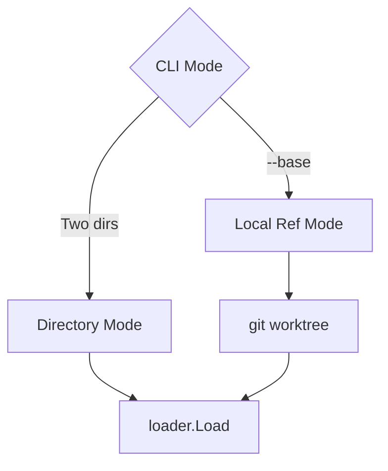
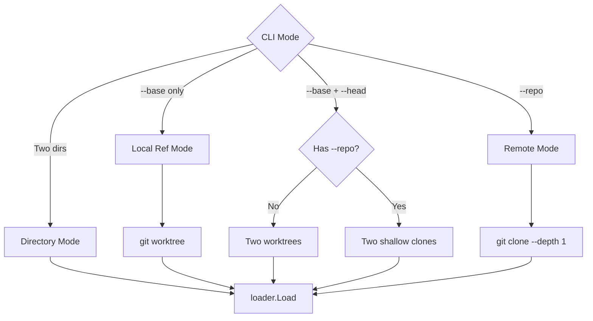
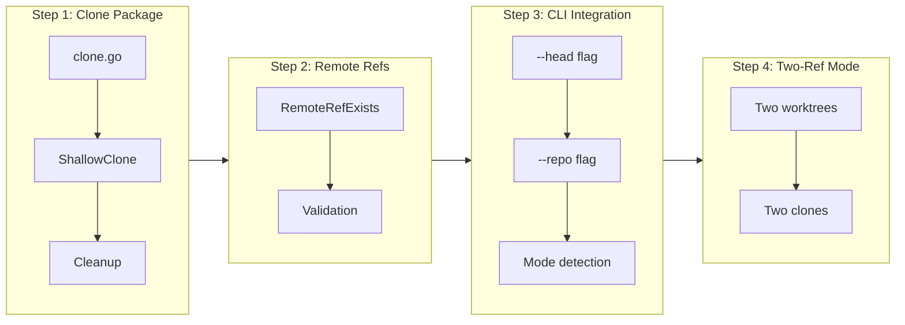

# Remote Repository Comparison

## Change Summary

Add `--repo` flag and `--head` flag to enable comparing configurations from remote git repositories. This allows comparing two versions of a module without having the repository cloned locally, and comparing two arbitrary refs within a repository.

## Motivation and Background

While CR-0016 enables comparing the current working directory against a local git ref, users also need to:

1. **Compare remote module versions**: Verify a published module hasn't introduced breaking changes between releases
2. **Compare two arbitrary refs**: Compare `v1.0.0` against `v2.0.0` without checking out either
3. **Analyze third-party modules**: Check if updating a dependency introduces breaking changes

These use cases are common for:
- Module consumers evaluating upgrades
- Security audits of third-party modules
- Automated dependency update tools

## Change Drivers

* Enable remote module version comparison
* Support third-party module analysis
* Complete the git ref comparison feature set
* Enable `--head` flag for comparing two refs

## Current State

After CR-0016, tfbreak supports:

```bash
tfbreak check ./old ./new           # Directory mode
tfbreak check --base main ./        # Local ref mode
```

### Current State Diagram



## Proposed Change

### New CLI Interface

```bash
# Compare two refs in current repository
tfbreak check --base v1.0.0 --head v2.0.0

# Compare refs in a remote repository
tfbreak check --repo https://github.com/org/module --base v1.0.0 --head v2.0.0
tfbreak check --repo git@github.com:org/module.git --base main --head feature

# Compare remote ref against local directory (mixed mode)
tfbreak check --repo https://github.com/org/module --base v1.0.0 ./local-changes

# Monorepo support: ref:path syntax (like git show REVISION:path)
tfbreak check --base v1.0.0:src --head v2.0.0:src                # Compare src/ between tags
tfbreak check --base v1:modules/old-vpc --head v2:modules/vpc    # Handle module renames
tfbreak check --repo https://github.com/org/infra --base v1:terraform --head v2:terraform
```

### New Flags

| Flag | Description |
|------|-------------|
| `--head <ref[:path]>` | Git ref for the "new" configuration (branch, tag, commit), optionally with subdirectory path |
| `--repo <url>` | Remote repository URL |

### Ref:Path Syntax

Both `--base` and `--head` support the `ref:path` syntax to specify a subdirectory within the checked-out ref. This follows git's convention (as used in `git show REVISION:path`) and enables comparison of specific modules within monorepos.

**Syntax:** `<ref>:<path>`

| Component | Description | Examples |
|-----------|-------------|----------|
| `ref` | Git ref (branch, tag, SHA) | `main`, `v1.0.0`, `abc1234` |
| `path` | Path relative to repository root | `modules/vpc`, `terraform/prod` |

**Behavior:**
- If no `:path` is specified, the repository root is used
- Each ref can have its own independent path, enabling comparison across renames
- The path is applied after the worktree/clone is created

### Flag Combinations

| --base | --head | --repo | new_dir arg | Behavior |
|--------|--------|--------|-------------|----------|
| ref | - | - | ./ | CR-0016: worktree vs working dir |
| ref | ref | - | - | Compare two local refs via worktrees |
| ref | ref | url | - | Compare two remote refs via shallow clones |
| ref | - | url | ./ | Compare remote ref vs local directory |

### Proposed State Diagram



### Pre-flight Check Order and Error Messages

When `--repo` is used, checks run in this order:

```
1. Is git installed?
   └─ No  → "Error: git is not installed or not in PATH

            tfbreak requires git for remote repository operations.
            Install git: https://git-scm.com/downloads"

2. Can we reach the repository? (via git ls-remote)
   └─ No  → "Error: cannot access repository 'https://github.com/org/repo'

            Git error: <git's error message verbatim>

            Troubleshooting:
              - Check the URL is correct
              - For private repos, ensure credentials are configured
              - Test manually: git ls-remote https://github.com/org/repo"

3. Does the ref exist?
   └─ No  → "Error: ref 'v99.0.0' not found in 'https://github.com/org/repo'

            Available tags can be listed with:
              git ls-remote --tags https://github.com/org/repo"
```

Note: `--repo` mode does NOT require being in a git repository. You can run it from any directory.

### Shallow Clone Strategy

For remote repositories, use shallow clones for efficiency:

```bash
# Clone specific ref with minimal history
git clone --depth 1 --branch <ref> --single-branch <url> <dir>
```

Benefits:
- Downloads only the specified ref
- Minimal disk usage
- Fastest possible clone

Limitations:
- Requires ref to be a branch or tag name (not commit SHA for remote)
- No history available for navigation

## Requirements

### Functional Requirements

#### CLI Interface

1. The `check` command **MUST** accept a `--head` flag with a git ref argument
2. The `check` command **MUST** accept a `--repo` flag with a git URL argument
3. When `--head` is provided without `--repo`, both refs **MUST** be resolved from the local repository
4. When `--repo` is provided, `--base` **MUST** also be provided
5. When `--repo` is provided without `--head`, a positional directory argument **MUST** be provided for new_dir
6. The `--repo` flag **MUST** accept HTTPS URLs
7. The `--repo` flag **MUST** accept SSH URLs (git@host:path format)

#### Ref:Path Syntax (Monorepo Support)

8. The `--head` flag **MUST** support the `ref:path` syntax (e.g., `v2.0.0:modules/vpc`)
9. When `ref:path` is used, the system **MUST** parse the ref and path components separately
10. The path component **MUST** be applied as a subdirectory within the worktree or clone
11. URL-like refs containing `://` **MUST NOT** be parsed for path components
12. If no `:path` is specified, the system **MUST** use the repository root (default behavior)
13. The ref component (without path) **MUST** be used for ref validation and clone operations
14. Each ref (`--base` and `--head`) **MAY** have independent paths, enabling comparison across renames

#### Pre-flight Checks (Fail Fast)

8. When `--repo` is used, the system **MUST** check git is installed before any other operation
9. When `--repo` is used, the system **MUST NOT** require being in a git repository
10. The system **MUST** validate remote refs exist using `git ls-remote` before cloning
11. Pre-flight checks **MUST** produce clear, actionable error messages

#### Ref Validation

12. The system **MUST** return exit code 2 if a remote ref does not exist
13. The system **MUST** return exit code 2 if the remote repository is not accessible
14. The system **MUST** NOT attempt to diagnose authentication failures beyond reporting git's error

#### Clone Operations

12. The system **MUST** use `git clone --depth 1 --branch <ref> --single-branch` for remote clones
13. The system **MUST** create clones in a temporary directory
14. The system **MUST** automatically remove clones after comparison completes
15. The system **MUST** remove clones even if comparison fails or errors occur
16. The system **MUST** handle cleanup on SIGINT/SIGTERM signals

#### Two-Ref Local Comparison

17. When `--base` and `--head` are both provided without `--repo`, the system **MUST** create two worktrees
18. Both worktrees **MUST** be cleaned up after comparison

#### Error Handling

19. The system **MUST** display clear error messages for inaccessible repositories
20. The system **MUST** display git's error message verbatim for authentication failures
21. The system **MUST** suggest troubleshooting steps for common errors

#### Output

22. The JSON output **MUST** include `head_ref` and `head_sha` fields when using `--head`
23. The JSON output **MUST** include `repo_url` field when using `--repo`
24. The text output **MUST** display the repository URL when using `--repo`

### Non-Functional Requirements

1. Shallow clone **MUST** complete in under 30 seconds for typical module repositories
2. The system **MUST** NOT store or log repository credentials
3. The system **MUST** pass through environment variables for git credential handling

## Affected Components

* Modified: `internal/cli/check.go` - Add --head and --repo flags
* Modified: `internal/cli/check_test.go` - Add tests for new modes
* New: `internal/git/clone.go` - Shallow clone management
* New: `internal/git/clone_test.go` - Clone tests
* Modified: `internal/git/refs.go` - Add RemoteRefExists function
* Modified: `internal/types/result.go` - Add head_ref, head_sha, repo_url fields

## Scope Boundaries

### In Scope

* `--head` flag for specifying new configuration ref
* `--repo` flag for remote repository comparison
* Shallow clone for remote refs
* Pre-flight ref validation with `git ls-remote`
* Two-worktree mode for comparing local refs
* Cleanup handling for all temporary directories

### Out of Scope ("Here, But Not Further")

* Terraform Registry URL support (e.g., `registry.terraform.io/...`) - future consideration
* Automatic version discovery (e.g., "latest tag") - future consideration
* Clone caching between runs - future consideration
* Sparse checkout optimization - future CR
* Credential management or storage - explicitly excluded per ADR-0003
* Platform-specific CI integrations - community responsibility

## Alternative Approaches Considered

### Alternative 1: Support commit SHAs for remote refs

Could use `git fetch` to fetch specific commits.

**Rejected because:**
- Requires fetching full history to resolve SHAs
- Tags and branches cover 99% of use cases
- Adds significant complexity

### Alternative 2: Use GitHub/GitLab APIs for file access

Could use REST APIs to fetch files without cloning.

**Rejected because:**
- Violates platform-agnostic principle (ADR-0003)
- Would require API-specific code for each platform
- Rate limits would affect usability

### Alternative 3: Full clone instead of shallow

Could clone full repository history.

**Rejected because:**
- Significantly slower for large repositories
- Unnecessary for single-ref comparison
- Wastes bandwidth and disk space

## Impact Assessment

### User Impact

* **Positive**: Can analyze remote modules without cloning
* **Positive**: Can compare any two versions of a module
* **Neutral**: New flags to learn
* **Note**: Private repositories require pre-configured git credentials

### Technical Impact

* **Additive**: New flags and clone functionality
* **Dependencies**: Requires CR-0015 and CR-0016
* **Network**: Remote operations require network access
* **Temporary storage**: Clones use temp directory space

### Business Impact

* **Use cases**: Enables dependency upgrade analysis
* **Adoption**: Completes the git integration feature set

## Implementation Approach

### Implementation Flow



### Step 1: Clone Package

```go
// internal/git/clone.go
package git

import (
    "fmt"
    "os"
)

// Clone represents a shallow clone that will be cleaned up
type Clone struct {
    Path string
}

// ShallowClone creates a shallow clone of a remote repository at a specific ref
func ShallowClone(url, ref string) (*Clone, error) {
    // Validate ref exists first (fast failure)
    exists, err := RemoteRefExists(url, ref)
    if err != nil {
        return nil, fmt.Errorf("failed to check ref %q: %w", ref, err)
    }
    if !exists {
        return nil, &RefNotFoundError{Ref: ref, Remote: url}
    }

    // Create temp directory
    tmpDir, err := os.MkdirTemp("", "tfbreak-clone-")
    if err != nil {
        return nil, fmt.Errorf("failed to create temp directory: %w", err)
    }

    // Shallow clone
    _, err = Run([]string{
        "clone",
        "--depth", "1",
        "--branch", ref,
        "--single-branch",
        url,
        tmpDir,
    }, nil)
    if err != nil {
        os.RemoveAll(tmpDir)
        return nil, fmt.Errorf("failed to clone %s: %w", url, err)
    }

    return &Clone{Path: tmpDir}, nil
}

// Remove cleans up the clone
func (c *Clone) Remove() error {
    return os.RemoveAll(c.Path)
}
```

### Step 2: Remote Ref Validation

```go
// internal/git/refs.go additions

// RemoteRefExists checks if a ref exists in a remote repository without cloning
func RemoteRefExists(url, ref string) (bool, error) {
    // Use git ls-remote with --exit-code to check ref existence
    _, err := Run([]string{"ls-remote", "--exit-code", url, ref}, nil)
    if err != nil {
        var gitErr *GitError
        if errors.As(err, &gitErr) {
            // Exit code 2 means ref not found
            if gitErr.ExitCode == 2 {
                return false, nil
            }
        }
        return false, err
    }
    return true, nil
}
```

### Step 3: CLI Integration

```go
// internal/cli/check.go additions

var (
    baseFlag string
    headFlag string
    repoFlag string
)

func init() {
    checkCmd.Flags().StringVar(&baseFlag, "base", "", "Git ref for old configuration")
    checkCmd.Flags().StringVar(&headFlag, "head", "", "Git ref for new configuration")
    checkCmd.Flags().StringVar(&repoFlag, "repo", "", "Remote repository URL")
}

func runCheck(cmd *cobra.Command, args []string) error {
    mode, err := detectMode(args)
    if err != nil {
        return err
    }

    var oldDir, newDir string
    var cleanups []func() error
    defer func() {
        for _, cleanup := range cleanups {
            cleanup() // Ignore cleanup errors, just log
        }
    }()

    switch mode {
    case modeDirectory:
        oldDir, newDir = args[0], args[1]

    case modeLocalRef:
        // CR-0016 logic
        wt, err := git.CreateWorktree(repoDir, baseFlag)
        if err != nil {
            return err
        }
        cleanups = append(cleanups, wt.Remove)
        oldDir = wt.Path
        newDir = resolveNewDir(args)

    case modeTwoLocalRefs:
        // Two worktrees
        wtOld, err := git.CreateWorktree(repoDir, baseFlag)
        if err != nil {
            return err
        }
        cleanups = append(cleanups, wtOld.Remove)

        wtNew, err := git.CreateWorktree(repoDir, headFlag)
        if err != nil {
            return err
        }
        cleanups = append(cleanups, wtNew.Remove)

        oldDir, newDir = wtOld.Path, wtNew.Path

    case modeRemoteRefs:
        // Two shallow clones
        cloneOld, err := git.ShallowClone(repoFlag, baseFlag)
        if err != nil {
            return err
        }
        cleanups = append(cleanups, cloneOld.Remove)

        cloneNew, err := git.ShallowClone(repoFlag, headFlag)
        if err != nil {
            return err
        }
        cleanups = append(cleanups, cloneNew.Remove)

        oldDir, newDir = cloneOld.Path, cloneNew.Path

    case modeRemoteVsLocal:
        // One clone, one local dir
        cloneOld, err := git.ShallowClone(repoFlag, baseFlag)
        if err != nil {
            return err
        }
        cleanups = append(cleanups, cloneOld.Remove)

        oldDir = cloneOld.Path
        newDir = resolveNewDir(args)
    }

    // Rest of check logic...
}
```

### Step 4: Mode Detection

```go
type checkMode int

const (
    modeDirectory checkMode = iota
    modeLocalRef
    modeTwoLocalRefs
    modeRemoteRefs
    modeRemoteVsLocal
)

func detectMode(args []string) (checkMode, error) {
    hasBase := baseFlag != ""
    hasHead := headFlag != ""
    hasRepo := repoFlag != ""
    hasArgs := len(args) > 0

    switch {
    case !hasBase && !hasHead && !hasRepo && len(args) == 2:
        return modeDirectory, nil

    case hasBase && !hasHead && !hasRepo:
        return modeLocalRef, nil

    case hasBase && hasHead && !hasRepo:
        return modeTwoLocalRefs, nil

    case hasBase && hasHead && hasRepo:
        return modeRemoteRefs, nil

    case hasBase && !hasHead && hasRepo && hasArgs:
        return modeRemoteVsLocal, nil

    case hasRepo && !hasBase:
        return 0, fmt.Errorf("--repo requires --base")

    default:
        return 0, fmt.Errorf("invalid flag combination")
    }
}
```

## Test Strategy

### Tests to Add

| Test File | Test Name | Description | Inputs | Expected Output |
|-----------|-----------|-------------|--------|-----------------|
| `clone_test.go` | `TestShallowClone_PublicRepo` | Clone public repo | Public URL, tag | Clone created |
| `clone_test.go` | `TestShallowClone_Branch` | Clone specific branch | URL, branch | Clone created |
| `clone_test.go` | `TestShallowClone_NotFound` | Ref doesn't exist | URL, invalid ref | RefNotFoundError |
| `clone_test.go` | `TestShallowClone_RepoNotFound` | Repository doesn't exist | Invalid URL | Error with message |
| `clone_test.go` | `TestClone_Remove` | Clone is cleaned up | Valid clone | Directory removed |
| `refs_test.go` | `TestRemoteRefExists_Branch` | Check remote branch | Public URL, "main" | true |
| `refs_test.go` | `TestRemoteRefExists_Tag` | Check remote tag | Public URL, tag | true |
| `refs_test.go` | `TestRemoteRefExists_NotFound` | Check missing ref | URL, invalid | false |
| `refs_test.go` | `TestRemoteRefExists_RepoInaccessible` | Repo doesn't exist | Invalid URL | Error |
| `check_test.go` | `TestCheck_HeadFlag_TwoLocalRefs` | Compare two local refs | --base v1 --head v2 | Two worktrees |
| `check_test.go` | `TestCheck_RepoFlag_TwoRemoteRefs` | Compare two remote refs | --repo URL --base v1 --head v2 | Two clones |
| `check_test.go` | `TestCheck_RepoFlag_VsLocalDir` | Compare remote vs local | --repo URL --base v1 ./ | One clone |
| `check_test.go` | `TestCheck_RepoFlag_RequiresBase` | --repo requires --base | --repo URL | Exit 2 |
| `check_test.go` | `TestCheck_RepoFlag_AuthError` | Auth failure message | Private repo, no creds | Git error shown |
| `check_test.go` | `TestCheck_Cleanup_RemoteMode` | Clones cleaned up | --repo mode | No orphan dirs |

### Integration Tests

| Scenario | Description | Flags | Expected |
|----------|-------------|-------|----------|
| Public repo two tags | Compare public module versions | --repo github.com/hashicorp/terraform-aws-vpc --base v3.0.0 --head v5.0.0 | Findings shown |
| Public repo tag vs local | Compare remote tag vs local changes | --repo ... --base v1.0.0 ./ | Comparison works |

### Tests to Modify

| Test File | Test Name | Current Behavior | New Behavior | Reason for Change |
|-----------|-----------|------------------|--------------|-------------------|
| `check_test.go` | `TestCheck_FlagValidation` | Validates --base only | Validates all git flags | New flags added |

### Tests to Remove

Not applicable - no tests need removal.

## Acceptance Criteria

### AC-1: Compare two local refs

```gherkin
Given a git repository with tags "v1.0.0" and "v2.0.0"
When I run "tfbreak check --base v1.0.0 --head v2.0.0"
Then the comparison completes successfully
  And findings show changes between v1.0.0 and v2.0.0
  And both temporary worktrees are cleaned up
```

### AC-2: Compare two remote refs

```gherkin
Given a public repository URL
When I run "tfbreak check --repo <url> --base v1.0.0 --head v2.0.0"
Then the comparison completes successfully
  And findings show changes between the remote refs
  And both temporary clones are cleaned up
```

### AC-3: Compare remote ref vs local directory

```gherkin
Given a public repository URL
  And a local directory with Terraform files
When I run "tfbreak check --repo <url> --base v1.0.0 ./"
Then the comparison completes successfully
  And findings show changes between remote v1.0.0 and local directory
```

### AC-4: Remote ref not found

```gherkin
Given a public repository URL
When I run "tfbreak check --repo <url> --base nonexistent --head main"
Then exit code is 2
  And error message indicates ref "nonexistent" was not found
```

### AC-5: Repository not accessible

```gherkin
Given an invalid repository URL
When I run "tfbreak check --repo https://invalid.example.com/repo --base main --head main"
Then exit code is 2
  And error message includes git's error output
```

### AC-6: --repo requires --base

```gherkin
When I run "tfbreak check --repo https://github.com/org/repo"
Then exit code is 2
  And error message indicates --repo requires --base
```

### AC-7: Authentication failure shows git error

```gherkin
Given a private repository URL
  And no credentials are configured
When I run "tfbreak check --repo <private-url> --base main --head main"
Then exit code is 2
  And git's authentication error is displayed verbatim
  And troubleshooting suggestions are shown
```

### AC-7b: Git not installed returns clear error

```gherkin
Given git is not installed or not in PATH
When I run "tfbreak check --repo https://github.com/org/repo --base v1 --head v2"
Then exit code is 2
  And error message contains "git is not installed"
  And error message includes installation URL
```

### AC-7c: Works from non-git directory

```gherkin
Given the current directory is NOT a git repository
  And git is installed
When I run "tfbreak check --repo https://github.com/hashicorp/terraform-aws-vpc --base v3.0.0 --head v5.0.0"
Then the comparison completes successfully
  And no "not a git repository" error is shown
```

### AC-8: SSH URL support

```gherkin
Given a repository accessible via SSH
  And SSH credentials are configured
When I run "tfbreak check --repo git@github.com:org/repo.git --base v1.0 --head v2.0"
Then the comparison completes successfully
```

### AC-9: JSON output includes remote info

```gherkin
Given a public repository URL
When I run "tfbreak check --repo <url> --base v1.0 --head v2.0 --format json"
Then JSON output contains "repo_url" field
  And JSON output contains "base_ref" and "head_ref" fields
```

### AC-10: Clones cleaned up on error

```gherkin
Given a public repository URL
When I run "tfbreak check --repo <url> --base v1.0 --head v2.0"
  And an error occurs during comparison
Then all temporary clone directories are removed
```

## Quality Standards Compliance

### Build & Compilation

- [ ] Code compiles/builds without errors
- [ ] No new compiler warnings introduced

### Linting & Code Style

- [ ] All linter checks pass with zero warnings/errors
- [ ] Code follows project coding conventions and style guides
- [ ] Any linter exceptions are documented with justification

### Test Execution

- [ ] All existing tests pass after implementation
- [ ] All new tests pass
- [ ] Test coverage meets project requirements for changed code

### Documentation

- [ ] CLI help text updated for --head and --repo flags
- [ ] User guide updated with remote comparison examples
- [ ] README updated with new usage examples

### Code Review

- [ ] Changes submitted via pull request
- [ ] PR title follows Conventional Commits format: `feat(cli): add --repo and --head flags for remote comparison`
- [ ] Code review completed and approved
- [ ] Changes squash-merged to maintain linear history

### Verification Commands

```bash
# Build verification
go build ./...

# Lint verification
go vet ./...

# Test execution
go test -v -race ./...

# Manual verification - public repo
tfbreak check --repo https://github.com/hashicorp/terraform-aws-vpc \
    --base v3.0.0 --head v5.0.0
```

## Risks and Mitigation

### Risk 1: Network timeouts during clone

**Likelihood:** medium
**Impact:** medium
**Mitigation:** Document that slow networks may cause timeouts. Consider adding --timeout flag in future. Shallow clone minimizes data transfer.

### Risk 2: Authentication errors are confusing

**Likelihood:** medium
**Impact:** low
**Mitigation:** Show git's error verbatim plus generic troubleshooting tips. Do not attempt to interpret or improve the error message per ADR-0003.

### Risk 3: Disk space exhaustion from large clones

**Likelihood:** low
**Impact:** medium
**Mitigation:** Shallow clone minimizes size. Cleanup on any exit path. Document that large repositories may use significant temp space.

### Risk 4: Commit SHA not supported for remote refs

**Likelihood:** low
**Impact:** low
**Mitigation:** Document that only branch and tag names are supported for remote refs. Full SHAs would require history fetch which defeats shallow clone benefits.

## Dependencies

* CR-0015: Git infrastructure package
* CR-0016: Local git ref comparison (for worktree reuse)
* Network access for remote operations

## Estimated Effort

| Component | Estimate |
|-----------|----------|
| clone.go | 3-4 hours |
| RemoteRefExists | 1-2 hours |
| CLI flag integration | 3-4 hours |
| Mode detection logic | 2-3 hours |
| Unit tests | 4-6 hours |
| Integration tests | 3-4 hours |
| Documentation | 1-2 hours |
| **Total** | **17-25 hours** |

## Decision Outcome

Chosen approach: "Shallow clone with pre-flight ref validation", because it provides fast remote access while ensuring early failure for invalid refs and maintaining the platform-agnostic approach from ADR-0003.

## Related Items

* Architecture Decision: `docs/adr/ADR-0003-git-ref-comparison.md`
* Prerequisite: CR-0015 (Git infrastructure)
* Prerequisite: CR-0016 (Local git ref comparison)
* Future consideration: Terraform Registry URL support
* Future consideration: Sparse checkout optimization

## More Information

### Research Sources

- [Git Shallow Clone - GitHub Blog](https://github.blog/open-source/git/get-up-to-speed-with-partial-clone-and-shallow-clone/)
- [Git ls-remote Documentation](https://git-scm.com/docs/git-ls-remote)
- [Shallow Clone Performance](https://www.perforce.com/blog/vcs/git-beyond-basics-using-shallow-clones)

### Shallow Clone Limitations

| Operation | Supported | Notes |
|-----------|-----------|-------|
| Read files | Yes | Full working directory available |
| Log history | Limited | Only 1 commit in history |
| Navigate refs | No | Only cloned ref available |
| Fetch more | Possible | Can unshallow later if needed |

### URL Format Examples

```bash
# HTTPS
https://github.com/org/repo
https://github.com/org/repo.git
https://gitlab.com/org/repo
https://git.example.com/org/repo

# SSH
git@github.com:org/repo.git
git@gitlab.com:org/repo.git
git@git.example.com:org/repo.git

# File (local)
file:///path/to/repo
/path/to/repo
```

All URL formats supported by git are supported by tfbreak, as the URL is passed directly to git commands.
