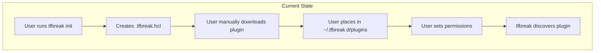
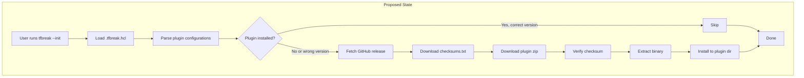
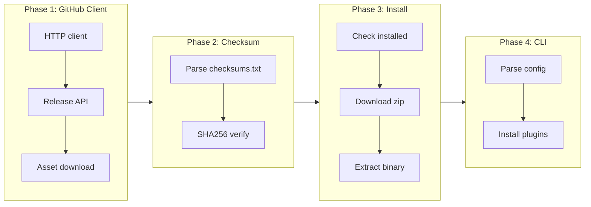

# Plugin Auto-Download Baseline (Phase 1)

## Change Summary

Add a global `--init` flag to tfbreak that automatically downloads plugins configured in `.tfbreak.hcl` from GitHub releases, following tflint's established pattern. Currently, plugins must be manually downloaded and placed in the plugin directory. This change enables automatic plugin installation when `source` and `version` are specified in the plugin configuration.

**CLI Design:**
- `tfbreak --init` - Downloads plugins (new, tflint-aligned)
- `tfbreak init` - Creates starter `.tfbreak.hcl` (existing, unchanged)

## Motivation and Background

tfbreak's plugin architecture (CR-0013) enables extensible rulesets via external binaries. However, the current implementation requires users to manually download plugin binaries from GitHub releases and place them in the correct directory. This creates friction for users, especially in CI/CD environments where manual setup is impractical.

tflint has solved this problem elegantly with their `tflint --init` flag, which automatically downloads plugins from GitHub releases based on configuration. By aligning with tflint's approach, we:

1. Provide a familiar experience for users coming from tflint
2. Leverage a battle-tested plugin distribution pattern
3. Enable seamless CI/CD integration with a single `tfbreak --init` command

## Change Drivers

* User friction: Manual plugin installation is error-prone and time-consuming
* CI/CD compatibility: Automated environments need declarative plugin installation
* Ecosystem alignment: tflint users expect similar plugin management patterns
* Plugin adoption: Easier installation will increase plugin ecosystem growth

## Current State

The current `tfbreak init` subcommand creates a starter `.tfbreak.hcl` configuration file. There is no mechanism for automatic plugin installation. Plugin installation requires manual steps:

1. Find the plugin's GitHub release page
2. Download the correct binary for the OS/architecture
3. Create the plugin directory (`~/.tfbreak.d/plugins`)
4. Place the binary with the correct name
5. Set executable permissions

Plugin configuration in `.tfbreak.hcl`:
```hcl
plugin "azurerm" {
  enabled = true
  source  = "github.com/jokarl/tfbreak-ruleset-azurerm"  # Parsed but not used
  version = "0.1.0"                                       # Parsed but not used
}
```

### Current State Diagram



## Proposed Change

Add a global `--init` flag to the root tfbreak command that:

1. Parses `.tfbreak.hcl` and identifies plugins with `source` and `version` specified
2. For each configured plugin, checks if it's already installed at the correct version
3. Downloads missing plugins from GitHub releases
4. Verifies checksums using `checksums.txt` from the release
5. Extracts and installs binaries to the plugin directory

The existing `tfbreak init` subcommand remains unchanged (creates starter config).

### Proposed State Diagram



### Plugin Directory Structure

Following tflint's convention, plugins are organized by source and version:

```
~/.tfbreak.d/plugins/
└── github.com/
    └── jokarl/
        └── tfbreak-ruleset-azurerm/
            └── 0.1.0/
                └── tfbreak-ruleset-azurerm
```

This structure enables:
- Multiple versions of the same plugin to coexist
- Clear mapping from source URL to filesystem location
- Version-specific binary isolation

### GitHub Release Asset Naming Convention

Plugin releases **MUST** follow this naming convention:

| Asset | Pattern | Example |
|-------|---------|---------|
| Binary zip | `tfbreak-ruleset-{name}_{GOOS}_{GOARCH}.zip` | `tfbreak-ruleset-azurerm_darwin_arm64.zip` |
| Checksums | `checksums.txt` | SHA256 hashes for all assets |

The zip file **MUST** contain a single binary named `tfbreak-ruleset-{name}` (or `.exe` on Windows).

### Configuration Syntax

```hcl
# Global plugin directory (optional)
config {
  plugin_dir = "/custom/plugin/path"
}

# Plugin with auto-download
plugin "azurerm" {
  enabled = true
  source  = "github.com/jokarl/tfbreak-ruleset-azurerm"
  version = "0.1.0"
}

# Plugin without auto-download (manual installation)
plugin "custom" {
  enabled = true
  # No source/version = manual installation required
}
```

## Requirements

### Functional Requirements

1. The system **MUST** download plugins from GitHub releases when `source` and `version` are specified
2. The system **MUST** verify downloaded files against `checksums.txt` using SHA256
3. The system **MUST** organize plugins in the directory structure `[plugin_dir]/[source]/[version]/tfbreak-ruleset-[name]`
4. The system **MUST** skip plugins that are already installed at the correct version
5. The system **MUST** support the `GITHUB_TOKEN` environment variable for authenticated requests
6. The system **MUST** return an error if `version` is specified without `source`
7. The system **MUST** return an error if checksum verification fails
8. The system **MUST** detect the current OS and architecture to download the correct binary
9. The system **MUST** set executable permissions on Unix systems after extraction
10. The system **MUST** support GitHub Enterprise instances via source URL parsing
11. The system **MUST** clean up temporary files on success or failure
12. The system **MUST** display progress information during download

### Non-Functional Requirements

1. The system **MUST** handle network timeouts gracefully with clear error messages
2. The system **MUST** support concurrent plugin downloads for performance
3. The system **MUST** not store or log GitHub tokens
4. The system **MUST** follow redirects for GitHub release asset downloads

## Affected Components

* `internal/cli/root.go` - Add global `--init` flag
* `internal/cli/plugin_init.go` - New file for plugin init logic
* `internal/config/config.go` - Plugin config validation
* `internal/config/validate.go` - Add source/version validation
* `plugin/install.go` - New file for plugin installation logic
* `plugin/github.go` - New file for GitHub API client
* `plugin/checksum.go` - New file for checksum verification
* `plugin/discovery.go` - Update to use versioned paths

## Scope Boundaries

### In Scope

* Automatic plugin download from GitHub releases on `tfbreak --init`
* SHA256 checksum verification via `checksums.txt`
* Plugin directory structure with source/version organization
* `GITHUB_TOKEN` support for authenticated requests
* Progress output during download
* Error handling for network/verification failures
* Configuration validation (version requires source)

### Out of Scope ("Here, But Not Further")

* PGP signature verification - deferred to future CR (tflint supports this but we'll start simpler)
* Keyless verification via GitHub Artifact Attestations - future enhancement
* Plugin caching across machines - users can configure shared `plugin_dir`
* Automatic plugin updates - users must change version in config
* Plugin removal/cleanup command - manual deletion for now
* Private GitHub repository support - future CR if needed
* Non-GitHub sources (GitLab, custom registries) - future CR

## Alternative Approaches Considered

* **go install pattern**: Use `go install github.com/org/plugin@version` - Rejected because it requires Go toolchain on target systems and doesn't support prebuilt binaries
* **Custom plugin registry**: Build a tfbreak-specific plugin registry - Rejected due to infrastructure overhead and ecosystem fragmentation
* **OCI registry**: Distribute plugins as OCI artifacts - Rejected as overly complex for initial implementation
* **Embedded plugins**: Compile popular plugins into tfbreak binary - Rejected to keep core binary small and enable independent plugin versioning

## Impact Assessment

### User Impact

* **Positive**: Dramatically simplified plugin installation with single command
* **Positive**: Consistent experience with tflint users
* **Neutral**: No changes required for users doing manual installation
* **Migration**: Users with existing manual installations can continue using them

### Technical Impact

* New external dependency: GitHub API for release metadata
* New HTTP client code for downloading assets
* Increased binary size (~100KB for HTTP/zip handling)
* New test fixtures for GitHub API mocking

### Business Impact

* Lower barrier to plugin adoption
* Enables CI/CD integration without custom scripting
* Positions tfbreak as enterprise-ready tooling

## Implementation Approach

### Phase 1: GitHub Client and Download Infrastructure

Create the foundational HTTP client and download utilities:

```go
// plugin/github.go
type GitHubClient struct {
    httpClient *http.Client
    token      string
}

func (c *GitHubClient) GetRelease(owner, repo, tag string) (*Release, error)
func (c *GitHubClient) DownloadAsset(url string, dest io.Writer) error
```

### Phase 2: Checksum Verification

Implement checksum parsing and verification:

```go
// plugin/checksum.go
type Checksummer struct {
    checksums map[string]string // filename -> sha256
}

func ParseChecksums(r io.Reader) (*Checksummer, error)
func (c *Checksummer) Verify(filename string, r io.Reader) error
```

### Phase 3: Plugin Installation

Implement the main installation logic:

```go
// plugin/install.go
type InstallConfig struct {
    Name    string
    Source  string
    Version string
}

func (c *InstallConfig) Install(pluginDir string) error
func (c *InstallConfig) IsInstalled(pluginDir string) bool
```

### Phase 4: CLI Integration

Add global `--init` flag to root command:

```go
// internal/cli/root.go
var initFlag bool

func init() {
    rootCmd.PersistentFlags().BoolVar(&initFlag, "init", false, "Download plugins defined in .tfbreak.hcl")
}

func Execute() error {
    if initFlag {
        return runPluginInit()
    }
    return rootCmd.Execute()
}

// internal/cli/plugin_init.go
func runPluginInit() error {
    // Load .tfbreak.hcl
    // Parse plugin configurations
    // For each plugin with source+version:
    //   if !installed: install()
}
```

### Implementation Flow



## Test Strategy

### Tests to Add

| Test File | Test Name | Description | Inputs | Expected Output |
|-----------|-----------|-------------|--------|-----------------|
| `plugin/github_test.go` | `TestGetRelease` | Verify release metadata parsing | Mock GitHub API response | Parsed Release struct |
| `plugin/github_test.go` | `TestGetRelease_NotFound` | Handle missing release | 404 response | Clear error message |
| `plugin/github_test.go` | `TestGetRelease_WithToken` | Token passed in header | GITHUB_TOKEN set | Authorization header present |
| `plugin/checksum_test.go` | `TestParseChecksums` | Parse checksums.txt format | Valid checksums file | Map of filename->hash |
| `plugin/checksum_test.go` | `TestVerify_Valid` | Valid checksum passes | Matching hash | No error |
| `plugin/checksum_test.go` | `TestVerify_Invalid` | Invalid checksum fails | Mismatched hash | Error with details |
| `plugin/install_test.go` | `TestInstall_Success` | Full installation flow | Mock release assets | Binary in correct location |
| `plugin/install_test.go` | `TestInstall_AlreadyInstalled` | Skip existing plugin | Pre-existing binary | No download attempt |
| `plugin/install_test.go` | `TestInstall_ChecksumMismatch` | Fail on bad checksum | Corrupted download | Error, no binary installed |
| `plugin/install_test.go` | `TestInstallPath` | Verify path generation | Source and version | Correct directory structure |
| `internal/config/validate_test.go` | `TestValidate_VersionWithoutSource` | Reject version without source | Plugin with only version | Validation error |
| `internal/cli/plugin_init_test.go` | `TestPluginInit_DownloadsPlugins` | --init triggers download | Config with plugins | Plugins installed |
| `internal/cli/root_test.go` | `TestRootCmd_InitFlag` | --init flag recognized | `tfbreak --init` | Plugin init runs |

### Tests to Modify

| Test File | Test Name | Current Behavior | New Behavior | Reason for Change |
|-----------|-----------|------------------|--------------|-------------------|
| `plugin/discovery_test.go` | `TestDiscover` | Finds flat binaries | Finds versioned binaries | Support new directory structure |

### Tests to Remove

Not applicable - no tests need to be removed.

## Acceptance Criteria

### AC-1: Plugin download from GitHub release

```gherkin
Given a .tfbreak.hcl with plugin source "github.com/jokarl/tfbreak-ruleset-azurerm" and version "0.1.0"
  And the plugin is not installed locally
  And the GitHub release v0.1.0 exists with the correct assets
When the user runs "tfbreak --init"
Then the plugin binary is downloaded and extracted to ~/.tfbreak.d/plugins/github.com/jokarl/tfbreak-ruleset-azurerm/0.1.0/tfbreak-ruleset-azurerm
  And the binary has executable permissions
  And the command displays "Installed plugin: azurerm v0.1.0"
```

### AC-2: Checksum verification

```gherkin
Given a plugin download in progress
  And the checksums.txt contains a SHA256 hash for the zip file
When the zip file is downloaded
Then the SHA256 hash of the downloaded file is computed
  And the computed hash is compared against checksums.txt
  And if the hashes do not match, an error is returned
  And the partially downloaded file is deleted
```

### AC-3: Skip already installed plugins

```gherkin
Given a plugin "azurerm" version "0.1.0" is already installed
  And the .tfbreak.hcl specifies the same source and version
When the user runs "tfbreak --init"
Then no download is attempted for that plugin
  And the command displays "Plugin azurerm v0.1.0 already installed"
```

### AC-4: Version without source validation

```gherkin
Given a .tfbreak.hcl with a plugin block containing version "0.1.0" but no source
When the configuration is loaded
Then an error is returned: "plugin 'foo': version requires source to be specified"
```

### AC-5: GitHub token support

```gherkin
Given the GITHUB_TOKEN environment variable is set
When tfbreak --init downloads a plugin
Then the Authorization header is included in GitHub API requests
  And rate limits are increased from 60 to 5000 requests/hour
```

### AC-6: Network error handling

```gherkin
Given a .tfbreak.hcl with a plugin that requires download
  And the network is unavailable or GitHub returns an error
When the user runs "tfbreak --init"
Then a clear error message is displayed including the HTTP status code or network error
  And no partial files are left in the plugin directory
  And the exit code is non-zero
```

### AC-7: Progress output

```gherkin
Given a plugin download in progress
When the user runs "tfbreak --init"
Then the output shows "Downloading azurerm v0.1.0..."
  And upon completion shows "Installed plugin: azurerm v0.1.0"
```

## Quality Standards Compliance

### Build & Compilation

- [x] Code compiles/builds without errors
- [x] No new compiler warnings introduced

### Linting & Code Style

- [x] All linter checks pass with zero warnings/errors
- [x] Code follows project coding conventions and style guides
- [x] Any linter exceptions are documented with justification

### Test Execution

- [x] All existing tests pass after implementation
- [x] All new tests pass
- [ ] Test coverage meets project requirements for changed code

### Documentation

- [x] Inline code documentation updated where applicable
- [x] API documentation updated for any API changes
- [x] User-facing documentation updated if behavior changes

### Code Review

- [ ] Changes submitted via pull request
- [ ] PR title follows Conventional Commits format
- [ ] Code review completed and approved
- [ ] Changes squash-merged to maintain linear history

### Verification Commands

```bash
# Build verification
go build ./...

# Lint verification
golangci-lint run

# Test execution
go test ./...

# Integration test with real GitHub (optional, requires network)
TFBREAK_TEST_GITHUB=1 go test ./plugin/... -run Integration
```

## Risks and Mitigation

### Risk 1: GitHub API rate limiting

**Likelihood:** Medium
**Impact:** Medium
**Mitigation:** Support `GITHUB_TOKEN` environment variable for authenticated requests (5000 req/hour vs 60). Document rate limit behavior and token setup.

### Risk 2: GitHub release asset naming inconsistency

**Likelihood:** Low
**Impact:** High
**Mitigation:** Document required naming convention clearly. Provide validation in plugin release workflows. Return clear errors when assets are not found.

### Risk 3: Checksum file missing from release

**Likelihood:** Low
**Impact:** High
**Mitigation:** Return clear error message. Document checksum file requirement in plugin development guide.

### Risk 4: Network failures during download

**Likelihood:** Medium
**Impact:** Low
**Mitigation:** Clean up partial downloads on failure. Support retry via re-running init. Clear error messages with troubleshooting steps.

## Dependencies

* Existing plugin discovery infrastructure (CR-0013)
* GitHub releases for tfbreak-ruleset-* plugins following naming convention

## Estimated Effort

| Phase | Effort |
|-------|--------|
| Phase 1: GitHub client | 4 hours |
| Phase 2: Checksum verification | 2 hours |
| Phase 3: Plugin installation | 4 hours |
| Phase 4: CLI integration | 2 hours |
| Testing and documentation | 4 hours |
| **Total** | **16 hours** |

## Decision Outcome

Chosen approach: "tflint-aligned plugin auto-download via GitHub releases", because it provides a familiar user experience, leverages battle-tested patterns, and minimizes implementation complexity by using GitHub's existing release infrastructure rather than building custom plugin distribution.

## Related Items

* ADR-0004: Plugin distribution and installation (architecture decision)
* CR-0013: Plugin infrastructure (prerequisite)
* CR-0019: Plugin signature verification (Phase 2 - builds on this CR)
* CR-0020: Plugin source extensibility (Phase 3 - builds on this CR)
* ADR-0002: Plugin architecture decision
* tflint plugin documentation: https://github.com/terraform-linters/tflint/blob/master/docs/user-guide/plugins.md

## More Information

### tflint Research (DeepWiki)

The following aspects of tflint's plugin system were researched via DeepWiki:

1. **Plugin configuration syntax**: `plugin` blocks with `enabled`, `version`, `source`, `signing_key` attributes
2. **Directory structure**: `[plugin_dir]/[source]/[version]/tflint-ruleset-[name]`
3. **GitHub release conventions**: `vX.Y.Z` tag, zip asset naming, checksums.txt requirement
4. **Installation flow**: `Install()` method in `plugin/install.go`
5. **Checksum verification**: SHA256 via `Checksummer.Verify()`
6. **GitHub client**: Token support, rate limiting, Enterprise instance support

### Asset Naming Reference

For plugin developers, releases must include:

```
v0.1.0/
├── tfbreak-ruleset-azurerm_darwin_amd64.zip
├── tfbreak-ruleset-azurerm_darwin_arm64.zip
├── tfbreak-ruleset-azurerm_linux_amd64.zip
├── tfbreak-ruleset-azurerm_linux_arm64.zip
├── tfbreak-ruleset-azurerm_windows_amd64.zip
├── tfbreak-ruleset-azurerm_windows_arm64.zip
└── checksums.txt
```

Each zip contains a single binary named `tfbreak-ruleset-azurerm` (or `.exe` on Windows).

### checksums.txt Format

```
a1b2c3d4...  tfbreak-ruleset-azurerm_darwin_amd64.zip
e5f6g7h8...  tfbreak-ruleset-azurerm_darwin_arm64.zip
...
```

Standard SHA256 checksum format as produced by `shasum -a 256` or `sha256sum`.
