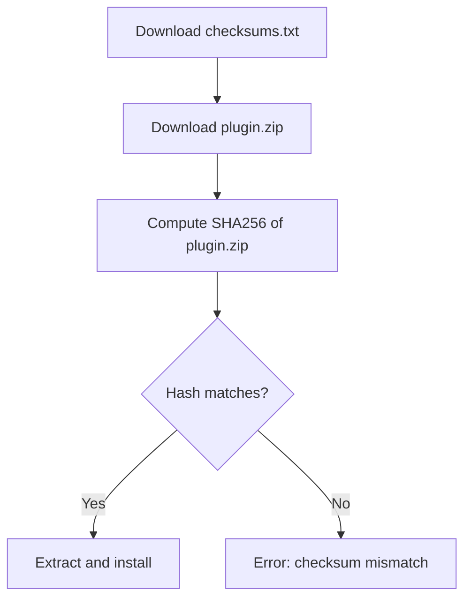
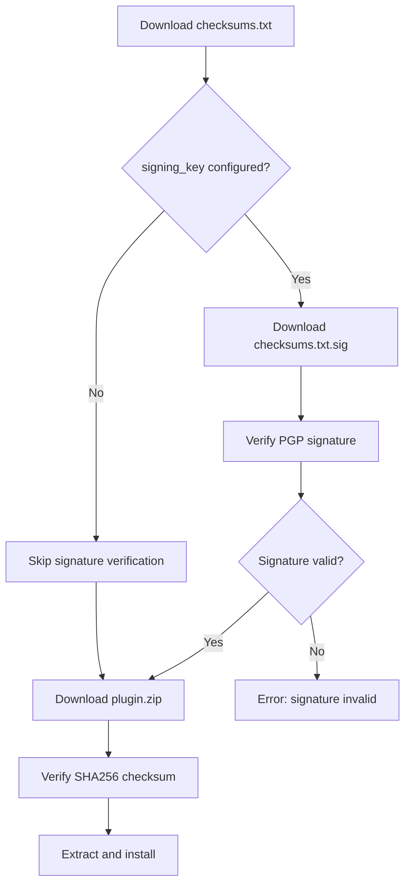

# Plugin PGP Signature Verification (Phase 2)

## Change Summary

Add PGP signature verification for plugin downloads, enabling users to verify that plugins were signed by trusted developers. This builds on CR-0018's baseline checksum verification by adding cryptographic proof of publisher authenticity via the `signing_key` configuration attribute.

## Motivation and Background

CR-0018 implements SHA256 checksum verification, which protects against download corruption but not against supply chain attacks. If an attacker compromises a GitHub account or CDN, they could replace plugin binaries with malicious versions that have valid checksums.

PGP signature verification addresses this threat by requiring plugins to be signed with a private key held only by the plugin developer. Users configure the corresponding public key in their `.tfbreak.hcl`, and tfbreak verifies the signature before installation.

tflint supports this via the `signing_key` attribute, and official tflint plugins from the `terraform-linters` organization use a built-in signing key. We will follow the same pattern.

## Change Drivers

* Security: Checksum-only verification is vulnerable to compromised releases
* Enterprise requirements: Security teams often mandate signature verification
* tflint parity: Users expect `signing_key` attribute to work
* Trust model: Plugin developers can prove authenticity of their releases

## Current State

After CR-0018, tfbreak verifies plugins using SHA256 checksums only:



This protects integrity but not authenticity.

## Proposed Change

Add PGP signature verification as an optional security layer:



### Configuration Syntax

```hcl
plugin "azurerm" {
  enabled = true
  source  = "github.com/jokarl/tfbreak-ruleset-azurerm"
  version = "0.1.0"

  # PGP public key for signature verification
  signing_key = <<-KEY
    -----BEGIN PGP PUBLIC KEY BLOCK-----

    mQINBFzpPOMBEADOat4P4z0jvXaYdhfy+UcGivb2XYgGSPQycTgeW1YuGLYdfrwz
    9okJj9pMMWgt/HpW8WrJOLv7fGecFT3eIVGDOzyT8j2GIRJdXjv8ZbZIn1Q+1V72
    ...
    -----END PGP PUBLIC KEY BLOCK-----
    KEY
}
```

### Release Requirements

Plugin releases with signature verification must include:

```
v0.1.0/
├── tfbreak-ruleset-azurerm_darwin_arm64.zip
├── tfbreak-ruleset-azurerm_linux_amd64.zip
├── checksums.txt           # SHA256 hashes
└── checksums.txt.sig       # PGP detached signature of checksums.txt
```

The `.sig` file is created by the plugin developer:

```bash
gpg --detach-sign --armor checksums.txt
```

### Built-in Signing Keys

For official tfbreak plugins (future), tfbreak will include built-in signing keys:

```go
var builtinSigningKeys = map[string]string{
    "github.com/jokarl": `-----BEGIN PGP PUBLIC KEY BLOCK-----
    ...
    -----END PGP PUBLIC KEY BLOCK-----`,
}
```

This allows official plugins to be verified without explicit `signing_key` configuration.

## Requirements

### Functional Requirements

1. The system **MUST** verify PGP signatures when `signing_key` is configured
2. The system **MUST** download `checksums.txt.sig` from the GitHub release
3. The system **MUST** verify the signature against the configured public key
4. The system **MUST** abort installation if signature verification fails
5. The system **MUST** skip signature verification if `signing_key` is not configured
6. The system **MUST** support ASCII-armored PGP public keys
7. The system **MUST** provide clear error messages for verification failures
8. The system **MUST** support built-in signing keys for specified organizations
9. The system **MUST** prefer explicit `signing_key` over built-in keys

### Non-Functional Requirements

1. The system **MUST** not require external GPG installation (use Go crypto library)
2. The system **MUST** validate key format before attempting verification
3. The system **MUST** handle expired keys with clear error messages

## Affected Components

* `internal/config/config.go` - Add `SigningKey` to PluginConfig
* `plugin/signature.go` - New file for PGP verification
* `plugin/install.go` - Integrate signature verification
* `plugin/keys.go` - New file for built-in signing keys

## Scope Boundaries

### In Scope

* PGP signature verification of checksums.txt
* `signing_key` configuration attribute
* Built-in signing keys for official organizations
* Clear error messages for verification failures
* Support for ASCII-armored keys

### Out of Scope ("Here, But Not Further")

* Keyless verification (GitHub Artifact Attestations) - Phase 4
* Key revocation checking - future enhancement
* Multiple signatures per release - not needed initially
* Key fingerprint verification UI - users manage keys themselves
* Automatic key discovery - users must configure explicitly

## Implementation Approach

### Phase 2.1: Signature Verification Core

```go
// plugin/signature.go
type SignatureChecker struct {
    publicKey *openpgp.Entity
}

func NewSignatureChecker(armoredKey string) (*SignatureChecker, error)
func (s *SignatureChecker) Verify(data, signature io.Reader) error
```

### Phase 2.2: Configuration Integration

```go
// internal/config/config.go
type PluginConfig struct {
    Name       string  `hcl:"name,label"`
    Enabled    *bool   `hcl:"enabled,attr"`
    Version    string  `hcl:"version,optional"`
    Source     string  `hcl:"source,optional"`
    SigningKey string  `hcl:"signing_key,optional"`  // NEW
}
```

### Phase 2.3: Install Flow Integration

```go
// plugin/install.go
func (c *InstallConfig) Install(pluginDir string) error {
    // ... download checksums.txt ...

    if c.SigningKey != "" || hasBuiltinKey(c.Source) {
        sigData := downloadAsset("checksums.txt.sig")
        if err := verifySignature(checksums, sigData, key); err != nil {
            return fmt.Errorf("signature verification failed: %w", err)
        }
    }

    // ... continue with checksum verification and download ...
}
```

## Test Strategy

### Tests to Add

| Test File | Test Name | Description | Inputs | Expected Output |
|-----------|-----------|-------------|--------|-----------------|
| `plugin/signature_test.go` | `TestNewSignatureChecker_ValidKey` | Parse valid PGP key | ASCII-armored key | SignatureChecker instance |
| `plugin/signature_test.go` | `TestNewSignatureChecker_InvalidKey` | Reject invalid key | Malformed key | Error |
| `plugin/signature_test.go` | `TestVerify_ValidSignature` | Verify valid signature | Signed data + signature | No error |
| `plugin/signature_test.go` | `TestVerify_InvalidSignature` | Reject invalid signature | Tampered data | Error |
| `plugin/signature_test.go` | `TestVerify_WrongKey` | Reject wrong key | Different key | Error |
| `plugin/install_test.go` | `TestInstall_WithSigningKey` | Full flow with signature | Mock release with sig | Success |
| `plugin/install_test.go` | `TestInstall_SignatureMismatch` | Reject bad signature | Tampered signature | Error, no install |
| `plugin/install_test.go` | `TestInstall_MissingSigFile` | Handle missing .sig | No sig file | Error when key configured |
| `plugin/keys_test.go` | `TestBuiltinKey_Found` | Lookup built-in key | Known org | Key returned |
| `plugin/keys_test.go` | `TestBuiltinKey_NotFound` | No built-in key | Unknown org | Empty string |
| `internal/config/config_test.go` | `TestPluginConfig_SigningKey` | Parse signing_key | HCL with key | Key in config |

### Tests to Modify

| Test File | Test Name | Current Behavior | New Behavior | Reason for Change |
|-----------|-----------|------------------|--------------|-------------------|
| `plugin/install_test.go` | `TestInstall_Success` | No signature check | Optional signature check | Add signature verification path |

### Tests to Remove

Not applicable.

## Acceptance Criteria

### AC-1: Signature verification with configured key

```gherkin
Given a plugin with signing_key configured in .tfbreak.hcl
  And the GitHub release contains checksums.txt.sig
When tfbreak --init downloads the plugin
Then checksums.txt.sig is downloaded
  And the signature is verified against the configured public key
  And installation proceeds only if verification succeeds
```

### AC-2: Signature verification failure

```gherkin
Given a plugin with signing_key configured
  And the checksums.txt.sig does not match the public key
When tfbreak --init attempts to install the plugin
Then an error is displayed: "signature verification failed for plugin 'name'"
  And the plugin is not installed
  And no partial files remain
```

### AC-3: Missing signature file with configured key

```gherkin
Given a plugin with signing_key configured
  And the GitHub release does not contain checksums.txt.sig
When tfbreak --init attempts to install the plugin
Then an error is displayed: "signature file not found for plugin 'name'"
  And the plugin is not installed
```

### AC-4: No signature verification without key

```gherkin
Given a plugin without signing_key configured
  And no built-in key exists for the plugin source
When tfbreak --init downloads the plugin
Then signature verification is skipped
  And only checksum verification is performed
  And installation proceeds normally
```

### AC-5: Built-in signing key

```gherkin
Given a plugin from source "github.com/jokarl/tfbreak-ruleset-azurerm"
  And tfbreak has a built-in signing key for "github.com/jokarl"
  And no explicit signing_key is configured
When tfbreak --init downloads the plugin
Then the built-in signing key is used for verification
  And the signature is verified automatically
```

### AC-6: Explicit key overrides built-in

```gherkin
Given a plugin from a source with a built-in signing key
  And an explicit signing_key is configured in .tfbreak.hcl
When tfbreak --init downloads the plugin
Then the explicit signing_key is used instead of the built-in key
```

## Quality Standards Compliance

### Build & Compilation

- [ ] Code compiles/builds without errors
- [ ] No new compiler warnings introduced

### Linting & Code Style

- [ ] All linter checks pass with zero warnings/errors
- [ ] Code follows project coding conventions

### Test Execution

- [ ] All existing tests pass after implementation
- [ ] All new tests pass
- [ ] Test coverage meets requirements

### Documentation

- [ ] Inline documentation updated
- [ ] User guide updated with signing_key examples

### Verification Commands

```bash
go build ./...
golangci-lint run
go test ./...
```

## Risks and Mitigation

### Risk 1: PGP library complexity

**Likelihood:** Medium
**Impact:** Medium
**Mitigation:** Use well-maintained `golang.org/x/crypto/openpgp` package. Limit scope to signature verification only (no encryption).

### Risk 2: Key management burden on users

**Likelihood:** Medium
**Impact:** Low
**Mitigation:** Make signing_key optional. Provide built-in keys for official plugins. Document key management best practices.

### Risk 3: Plugin developers not signing releases

**Likelihood:** High
**Impact:** Low
**Mitigation:** Signature verification is optional. Document signing workflow for developers. Provide GitHub Actions template.

## Dependencies

* CR-0018: Plugin auto-download baseline (prerequisite)
* `golang.org/x/crypto/openpgp` package

## Estimated Effort

| Component | Effort |
|-----------|--------|
| Signature verification core | 4 hours |
| Configuration integration | 2 hours |
| Install flow integration | 2 hours |
| Built-in keys infrastructure | 2 hours |
| Testing | 4 hours |
| Documentation | 2 hours |
| **Total** | **16 hours** |

## Decision Outcome

Chosen approach: "PGP signature verification with optional signing_key", because it follows tflint's proven pattern, provides strong authenticity guarantees, and remains optional to avoid blocking plugin adoption.

## Related Items

* ADR-0004: Plugin distribution and installation
* CR-0018: Plugin auto-download baseline (prerequisite)
* CR-0020: Plugin source extensibility (Phase 3)
* tflint signing documentation: https://github.com/terraform-linters/tflint/blob/master/docs/user-guide/plugins.md#signing-and-verification
